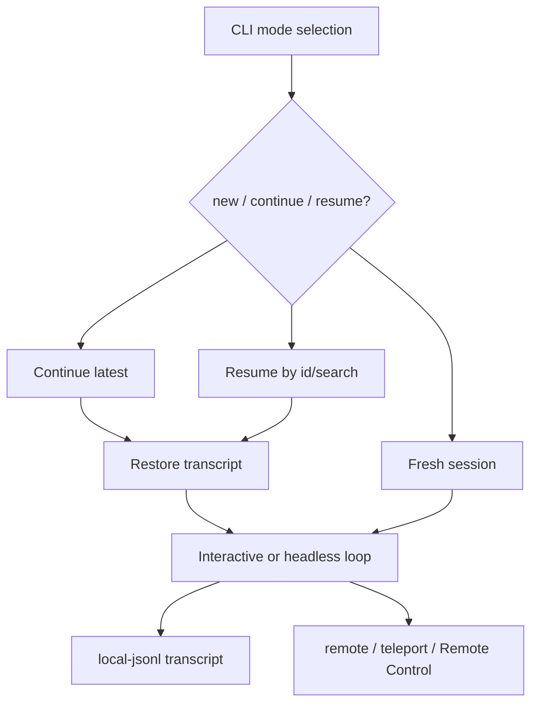

# Sessions, persistence, and remote

This chapter treats sessions as the durable spine of Claude Code. A session is not only a chat transcript: it is a local JSONL event stream, a resume/continue target, a fork/rewind boundary, a possible remote-control handoff point, and—when attached by its host—a view into durable claude.ai Project knowledge.

Read this chapter when the question is: **where did the agent's state come from, where was it saved, and how can it be resumed, forked, rewound, or controlled remotely?**

## Source-anchor policy

This page is a chapter guide. Linked implementation pages carry concrete `cli.renamed.js` anchors.

| Semantic alias | Minified anchor | Scope |
|---|---|---|
| Sessions/persistence/remote chapter | N/A — navigation page | Groups local JSONL transcripts, resume/continue/fork/rewind, remote sessions, teleport, and Remote Control. |
| Session implementation pages | See linked source-anchor tables | Concrete bundle anchors live in destination pages. |

## Session spine

```mermaid
flowchart TD
    Startup[CLI mode selection] --> NewOrResume{new / continue / resume?}
    NewOrResume --> New[Fresh session]
    NewOrResume --> Continue[Continue latest]
    NewOrResume --> Resume[Resume by id/search]
    Continue --> Restore[Restore transcript]
    Resume --> Restore
    Restore --> Loop[Interactive or headless loop]
    New --> Loop
    Loop --> Jsonl[local-jsonl transcript]
    Loop --> Remote[remote / teleport / Remote Control]
```

## Primary reading order

| Order | Page | Session question answered |
|---:|---|---|
| 1 | [Session resume and transcripts](session-resume-and-transcripts.md) | How do JSONL transcript roots, `--continue`/`--resume`/`--session-id`/fork/no-persistence/rewind connect, and how do `SessionDiscovery` + `SessionRestore` rehydrate permission/model/agent state? |
| 2 | [Hosted Projects and knowledge](hosted-projects-and-knowledge.md) | How does `CLAUDE_PROJECT_UUID` bind one session to one shared knowledge container, and how do project context, read/search/write/delete, OAuth scopes, and upload guards work? |
| 3 | [Team onboarding and share flows](team-onboarding-and-share-flows.md) | How does `/team-onboarding` scan local session usage, draft `ONBOARDING.md`, and optionally create/update an organization share link? |
| 4 | [Remote control and teleport](remote-control-and-teleport.md) | How do `--remote`, `--teleport`, `remote-control`, bridge tokens, and Remote Control paths connect to sessions? |
| 5 | [Session API, events, and storage](session-api-events-and-storage.md) | Which API endpoints, event families, bridge frames, and internal storage areas are visible around sessions and remote control? |
| 6 | [SDK query, session API, and subagent surface](sdk-query-and-session-api.md) | What programmatic SDK surface does Claude Code expose for `query`, session management, subagent inspection, in-process MCP, and direct-connect transport? |
| 7 | [Data models and frame schemas](data-models-and-frame-schemas.md) | Which observable transcript records, session layers, stream/control frames, and storage record families shape sessions? |
| 8 | [Session and remote-control architecture](architecture.md) | How is a session decomposed into a durable JSONL layer + live envelope, and how do resume/fork/rewind/remote reuse the same address? |

## Handoffs

- Startup mode selection is documented in [Runtime lifecycle](../01-runtime-lifecycle/README.md).
- Stream-JSON headless frames are documented in [Context and model loop](../02-context-model-loop/headless-streaming-and-resilience.md).
- File checkpoints, context-collapse metadata, and rewind mechanics are detailed in [Context, memory, compaction, checkpoints, and rewind](../02-context-model-loop/context-memory-compaction-checkpoints.md).
- Permission forwarding and tool execution are documented in [Tools, integrations, and security](../03-tools-integrations-security/README.md).
- Other hosted creation surfaces are documented in [Artifact publishing and live pages](../03-tools-integrations-security/artifact-publishing-and-live-pages.md) and [Claude Design and design-system sync](../03-tools-integrations-security/claude-design-and-design-sync.md).
- Protocol families across remote, bridge, MCP, agents, and provider streaming are documented in [Runtime communication protocols](../00-start-here/runtime-communication-protocols.md).

## Navigation

- [Start here](../00-start-here/README.md)
- [Full table of contents](../SUMMARY.md)
