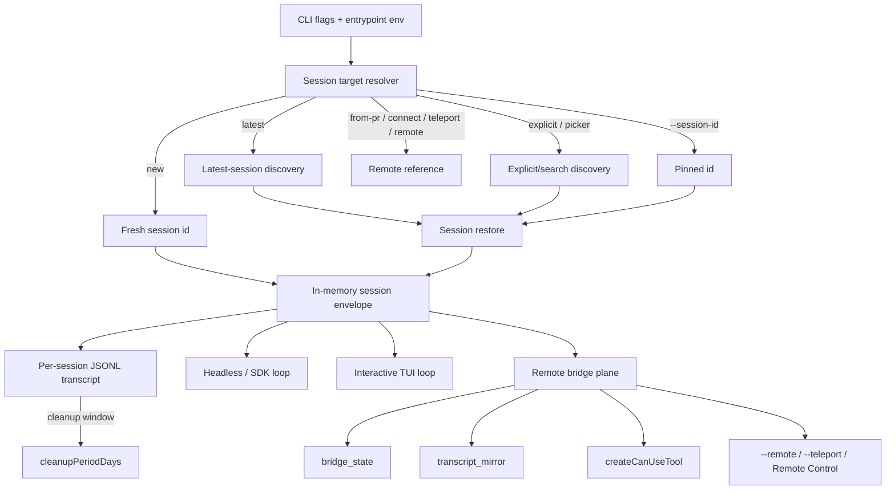

# Session and remote-control architecture

This page is the architecture analysis for the sessions/persistence/remote module. It complements the implementation pages by focusing on **what a session actually is, where state lives, how restore/fork/rewind compose, and how remote variants reuse the same envelope** rather than re-listing each flag.

Scope: durable JSONL transcripts, in-memory session envelope, resume/continue/fork/rewind flows, remote sessions, teleport, Remote Control, session API/event families, and storage seams. Implementation specifics live in [Session resume and transcripts](session-resume-and-transcripts.md), [Remote control and teleport](remote-control-and-teleport.md), and [Session API, events, and storage](session-api-events-and-storage.md).

## Module purpose

This module owns the **state plane** of the agent runtime. It treats a session as the unit of durability and the address of a runtime instance, and it makes that unit visible to:

1. Local persistence (JSONL transcripts under the Claude config directory).
2. CLI restore/fork/rewind paths.
3. Headless/SDK transports that need to refer to a session by ID.
4. Remote variants (`--remote`, `--teleport`, Remote Control) that project the same envelope onto a network bridge.

## Architecture thesis

A session is a **two-layer object**: a durable transcript layer (`local-jsonl`) and a live runtime layer (the in-memory envelope). Both layers are addressed by the same session ID. All other features—resume, continue, fork, rewind, remote, teleport, Remote Control—are operations on this pair, not separate state systems.

## Source anchors

| Semantic alias | String or symbol | Architectural meaning |
| --- | --- | --- |
| LocalJsonlTranscriptSource | `transcriptSource:"local-jsonl"` | Default classification of the durable layer. |
| ProjectSessionStoreRoot | `projects` | Config-root projects helper; addresses one project's session files. |
| SessionJsonlNamePattern | `${H}.jsonl` | Per-session filename pattern. |
| CurrentSessionFileResolver | `${v$()}.jsonl` | Current-session file resolver. |
| SessionDiscovery | `async function loadConversationForResume(H,$)` | Latest/resume discovery — turns CLI intent into a session target. |
| SessionRestore | `async function OG8(H,$,q)` | Restore — produces the in-memory envelope from the durable layer. |
| ContinueLatestFlag | `-c, --continue` | Resolve target = "latest in cwd." |
| ResumeSessionFlag | `-r, --resume [value]` | Resolve target = explicit ID, picker, or search. |
| ForkSessionFlag | `--fork-session` | Resume into a new session ID instead of mutating the original. |
| NoSessionPersistenceFlag | `--no-session-persistence` | Disables the durable layer for this run. |
| ResumeSessionAtGuard | `--resume-session-at requires --resume` | Headless restore-validation rule. |
| SessionIdPinFlag | `--session-id <uuid>` | Pin a specific session ID; intersects with `--continue`/`--resume` validation. |
| InteractiveResumePicker | `await aa4(Y7, ...)` | Interactive picker/search path called from the root action. |
| BridgeStateFrame | `enqueue({type:"system",subtype:"bridge_state",state:bH,detail:pH,...})` | Bridge-state frame used by remote variants. |
| TranscriptMirrorFrame | `transcript_mirror` | Local mirror of remote transcript so SDK/headless behavior is symmetric. |
| SessionStateFrame | `session_state_changed` | Idle/running/requires_action frame attached to the envelope. |
| RemotePermissionBridge | `createCanUseTool` | Permission bridge wired into remote/SDK transports. |
| TranscriptRetentionSetting | `cleanupPeriodDays` | Setting that bounds the durable layer's retention window. |

## Internal decomposition

| Sub-component | Responsibility |
|---|---|
| Target resolver | Maps `--continue`/`-r`/`--from-pr`/`--session-id`/`--connect`/`--teleport`/`--remote`/`--remote-control` plus picker into a single session reference. |
| `SessionRestore` | Reads the durable JSONL, reconstructs permission/model/agent/deferred-tool state, and produces the envelope. |
| `SessionDiscovery` | Locates "latest" or "matching" sessions by walking the project's JSONL directory. |
| Envelope | The live runtime view: session ID, working dir, model, permission mode, agent set, tool registry, hooks, and event sink. |
| Persistence sink | Appends a line per event to `${sessionId}.jsonl`; respects `--no-session-persistence`. |
| Bridge plane | For remote variants, wraps the envelope with `bridge_state`, `transcript_mirror`, and remote permission flow. |
| `InteractiveResumePicker` | Interactive fallback when `--resume` value is ambiguous. |

## Public interface

### Inputs

| Surface | Effect |
|---|---|
| `--continue` / `-c` | Resolve to the most recent session in cwd. |
| `--resume [value]` / `-r` | Resolve by explicit ID, picker, or search term. |
| `--session-id <uuid>` | Pin an explicit ID; rejected with incompatible flags. |
| `--fork-session` | Resume into a new ID; durable history is preserved. |
| `--no-session-persistence` | Skip the durable layer; resume becomes unavailable. |
| `--resume-session-at <message id>` | Truncate restored history (headless only). |
| `--rewind-files <user-message-id>` | Restore files to a prior state and exit; no model turn. |
| `--from-pr <ref>` | PR-based resume path classified through the same resolver. |
| `--connect`, `--remote`, `--teleport`, `--remote-control` / `--rc` | Map the envelope to remote/host transports. |
| `cleanupPeriodDays` setting | Bounds the durable layer's retention window. |
| Managed setting `disableRemoteControl` | Blocks Remote Control activation at the policy boundary. |

### Outputs

| Output | Consumer |
|---|---|
| `${sessionId}.jsonl` | Local transcript reader, future `--continue`/`--resume`, exporter tools. |
| `transcript_mirror` frames | SDK/headless consumers; remote bridges. |
| `bridge_state` frames | Remote callers/UIs watching bridge connectivity. |
| `session_state_changed` frames | Hosts that drive long-running automation. |
| `permission_denied` / `can_use_tool` frames | Remote/host approval consumers. |
| Resume warnings (e.g. permission mode mismatch) | UI/UX surfaces. |

## Internal collaborators

| Collaborator | Contract |
|---|---|
| Runtime lifecycle | Produces the resolved target and hands the envelope to the chosen mode. |
| Context/model loop | Provides session events (messages, tool uses, results, errors) for the durable sink. |
| Tool/permission runtime | Persists tool-use lifecycle events and produces decisions remote consumers see. |
| Hooks subsystem | Receives `SessionStart`, `SessionEnd`, `PreCompact`, `PostCompact`, `Setup`. |
| MCP/plugins | Re-applied at restore time so the envelope reflects the same tools as the original session. |
| Telemetry/ops | Receives resume/restore/save events and shutdown signals. |
| Remote bridge | Uses envelope + bridge state to mediate with hosted services. |

## Design decisions

1. **Sessions are addressable by ID, locally or remotely.** `${sessionId}.jsonl` is the canonical key; remote variants reuse the same identity rather than introducing a parallel scheme.
2. **Durable layer is JSONL, not a database.** Append-only line files make restore deterministic, support tail-based observation, and avoid coupling the runtime to a storage engine.
3. **Restore reconstructs the *envelope*, not just history.** `SessionRestore` also re-applies permission mode, model, agents, and deferred tools so the resumed session behaves like its prior self.
4. **Fork is a first-class operation.** `--fork-session` separates "I want to continue" from "I want a divergent copy" so transcripts are not silently overwritten.
5. **Rewind is its own subcommand-like flag.** `--rewind-files` is a file-restore-only path that cannot run a turn; this prevents accidental model runs against an inconsistent file tree.
6. **No-persistence is opt-in, not the default.** Persistence by default keeps resume reliable; explicit opt-out exists for ephemeral pipelines.
7. **Remote variants project the envelope, not the loop.** `--remote`, `--teleport`, `--remote-control` swap transports but reuse permission and event flow; downstream code does not branch on "remote vs local."
8. **Picker is a UX fallback, not a separate path.** `InteractiveResumePicker` is invoked when resolver input is ambiguous; it ultimately returns into the same `SessionDiscovery`/`SessionRestore` flow.
9. **Retention is a setting, not a runtime branch.** `cleanupPeriodDays` lets ops control disk usage without changing session semantics.

## State plane

| Layer | Lifetime | Owner |
|---|---|---|
| Process argv/env | Process | Runtime lifecycle |
| Settings (user/project/local/managed) | User/process | Settings module |
| Live envelope (session ID, permissions, agents, tools, hooks, model) | Process | This module |
| Durable JSONL transcript | Until cleanup or rewind | This module |
| Remote bridge state | Connection | This module + remote transport |
| Telemetry/log files | Configured window | Ops module |

This separation is what lets resume, fork, and rewind operate without touching other modules' state.

## Failure modes

| Failure | Behavior |
|---|---|
| `--resume` value matches nothing | Picker fallback or precise error. |
| `--resume-session-at` without `--resume` | Headless validation rejects before any restore. |
| `--rewind-files` combined with a prompt | Rejected; rewind is a standalone operation. |
| Permission mode mismatch on resume | Warning is surfaced before the loop starts. |
| Disk full / JSONL write error | Persistence layer surfaces the error; durable layer can be disabled for the remainder of the run if needed. |
| Bridge disconnect | `bridge_state` frame is emitted; reconnection logic owns retry decisions. |
| Managed policy disables Remote Control after activation | New activations are blocked; existing remote sessions terminate through the normal shutdown path. |
| Concurrent writers to the same session file | The single-writer pattern (one process per session ID) is implied; violating it is undefined. |

## Extension points

| Extension | How it plugs in |
|---|---|
| Additional resume source | Add another branch in the target resolver that produces a session reference; do not bypass `SessionRestore`. |
| New durable layer (e.g. cloud transcripts) | Implement the persistence sink interface; keep JSONL semantics for local fallback. |
| New remote transport | Project the envelope through the bridge plane; emit `bridge_state` and `transcript_mirror` for parity. |
| Custom retention policy | Use settings; runtime should not branch on retention specifics. |
| Hook into restore | Use `SessionStart` / `Setup` hooks rather than wrapping `SessionRestore`. |

## Caveats

- The exact set of fields restored by `SessionRestore` is implementation-defined; this page documents observable categories (permission mode, model, agent set, deferred tools).
- Remote/teleport/Remote Control variants share many control-frame primitives; their differences are documented in the implementation page.
- The Anthropic SDK bundle contributes many `session_id`/`/v1/sessions/...` strings that are unrelated to Claude Code's local session module; this page only describes the local module.

## Related docs

- [Session resume and transcripts](session-resume-and-transcripts.md)
- [Remote control and teleport](remote-control-and-teleport.md)
- [Session API, events, and storage](session-api-events-and-storage.md)
- [System architecture](../00-start-here/system-architecture.md)
- [Runtime lifecycle architecture](../01-runtime-lifecycle/architecture.md)
- [Context and model loop architecture](../02-context-model-loop/architecture.md)
- [Tool runtime and security architecture](../03-tools-integrations-security/architecture.md)
