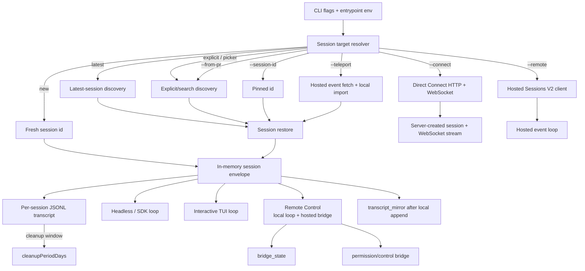

# Session and remote-control architecture

This page is the architecture analysis for the sessions/persistence/remote module. It complements the implementation pages by focusing on **what a session actually is, where state lives, how restore/fork/rewind compose, and which remote paths control a local envelope versus run a hosted one** rather than re-listing each flag.

Scope: durable JSONL transcripts, in-memory session envelope, resume/continue/fork/rewind flows, remote sessions, teleport, Remote Control, session API/event families, and storage seams. Implementation specifics live in [Session resume and transcripts](session-resume-and-transcripts.md), [Remote control and teleport](remote-control-and-teleport.md), and [Session API, events, and storage](session-api-events-and-storage.md).

## Module purpose

This module owns the **state plane** of the agent runtime. It treats a session as the unit of durability and the address of a runtime instance, and it makes that unit visible to:

1. Local persistence (JSONL transcripts under the Claude config directory).
2. CLI restore/fork/rewind paths.
3. Headless/SDK transports that need to refer to a session by ID.
4. Remote variants that either bridge a local envelope (Remote Control), operate a hosted session (`--remote`), or import hosted history into a local envelope (`--teleport`).

## Architecture thesis

A local session is a **two-layer object**: a durable transcript layer (`local-jsonl`) and a live runtime layer (the in-memory envelope). Both local layers use the same session UUID. Hosted and bridged paths add service-side identities (for example a Remote Control bridge-session ID) and replay cursors; those identifiers are related to the local UUID through transcript metadata, but they are not one universal key.

## Source anchors

| Semantic alias | String or symbol | Architectural meaning |
| --- | --- | --- |
| LocalJsonlTranscriptSource | `transcriptSource:"local-jsonl"` | Default classification of the durable layer. |
| ProjectSessionStoreRoot | `projects` | Config-root projects helper; addresses one project's session files. |
| SessionJsonlNamePattern | `${H}.jsonl` | Per-session filename pattern. |
| CurrentSessionFileResolver | `${v$()}.jsonl` | Current-session file resolver. |
| SessionDiscovery | `async function loadConversationForResume(H,$)` | Latest/resume discovery — turns CLI intent into a session target. |
| SessionRestore | `async function f7o(e,t,r)` | Restore — applies discovered state to the current in-memory envelope. |
| ContinueLatestFlag | `-c, --continue` | Resolve target = "latest in cwd." |
| ResumeSessionFlag | `-r, --resume [value]` | Resolve target = explicit ID, picker, or search. |
| ForkSessionFlag | `--fork-session` | Resume into a new session ID instead of mutating the original. |
| NoSessionPersistenceFlag | `--no-session-persistence` | Disables the durable layer for this run. |
| ResumeSessionAtGuard | `--resume-session-at requires --resume` | Headless restore-validation rule. |
| SessionIdPinFlag | `--session-id <uuid>` | Pin a specific session ID; intersects with `--continue`/`--resume` validation. |
| InteractiveResumePicker | `await aa4(Y7, ...)` | Interactive picker/search path called from the root action. |
| BridgeStateFrame | `enqueue({type:"system",subtype:"bridge_state",state:bH,detail:pH,...})` | Bridge-state frame used by remote variants. |
| TranscriptMirrorFrame | `transcript_mirror` | Carries entries to SDK/host mirror listeners only after the corresponding local append succeeds. |
| SessionStateFrame | `session_state_changed` | Idle/running/requires_action frame attached to the envelope. |
| RemotePermissionBridge | `createCanUseTool` | Permission bridge wired into remote/SDK transports. |
| OrderedTranscriptStore | `class ROd`, `drainQueuesOnce` | Per-file queues serialize append batches and UUID removals; SDK mirrors are emitted only after a successful local append. |
| MetadataCheckpoint | `bytesSinceMetadataReAppend`, `LITE_READ_BUF_SIZE / 2` | Re-appends cached current-session metadata after approximately 32 KiB of successful UTF-8 main-transcript writes. |
| TranscriptRelocation | `relocateSessionTranscript`, `beginTranscriptRelocation`, `mOd`, `cOd` | Globally buffers `ROd` entries and buffers auxiliary appends addressed to the exact old main JSONL while moving the main transcript and associated session directory. |
| RemoteHydration | `hydrateRemoteSession`, `hydrateFromCCRv2InternalEvents`, `.ccr-tip.json` | Reconciles server internal events into local JSONL by guarded replacement or an anchored delta. |
| PersistenceBackfill | `Epf`, `bpf`, `onTransportPersistenceReady` | Compares server UUIDs with local foreground/subagent suffixes and starts queuing missing local records before installing the live CCR writer. |
| BridgeResumeMetadata | `saveBridgeSession`, `lastSequenceNum` | Caches the hosted bridge ID and highest received numeric worker-SSE ID in memory; when the current transcript is materialized, queues a `bridge-session` append. |
| TranscriptRetentionSweep | `cleanupPeriodDays`, `async function kIp()` | Setting plus executable `mtime`-based cleanup sweep. |
| RetentionHousekeeping | `startBackgroundHousekeeping`, `.last-cleanup` | Process-local startup scheduler for transcript heartbeats and deferred retention work. |

## Internal decomposition

```mermaid
flowchart TD
    Cli[CLI flags + entrypoint env] --> Resolver[Session target resolver]
    Resolver -->|new| Fresh[Fresh session id]
    Resolver -->|latest| DiscoveryLatest[Latest-session discovery]
    Resolver -->|explicit / picker| DiscoveryExplicit[Explicit/search discovery]
    Resolver -->|--from-pr| DiscoveryExplicit
    Resolver -->|--teleport| Teleport[Hosted event fetch + local import]
    Resolver -->|--connect| DirectConnect[Direct Connect HTTP + WebSocket]
    Resolver -->|--remote| Hosted[Hosted Sessions V2 client]
    Resolver -->|--session-id| Pinned[Pinned id]

    Fresh --> Envelope[In-memory session envelope]
    DiscoveryLatest --> Restore[Session restore]
    DiscoveryExplicit --> Restore
    Pinned --> Restore
    Teleport --> Restore
    Restore --> Envelope

    Envelope --> Durable[Per-session JSONL transcript]
    Envelope --> Headless[Headless / SDK loop]
    Envelope --> TUI[Interactive TUI loop]
    Envelope --> LocalBridge[Remote Control<br/>local loop + hosted bridge]
    LocalBridge --> BridgeState[bridge_state]
    LocalBridge --> Permission[permission/control bridge]
    Envelope --> Mirror[transcript_mirror after local append]
    DirectConnect --> DirectSocket[Server-created session + WebSocket stream]
    Hosted --> HostedLoop[Hosted event loop]

    Durable -->|cleanup window| Retention[cleanupPeriodDays]
```

| Sub-component | Responsibility |
|---|---|
| Target resolver | Maps local selectors (`--continue`, `-r`, `--from-pr`, `--session-id`, picker) to restore targets and dispatches Direct Connect, teleport, hosted `--remote`, and Remote Control to their distinct transport/import paths. |
| `SessionRestore` | Applies already-discovered conversation, permission, model, agent, deferred-tool, worktree, and compatible bridge state to the envelope. |
| `SessionDiscovery` | Locates and loads "latest" or matching sessions from the project's JSONL directories, then normalizes the restore object. |
| Envelope | The live runtime view: session ID, working dir, model, permission mode, agent set, tool registry, hooks, and event sink. |
| Persistence sink | Queues records per file, appends ordered JSONL batches, then notifies mirrors; respects `--no-session-persistence`. |
| Bridge plane | Remote Control wraps a local envelope with bridge state, hosted identity, sequence replay, and remote permission flow. `--remote` and teleport have separate hosted-session clients. |
| `InteractiveResumePicker` | Interactive fallback when `--resume` value is ambiguous. |

## Public interface

### Inputs

| Surface | Effect |
|---|---|
| `--continue` / `-c` | Resolve to the most recent session in cwd. |
| `--resume [value]` / `-r` | Resolve by explicit ID, picker, or search term. |
| `--session-id <uuid>` | Pin an explicit ID; rejected with incompatible flags. |
| `--fork-session` | Resume into a new ID; durable history is preserved. |
| `--no-session-persistence` | Skip the durable layer; resume becomes unavailable. |
| `--resume-session-at <message id>` | Truncate restored history (headless only). |
| `--rewind-files <user-message-id>` | Restore files to a prior state and exit; no model turn. |
| `--from-pr <ref>` | PR-based resume path classified through the same resolver. |
| `--connect`, `--remote`, `--teleport`, `--remote-control` / `--rc` | Select distinct paths: Direct Connect creates and streams a server session, hosted remote owns a hosted loop, teleport imports hosted history into local restore, and Remote Control bridges a local envelope. |
| `cleanupPeriodDays` setting | Bounds the durable layer's retention window. |
| Managed setting `disableRemoteControl` | Blocks Remote Control activation at the policy boundary. |

### Outputs

| Output | Consumer |
|---|---|
| `${sessionId}.jsonl` | Local transcript reader, future `--continue`/`--resume`, exporter tools. |
| `transcript_mirror` frames | SDK/headless hosts and registered external-store mirror listeners. |
| `bridge_state` frames | Remote callers/UIs watching bridge connectivity. |
| `session_state_changed` frames | Hosts that drive long-running automation. |
| `permission_denied` / `can_use_tool` frames | Remote/host approval consumers. |
| Resume warnings (e.g. permission mode mismatch) | UI/UX surfaces. |

## Internal collaborators

| Collaborator | Contract |
|---|---|
| Runtime lifecycle | Produces the resolved target and hands the envelope to the chosen mode. |
| Context/model loop | Provides session events (messages, tool uses, results, errors) for the durable sink. |
| Tool/permission runtime | Persists tool-use lifecycle events and produces decisions remote consumers see. |
| Hooks subsystem | Receives `SessionStart`, `SessionEnd`, `PreCompact`, `PostCompact`, `Setup`. |
| MCP/plugins | Re-applied at restore time so the envelope reflects the same tools as the original session. |
| Telemetry/ops | Receives resume/restore/save events and shutdown signals. |
| Remote bridge | Uses envelope + bridge state to mediate with hosted services. |

## Design decisions

1. **The local UUID is canonical for local state, not every remote object.** `${sessionId}.jsonl` addresses the local transcript. Remote Control additionally persists a bridge-session ID and last sequence number; hosted sessions have service IDs that may later be teleported into a local session.
2. **Durable layer is append-oriented ordered JSONL, not a database.** `ROd` maintains per-file queues and drains them through a serialized chain. Its 100 MiB constant is a flush threshold over accumulated serialized JavaScript string length, not a byte-accurate record cap: an individual serialized record can exceed it and is still written whole. Most operations append, but queued UUID removal can truncate and rewrite a transcript in place. This establishes order within one process/file queue; the artifact exposes no cross-process file lock or transaction protocol.
3. **Restore reconstructs the *envelope*, not just history.** `SessionRestore` also re-applies permission mode, model, agents, and deferred tools so the resumed session behaves like its prior self.
4. **Fork is a first-class operation.** `--fork-session` separates "I want to continue" from "I want a divergent copy" so transcripts are not silently overwritten.
5. **Rewind is its own subcommand-like flag.** `--rewind-files` is a file-restore-only path that cannot run a turn; this prevents accidental model runs against an inconsistent file tree.
6. **No-persistence is opt-in, not the default.** Persistence by default keeps resume reliable; explicit opt-out exists for ephemeral pipelines.
7. **Remote surfaces are not interchangeable transports.** Remote Control drives a local loop through a resumable bridge. `--remote` drives a hosted session through its own SSE client. Teleport fetches hosted logs (with an endpoint fallback), validates repository compatibility, and resumes them locally. The Chrome `BridgeClient` is yet another transport used by browser tools.
8. **Picker is a UX fallback, not a separate path.** `InteractiveResumePicker` is invoked when resolver input is ambiguous; it ultimately returns into the same `SessionDiscovery`/`SessionRestore` flow.
9. **Retention is active lifecycle behavior.** The default is 30 days (minimum configured value: 1). The sweep compares filesystem `mtime`, removes stale transcripts, recordings and sidecars, and recursively cleans associated session/subagent/workflow/remote-agent state. It pauses when disabled or invalid settings sources make the configured period unknowable.

`startBackgroundHousekeeping()` is process-local and starts once. It schedules its first slow-work check after five seconds. In an interactive process, activity within the preceding minute defers that work by ten minutes; a `.last-cleanup` sentinel younger than 24 hours also moves the sweep to that ten-minute slow-work interval rather than running it at the first check. After `kIp()` returns, housekeeping rewrites the sentinel. Interactive housekeeping also touches the current transcript immediately and every hour, so an active transcript's `mtime` is refreshed independently of message writes. These timers are unreferenced and therefore do not keep the process alive.

## Write, mirror, and shutdown ordering

For the main transcript store, ordering is:

1. `appendEntry` routes the record according to `ENTRY_APPEND_POLICY` and enqueues it for one target file.
2. A default 100 ms timer schedules a drain; enabling legacy remote ingress or registering the CCR internal-event writer changes that store instance to 10 ms. Clearing the writer does not restore 100 ms. All drains are chained, and records for each file are processed in queue order.
3. The drain appends the JSONL batch locally.
4. Only after that append succeeds does `fireMirror` publish the same entries to SDK/external-store listeners.
5. On append failure, the runtime logs/telemeters the error and resolves the queued waiters so the model loop does not remain blocked. The failed records are not mirrored by that drain. Transcript UUIDs enter the process-local dedup cache when they are enqueued, however, so retrying the same UUID can remain suppressed until that cache is cleared or rebuilt even when the disk append failed.
6. Shutdown calls `flushSessionStorageAtExit()`, waits for the store and auxiliary append queues, and then re-appends cached metadata. This is a best-effort flush, not an `fsync` durability guarantee.

Within a drain, `MAX_CHUNK_BYTES = 104857600` is tested against `.length` on accumulated serialized strings before the next record is added. Crossing the threshold flushes the already-accumulated string; it does not reject, split, or cap the next record, and JavaScript string units are not UTF-8 bytes. Separately, successful appends to the current main transcript add `Buffer.byteLength(..., "utf8")` to a counter. At 32,768 bytes, the drain best-effort appends the cached last-prompt/title/tag/agent/mode/permission/worktree/PR/bridge metadata again and mirrors those records. This is a snapshot of fields already cached by local lifecycle calls—not a per-frame poll of live bridge state.

SDK `sessionStore` persistence is a second stage after the local mirror frame. It has its own batching, timeout, and retry behavior; an external-store failure does not roll back an already-successful local JSONL append.

That append-before-mirror statement is specific to SDK/session-mirror callbacks. Remote Control's internal CCR event writer is invoked after a local write is enqueued, not after that append has completed, and its uploader has an independent acknowledgement/retry/drop lifecycle. Transcript UUID removal emits neither an SDK mirror frame nor an internal-CCR deletion event in this path, and removal does not evict the UUID from the same process-local dedup cache.

## Relocation and remote reconciliation

Changing the persisted project/cwd can physically relocate a materialized transcript. `relocateSessionTranscript()` first enables `ROd`'s relocation buffer, which holds every `appendEntry()` routed through that store, and a separate auxiliary buffer that intercepts only `appendEntryToFileAsync(oldMainJsonl, ...)`. It flushes work already admitted to those two executors and then moves the main JSONL and the `${sessionId}/` associated-state directory separately. The move prefers `rename`; selected target-conflict errors remove the target and retry, while `EXDEV` falls back to copy-then-delete. It then updates the active path/cwd, appends a `relocated` metadata record when the main file moved, repoints task-output symlinks after a successful associated-directory move, and replays buffered records in `finally`.

That scope is narrower than pausing all session-state writers. Direct writers to associated-tree files such as agent `.meta.json` and remote-agent metadata do not join either buffer, nor does the sibling `.ccr-tip.json`; they can race the directory move or resolve their path on either side of the active-path switch. The CCR tip is not one of the two moved objects, so an old-project tip can remain orphaned while later hydration or direct/headless acknowledgement creates a new-project tip. The retention sweep recognizes orphan tips and eventually removes them by their own `mtime`.

The buffers protect cooperating transcript appends, but they do not form one filesystem transaction. The main file and associated directory can move independently; copy/delete, target replacement, relocation stamping, direct associated-state writes, sidecar updates, and symlink repointing can fail or race at different points. There is no rollback or cross-process lock.

Remote transcript recovery is also reconciliation rather than ordinary local replay:

- Legacy `hydrateRemoteSession()` fetches the server log set and normally rewrites local JSONL. It refuses to replace a content-bearing local transcript when the fetched set contains no `user` or `assistant` record, but otherwise the rewrite is direct and non-transactional. Its later live ingress writes are serialized per session, send a `Last-Uuid`, retry an entry up to ten times, and can adopt the server's last UUID after a 409.
- CCR v2 validates a best-effort `.ccr-tip.json` anchor against UUIDs in the local transcript's last 64 KiB. A coherent anchored response can append only payloads whose UUIDs are absent from that tail; rejected, missing, included, or incoherent anchors lead to a server-selected/full-refetch replacement path. The same zero-content guard protects content-bearing foreground and subagent files. Foreground and subagent rewrites are separate, and subagents are replaced per returned `session_agent_id` rather than as one transaction. Each internal-event endpoint requests 1,000 records per page and follows `next_cursor` without a client page/event cap; every page gets up to ten 30-second attempts, and exhaustion on any later page discards the accumulated client result.
- When an interactive bridge reports persistence ready, it fetches server foreground and subagent events, unions their payload UUIDs, scans local files backward to the latest compaction boundary, and starts queuing UUID-bearing local records absent from that server set. Subagent backfill considers at most the 20 newest files no larger than 5 MiB. Individual enqueue promises are not awaited before the live writer is installed, so this is scheduled backfill rather than an acknowledgement barrier. The backward reader snapshots file size when it opens: a local append after that file's scan boundary but before live-writer installation is neither selected by that pass nor sent through the not-yet-installed writer, and must wait for a later reconciliation opportunity. A transport-generation check prevents stale writer installation; teardown can drop pending old-uploader work while an in-flight request can still settle.

The `.ccr-tip.json` anchor is separate from JSONL. Successful foreground hydration writes update it in either CCR-capable path. The acknowledged-outgoing-batch updater is installed by the direct remote/headless CCR runtime; the interactive `Qms()` bridge transport does not install that callback in this artifact, so its backfill/live acknowledgements do not by themselves advance the sidecar. Hydration stores the returned server `event_id` when present, whereas outgoing acknowledgement stores the payload UUID; validation always searches transcript payload UUIDs. If a server event ID differs from its payload UUID, the hydrated tip fails the next local-tail validation and safely falls back rather than serving as a delta anchor. JSONL and sidecar updates are not atomic together, and relocation does not move the sidecar.

## State plane

| Layer | Lifetime | Owner |
|---|---|---|
| Process argv/env | Process | Runtime lifecycle |
| Settings (user/project/local/managed) | User/process | Settings module |
| Live envelope (session ID, permissions, agents, tools, hooks, model) | Process | This module |
| Durable JSONL transcript | Across process restarts; subject to retention or explicit deletion | This module |
| Remote Control bridge state | Connection plus persisted bridge ID/highest received numeric SSE ID | This module + Remote Control transport |
| Hosted `--remote` state | Hosted session lifetime | Sessions API/SSE client |
| Telemetry/log files | Configured window | Ops module |

This separation is what lets resume, fork, and rewind operate without touching other modules' state.

## Failure modes

| Failure | Behavior |
|---|---|
| `--resume` value matches nothing | Picker fallback or precise error. |
| `--resume-session-at` without `--resume` | Headless validation rejects before any restore. |
| `--rewind-files` combined with a prompt | Rejected; rewind is a standalone operation. |
| Permission mode mismatch on resume | Warning is surfaced before the loop starts. |
| Disk full / JSONL write error | The drain logs the error and emits `tengu_transcript_write_failed`; queued callers are released and execution can continue, but those records may be absent from disk and mirrors. There is no source-visible automatic switch that disables all later writes. |
| Remote Control bridge disconnect | The worker SSE transport resumes after its highest received numeric ID, logs but still dispatches duplicate sequence IDs, refreshes/rebuilds selected credential failures, and exposes bridge-state changes. Separate bounded UUID rings suppress send-attempt echoes and type-accepted inbound `user` redelivery; eligible control frames route before that UUID check. |
| `--remote` disconnect | `SessionsV2Client` resumes by sequence but stops after five reconnect attempts; a `catch_up_truncated` event explicitly reports an unrecoverable transcript gap. |
| Managed policy changes | Static source proves activation gates. It does not prove that an already-running bridge is synchronously revoked when policy changes elsewhere. |
| Concurrent writers to the same session file | In-process queues serialize their own writes, but the artifact exposes no cross-process lock. Cross-process ordering and atomic multi-record semantics remain unspecified. |
| Transcript relocation failure | Buffered transcript writes replay in `finally`, but the auxiliary buffer covers only the exact old main JSONL; direct associated-tree and CCR-tip writers remain outside it. Main-file move, associated-directory move, relocation metadata, sidecar placement, and symlink repointing are independent. Partial relocation, split associated state, orphan tips, and duplicate copy/delete artifacts are not rolled back. |
| Remote hydration mismatch | Content-bearing local history is retained when the fetched foreground/subagent set has no `user` or `assistant` content. Other accepted full-hydration paths directly rewrite JSONL; delta mode depends on a locally validated tail anchor and falls back when coherence cannot be established. |
| Retention ambiguity | Cleanup is skipped when settings errors or disabled sources make `cleanupPeriodDays` unsafe to determine, favoring retention over accidental deletion. |

## Extension points

| Extension | How it plugs in |
|---|---|
| Additional resume source | Add another branch in the target resolver that produces a session reference; do not bypass `SessionRestore`. |
| New durable mirror | Implement the SDK `sessionStore` adapter. Local writes remain required by this artifact; use an ephemeral `CLAUDE_CONFIG_DIR` if local residue is undesirable. |
| New remote transport | Specify whether it controls a local envelope or owns a hosted loop; do not assume Remote Control, Sessions V2, teleport, and Chrome bridge semantics are interchangeable. |
| Custom retention policy | Extend the cleanup implementation and its settings-safety gates, not just the schema. |
| Hook into restore | Use `SessionStart` / `Setup` hooks rather than wrapping `SessionRestore`. |

## Caveats

- The exact set of fields restored by `SessionRestore` is implementation-defined; this page documents observable categories. Saved permission/model/agent values are transitioned through current availability and policy checks rather than copied unconditionally.
- Server-side replay retention, bridge-session retention, compatibility across versions, and hosted transaction guarantees are not established by the static client artifact.
- A persisted worker-SSE cursor is receipt state, not proof that the corresponding payload parsed, passed attestation filtering, or reached the application callback. `saveBridgeSession()` updates the in-memory bridge cache immediately but queues a transcript record only when a session file is materialized; metadata re-append can persist that cache later. The visible background-job snapshot is written during rendezvous shutdown rather than after every frame.
- Remote Control, hosted Sessions V2, teleport, and the Chrome browser-tool bridge share some vocabulary but have distinct lifecycles; their differences are documented in the implementation page.
- The Anthropic SDK bundle contributes many `session_id`/`/v1/sessions/...` strings that are unrelated to Claude Code's local session module; this page only describes the local module.

## Related docs

- [Session resume and transcripts](session-resume-and-transcripts.md)
- [Remote control and teleport](remote-control-and-teleport.md)
- [Session API, events, and storage](session-api-events-and-storage.md)
- [System architecture](../00-start-here/system-architecture.md)
- [Runtime lifecycle architecture](../01-runtime-lifecycle/architecture.md)
- [Context and model loop architecture](../02-context-model-loop/architecture.md)
- [Tool runtime and security architecture](../03-tools-integrations-security/architecture.md)
