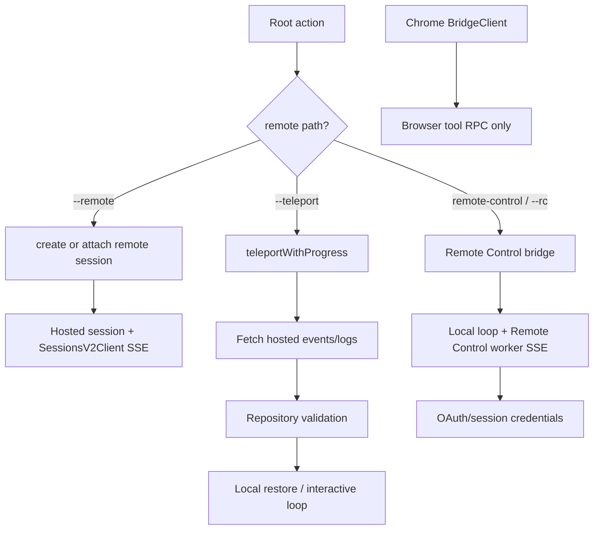
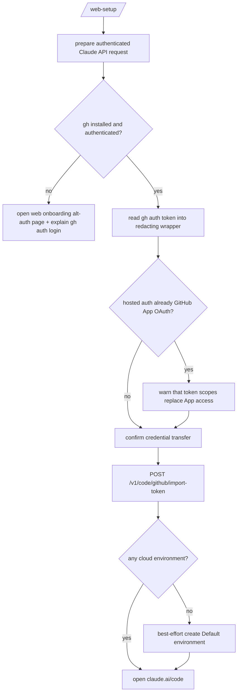

# Remote control and teleport

This page reverse-engineers the hosted-session, teleport, and Remote Control paths. They share session vocabulary but are not one transport: `--remote` drives a hosted session, teleport imports hosted history into a local runtime, Remote Control exposes a running local runtime through a hosted bridge, and Chrome's `BridgeClient` serves browser-backed tools.

## Source anchors

| Semantic alias | String or symbol | Meaning |
| --- | --- | --- |
| DisableRemoteControlPolicy | `Disable Remote Control (claude.ai/code, \`claude remote-control\`, \`--remote-control\`/\`--rc\`)` | Managed setting/policy surface for Remote Control. |
| RemoteSessionFlag | `--remote [description\|session_id\|url]` | Hidden remote-session create/attach flag. |
| TeleportSessionFlag | `--teleport [session]` | Teleport session resume flag. |
| RemoteControlFlag | `--remote-control [name]` | Hidden Remote Control flag. |
| RemoteControlAliasFlag | `--rc [name]` | Alias for Remote Control. |
| BridgeMainEntrypoint | `bridgeMain` | Remote/bridge headless process entry. |
| ReplBridgeInitializer | `initReplBridge` | Interactive REPL bridge initialization. |
| RemoteSessionConfig | `remoteSessionConfig` | Interactive app receives remote-session configuration. |
| TeleportProgressFlow | `teleportWithProgress` | Teleport progress UI/path. |
| BridgePermanentStartupGates | `Remote Control is disabled by your organization's policy` | Bridge-headless startup has non-retryable policy/trust gates before registration. |
| BridgeTransportWorktreeGuards | `Remote Control base URL uses HTTP`, `Worktree mode requires a git repository or WorktreeCreate hooks` | Bridge startup rejects unsafe HTTP and invalid worktree spawn mode. |
| BridgeFirstMessageTitle | `onFirstUserMessage`, `updateBridgeSessionTitle` | Bridge sessions derive and publish a title from the first meaningful user message. |
| FirstMeaningfulUserMessage | `getFirstMeaningfulUserMessageTextContent`, `isCompactSummary` | Title text skips meta and compact-summary messages before using user content. |
| TeleportPolicyAndOAuthGate | `allow_remote_sessions`, `getClaudeAIOAuthTokens()?.accessToken` | Teleport resume checks remote-session policy and a Claude.ai OAuth access token. |
| TeleportRemoteTokenFallback | `CLAUDE_CODE_REMOTE`, `CLAUDE_CODE_OAUTH_TOKEN` | Remote polling can fall back to remote-mode OAuth env handoff. |
| SessionAccessToken | `CLAUDE_CODE_SESSION_ACCESS_TOKEN` | Session ingress token source. |
| RemoteControlSseTransport | [~417,160](../../claude-code-pkg/src/entrypoints/cli.renamed.js#L417160) | `from_sequence_num`, `Last-Event-ID`, `seenSequenceNums` | Resumable worker SSE transport that tracks/logs numeric IDs; duplicate IDs are still dispatched. |
| RemoteControlSessionFactory | [~417,824](../../claude-code-pkg/src/entrypoints/cli.renamed.js#L417824) | `async function z6u(e)` | Creates/reattaches the hosted bridge, rebuilds credentials/transport, and owns archive teardown. |
| CcrV2Hydration | [~580,840](../../claude-code-pkg/src/entrypoints/cli.renamed.js#L580840) | `hydrateFromCCRv2InternalEvents`, `.ccr-tip.json` | Reconciles foreground/subagent internal events into local JSONL by anchored delta or guarded replacement. |
| PersistenceReadyBackfill | [~833,666](../../claude-code-pkg/src/entrypoints/cli.renamed.js#L833666) | `Epf`, `onTransportPersistenceReady` | Starts local-to-server suffix backfill before installing the interactive bridge's live internal-event writer. |
| HostedRemoteClient | [~853,215](../../claude-code-pkg/src/entrypoints/cli.renamed.js#L853215) | `SessionsV2Client` | Separate SSE client used by `--remote` attach/create. |
| HostedRequestIdFilter | [~853,420-853,755](../../claude-code-pkg/src/entrypoints/cli.renamed.js#L853420) | `issuedRequestIds`, `Rqb = 500` | Bounds the set used to reject non-worker responses to this hosted client's own control requests. |
| TeleportLogFallback | [~336,767](../../claude-code-pkg/src/entrypoints/cli.renamed.js#L336767) | `v2 endpoint returned null, trying session-ingress` | Fetches hosted logs with an ordered endpoint fallback. |
| RemoteEnvironmentCommand | [~813,295–813,790](../../claude-code-pkg/src/entrypoints/cli.renamed.js#L813295) | `/remote-env`, `P0a()`, `z0a()`, `A$e()` | Lists cloud targets, resolves settings precedence, and writes the user default environment. |
| WebSetupCommand | [~828,230–828,760](../../claude-code-pkg/src/entrypoints/cli.renamed.js#L828230) | `/web-setup`, `rcf()`, `NPa()`, `TIt()` | Confirms/imports the local GitHub CLI token and bootstraps a default cloud environment when needed. |
| SessionLinkCommand | [~817,956–818,122](../../claude-code-pkg/src/entrypoints/cli.renamed.js#L817956) | `/session`, `/remote`, `remoteSessionUrl` | Reads the current hosted URL and renders a screen-reader-aware QR view without mutating session state. |

## Bundle modules in `cli.renamed.js`

| Semantic alias | Loader line | Representative renamed exports | Atlas entry |
|---|---:|---|---|
| `TeammateMailboxIpc` | 286598 | `writeToMailbox`, `sendShutdownRequestToMailbox`, `readUnreadMessages`, `readMailbox`, `markMessagesAsRead`, `markMessageAsReadByIndex`, `markMessagesAsReadByPredicate`, `formatTeammateMessages`, `createIdleNotification`, `isIdleNotification`, `isTeamPermissionUpdate`, `isTaskAssignment`, `isStructuredProtocolMessage`, `isShutdownRequest`, `isShutdownRejected`, `getInboxPath` | [Bundle module map — session, transcript, agent metadata, and teammate IPC](../99-research-atlas/module-map-from-renamed-cli.md#session-transcript-agent-metadata-and-teammate-ipc) |
| `TeamFileMemberModes` | 476236 | `writeTeamFileAsync`, `updateTeamFile`, `unregisterTeamForSessionCleanup`, `syncTeammateMode`, `setMemberMode`, `setMultipleMemberModes`, `setMemberActive`, `sanitizeName` | [Bundle module map — session, transcript, agent metadata, and teammate IPC](../99-research-atlas/module-map-from-renamed-cli.md#session-transcript-agent-metadata-and-teammate-ipc) |
| `RemoteControlFeatureGates` | 325388 | `isRunningInRemoteEnvironment`, `isRemoteControlInternalEventsEnabled`, `isRemoteControlHardDisabled`, `isPreviewHmrEnabled`, `isPersistentRemoteSessionEnabled`, `isCseShimEnabled`, `isCcrV2SendEventsEnabled`, `isCcrMirrorEnabled` | [Bundle module map — remote control, feature flags, networking](../99-research-atlas/module-map-from-renamed-cli.md#remote-control-feature-flags-networking) |

## Remote runtime map


```mermaid
flowchart TD
    Root[Root action] --> RemoteFlag{remote path?}
    RemoteFlag -->|--remote| RemoteSession[create or attach remote session]
    RemoteFlag -->|--teleport| Teleport[teleportWithProgress]
    RemoteFlag -->|remote-control / --rc| Control[Remote Control bridge]
    RemoteSession --> HostedLoop[Hosted session + SessionsV2Client SSE]
    Teleport --> Fetch[Fetch hosted events/logs]
    Fetch --> Validate[Repository validation]
    Validate --> App[Local restore / interactive loop]
    Control --> Bridge[Local loop + Remote Control worker SSE]
    Bridge --> Tokens[OAuth/session credentials]
    Chrome[Chrome BridgeClient] --> BrowserTools[Browser tool RPC only]
```

## Remote surfaces

| Surface | Runtime role |
|---|---|
| `--remote [description|session_id|url]` | Creates a remote session from a description or attaches to an existing session by ID/URL. |
| `--teleport [session]` | Resumes a teleport session; helper strings validate clean git state and matching checkout. |
| `remote-control` / `rc` | Hidden command that starts Remote Control for local sessions. |
| `--remote-control [name]` / `--rc [name]` | Hidden root flags enabling Remote Control on an interactive session. |
| `remoteSessionConfig` | Propagates remote-session configuration into the interactive app. |
| `bridgeMain` | Headless bridge process entry used by bridge/session-ingress modes. |
| `initReplBridge` | Interactive bridge initialization for inbound messages, permission responses, interrupts, model changes, and thinking-token changes. |
| `CLAUDE_CODE_SESSION_ACCESS_TOKEN` | Bearer-like session ingress token source and refresh variable. |

## Interactive remote setup commands

The three nearby slash commands have different authority boundaries: `/remote-env` mutates local settings, `/web-setup` transfers a GitHub credential to the hosted service after confirmation, and `/session` only displays an already-created hosted-session link.

### `/remote-env`: default environment selection

`/remote-env` is a local TUI command gated by Claude.ai subscriber status and the `allow_remote_sessions` policy. It concurrently lists first-party cloud environments and any additional target provider implemented by the build. In `2.1.215`, `JIu()` returns no additional targets, so the visible list comes from `GET /v1/environment_providers` using Claude.ai OAuth plus the organization UUID. The fetch path also caches only a boolean `hasRemoteEnvironment` hint in global config; the environment records remain service data.

The initial selection comes from the effective `remote.defaultEnvironmentId` settings stack. Selecting a target concurrently requests two writes:

1. remove `remote.defaultEnvironmentId` from `localSettings` when that local override exists; and
2. store the selected environment ID in `userSettings`.

After both Promises resolve, the handler recomputes the effective setting. If a higher-precedence policy/flag/other source still pins another ID, the success text explicitly warns that the selected user value does not currently win. Unlike settings handlers that inspect the returned `{error}` value, this branch does not check either update result before emitting success copy; the precedence warning is therefore not a general write-verification mechanism. Listing failures are preserved separately from an empty list so the UI can say whether no environment exists or the service could not be queried. The command chooses an existing target; it does not create or delete environments.

### `/web-setup`: import local GitHub CLI authentication

`/web-setup` is available only on the Claude.ai surface when the rollout gate and both `allow_remote_sessions` and `allow_quick_web_setup` policies pass. Its implementation is not merely a browser link:


```mermaid
flowchart TD
  Start[/web-setup/] --> Login[prepare authenticated Claude API request]
  Login --> GH{gh installed and authenticated?}
  GH -->|no| Alt[open web onboarding alt-auth page + explain gh auth login]
  GH -->|yes| Token[read gh auth token into redacting wrapper]
  Token --> Existing{hosted auth already GitHub App OAuth?}
  Existing -->|yes| Replace[warn that token scopes replace App access]
  Existing -->|no| Confirm[confirm credential transfer]
  Replace --> Confirm
  Confirm --> Import[POST /v1/code/github/import-token]
  Import --> Envs{any cloud environment?}
  Envs -->|no| Create[best-effort create Default environment]
  Envs -->|yes| Open[open claude.ai/code]
  Create --> Open
```

Before transfer, the UI says the hosted product uses the credential to clone and push on the user's behalf. If the account is already connected through the GitHub App, it warns that continuing replaces that authentication and that repository access will follow the local token's scopes. Only an explicit **Continue**/**Replace connection** action calls the import endpoint. The token wrapper redacts `toString`, JSON serialization, and Node inspection, but the secret necessarily remains in process memory long enough to enter the authenticated request body.

The import maps network, signed-out, invalid-token, and other server failures to distinct user messages. On success, if listing environments returns none **or the list request fails**, the command best-effort creates an Anthropic cloud environment named `Default` (Python 3.11, Node 20, default-host network access). Environment-creation failure is logged as a warning and does not roll back a successful credential import; the command still opens the hosted Code page and reports the returned GitHub username.

Cancellation sets a local ignored-result latch. The inspected path does not attach an abort signal to all already-issued login/import requests, so cancellation prevents later UI handling but is not proof that an in-flight server request was canceled transactionally.

### `/session` (`/remote`): read-only hosted link

`/session` is enabled only in remote mode and hidden from normal discovery unless the `fanout` feature is active. It reads `remoteSessionUrl` from runtime state, prints the browser URL, and—unless screen-reader mode is active—generates a UTF-8 QR code. QR generation failure is debug-logged and simply omits the code; the text URL remains visible.

If no URL exists, the view distinguishes a non-remote local session from a directly connected/browser context that has no shareable browser link. It performs no settings write, hosted API mutation, archive, or transport handoff.

## Permission and control bridge

Remote Control is not just display streaming. The `permission_response` anchor in the headless/bridge code and `initReplBridge` callback list show bidirectional control: inbound messages, permission responses, interrupts, model updates, thinking-token updates, and other state changes can be bridged into a running session.

For the lower-level frame families (`control_request`, `bridge_state`, `permission_request`/`permission_response`, IDE `ws://` or `.../sse` endpoints, provider `text/event-stream`, and MCP JSON-RPC methods), see [Runtime communication protocols](../00-start-here/runtime-communication-protocols.md).

## Bridge startup gates and title propagation

The decoded bridge-headless chunk shows hard gates before the bridge is registered. Policy can reject Remote Control with `disableRemoteControl`; untrusted workspaces fail before starting; non-localhost HTTP base URLs are rejected in favor of HTTPS; and worktree spawn mode requires either a git repository or `WorktreeCreate` hooks. These are startup failures, not recoverable bridge frames.

Once bridge ingress starts, `onFirstUserMessage` calls the same first-meaningful-message title helper used by session metadata and then calls `updateBridgeSessionTitle`. That means the remote title is derived from user content after meta and compact-summary messages are skipped, rather than from an arbitrary bridge name.

## Remote Control identity, replay, and teardown

Remote Control has two linked identities: the local session UUID and a hosted bridge-session ID. `saveBridgeSession()` immediately updates the current session's in-memory bridge cache and, only when the main transcript is already materialized, asynchronously queues the bridge ID and highest received numeric worker-SSE ID as a `bridge-session` record. Metadata re-append can persist the cache after later materialization. Resume restores the durable values; a CLI fork deliberately clears them so the new lineage does not reattach to the original bridge.

The worker SSE transport resumes with both `from_sequence_num` and `Last-Event-ID`. It applies base-10 `parseInt` to the SSE ID, ignores wholly nonnumeric values, logs IDs already present in `seenSequenceNums`, and still dispatches those frames. Once that set exceeds 1,000 entries it removes values below `lastSequenceNum - 200`; this is heuristic retention, not a hard capacity. It advances `lastSequenceNum` monotonically as soon as a larger parsed ID is read, before event-type checks, JSON parsing, device-attestation filtering, or application handling. The cursor is therefore transport receipt state, not “last accepted message.” Validly parsed `client_event` envelopes can also be reported as received/processed by the delivery channel even when filtering prevents application dispatch.

Application replay protection uses separate fixed-capacity UUID rings. Main envelopes enter the outbound ring before their asynchronous transport write is acknowledged, outbound SDK events have another ring, and a parsed `user` envelope enters the inbound ring before its callback runs; callback failure therefore does not remove it. After the upstream event/attestation filter rejects worker-sourced `control_request` frames, eligible `control_response` and `control_request` payloads route before the main-envelope UUID checks, while other non-user envelopes are ignored. The default ring capacity is 2,000 (feature-configurable from 100 to 50,000), so these are bounded send/type-acceptance filters rather than delivery commits or an exactly-once guarantee.

A 45-second liveness timer forces reconnect when no data arrives. Reconnect uses exponential backoff with jitter; selected 401/credential failures cause credential refresh and transport rebuild, while permanent 401/403/404 outcomes are surfaced rather than retried forever. Cursor persistence is lifecycle-bound rather than per-frame: interactive bridge metadata is saved at bridge lifecycle points, while the visible background-job path snapshots `bridgeSessionSeq` during rendezvous shutdown and reuses it on respawn. Changing the stored bridge ID clears the old job cursor.

Outbound worker events use separate bounded uploader queues, not the inbound SSE replay cursor. Client-event batches are capped at 100 records/10 MiB with queue backpressure; transient failures retry with exponential backoff, while permanent 400/413/422 responses can drop ephemeral events and, if the durable retry still fails, the durable batch. Internal-event and delivery queues have their own caps and permanent-error drops, and closing the client discards pending queue contents. None of these paths establishes exactly-once upload.

During initial-history flush and credential rebuild, two uncapped in-memory arrays queue outbound transcript messages and outbound SDK events. They do not queue inbound SSE frames or control-plane output: control requests, responses, cancellation requests, and result frames are dropped while recovery is in flight. A successful rebuild drains the two arrays into the replacement transport; recovery failure/teardown drops what remains.

Normal v2 teardown makes a best-effort `archiveCodeSession` request within the configured 1.5-second budget and can retry once after a 401 if enough of that budget remains. Its telemetry treats numeric statuses below 400 as success; unlike the separate `archiveRemoteSession` helper used by other paths, this v2 wrapper does not special-case 409 as success. Handoff paths can explicitly skip archival so another owner can continue the hosted bridge. Static source does not establish how long an archived bridge remains recoverable.

## CCR transcript reconciliation is separate from SSE replay

Remote Control's numeric worker-SSE cursor and its transcript-persistence cursor are different state machines. The latter is a best-effort `.ccr-tip.json` sidecar whose `{eventId, updatedAt}` is updated after acknowledged outgoing foreground internal-event batches or successful foreground hydration. Before delta resume, the client accepts that anchor only when it is also found among UUIDs in the local JSONL tail's last 64 KiB.

CCR v2 hydration uses a coherent anchor to append returned payloads not already represented in that tail. An incoherent tail triggers an unanchored refetch; server anchor rejection/not-found, an anchor included in the response, or no valid sidecar leads to a full candidate set. Before a full foreground or per-agent subagent rewrite, a zero-content guard preserves an existing content-bearing transcript when the fetched set contains no `user` or `assistant` payload. Rewrites use direct JSONL output rather than atomic replacement, subagent files are handled independently, and absent server agents do not cause local agent-file deletion. This is recovery policy, not worker-SSE dispatch deduplication.

When an interactive bridge transport becomes persistence-ready, `Epf()` first fetches foreground and subagent server UUIDs and scans local files backward to the newest compaction boundary. It starts queuing UUID-bearing local records absent from the union. Subagent startup backfill is capped at the 20 newest files of at most 5 MiB; main scanning is backward-streamed without that file-size admission cap. The routine starts writer Promises with failure handlers but does not await their server acknowledgements before returning. Only then does a transport-generation check install the live writer/readers, and registration lowers the main JSONL drain schedule from 100 ms to 10 ms. Teardown invalidates stale installation but does not cancel already-started old-transport work as one transaction.

The direct remote/headless CCR runtime wires its internal-event writer/readers eagerly and can prefetch hydration on `--resume`; the interactive bridge uses the persistence-ready/backfill callback above. Neither path should be generalized to hosted `--remote`, teleport, or the worker-SSE receipt cursor.

## Hosted `--remote` reconnect contract

`--remote` uses `SessionsV2Client`, not the Remote Control worker wrapper. It also resumes with a sequence query/header and uses a 45-second liveness timeout, but its retry contract is bounded: five reconnect attempts with exponential backoff capped between 1 and 30 seconds. Clock-drift/suspend detection triggers a reconnect. A `catch_up_truncated` event is handled explicitly as a transcript gap; the client reports it rather than claiming complete replay.

The hosted client also keeps an insertion-ordered `issuedRequestIds` set for control-plane source filtering. Each locally generated control request enters the set before its asynchronous POST result is known; a worker-sourced response removes it. Once the set exceeds 500 entries, the oldest still-retained ID is evicted. Timeouts and failed POSTs are not wired to immediate removal in this class, so unanswered IDs can remain until a worker response or capacity eviction. While an ID is retained, a matching `control_response` from a non-worker source is dropped; after eviction, that particular source check can no longer recognize a late response as belonging to this client's request. This is a bounded provenance filter, not a complete pending-request ledger or an exactly-once response guarantee.

This distinction matters operationally: do not transfer Remote Control's credential-rebuild/archive behavior to `--remote`, and do not assume `--remote`'s five-attempt budget applies to the Remote Control worker.

## Teleport-specific guardrails

Teleport helpers include user-facing errors such as:

- `Git working directory is not clean. Please commit or stash your changes before using --teleport.`
- `You must run claude --teleport ... from a checkout of ...`

The decoded teleport path adds two more guardrails. `teleportResumeCodeSession` first checks `allow_remote_sessions`, then requires `getClaudeAIOAuthTokens()?.accessToken`; if no token is present, the runtime reports that Claude Code web sessions require Claude.ai authentication and that API-key authentication is not sufficient for this path. After the token gate it fetches the session and calls `validateSessionRepository`, so teleport remains tied to repository/session consistency rather than an arbitrary transcript download. Remote event polling can use the same OAuth token or, when `CLAUDE_CODE_REMOTE` is set, `CLAUDE_CODE_OAUTH_TOKEN` / cached OAuth fallback.

Log retrieval first tries the Sessions API v2 path and falls back to session ingress only when that call returns `null`; errors do not silently select an arbitrary third path. The importer removes sidechain entries before local resume. Event polling requests ascending order, follows up to 50 pages per call, and retries transient GET failures with 2/4/8/16-second delays. Within each returned page it overwrites the cursor from every present `sequence_num` before filtering out environment-manager logs, control responses, malformed payloads, or payloads without `session_id`; filtered records therefore still advance the next request. Unlike the Remote Control worker cursor, this helper neither parses numeric IDs, computes a monotonic maximum, nor deduplicates eligible payloads. It relies on the requested/server-returned order, returns repeated eligible events again, and uses the last encountered sequence as a string—so an out-of-order response can regress the client cursor.

The response's `next_cursor` is only a “continue paging” test; the next request still uses the last encountered `sequence_num`, not the `next_cursor` value itself. A page that claims another page but supplies no sequence can therefore repeat the same request until the 50-page cap. When the cap is reached, a later poll resumes from whatever last sequence was retained. The long-running wait helper polls once per second for at most 30 minutes, fails after ten consecutive metadata-fetch failures, and treats five consecutive idle polls with no **eligible** events as completion. Filtered-only traffic advances the cursor but does not reset that idle counter. A hosted `requires_action` state is fatal in unattended polling because no client is present to answer the permission prompt.

These are client-side stopping rules, not server guarantees. Short-code/session expiry, hosted event retention, and whether every old sequence remains replayable are not recoverable from this artifact.

## Chrome browser-tool bridge protocol (`BridgeClient`)

This is a separate browser-tool subsystem, not the session transport used by Remote Control or `--remote`. One client owns one WebSocket to the Chrome bridge server and routes JSON tool messages between Claude Code and the user's extension(s). Per-connection state includes `connected`, `authenticated`, `connecting`, `reconnectAttempts`, `pendingCalls` and `timedOutCalls` (both `Map<tool_use_id, ...>`), `selectedDeviceId`, `pairingInProgress`, plus a `keepAliveInterval` and `lastPongReceived`.

`ensureConnected()` is the public guard: it logs `wsState`, returns immediately when the socket is `OPEN` and authenticated, otherwise starts `connect()` and polls every 200 ms with a 10,000 ms cap, resolving `true` once `connected && authenticated` and `false` if the connecting flag clears first. `connect()` walks a handshake that emits `chrome_bridge_handshake_timeout` at `z8q` ms when WebSocket stays below `OPEN`, fetches the dev or production user ID for the URL, and adds an OAuth token when one is available.

`callTool(name, args, opts)` is the single-tool RPC. It validates `ws.readyState === OPEN`, triggers `discoverAndSelectExtension` on first call (cached in `discoveryPromise`), throws `NoExtensionConnectedError` if discovery finishes without a `selectedDeviceId`, and then composes the wire frame:

```js
{
  type: "tool_call",
  tool_use_id: crypto.randomUUID(),
  client_type: this.context.clientTypeId,
  tool: H,
  args: $,
  target_device_id?: this.selectedDeviceId,
  permission_mode?: opts?.permissionMode ?? this.permissionMode,
  allowed_domains?: opts?.allowedDomains ?? this.allowedDomains,
  handle_permission_prompts?: opts?.onPermissionRequest ? true : undefined,
  session_scope?: opts?.sessionScope,
}
```

The call is registered in `pendingCalls` together with a `createTimeoutTimer(tool_use_id, f)` whose cap is `context.getToolCallTimeoutMs?.(name) ?? DEFAULT_TOOL_CALL_TIMEOUT_MS`. Telemetry events emitted on the call path include `chrome_bridge_tool_call_started`, `chrome_bridge_connection_failed`, and `chrome_bridge_handshake_timeout`, all carrying `tool_name`, `tool_use_id`, `session_id`, and `user_message_uuid`.

`discoverAndSelectExtension()` queries the server for connected extensions, waits up to `PEER_WAIT_TIMEOUT_MS` when none are visible, and chooses the device:

- **`requirePairedDevice`** — only auto-selects the persisted device id; otherwise refuses with the log message `"requirePairedDevice set but no persistedDeviceId; refusing to auto-select"`.
- **Single-device** — silently selects when exactly one extension is connected.
- **Multi-device** — sets `multiBrowserPendingSelection = true` and requires the user to pair, gated by `pendingPairingRequestId` to prevent duplicate prompts.

The bridge child process itself is supervised: at [line 236330](../../claude-code-pkg/src/entrypoints/cli.renamed.js#L236330) a sibling helper sends `process.kill(H.pid, "SIGTERM")` and logs `Sent SIGTERM to ${name} bridge process` whenever the parent tears down, hooking into the shutdown coordinator covered in [Shutdown coordinator and signal-exit](../01-runtime-lifecycle/cli-main-paths.md#shutdown-coordinator-and-signal-exit).

## Artifact-limited boundaries

- Client source proves replay cursors, bounded application-level UUID filtering, uploader/retry budgets, archive calls, and repository/auth gates. Numeric duplicate SSE IDs are logged rather than dispatch-deduplicated, and the cursor can precede payload acceptance; the artifact does not prove server retention, exactly-once delivery, or cross-version compatibility.
- Policy checks are proven at startup/activation points. The artifact does not establish immediate revocation of an already-running bridge after an out-of-process policy change.
- Archive is a service operation, not proof of physical deletion, retention duration, or data erasure.

## Related docs

- [Session resume and transcripts](session-resume-and-transcripts.md)
- [Session API, events, and storage](session-api-events-and-storage.md)
- [Headless streaming and resilience](../02-context-model-loop/headless-streaming-and-resilience.md)
- [Diagnostics and debug logs](../05-hosted-agent-ops/diagnostics-and-debug-logs.md)
- [Telemetry and tracing](../05-hosted-agent-ops/telemetry-and-tracing.md)
