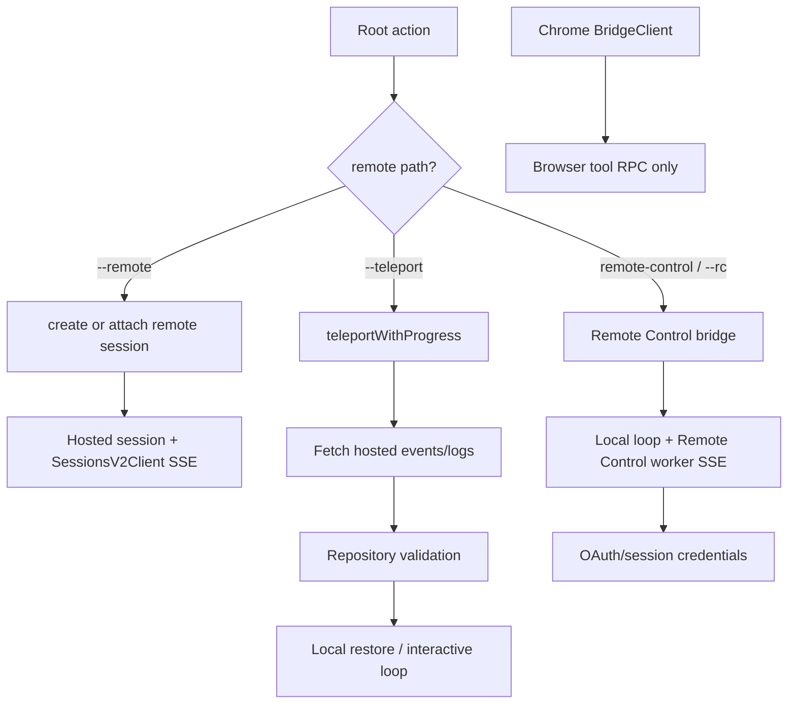

# Remote control and teleport

This page reverse-engineers the hosted-session, teleport, and Remote Control paths. They share session vocabulary but are not one transport: `--remote` drives a hosted session, teleport imports hosted history into a local runtime, Remote Control exposes a running local runtime through a hosted bridge, and Chrome's `BridgeClient` serves browser-backed tools.

## Source anchors

| Semantic alias | String or symbol | Meaning |
| --- | --- | --- |
| DisableRemoteControlPolicy | `Disable Remote Control (claude.ai/code, \`claude remote-control\`, \`--remote-control\`/\`--rc\`)` | Managed setting/policy surface for Remote Control. |
| RemoteSessionFlag | `--remote [description\|session_id\|url]` | Hidden remote-session create/attach flag. |
| TeleportSessionFlag | `--teleport [session]` | Teleport session resume flag. |
| RemoteControlFlag | `--remote-control [name]` | Hidden Remote Control flag. |
| RemoteControlAliasFlag | `--rc [name]` | Alias for Remote Control. |
| BridgeMainEntrypoint | `bridgeMain` | Remote/bridge headless process entry. |
| ReplBridgeInitializer | `initReplBridge` | Interactive REPL bridge initialization. |
| RemoteSessionConfig | `remoteSessionConfig` | Interactive app receives remote-session configuration. |
| TeleportProgressFlow | `teleportWithProgress` | Teleport progress UI/path. |
| BridgePermanentStartupGates | `Remote Control is disabled by your organization's policy` | Bridge-headless startup has non-retryable policy/trust gates before registration. |
| BridgeTransportWorktreeGuards | `Remote Control base URL uses HTTP`, `Worktree mode requires a git repository or WorktreeCreate hooks` | Bridge startup rejects unsafe HTTP and invalid worktree spawn mode. |
| BridgeFirstMessageTitle | `onFirstUserMessage`, `updateBridgeSessionTitle` | Bridge sessions derive and publish a title from the first meaningful user message. |
| FirstMeaningfulUserMessage | `getFirstMeaningfulUserMessageTextContent`, `isCompactSummary` | Title text skips meta and compact-summary messages before using user content. |
| TeleportPolicyAndOAuthGate | `allow_remote_sessions`, `getClaudeAIOAuthTokens()?.accessToken` | Teleport resume checks remote-session policy and a Claude.ai OAuth access token. |
| TeleportRemoteTokenFallback | `CLAUDE_CODE_REMOTE`, `CLAUDE_CODE_OAUTH_TOKEN` | Remote polling can fall back to remote-mode OAuth env handoff. |
| SessionAccessToken | `CLAUDE_CODE_SESSION_ACCESS_TOKEN` | Session ingress token source. |
| RemoteControlSseTransport | [~417,160](../../claude-code-pkg/src/entrypoints/cli.renamed.js#L417160) | `from_sequence_num`, `Last-Event-ID`, `seenSequenceNums` | Resumable, deduplicating worker SSE transport for Remote Control. |
| RemoteControlSessionFactory | [~417,824](../../claude-code-pkg/src/entrypoints/cli.renamed.js#L417824) | `async function z6u(e)` | Creates/reattaches the hosted bridge, rebuilds credentials/transport, and owns archive teardown. |
| HostedRemoteClient | [~853,215](../../claude-code-pkg/src/entrypoints/cli.renamed.js#L853215) | `SessionsV2Client` | Separate SSE client used by `--remote` attach/create. |
| TeleportLogFallback | [~336,767](../../claude-code-pkg/src/entrypoints/cli.renamed.js#L336767) | `v2 endpoint returned null, trying session-ingress` | Fetches hosted logs with an ordered endpoint fallback. |

## Bundle modules in `cli.renamed.js`

| Semantic alias | Loader line | Representative renamed exports | Atlas entry |
|---|---:|---|---|
| `TeammateMailboxIpc` | 286598 | `writeToMailbox`, `sendShutdownRequestToMailbox`, `readUnreadMessages`, `readMailbox`, `markMessagesAsRead`, `markMessageAsReadByIndex`, `markMessagesAsReadByPredicate`, `formatTeammateMessages`, `createIdleNotification`, `isIdleNotification`, `isTeamPermissionUpdate`, `isTaskAssignment`, `isStructuredProtocolMessage`, `isShutdownRequest`, `isShutdownRejected`, `getInboxPath` | [Bundle module map — session, transcript, agent metadata, and teammate IPC](../99-research-atlas/module-map-from-renamed-cli.md#session-transcript-agent-metadata-and-teammate-ipc) |
| `TeamFileMemberModes` | 476236 | `writeTeamFileAsync`, `updateTeamFile`, `unregisterTeamForSessionCleanup`, `syncTeammateMode`, `setMemberMode`, `setMultipleMemberModes`, `setMemberActive`, `sanitizeName` | [Bundle module map — session, transcript, agent metadata, and teammate IPC](../99-research-atlas/module-map-from-renamed-cli.md#session-transcript-agent-metadata-and-teammate-ipc) |
| `RemoteControlFeatureGates` | 325388 | `isRunningInRemoteEnvironment`, `isRemoteControlInternalEventsEnabled`, `isRemoteControlHardDisabled`, `isPreviewHmrEnabled`, `isPersistentRemoteSessionEnabled`, `isCseShimEnabled`, `isCcrV2SendEventsEnabled`, `isCcrMirrorEnabled` | [Bundle module map — remote control, feature flags, networking](../99-research-atlas/module-map-from-renamed-cli.md#remote-control-feature-flags-networking) |

## Remote runtime map


```mermaid
flowchart TD
    Root[Root action] --> RemoteFlag{remote path?}
    RemoteFlag -->|--remote| RemoteSession[create or attach remote session]
    RemoteFlag -->|--teleport| Teleport[teleportWithProgress]
    RemoteFlag -->|remote-control / --rc| Control[Remote Control bridge]
    RemoteSession --> HostedLoop[Hosted session + SessionsV2Client SSE]
    Teleport --> Fetch[Fetch hosted events/logs]
    Fetch --> Validate[Repository validation]
    Validate --> App[Local restore / interactive loop]
    Control --> Bridge[Local loop + Remote Control worker SSE]
    Bridge --> Tokens[OAuth/session credentials]
    Chrome[Chrome BridgeClient] --> BrowserTools[Browser tool RPC only]
```

## Remote surfaces

| Surface | Runtime role |
|---|---|
| `--remote [description|session_id|url]` | Creates a remote session from a description or attaches to an existing session by ID/URL. |
| `--teleport [session]` | Resumes a teleport session; helper strings validate clean git state and matching checkout. |
| `remote-control` / `rc` | Hidden command that starts Remote Control for local sessions. |
| `--remote-control [name]` / `--rc [name]` | Hidden root flags enabling Remote Control on an interactive session. |
| `remoteSessionConfig` | Propagates remote-session configuration into the interactive app. |
| `bridgeMain` | Headless bridge process entry used by bridge/session-ingress modes. |
| `initReplBridge` | Interactive bridge initialization for inbound messages, permission responses, interrupts, model changes, and thinking-token changes. |
| `CLAUDE_CODE_SESSION_ACCESS_TOKEN` | Bearer-like session ingress token source and refresh variable. |

## Permission and control bridge

Remote Control is not just display streaming. The `permission_response` anchor in the headless/bridge code and `initReplBridge` callback list show bidirectional control: inbound messages, permission responses, interrupts, model updates, thinking-token updates, and other state changes can be bridged into a running session.

For the lower-level frame families (`control_request`, `bridge_state`, `permission_request`/`permission_response`, IDE `ws://` or `.../sse` endpoints, provider `text/event-stream`, and MCP JSON-RPC methods), see [Runtime communication protocols](../00-start-here/runtime-communication-protocols.md).

## Bridge startup gates and title propagation

The decoded bridge-headless chunk shows hard gates before the bridge is registered. Policy can reject Remote Control with `disableRemoteControl`; untrusted workspaces fail before starting; non-localhost HTTP base URLs are rejected in favor of HTTPS; and worktree spawn mode requires either a git repository or `WorktreeCreate` hooks. These are startup failures, not recoverable bridge frames.

Once bridge ingress starts, `onFirstUserMessage` calls the same first-meaningful-message title helper used by session metadata and then calls `updateBridgeSessionTitle`. That means the remote title is derived from user content after meta and compact-summary messages are skipped, rather than from an arbitrary bridge name.

## Remote Control identity, replay, and teardown

Remote Control has two linked identities: the local session UUID and a hosted bridge-session ID. `saveBridgeSession()` appends the bridge ID and last accepted sequence number as a `bridge-session` transcript record. Resume restores both values; a CLI fork deliberately clears them so the new lineage does not reattach to the original bridge.

The worker SSE transport resumes with both `from_sequence_num` and `Last-Event-ID`. For numeric SSE IDs it keeps a bounded recent `seenSequenceNums` set, drops duplicates, and advances `lastSequenceNum` monotonically. A 45-second liveness timer forces reconnect when no data arrives. Reconnect uses exponential backoff with jitter; selected 401/credential failures cause credential refresh and transport rebuild, while permanent 401/403/404 outcomes are surfaced rather than retried forever.

During rebuild, the wrapper queues inbound/outbound work until the replacement transport is ready. Normal teardown archives the hosted bridge session through `archiveRemoteSession`; handoff paths can explicitly skip archival so another owner can continue it. Archive treats HTTP 200 and 409 as success and otherwise logs a best-effort failure. Static source does not establish how long an archived bridge remains recoverable.

## Hosted `--remote` reconnect contract

`--remote` uses `SessionsV2Client`, not the Remote Control worker wrapper. It also resumes with a sequence query/header and uses a 45-second liveness timeout, but its retry contract is bounded: five reconnect attempts with exponential backoff capped between 1 and 30 seconds. Clock-drift/suspend detection triggers a reconnect. A `catch_up_truncated` event is handled explicitly as a transcript gap; the client reports it rather than claiming complete replay.

This distinction matters operationally: do not transfer Remote Control's credential-rebuild/archive behavior to `--remote`, and do not assume `--remote`'s five-attempt budget applies to the Remote Control worker.

## Teleport-specific guardrails

Teleport helpers include user-facing errors such as:

- `Git working directory is not clean. Please commit or stash your changes before using --teleport.`
- `You must run claude --teleport ... from a checkout of ...`

The decoded teleport path adds two more guardrails. `teleportResumeCodeSession` first checks `allow_remote_sessions`, then requires `getClaudeAIOAuthTokens()?.accessToken`; if no token is present, the runtime reports that Claude Code web sessions require Claude.ai authentication and that API-key authentication is not sufficient for this path. After the token gate it fetches the session and calls `validateSessionRepository`, so teleport remains tied to repository/session consistency rather than an arbitrary transcript download. Remote event polling can use the same OAuth token or, when `CLAUDE_CODE_REMOTE` is set, `CLAUDE_CODE_OAUTH_TOKEN` / cached OAuth fallback.

Log retrieval first tries the Sessions API v2 path and falls back to session ingress only when that call returns `null`; errors do not silently select an arbitrary third path. The importer removes sidechain entries before local resume. Event polling is cursor-ordered (`sort_order: "asc"`), follows up to 50 pages per poll, retries transient GET failures with 2/4/8/16-second delays, and advances the cursor from `sequence_num`. The long-running wait helper polls once per second for at most 30 minutes, fails after ten consecutive metadata-fetch failures, and treats five consecutive idle/no-new-event polls as completion. A hosted `requires_action` state is fatal in unattended polling because no client is present to answer the permission prompt.

These are client-side stopping rules, not server guarantees. Short-code/session expiry, hosted event retention, and whether every old sequence remains replayable are not recoverable from this artifact.

## Chrome browser-tool bridge protocol (`BridgeClient`)

This is a separate browser-tool subsystem, not the session transport used by Remote Control or `--remote`. One client owns one WebSocket to the Chrome bridge server and routes JSON tool messages between Claude Code and the user's extension(s). Per-connection state includes `connected`, `authenticated`, `connecting`, `reconnectAttempts`, `pendingCalls` and `timedOutCalls` (both `Map<tool_use_id, ...>`), `selectedDeviceId`, `pairingInProgress`, plus a `keepAliveInterval` and `lastPongReceived`.

`ensureConnected()` is the public guard: it logs `wsState`, returns immediately when the socket is `OPEN` and authenticated, otherwise starts `connect()` and polls every 200 ms with a 10,000 ms cap, resolving `true` once `connected && authenticated` and `false` if the connecting flag clears first. `connect()` walks a handshake that emits `chrome_bridge_handshake_timeout` at `z8q` ms when WebSocket stays below `OPEN`, fetches the dev or production user ID for the URL, and adds an OAuth token when one is available.

`callTool(name, args, opts)` is the single-tool RPC. It validates `ws.readyState === OPEN`, triggers `discoverAndSelectExtension` on first call (cached in `discoveryPromise`), throws `NoExtensionConnectedError` if discovery finishes without a `selectedDeviceId`, and then composes the wire frame:

```js
{
  type: "tool_call",
  tool_use_id: crypto.randomUUID(),
  client_type: this.context.clientTypeId,
  tool: H,
  args: $,
  target_device_id?: this.selectedDeviceId,
  permission_mode?: opts?.permissionMode ?? this.permissionMode,
  allowed_domains?: opts?.allowedDomains ?? this.allowedDomains,
  handle_permission_prompts?: opts?.onPermissionRequest ? true : undefined,
  session_scope?: opts?.sessionScope,
}
```

The call is registered in `pendingCalls` together with a `createTimeoutTimer(tool_use_id, f)` whose cap is `context.getToolCallTimeoutMs?.(name) ?? DEFAULT_TOOL_CALL_TIMEOUT_MS`. Telemetry events emitted on the call path include `chrome_bridge_tool_call_started`, `chrome_bridge_connection_failed`, and `chrome_bridge_handshake_timeout`, all carrying `tool_name`, `tool_use_id`, `session_id`, and `user_message_uuid`.

`discoverAndSelectExtension()` queries the server for connected extensions, waits up to `PEER_WAIT_TIMEOUT_MS` when none are visible, and chooses the device:

- **`requirePairedDevice`** — only auto-selects the persisted device id; otherwise refuses with the log message `"requirePairedDevice set but no persistedDeviceId; refusing to auto-select"`.
- **Single-device** — silently selects when exactly one extension is connected.
- **Multi-device** — sets `multiBrowserPendingSelection = true` and requires the user to pair, gated by `pendingPairingRequestId` to prevent duplicate prompts.

The bridge child process itself is supervised: at [line 236330](../../claude-code-pkg/src/entrypoints/cli.renamed.js#L236330) a sibling helper sends `process.kill(H.pid, "SIGTERM")` and logs `Sent SIGTERM to ${name} bridge process` whenever the parent tears down, hooking into the shutdown coordinator covered in [Shutdown coordinator and signal-exit](../01-runtime-lifecycle/cli-main-paths.md#shutdown-coordinator-and-signal-exit).

## Artifact-limited boundaries

- Client source proves replay cursors, local deduplication, retry budgets, archive calls, and repository/auth gates; it does not prove server retention, exactly-once delivery, or cross-version compatibility.
- Policy checks are proven at startup/activation points. The artifact does not establish immediate revocation of an already-running bridge after an out-of-process policy change.
- Archive is a service operation, not proof of physical deletion, retention duration, or data erasure.

## Related docs

- [Session resume and transcripts](session-resume-and-transcripts.md)
- [Session API, events, and storage](session-api-events-and-storage.md)
- [Headless streaming and resilience](../02-context-model-loop/headless-streaming-and-resilience.md)
- [Diagnostics and debug logs](../05-hosted-agent-ops/diagnostics-and-debug-logs.md)
- [Telemetry and tracing](../05-hosted-agent-ops/telemetry-and-tracing.md)
