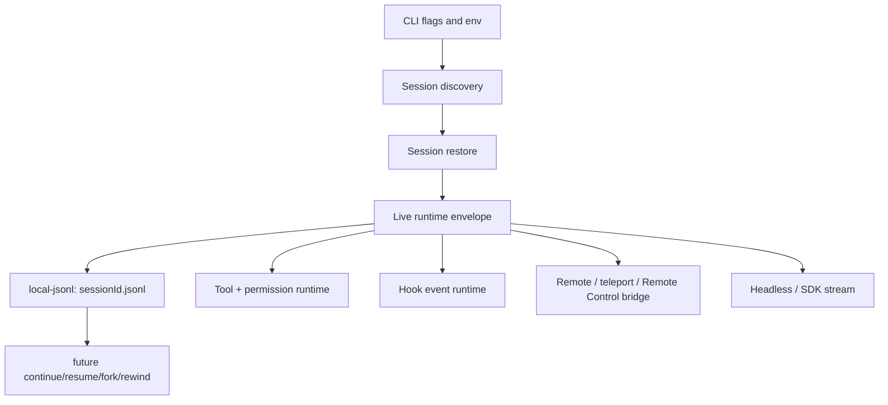
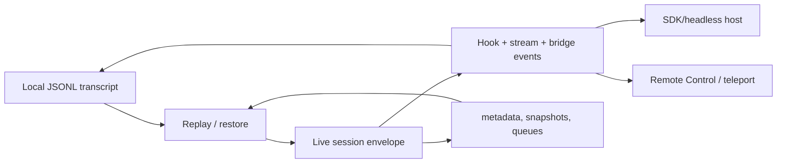

# Session API, events, and storage

This page reverse-engineers a question-oriented slice of `cli.renamed.js`: **how are sessions designed, does remote control exist, what API/event/storage surfaces are visible, and how do those pieces compose?**

It complements [Session resume and transcripts](session-resume-and-transcripts.md), [Remote control and teleport](remote-control-and-teleport.md), and [Session and remote-control architecture](architecture.md). Those pages explain individual flows; this page is the list/reference view.

Use [Data models and frame schemas](data-models-and-frame-schemas.md) for the canonical transcript-record, session-layer, and frame-family schema reference.

## Short answer

- A session is designed as a **durable local JSONL transcript plus a live runtime envelope** addressed by one session ID.
- Remote control **does exist**. The visible entrypoints are `--remote`, `--teleport`, `--remote-control`, and `--rc`; the implementation projects the same session envelope over bridge/session-ingress transports instead of creating a separate remote runtime.
- API calls are not one neat table in source. `cli.renamed.js` embeds several families: Claude Code cloud/runtime endpoints, Anthropic SDK generated endpoints, MCP JSON-RPC methods, telemetry/OTEL endpoints, and third-party integration endpoints.
- Events are also plural: hook event names, stream/SDK frames, bridge/control frames, MCP JSON-RPC notifications, telemetry events, and JSONL transcript entries.
- Internal storage exists and is mostly **file-backed**: per-session JSONL, per-project metadata, file-history/context-collapse/checkpoint records, task/session queues, optional SDK `sessionStore` mirroring, scheduled-task files/locks, debug logs, and caches.

## Source anchors

| Semantic alias | String or symbol | Meaning |
| --- | --- | --- |
| LocalJsonlTranscriptSource | `transcriptSource:"local-jsonl"` | Sessions default to local JSONL transcript storage. |
| ProjectStateRoot | `projects` | Per-project state helper under the Claude config root. |
| CurrentSessionJsonlName | `` `${v$()}.jsonl` `` | Current-session JSONL file naming. |
| SessionDiscovery | `async function jHH` | Resume/latest-session discovery. |
| TranscriptRestore | `async function OG8` | Transcript restore into the live envelope. |
| TranscriptRecorder | `recordTranscript` | Durable transcript append/export surface. |
| FileHistorySnapshotRecorder | `recordFileHistorySnapshot` | File-history snapshot storage. |
| ContextCollapseSnapshotRecorder | `recordContextCollapseSnapshot` | Context-collapse snapshot storage. |
| SdkSessionStoreAdapter | `sessionStore` | SDK/external storage adapter hook. |
| SessionStorePersistenceGuard | `sessionStore cannot be used with persistSession: false` | External mirroring depends on local persistence. |
| RemoteSessionFlag | `--remote [description\|session_id\|url]` | Remote session creation/attach flag. |
| TeleportSessionFlag | `--teleport [session]` | Teleport resume flag. |
| RemoteControlFlag | `--remote-control [name]` | Remote Control flag. |
| RemoteControlAliasFlag | `--rc [name]` | Remote Control alias. |
| DisableRemoteControlPolicy | `disableRemoteControl` | Managed policy gate for Remote Control. |
| BridgeMainEntrypoint | `bridgeMain` | Bridge entrypoint family. |
| ReplBridgeInitializer | `initReplBridge` | Remote Control bridge initializer. |
| RemoteSessionConfig | `remoteSessionConfig` | Remote session config surface. |
| SessionAccessToken | `CLAUDE_CODE_SESSION_ACCESS_TOKEN` | Session access token env hook. |
| WebSocketAuthFd | `CLAUDE_CODE_WEBSOCKET_AUTH_FILE_DESCRIPTOR` | WebSocket auth file-descriptor env hook. |
| BridgeStateFrame | `bridge_state` | Remote bridge state stream frame. |
| ControlRequestFrame | `control_request` | Host/SDK control request frame. |
| PermissionResponseFrame | `permission_response` | Permission response/control frame. |
| ApiRequestLogger | `[API REQUEST]` | API request debug logging. |
| SseTransportHint | `text/event-stream` | SSE transport hint. |
| ClientRequestIdHeader | `x-client-request-id` | Request correlation header. |
| PreToolUseHook | `PreToolUse` | Hook event list begins. |
| SessionEndHook | `SessionEnd` | Hook session lifecycle event. |
| SessionStateFrame | `session_state_changed` | Runtime/session state stream frame. |
| TranscriptMirrorFrame | `transcript_mirror` | Local/remote transcript mirror frame. |
| PromptSuggestionFrame | `prompt_suggestion` | Predicted next-prompt frame. |

## Bundle module in `cli.renamed.js`

| Semantic alias | Loader line | Representative renamed exports | Atlas entry |
|---|---:|---|---|
| `SessionRuntimeStateHub` | 3398, 118553 | `switchSession`, `setUserMsgOptIn`, `waitForScrollIdle`, `setSessionOverridesGetter`, `regenerateSessionId`, `getParentSessionId`, `setTracerProvider`, `setTeleportedSessionInfo`, `snapshotOutputTokensForTurn`, `setThinkingTypeOverride`, `setTerminalFocusForState`, `setTeamMemoryServerStatus`, `setSystemPromptSectionCacheEntry` | [Bundle module map — session, transcript, agent metadata, and teammate IPC](../99-research-atlas/module-map-from-renamed-cli.md#session-transcript-agent-metadata-and-teammate-ipc) |

## Session design

`cli.renamed.js` uses the session ID as the common address for these layers:

| Layer | Evidence | Responsibility |
|---|---|---|
| Session identity | `` `${v$()}.jsonl` `` and `--session-id <uuid>` | Gives every local and remote projection one stable key. |
| Durable transcript | `transcriptSource:"local-jsonl"`, `recordTranscript`, `loadTranscriptFromFile` | Stores message/event history as append-only JSONL. |
| Restore/discovery | `SessionDiscovery`, `SessionRestore` | Turns `--continue`/`--resume`/picker/search into a restored envelope. |
| Live envelope | `session_state_changed`, permission/model/agent restore paths | Holds process-time state: model, cwd, permissions, agents, tools, hooks, queues. |
| External mirroring | `sessionStore`, `transcript_mirror` | Allows SDK/remote consumers to mirror local writes. |
| Retention/cleanup | `cleanupPeriodDays` | Bounds how long local project/session files remain. |

Two important constraints fall out of the source:

1. `sessionStore` is not a replacement for local writes. The explicit error says it cannot be used with `persistSession: false`; mirroring is fed from the local transcript stream.
2. Remote variants do not bypass the session envelope. They add bridge frames and tokens around the same session model.

## Remote control and remote sessions

The visible remote-control features are:

| Surface | Source anchor | Role |
|---|---|---|
| `--remote [description|session_id|url]` | line ~19550, byte `0xdcb633` | Create a remote session from a description, or attach by session ID / Claude Code URL. |
| `--teleport [session]` | line ~19550, byte `0xdcb5c1` | Resume a teleport session. |
| `--remote-control [name]` | line ~19550, byte `0xdcb6f2` | Start an interactive session with Remote Control enabled. |
| `--rc [name]` | line ~19550, byte `0xdcb785` | Alias for `--remote-control`. |
| `disableRemoteControl` | line ~185, byte `0x11a7a3` | Managed setting/policy gate. |
| `CLAUDE_CODE_SESSION_ACCESS_TOKEN` | line ~2624, byte `0x6519e7` | Session token passed through env. |
| `CLAUDE_CODE_WEBSOCKET_AUTH_FILE_DESCRIPTOR` | line ~2624, byte `0x6516a5` | WebSocket auth handoff through a file descriptor. |
| `initReplBridge` | line ~9335, byte `0xc148bc` | Bridge initializer for Remote Control. |
| `remoteSessionConfig` | line ~9573, byte `0xcd6d9b` | Remote-session configuration object. |

Remote Control is implemented through bridge/control frames. The high-signal frames visible in `cli.renamed.js` are:

| Frame/event | Direction | Purpose |
|---|---|---|
| `bridge_state` | runtime → host/SDK | Announces bridge state changes such as connecting, failed, or ready. |
| `control_request` | runtime → host | Asks the host to perform/approve control-plane work. |
| `permission_response` | host → runtime | Returns a tool-permission/control decision. |
| `control_response` | host → runtime | Resolves a prior control request. |
| `keep_alive` | host/runtime | Keeps the bridge alive; ignored by the message loop once consumed. |
| `update_environment_variables` | host → runtime | Remote env update frame; consumed by bridge handling. |
| `bash_command` | host → runtime | Injects a command into the headless bash path and posts the output back as user-visible content. |
| `transcript_mirror` | runtime → host/SDK | Mirrors local transcript records to external consumers. |

The bridge path also wires callbacks such as inbound prompt message handling, permission responses, interrupt, model changes, and max-thinking-token changes. That makes Remote Control a control-plane projection over the session, not just screen sharing.

## API call surfaces

The bundle contains API paths from several layers. The table below is a **source-visible API surface list**, not a guarantee that every path is exercised in every local run.

### Claude Code runtime/cloud endpoints

| Category | Paths visible in `cli.renamed.js` | Notes |
|---|---|---|
| Auth/profile/settings | `/api/claude_cli_profile`, `/api/oauth/profile`, `/api/claude_code/settings`, `/api/auth/trusted_devices`, `/api/oauth/account/settings` | Local CLI account/profile/settings flows. |
| OAuth/API-key bootstrap | `/v1/oauth/token`, `/oauth/token`, `/oauth/authorize`, `/oauth/code/callback`, `/api/oauth/claude_cli/create_api_key`, `/api/oauth/claude_cli/roles`, `/api/claude_cli/bootstrap`, `/api/hello`, `/v1/oauth/hello` | Login/bootstrap surfaces. |
| Sessions and remote environment | `/v1/code/sessions`, `/v1/code/sessions/`, `/v1/environment_providers`, `/v1/environment_providers/cloud/create`, `/v1/environments/bridge`, `/v1/environments/bridge/`, `/v2/ccr-sessions/`, `/v1/session_ingress/session/` | Remote/hosted code-session and bridge family. |
| Session ingress/MCP ingress | `/v2/session_ingress/shttp/mcp/`, `/v2/session_ingress/mcp/ws/`, `/mcp/start-auth/`, `/v1/mcp_servers?limit=1000`, `/v1/toolbox/shttp/mcp/{server_id}`, `/v1/mcp/{server_id}` | Remote MCP/session ingress. |
| Files/uploads/shared transcripts | `/v1/files`, `/v1/files?beta=true`, `/api/oauth/file_upload`, `/api/oauth/files/`, `/api/claude_code_shared_session_transcripts` | File upload and shared-transcript support. |
| Team/project memory | `/api/claude_code/team_memory?repo=`, `/api/claude_code/skills` | Project/team memory and skill surfaces. |
| Web/domain helper | `/api/web/domain_info?domain=` | Web/domain metadata path used around web features. |
| Hosted review / triggers | `/v1/ultrareview/preflight`, `/v1/code/triggers`, `/v1/code/triggers/{trigger_id}`, `/v1/code/triggers/{trigger_id}/run` | Hosted review and code-trigger family. |
| Metrics/events/traces/logs | `/api/event_logging/v2/batch`, `/api/claude_code/metrics`, `/v1/traces`, `/v1/logs` | Telemetry/OTEL/exporter endpoints. |
| Notifications | `/api/claude_code/notification/preferences` | Notification preference backend. |

### Embedded Anthropic SDK endpoint declarations

These look like generated SDK/resource declarations inside the bundle. Treat them as SDK surface evidence, not necessarily Claude Code local-session internals.

| Resource family | Paths visible |
|---|---|
| Messages/models | `/v1/messages`, `/v1/messages?beta=true`, `/v1/messages/count_tokens`, `/v1/models`, `/v1/models?limit=1000`, `/v1/models/{id}` |
| Sessions | `/v1/sessions`, `/v1/sessions/{session_id}`, `/v1/sessions/{session_id}/archive`, `/v1/sessions/{session_id}/events`, `/v1/sessions/{session_id}/events/stream`, `/v1/sessions/{session_id}/threads`, `/v1/sessions/{session_id}/threads/{thread_id}`, `/v1/sessions/{session_id}/threads/{thread_id}/events`, `/v1/sessions/{session_id}/threads/{thread_id}/stream`, `/v1/sessions/{session_id}/resources` |
| Agents | `/v1/agents`, `/v1/agents/{agent_id}`, `/v1/agents/{agent_id}/archive`, `/v1/agents/{agent_id}/versions` |
| Environments | `/v1/environments`, `/v1/environments/{environment_id}`, `/v1/environments/{environment_id}/archive` |
| Files | `/v1/files`, `/v1/files/{file_id}`, `/v1/files/{file_id}/content` |
| Memory stores | `/v1/memory_stores`, `/v1/memory_stores/{memory_store_id}`, `/v1/memory_stores/{memory_store_id}/memories`, `/v1/memory_stores/{memory_store_id}/memory_versions` |
| Skills/vaults | `/v1/skills`, `/v1/skills/{skill_id}`, `/v1/skills/{skill_id}/versions`, `/v1/vaults`, `/v1/vaults/{vault_id}`, `/v1/vaults/{vault_id}/credentials` |

### Third-party and integration paths

| Integration | Paths visible | Notes |
|---|---|---|
| GitHub | `/api.github.com`, `/api.github.com/graphql`, `/repos/`, `/api/graphql`, `/v1/code/github/`, `/v1/code/github/import-token` | GitHub REST/GraphQL and Claude Code GitHub integration. |
| Slack | `/v1/code/slack/` | Slack code integration surface. |
| Google/Azure OAuth | `/oauth2.googleapis.com/token`, `/oauth2.googleapis.com/revoke`, `/oauth2/v2.0/token`, `/oauth2/v2.0/authorize` | Auth-provider support. |
| Hosted MCP directories | `/mcp.linear.app/mcp`, `/mcp.notion.com/mcp`, `/mcp.sentry.dev/mcp`, `/api.githubcopilot.com/mcp/` | MCP server/directory references. |

Notably, a search for `/v1/remote` did **not** find a matching path in the analyzed artifact; the remote/session-ingress paths above are the observed remote families.

## Event surfaces

There is no single event bus. The code exposes several event families.

### Hook events

The hook event array at line ~185 contains this source-visible list:

| Family | Events |
|---|---|
| Tool lifecycle | `PreToolUse`, `PostToolUse`, `PostToolUseFailure`, `PostToolBatch` |
| Prompt/session lifecycle | `UserPromptSubmit`, `UserPromptExpansion`, `SessionStart`, `SessionEnd`, `Stop`, `StopFailure`, `Setup` |
| Subagent/task lifecycle | `SubagentStart`, `SubagentStop`, `TaskCreated`, `TaskCompleted`, `TeammateIdle` |
| Context/compaction | `PreCompact`, `PostCompact`, `InstructionsLoaded` |
| Permission/elicitation | `PermissionRequest`, `PermissionDenied`, `Elicitation`, `ElicitationResult` |
| Config/worktree/file | `ConfigChange`, `WorktreeCreate`, `WorktreeRemove`, `CwdChanged`, `FileChanged` |
| Misc notification | `Notification` |

### Stream/headless/SDK frames

| Frame | Meaning |
|---|---|
| `session_state_changed` | Session state changed, e.g. idle/running/requires-action surfaces. |
| `transcript_mirror` | Transcript line mirrored to host/SDK/remote consumer. |
| `bridge_state` | Remote bridge state update. |
| `control_request` / `control_response` | Host/runtime control-plane request/response pair. |
| `permission_denied` | Tool call was denied without an interactive approval path. |
| `task_started` | Task registered in the runtime task state. |
| `task_updated` | Patch-style task update emitted after task state mutation. |
| `task_progress` | Progress notification for task-like work. |
| `task_notification` | Long-running monitor stdout line delivered to the model. |
| `prompt_suggestion` | Predicted next prompt emitted when suggestions are enabled. |
| `rate_limit_event` | Rate-limit state surfaced to clients. |
| `relevant_memories` | Memory recall supervisor surfaced memories for a turn. |
| `elicitation_complete` | MCP URL-mode elicitation completed. |

### MCP request/notification methods

These are protocol methods rather than Claude Code hook names, but they are visible in the same artifact:

| Method family | Examples |
|---|---|
| Tools | `tools/list`, `tools/call` |
| Resources | `resources/list`, `resources/read`, `resources/templates/list` |
| Prompts | `prompts/list`, `prompts/get` |
| Tasks/cancel/progress | `tasks/list`, `tasks/cancel`, `notifications/cancelled`, progress notification handlers |

### Telemetry events

Telemetry strings mostly use the `tengu_*` prefix, for example scheduled-task, auto-mode, updater, worktree, and bridge events. The exact sink schema is not stable, so this wiki treats them as operational signal names rather than public API.

## Internal storage

| Storage area | Evidence | What is stored |
|---|---|---|
| Project/session transcripts | `projects`, `` `${sessionId}.jsonl` ``, `recordTranscript` | Append-only JSONL transcript and session records. |
| Session metadata/index | `listSessions`, `getSessionInfo`, `recordSessionAlias`, `restoreSessionMetadata` | Summary/title/cwd/git branch/tag/session alias data used by resume/picker. |
| File history/checkpoints | `recordFileHistorySnapshot`, `persistLeafCheckpoint`, `--rewind-files` | Snapshots used for rewind/checkpoint restore. |
| Context-collapse data | `recordContextCollapseSnapshot`, `recordContextCollapseCommit`, `recordContentReplacement` | Compaction/collapse metadata and replacement records. |
| Sidechain/subagent transcripts | `recordSidechainTranscript`, `loadSubagentTranscripts`, `loadAllSubagentTranscriptsFromDisk` | Subagent/sidechain history separate from the main transcript view. |
| Remote metadata | `readRemoteAgentMetadata`, `listRemoteAgentMetadata`, `saveBridgeSession` | Remote/bridge/agent metadata linked to a local session. |
| Permission/model/agent state | `savePermissionMode`, `saveMode`, `saveAgentSetting`, `saveAgentName`, `saveAgentColor` | Envelope fields restored alongside transcript history. |
| Queues | `recordQueueOperation`, task message queue handling | Pending task/control messages for SDK/task flows. |
| SDK external mirror | `sessionStore`, `sessionStoreFlush`, `transcript_mirror` | Optional external storage adapter fed by local persistence. |
| Scheduled tasks | `.claude/scheduled_tasks.lock`, durable scheduled-task prompt mentions `.claude/scheduled_tasks.json` | Session/durable scheduled prompt state and scheduler lock. |
| Debug/ops logs | `CLAUDE_CODE_DEBUG_LOGS_DIR`, debug `latest` symlink | Support/debug log files outside the transcript. |

The main design pattern is **append and replay**. Runtime code appends transcript/internal records; resume restores by scanning those records into a live envelope; remote/SDK consumers can mirror the same stream.

## Mental model

The important implementation takeaway: **session, API, event, and storage logic are intentionally coupled by the session ID**. A local session can become a remote-controlled session because the bridge adds control frames around the same envelope rather than translating it into a different object model.

## Caveats

- `cli.renamed.js` is bundled/minified. Exact anchors behind `SessionDiscovery` and `SessionRestore` are version-specific search handles, not stable API names.
- The API list includes embedded SDK declarations and integration constants. It is a source-visible endpoint inventory, not a network trace.
- Event names span hooks, stream frames, bridge control frames, MCP methods, and telemetry. Consumers should not assume one subscription mechanism receives all of them.
- Remote/session ingress paths are documented from static strings. A live run may choose different paths depending on account, policy, feature gates, and environment.

## Related docs

- [Session resume and transcripts](session-resume-and-transcripts.md)
- [Remote control and teleport](remote-control-and-teleport.md)
- [Data models and frame schemas](data-models-and-frame-schemas.md)
- [Session and remote-control architecture](architecture.md)
- [SDK query, session API, and subagent surface](sdk-query-and-session-api.md)
- [Runtime communication protocols](../00-start-here/runtime-communication-protocols.md)
- [Tool runtime, events, and integration flows](../03-tools-integrations-security/tool-runtime-events-and-integrations.md)
- [Telemetry and tracing](../05-hosted-agent-ops/telemetry-and-tracing.md)
- [Feature gates reference](../05-hosted-agent-ops/feature-gates-reference.md)