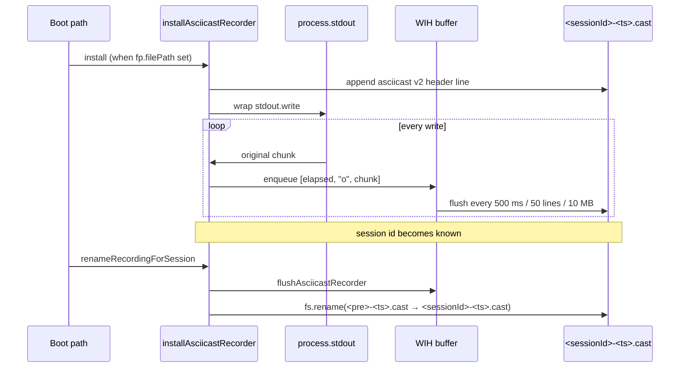

# Session recording (asciicast)

This page documents Claude Code's session recording subsystem: the asciicast v2 recorder that captures every `process.stdout.write` into a `.cast` file under the session's project directory. The feature is the on-disk counterpart to the in-memory transcript and is independent of the JSONL session store.

Use this page alongside:

- [Session resume and transcripts](session-resume-and-transcripts.md) for the JSONL transcript that captures the structured message stream.
- [Session API, events, and storage](session-api-events-and-storage.md) for how the runtime addresses sessions on disk.
- [Diagnostics and debug logs](../05-hosted-agent-ops/diagnostics-and-debug-logs.md) for related debug-output spilling.

## Source anchors

| Semantic alias | String or symbol | Meaning |
| --- | --- | --- |
| AsciicastRecorderInstaller | `function installAsciicastRecorder()` | Writes the asciicast v2 header to disk and monkey-patches `process.stdout.write` to tee each chunk into the recording file. |
| AsciicastRecorderFlush | `async function flushAsciicastRecorder()` | Drains the buffered append queue; called before session-end persistence and during `renameRecordingForSession`. |
| RecordFilePath | `function getRecordFilePath()` | Returns the in-process recording file path (`fp.filePath`), or `null` when recording is not active. |
| RecordingPathLister | `function getSessionRecordingPaths()` | Lists all `<sessionId>-<timestamp>.cast` files for the current session under `~/.claude/projects/<encoded-cwd>/`. |
| SessionRecordingRenamer | `async function renameRecordingForSession()` | After session id is finalized, renames the pre-session recording file to `<sessionId>-<timestamp>.cast`. |
| RecordingStateReset | `function resetRecordingStateForTesting()` (alias `_resetRecordingStateForTesting`) | Clears `fp.filePath` and `fp.timestamp`. Only used in tests. |
| RecordingTimingOrigin | `let K = performance.now()` (inside `installAsciicastRecorder`) | Time origin used to compute the relative timestamp of every event. |
| RecordingBufferConfig | `{flushIntervalMs: 500, maxBufferSize: 50, maxBufferBytes: 10485760}` (passed to `WIH(...)`) | Buffer flush schedule and caps. |
| AsciicastHeader | `{version: 2, width, height, timestamp, env: {SHELL, TERM}}` | Header line written at install time. |

## Bundle module in `cli.renamed.js`

| Semantic alias | Loader line | Representative renamed exports | Atlas entry |
|---|---:|---|---|
| `AsciicastSessionRecorder` | 680294 | `installAsciicastRecorder`, `flushAsciicastRecorder`, `getRecordFilePath`, `getSessionRecordingPaths`, `renameRecordingForSession`, `_resetRecordingStateForTesting` | [Bundle module map — session, transcript, agent metadata, and teammate IPC](../99-research-atlas/module-map-from-renamed-cli.md#session-transcript-agent-metadata-and-teammate-ipc) |

## Recording lifecycle



## File location

Recording files live at:

```
~/.claude/projects/<wO(originalCwd)>/<sessionId>-<timestamp>.cast
```

where `wO(...)` is the same per-cwd encoding used by the JSONL transcript store. `getSessionRecordingPaths()` reads the projects directory and returns the sorted list of `<sessionId>*.cast` files; multiple recordings per session id appear when the session was resumed.

The directory is shared with the JSONL transcripts (`<sessionId>.jsonl`), so the asciicast file is colocated with the structured transcript for the same session.

## `installAsciicastRecorder()`

The recorder is installed at the start of any session that has `fp.filePath` set (the runtime sets this when recording is enabled by setting or env). The function:

1. Returns early if no record file path is set (`getRecordFilePath() === null`).
2. Computes terminal size from `process.stdout.columns/rows`, defaulting to 80×24 when the columns are not reported (non-TTY headless runs).
3. Captures `performance.now()` as the time origin `K`.
4. Builds an asciicast v2 header object:
   ```json
   {
     "version": 2,
     "width": <cols>,
     "height": <rows>,
     "timestamp": <unix seconds>,
     "env": {"SHELL": "<SHELL env>", "TERM": "<TERM env>"}
   }
   ```
5. Creates the directory via `mkdirSync(dirname(recordFilePath))` (swallowing errors so a pre-existing dir is fine).
6. Writes the header line with mode `0o600` (`384` decimal) so the recording is owner-readable only.
7. Wraps `process.stdout.write` so every write also produces an asciicast event line `[<elapsed_seconds>, "o", <utf-8 text>]`. `elapsed_seconds` is computed as `(performance.now() - K) / 1000`. Buffered writes are queued through `WIH(...)` with `flushIntervalMs: 500`, `maxBufferSize: 50`, `maxBufferBytes: 10485760` — flush triggers whichever comes first.
8. Preserves the original write callback `process.stdout.write` so callers' `(err) => ...` callbacks still fire normally.

The append loop is sequenced through a chained Promise so writes are appended in order even when the underlying file-system call is async. Errors are swallowed (recording is best-effort and must not break stdout).

## Pre-session id vs post-session id

`fp.filePath` is set early (before the runtime has a session id), so the initial header is written into a "pre-session" file path. Once the runtime resolves the session id, `renameRecordingForSession()` runs:

1. Returns early if no recording is active.
2. Flushes the buffer via `flushAsciicastRecorder()` (`zT$?.flush()`).
3. Computes the target path `~/.claude/projects/<encoded-cwd>/<sessionId>-<timestamp>.cast`.
4. Calls `fs.rename(currentPath, targetPath)`. If rename succeeds, `fp.filePath` is updated so subsequent writes go to the renamed file. If rename fails (cross-device, race), the function logs `[asciicast] Failed to rename recording from <old> to <new>` and continues writing to the old file.

`fp.timestamp` is the monotonic recording-start timestamp; using it in the file name guards against collisions when the same session id is resumed multiple times in one project.

## Flushing

`flushAsciicastRecorder()` awaits `zT$?.flush()` (the `WIH(...)` buffer). The runtime calls it:

- Just before `renameRecordingForSession` so the rename target sees a fully drained buffer.
- During session-end cleanup so the last chunk reaches disk before exit.

The 500 ms flush interval is the worst-case write latency under normal operation; the 50-line and 10 MB caps short-circuit the timer when output bursts.

## Permissions

Header writes use `appendFileSync(headerPath, headerLine, {mode: 384})` so the file is created with `0o600` permissions (owner read/write only). Subsequent appends preserve the mode. This matches the JSONL transcript permissions and keeps captured terminal output off other users' shoulders.

## Testing helpers

`resetRecordingStateForTesting()` (exported also as `_resetRecordingStateForTesting`) clears `fp.filePath` and `fp.timestamp`. Tests use it to simulate a fresh boot without leaking state between cases.

## Caveats

- The recorder captures only `process.stdout`; `process.stderr` is not teed.
- Non-text output (binary writes) is converted via `Buffer.from(chunk).toString("utf-8")` before being JSON-stringified, so non-UTF-8 byte sequences will produce U+FFFD replacement chars in the recording.
- ANSI escape sequences pass through unchanged (that is the point: an asciicast player can re-render the original terminal output).
- The recording starts before the session id is known, so the file is renamed once. The initial file's directory is the cwd-encoded project directory, so playback paths line up with `getSessionRecordingPaths()` immediately.
- Recording is silent; the runtime emits no telemetry for installation or per-write activity. Failures are surfaced only through `onDebug` calls visible in the debug log directory (see [Diagnostics and debug logs](../05-hosted-agent-ops/diagnostics-and-debug-logs.md)).

## Related docs

- [Session resume and transcripts](session-resume-and-transcripts.md)
- [Session API, events, and storage](session-api-events-and-storage.md)
- [Diagnostics and debug logs](../05-hosted-agent-ops/diagnostics-and-debug-logs.md)
- [Bundle module map](../99-research-atlas/module-map-from-renamed-cli.md)
