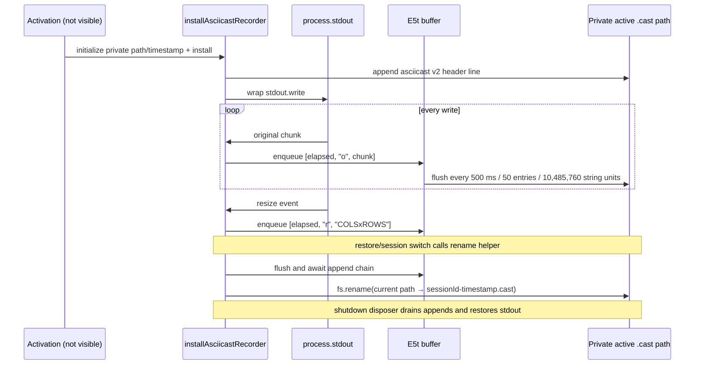

# Session recording (asciicast)

This page documents the source-visible asciicast v2 recorder helper. Once installed with a non-null private file path, it tees `process.stdout.write` and resize events into a `.cast` file. The analyzed artifact exposes the implementation, rename/list helpers, and retention cleanup, but **not the path initializer or installer call**, so this page does not claim which user-facing setting activates it in `2.1.215`.

Use this page alongside:

- [Session resume and transcripts](session-resume-and-transcripts.md) for the JSONL transcript that captures the structured message stream.
- [Session API, events, and storage](session-api-events-and-storage.md) for how the runtime addresses sessions on disk.
- [Diagnostics and debug logs](../05-hosted-agent-ops/diagnostics-and-debug-logs.md) for related debug-output spilling.

## Source anchors

| Semantic alias | String or symbol | Meaning |
| --- | --- | --- |
| AsciicastRecorderInstaller | [~860,015](../../claude-code-pkg/src/entrypoints/cli.renamed.js#L860015) `function installAsciicastRecorder()` | Writes the asciicast v2 header and wraps `process.stdout.write` plus resize events. |
| AsciicastRecorderFlush | [~860,012](../../claude-code-pkg/src/entrypoints/cli.renamed.js#L860012) `async function flushAsciicastRecorder()` | Exported wrapper around the current buffer's `flush()`; no direct caller was found. |
| RecordFilePath | `function getRecordFilePath()` | Returns private `mfe.filePath`, or `null`. The non-null initializer is not visible in the artifact. |
| RecordingPathLister | `function getSessionRecordingPaths()` | Lists all `<sessionId>-<timestamp>.cast` files for the current session under `~/.claude/projects/<encoded-cwd>/`. |
| SessionRecordingRenamer | [~859,987](../../claude-code-pkg/src/entrypoints/cli.renamed.js#L859987) `async function renameRecordingForSession()` | Flushes and renames the current path to `<sessionId>-<private timestamp>.cast`. |
| RecordingStateReset | `function resetRecordingStateForTesting()` (alias `_resetRecordingStateForTesting`) | Clears `mfe.filePath` and `mfe.timestamp`. |
| RecordingTimingOrigin | `performance.now()` inside `installAsciicastRecorder` | Time origin used to compute relative event timestamps after installation. |
| RecordingBufferConfig | `{flushIntervalMs: 500, maxBufferSize: 50, maxBufferBytes: 10485760}` passed to `E5t(...)` | Flush schedule and thresholds; the last threshold counts JavaScript string length despite its name. |
| AsciicastHeader | `{version: 2, width, height, timestamp, env: {SHELL, TERM}}` | Header line written at install time. |
| RecorderShutdownDisposer | `_a(async () => Hvn?.dispose())` | Flushes the buffer, waits for chained appends, removes resize handling, and restores stdout during coordinated shutdown. |
| RecordingRetention | [~746,352](../../claude-code-pkg/src/entrypoints/cli.renamed.js#L746352) `async function kIp()` | Removes stale `.cast` files during the normal retention sweep. |

## Bundle module in `cli.renamed.js`

| Semantic alias | Loader line | Representative renamed exports | Atlas entry |
|---|---:|---|---|
| `AsciicastSessionRecorder` | 859952 | `installAsciicastRecorder`, `flushAsciicastRecorder`, `getRecordFilePath`, `getSessionRecordingPaths`, `renameRecordingForSession`, `_resetRecordingStateForTesting` | [Bundle module map — session, transcript, agent metadata, and teammate IPC](../99-research-atlas/module-map-from-renamed-cli.md#session-transcript-agent-metadata-and-teammate-ipc) |

## Recording lifecycle


```mermaid
sequenceDiagram
    participant Activation as Activation (not visible)
    participant Recorder as installAsciicastRecorder
    participant Stdout as process.stdout
    participant Buffer as E5t buffer
    participant Disk as Private active .cast path

    Activation->>Recorder: initialize private path/timestamp + install
    Recorder->>Disk: append asciicast v2 header line
    Recorder->>Stdout: wrap stdout.write

    loop every write
        Stdout->>Recorder: original chunk
        Recorder->>Buffer: enqueue [elapsed, "o", chunk]
        Buffer->>Disk: flush every 500 ms / 50 entries / 10,485,760 string units
    end

    Stdout->>Recorder: resize event
    Recorder->>Buffer: enqueue [elapsed, "r", "COLSxROWS"]
    Note over Recorder,Disk: restore/session switch calls rename helper
    Recorder->>Buffer: flush and await append chain
    Recorder->>Disk: fs.rename(current path → sessionId-timestamp.cast)
    Note over Recorder,Disk: shutdown disposer drains appends and restores stdout
```

## File location

The rename target and paths returned by `getSessionRecordingPaths()` live at:

```
~/.claude/projects/<sanitizePath(originalCwd)>/<sessionId>-<timestamp>.cast
```

where the path sanitizer is the same per-cwd encoding used by the JSONL transcript store. `getSessionRecordingPaths()` reads the projects directory and lexicographically sorts names that start with the current session ID and end in `.cast`. It does not require the expected intervening hyphen/timestamp grammar and does not stat the entries, so matching directories, symlinks, or longer-ID prefixes are returned too; this is a filename filter, not validated recording discovery.

The target directory is shared with JSONL transcripts (`<sessionId>.jsonl`). The artifact does not expose the initial/private path initializer, so it does not prove that the file begins in this directory or what the filename timestamp represents.

## `installAsciicastRecorder()`

If some caller has set `mfe.filePath` and invokes the installer, the function:

1. Returns early if no record file path is set (`getRecordFilePath() === null`).
2. Computes terminal size from `process.stdout.columns/rows`, defaulting to 80×24 when the columns are not reported (non-TTY headless runs).
3. Captures `performance.now()` as the time origin `K`.
4. Builds an asciicast v2 header object:
   ```json
   {
     "version": 2,
     "width": <cols>,
     "height": <rows>,
     "timestamp": <unix seconds>,
     "env": {"SHELL": "<SHELL env>", "TERM": "<TERM env>"}
   }
   ```
5. Calls non-recursive `mkdirSync(dirname(recordFilePath))` and swallows every error (a pre-existing directory is fine; a missing ancestor or permission failure is exposed only by the following append).
6. Appends the header line while requesting creation mode `0o600` (`384` decimal). It does not truncate, exclusively create, or reject a symlink, so an existing file receives another header and an existing symlink is followed.
7. Wraps `process.stdout.write` so every later write also produces `[<elapsed_seconds>, "o", <utf-8 text>]`; non-string chunks are decoded as UTF-8.
8. Registers terminal resize records `[<elapsed_seconds>, "r", "<cols>x<rows>"]`.
9. Buffers event strings with a 500 ms timer and thresholds of 50 entries or 10,485,760 JavaScript string-length units. The implementation increments by `string.length`; this is not a proven byte limit.
10. Preserves the original stdout write overload/callback behavior and registers a shutdown disposer that restores it.

Recorder appends admitted to its Promise chain stay ordered, and asynchronous append failures are swallowed to avoid breaking stdout. Each flush resolves the then-current global recording path and uses ordinary `appendFile()`, with no no-follow, descriptor-identity, cross-process lock, or durable-sync step. The initial synchronous header append is not inside that catch path and can still throw if installation reaches an unusable path.

The installer has no source-visible “already installed” guard. If an otherwise-unseen activation path invoked it twice, the second wrapper would call through the first, causing both buffers to observe later stdout writes; resize listeners would also stack, and the global `Hvn` disposer reference would describe only the newest recorder. Because this artifact exposes no production installer call at all, repeated-install reachability remains unknown rather than a demonstrated product behavior.

## Rename after a session change

The helper supports renaming an already-active recording after a session switch/restore. `renameRecordingForSession()`:

1. Snapshots the current recording path and computes `~/.claude/projects/<encoded-cwd>/<sessionId>-<timestamp>.cast` from the then-current original cwd and session ID; it returns if no recording/timestamp is active or the paths already match.
2. Calls the underlying recorder object's `flush()` directly.
3. Calls `fs.rename(snapshotPath, snapshotTarget)`. If rename succeeds, `mfe.filePath` is updated to the snapshotted target so subsequent writes resolve there. If rename fails (for example, cross-device or a race), the function logs `[asciicast] Failed to rename recording from <old> to <new>` and continues with the prior global path.

Both source and target identity are captured before the awaited flush. A concurrent session/cwd/path change during that wait is not re-read before rename, so the helper can rename the snapshotted source to a target derived from stale session state and then overwrite the newer global path with that target on success. The helper does not preflight or exclusively reserve the target; a collision is delegated to platform `rename()` semantics rather than preserving both files. `mfe.timestamp` must be nonzero for rename to proceed. No assignment that gives it that value is present in the readable module/call graph, so its clock domain, collision likelihood, and relationship to the header's Unix timestamp remain unknown.

## Flushing

`flushAsciicastRecorder()` awaits the current recorder object's `flush()`. No direct call to this exported wrapper was found in `cli.js`, `cli.formatted.js`, or `cli.renamed.js`. The same underlying operations are nevertheless source-visible in two places:

- `renameRecordingForSession()` invokes `Hvn?.flush()` before rename.
- the registered shutdown disposer calls `Hvn?.dispose()`, which flushes the string buffer, waits for the chained append Promise, removes the resize listener, and restores the original `stdout.write`.

The 500 ms timer is a scheduling threshold, not a durability deadline: asynchronous filesystem completion can occur later, and abrupt termination can bypass JavaScript cleanup. The 50-entry and string-length thresholds can short-circuit the timer during bursts; neither rejects oversized output.

`flush()` empties the current string buffer and awaits the Promise chain value visible at that point. Stdout remains wrapped while that await is pending, so a timer/threshold flush can enqueue a newer append that the original await does not include. Around rename, such an append can still capture the old pathname and race `fs.rename()`, potentially leaving output split between the renamed target and a newly recreated old path. The shutdown disposer has the same concurrent-late-flush boundary, although orderly shutdown normally tries to quiesce producers first.

## Permissions

The header call passes `{mode: 384}` (`0o600`) to `appendFileSync`; that mode applies when the file is created and may be narrowed by platform/umask behavior. If an existing path was initialized with broader permissions, this append does not chmod it. Subsequent appends do not change the mode.

## Activation evidence boundary

The environment schema contains `CLAUDE_CODE_TERMINAL_RECORDING`, but across the raw, formatted, and semantic-renamed views of this same artifact there is no source-visible path from that variable to the private state, no assignment that makes `mfe.filePath` non-null or `mfe.timestamp` nonzero, and no call to `installAsciicastRecorder()`. The three files are derivative views, not independent binaries.

Therefore this artifact proves a recorder helper that can be activated, not that the named environment variable activates it in the packaged CLI. The missing setup may have been dead-code-eliminated, generated dynamically, or performed by a native/bootstrap layer not represented here; choosing among those explanations would be speculation.

## Testing helpers

`resetRecordingStateForTesting()` (exported also as `_resetRecordingStateForTesting`) clears `mfe.filePath` and `mfe.timestamp`. Tests use it to simulate a fresh boot without leaking state between cases.

## Caveats

- The recorder captures only `process.stdout`; `process.stderr` is not teed.
- Non-text output (binary writes) is converted via `Buffer.from(chunk).toString("utf-8")` before being JSON-stringified, so non-UTF-8 byte sequences will produce U+FFFD replacement chars in the recording.
- ANSI escape sequences pass through unchanged (that is the point: an asciicast player can re-render the original terminal output).
- Installation logs the selected path, and rename success/failure is debug-logged; per-write activity is not telemetered.
- Installation is not source-visible as idempotent; repeated invocation would append another header and stack stdout/resize wrappers.
- Active-path appends and rename are pathname-based and follow normal filesystem symlink/collision semantics; the helper exposes no no-follow or file-identity guard.
- Startup housekeeping schedules the normal retention sweep; when that sweep runs, it removes stale `.cast` files by filesystem `mtime` under the same `cleanupPeriodDays` policy as other local session artifacts. That is client-side file cleanup, not evidence about any externally copied recording.
- Activation, initial path, filename timestamp meaning, and behavior on termination that bypasses shutdown hooks remain artifact-limited unknowns.

## Related docs

- [Session resume and transcripts](session-resume-and-transcripts.md)
- [Session API, events, and storage](session-api-events-and-storage.md)
- [Diagnostics and debug logs](../05-hosted-agent-ops/diagnostics-and-debug-logs.md)
- [Bundle module map](../99-research-atlas/module-map-from-renamed-cli.md)
