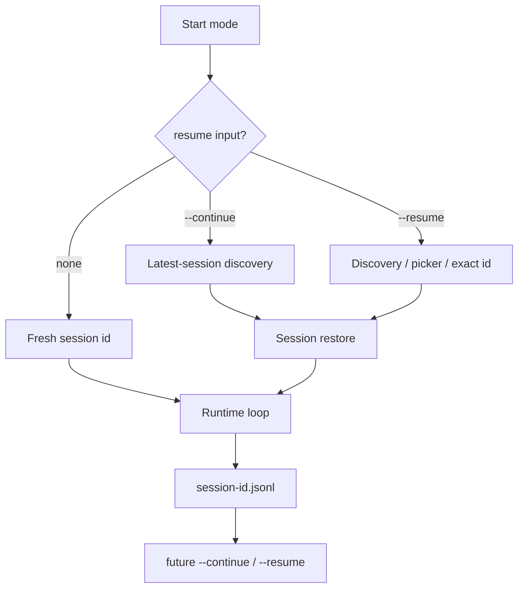
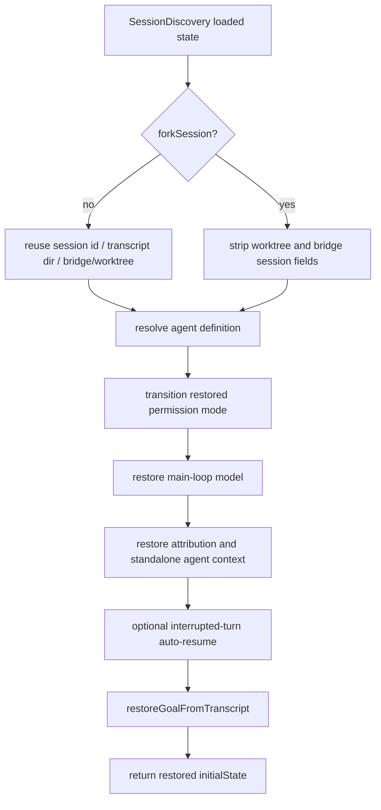

# Session resume and transcripts

This page reverse-engineers the local session and transcript paths that explain how Claude Code resumes conversations and persists state.

## Source anchors

| Semantic alias | String or symbol | Meaning |
| --- | --- | --- |
| LocalJsonlTranscriptSource | `transcriptSource:"local-jsonl"` | Default local transcript source classification. |
| ProjectStateRoot | `projects` | Config/project root helper under the Claude config directory. |
| SessionJsonlLookup | `${H}.jsonl` | JSONL transcript filename lookup helper. |
| CurrentSessionJsonlPath | `${v$()}.jsonl` | Current session JSONL transcript path. |
| SessionDiscovery | `async function loadConversationForResume(H,$)` | Latest/resume session discovery helper. |
| SessionRestore | `async function OG8(H,$,q)` | Session restore path. |
| ContinueFlag | `-c, --continue` | Continue most recent conversation. |
| ResumeFlag | `-r, --resume [value]` | Resume by ID or picker/search term. |
| ForkSessionFlag | `--fork-session` | Resume into a new session ID. |
| NoSessionPersistenceFlag | `--no-session-persistence` | Disables transcript writes and resume. |
| ResumeSessionAtGuard | `--resume-session-at requires --resume` | Headless resume validation. |
| RewindFilesResumeGuard | `--rewind-files requires --resume` | Rewind validation. |

## Bundle module in `cli.renamed.js`

| Semantic alias | Loader line | Representative renamed exports | Atlas entry |
|---|---:|---|---|
| `TranscriptAgentMetadataStore` | 623491 | `writeRemoteAgentMetadata`, `writeAgentMetadata`, `readAgentMetadata`, `getMaterializedSessionFile`, `getTranscriptPathForSession`, `transcriptCursorEnd`, `trackSessionWrite`, `subscribeSessionTitleChanged`, `subscribeSessionAgentNameChanged`, `setInternalEventWriter`, `setInternalEventReader`, `worktreeStateSignal`, `sessionIdExists` | [Bundle module map — session, transcript, agent metadata, and teammate IPC](../99-research-atlas/module-map-from-renamed-cli.md#session-transcript-agent-metadata-and-teammate-ipc) |

## Local transcript flow

## Session flags

| Surface | Runtime role |
|---|---|
| `--continue` / `-c` | Loads the most recent conversation in the current directory. |
| `--resume [value]` / `-r` | Resumes by explicit ID or opens a search/picker path when ambiguous. |
| `--from-pr` | Classified as a resume-like start in `Uzq`. |
| `--session-id <uuid>` | Uses a specific session ID, with validation and incompatibility checks in SDK/bridge paths. |
| `--fork-session` | Resumes into a new session ID rather than mutating the original. |
| `--no-session-persistence` | Disables transcript writes and therefore future resume. |
| `--resume-session-at <message id>` | Truncates resumed context to an assistant message in print mode. |
| `--rewind-files <user-message-id>` | Restores files to the state at a user message and exits. |

## Persistence interpretation

The `local-jsonl` and `${sessionId}.jsonl` anchors show that local sessions are durable JSONL transcript files. `SessionDiscovery` and `SessionRestore` then form the semantic pair for session discovery and restore. The root action routes `--continue`, `--resume`, PR resume, remote/teleport branches, and picker fallback into these restoration surfaces before entering `InteractiveSessionLoop` or `HeadlessRunner`.

## Edge cases

- `--resume-session-at` and `--rewind-files` require `--resume`.
- `--rewind-files` is a standalone operation and cannot be used with a prompt.
- `--no-session-persistence` explicitly prevents saving and resuming.
- Resuming may warn when permission mode differs from the saved session.

## Restore internals

This section reconstructs how resume/continue state is loaded and transformed before re-entering the runtime loop. The core pair is `SessionDiscovery` (find/load a resumable session) and `SessionRestore` (apply restored state into the current runtime envelope).

### Additional anchors

| Semantic alias | String or symbol | Meaning |
| --- | --- | --- |
| LiveSessionFilter | `listAllLiveSessions` | Used to filter out live non-interactive sessions during latest-session lookup. |
| TranscriptPathLoadBranch | `kI7($)` | Transcript-path based load branch. |
| SessionIdLoadBranch | `JJ$(H)` | Session-ID/string based load branch. |
| ResumeHookMessage | `Rm("resume"` | Resume hook/system messages are appended to restored messages. |
| DeferredToolResumeState | `turnInterruptionState`, `deferredToolUse` | Resume returns interruption and deferred-tool metadata. |
| ForkSessionRestore | `forkSession` | Forking changes which session/bridge/worktree fields are reused. |
| PermissionModeTransition | `transitionPermissionMode` | Restored permission mode is transitioned into current permission context. |
| InterruptedTurnResumeGate | `CLAUDE_CODE_RESUME_INTERRUPTED_TURN` | Optional interrupted-turn auto-resume gate. |
| TranscriptGoalRestore | `restoreGoalFromTranscript` | Restores goal-like state from transcript messages. |
| WorktreeSessionPersistence | `activeWorktreeSession` | Worktree session state is persisted in current project config. |
| ExistingWorktreeEntry | `enterExistingWorktreeForSession`, `is not a registered worktree` | Existing-worktree attach validates canonical git root and registered worktrees. |

### Session discovery: finding and normalizing a session

`SessionDiscovery` supports several inputs:

| Input shape | Branch | Meaning |
|---|---|---|
| `H === undefined` | latest-session lookup | Loads candidate sessions and filters out live non-interactive session IDs from `listAllLiveSessions`. |
| transcript path supplied | `TranscriptPathLoadBranch` | Loads messages/session ID from an explicit transcript path. |
| string value | `SessionIdLoadBranch` | Resolves a session by ID/string. |
| object `H` | direct object branch | Uses an already-loaded session-like object. |

After loading, `SessionDiscovery` normalizes and enriches the result by resolving the session ID, mapping/validating the transcript path, loading messages and marking them as resume input, looking for deferred tool state, calling a resume hook, and returning a large state object.

### Session discovery return state families

| State family | Returned fields |
|---|---|
| Conversation | `messages`, `turnInterruptionState`, `deferredToolUse`, `sessionId`, `fullPath` |
| File/history | `fileHistorySnapshots`, `attributionSnapshots`, `contentReplacements` |
| Context collapse | `contextCollapseCommits`, `contextCollapseSnapshot` |
| Agent identity | `agentName`, `agentColor`, `agentSetting`, `customTitle`, `aiTitle`, `tag`, `mode` |
| Permission/isolation | `permissionMode`, `isolationLatch` |
| Worktree/PR | `worktreeSession`, `prNumber`, `prUrl`, `prRepository` |
| Bridge/remote | `bridgeSessionId`, `bridgeLastSeq` |

Resume is not simply replaying chat messages — it rehydrates a broad runtime envelope.

### Session restore: applying restored state

Key mechanics:

- **Session reuse versus fork.** Non-fork restores set the active session ID and transcript directory; forked restores intentionally clear `worktreeSession`, `bridgeSessionId`, and `bridgeLastSeq` before applying state.
- **Content replacement handling.** Forked sessions with `contentReplacements` apply those replacements separately.
- **Agent resolution.** `xyH(...)` resolves restored agent settings against current main-thread and available agent definitions.
- **Permission transition.** If a restored permission mode exists, `transitionPermissionMode` merges it into the current `toolPermissionContext`; failures are logged with `[sessionRestore]`.
- **Model restore.** `Sa5(...)` can restore the main-loop model; `IG(...)` applies it when present.
- **Bridge restore.** Non-fork sessions with bridge metadata can re-enable the REPL bridge unless the current initial state is outbound-only.
- **Interrupted turn.** With `CLAUDE_CODE_RESUME_INTERRUPTED_TURN` set and an `interrupted_prompt` turn-interruption kind, the runtime re-injects the interrupted user message as the initial message.
- **Goal restore.** `restoreGoalFromTranscript` rebuilds goal-like state from transcript messages before returning.

### Worktree session state

Worktree state is persisted separately from the JSONL transcript through `activeWorktreeSession` in current project config. The decoded worktree helper stores the original cwd, worktree path/name/branch, session ID, and cleanup flags, then later restores or clears that state through `restoreWorktreeSession`, `keepWorktree`, and cleanup helpers.

Attaching to an existing worktree is stricter than checking whether a path exists. `enterExistingWorktreeForSession` resolves the current canonical git root, rejects paths that are the main worktree or current cwd, runs `git -C <root> worktree list --porcelain`, and only persists `enteredExisting: true` after the real path matches a registered worktree. This keeps resume/worktree continuity tied to git's registered worktree set.

### Failure behavior

`SessionDiscovery` records `session_resume` feature markers. If no session is found it marks `not_found` and returns `null`. If loading fails it marks `load_failed`, reports the error, and rethrows.

### Implementation takeaways

1. Resume is a state rehydration pipeline, not just JSONL replay.
2. Forking is explicit and strips bridge/worktree continuity to avoid mutating the original session lineage.
3. Permission mode and model state are restored through transition helpers, not blindly copied.
4. Remote/bridge continuity is preserved only when compatible with the current runtime initial state.

## Related docs

- [Session and remote-control architecture](architecture.md)
- [Session API, events, and storage](session-api-events-and-storage.md)
- [CLI main paths](../01-runtime-lifecycle/cli-main-paths.md)
- [Context, memory, compaction, checkpoints, and rewind](../02-context-model-loop/context-memory-compaction-checkpoints.md)
- [Headless streaming and resilience](../02-context-model-loop/headless-streaming-and-resilience.md)
- [Remote control and teleport](remote-control-and-teleport.md)
