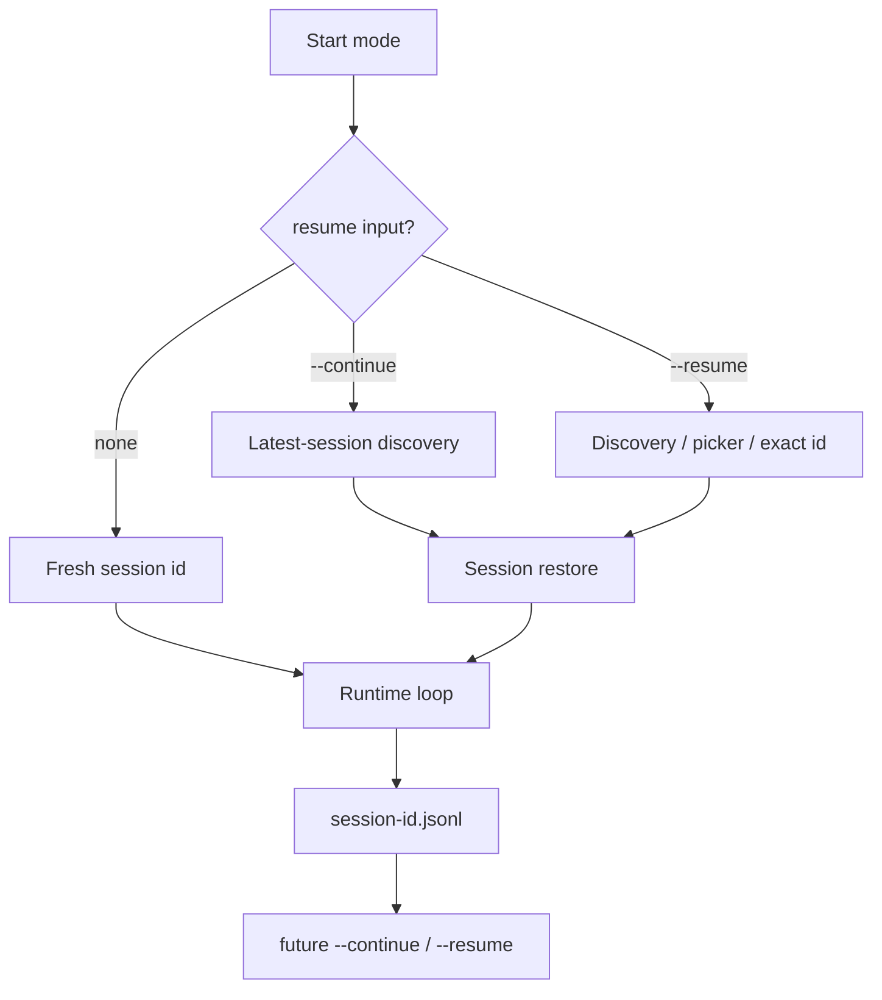
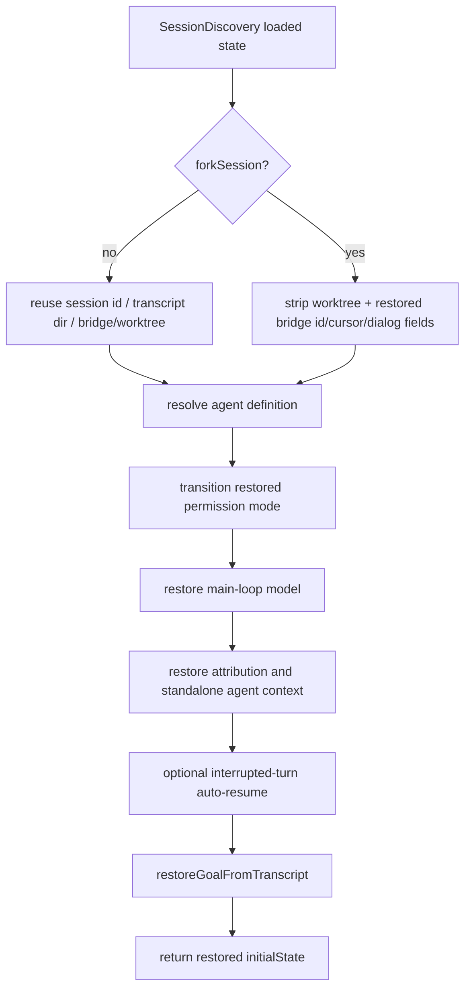

# Session resume and transcripts

This page reverse-engineers the local session and transcript paths that explain how Claude Code resumes conversations and persists state.

## Source anchors

| Semantic alias | String or symbol | Meaning |
| --- | --- | --- |
| LocalJsonlTranscriptSource | `transcriptSource:"local-jsonl"` | Default local transcript source classification. |
| ProjectStateRoot | `projects` | Config/project root helper under the Claude config directory. |
| SessionJsonlLookup | `${H}.jsonl` | JSONL transcript filename lookup helper. |
| CurrentSessionJsonlPath | `${v$()}.jsonl` | Current session JSONL transcript path. |
| SessionDiscovery | [~335,407](../../claude-code-pkg/src/entrypoints/cli.renamed.js#L335407) `async function loadConversationForResume(e,t,r)` | Latest/explicit session discovery and resume normalization. |
| ConversationChainBuilder | [~581,220](../../claude-code-pkg/src/entrypoints/cli.renamed.js#L581220) `buildConversationChain` | Walks `parentUuid` from a selected leaf and recovers selected related records. |
| UnchainedTranscriptWarning | [~581,248](../../claude-code-pkg/src/entrypoints/cli.renamed.js#L581248) `warnIfTranscriptUnchained` | Reports producers that wrote multiple conversation records without links. |
| SessionRestore | [~860,505](../../claude-code-pkg/src/entrypoints/cli.renamed.js#L860505) `async function f7o(e,t,r)` | Applies compatible saved state to the current runtime. |
| OrderedTranscriptStore | [~579,533](../../claude-code-pkg/src/entrypoints/cli.renamed.js#L579533) `class ROd` | Queues writes per target file and serializes drain batches. |
| SessionStorageShutdown | [~579,483](../../claude-code-pkg/src/entrypoints/cli.renamed.js#L579483) `flushSessionStorageAtExit` | Flushes transcript queues and re-appends metadata during coordinated shutdown. |
| ContinueFlag | `-c, --continue` | Continue most recent conversation. |
| ResumeFlag | `-r, --resume [value]` | Resume by ID or picker/search term. |
| ForkSessionFlag | `--fork-session` | Resume into a new session ID. |
| NoSessionPersistenceFlag | `--no-session-persistence` | Disables transcript writes and resume. |
| EndedByModelResume | `ended-by-model`, `applyEndedByModelOnResume` | Rehydrates the terminal conversation state and blocks new turns. |
| ObserverRefResume | `observer-ref`, `readLastObserverRef` | Lets an observed main/agent transcript reattach a compatible observer task. |
| ResumeSessionAtGuard | `--resume-session-at requires --resume` | Headless resume validation. |
| RewindFilesResumeGuard | `--rewind-files requires --resume` | Rewind validation. |
| BackgroundForkCommand | `Usage: /fork \<directive\>` | Copies the current conversation into a new background session with its own agent-view row. |
| InSessionSubtaskCommand | `Usage: /subtask \<task\>` | Runs the former in-session `/fork` delegation behavior as a subagent. |

## Bundle module in `cli.renamed.js`

| Semantic alias | Loader line | Representative renamed exports | Atlas entry |
|---|---:|---|---|
| `TranscriptAgentMetadataStore` | 623491 | `writeRemoteAgentMetadata`, `writeAgentMetadata`, `readAgentMetadata`, `getMaterializedSessionFile`, `getTranscriptPathForSession`, `transcriptCursorEnd`, `trackSessionWrite`, `subscribeSessionTitleChanged`, `subscribeSessionAgentNameChanged`, `setInternalEventWriter`, `setInternalEventReader`, `worktreeStateSignal`, `sessionIdExists` | [Bundle module map — session, transcript, agent metadata, and teammate IPC](../99-research-atlas/module-map-from-renamed-cli.md#session-transcript-agent-metadata-and-teammate-ipc) |

## Local transcript flow

```mermaid
flowchart TD
    Start[Start mode] --> Choice{resume input?}
    Choice -->|none| Fresh[Fresh session id]
    Choice -->|--continue| Latest[Latest-session discovery]
    Choice -->|--resume| Resolve[Discovery / picker / exact id]
    Latest --> Restore[Session restore]
    Resolve --> Restore
    Fresh --> Loop[Runtime loop]
    Restore --> Loop
    Loop --> Jsonl[session-id.jsonl]
    Jsonl --> Future[future --continue / --resume]
```

## Session flags

| Surface | Runtime role |
|---|---|
| `--continue` / `-c` | Loads the most recent conversation in the current directory. |
| `--resume [value]` / `-r` | Resumes by explicit ID or opens a search/picker path when ambiguous. |
| `--from-pr [value]` | Opens the resume picker with a PR filter: a bare flag keeps sessions carrying any `prNumber`; a number or supported PR URL keeps the matching PR number. |
| `--session-id <uuid>` | Uses a specific session ID, with validation and incompatibility checks in SDK/bridge paths. |
| `--fork-session` | Resumes into a new session ID rather than mutating the original. |
| `--no-session-persistence` | Disables transcript writes and therefore future resume. |
| `--resume-session-at <message id>` | Truncates resumed context to an assistant message in print mode. |
| `--rewind-files <user-message-id>` | Restores files to the state at a user message and exits. |

### `/fork`, `/subtask`, and `--fork-session`

These similarly named surfaces now have distinct contracts:

| Surface | Contract in `2.1.215` |
|---|---|
| `/fork <directive>` | Copies the current conversation into a new background session while the parent keeps running. The copy gets its own `claude agents` row and is named from the directive when no title exists. |
| `/subtask <task>` | Launches an in-session delegated subagent; this is the behavior older `/fork` implementations provided. |
| `--fork-session` | When used with CLI `--resume`/`--continue`, restores the selected transcript under a new session ID rather than mutating the original. |

Background sessions participate in `/resume`; from the agent view, `/resume` opens a picker and resumes the selected entry as a background session. The persisted transcript remains the durable source even when the original agent-view row was deleted.

## Persistence interpretation

The `local-jsonl` and `${sessionId}.jsonl` anchors show that local sessions are durable JSONL transcript files. `SessionDiscovery` and `SessionRestore` then form the semantic pair for session discovery and restore. The root action routes `--continue`, `--resume`, PR resume, teleport, and picker fallback into these restoration surfaces before entering `InteractiveSessionLoop` or `HeadlessRunner`; hosted `--remote` has its own runtime rather than first becoming a local resume.

### Append and mirror ordering

Main transcript writes are not independent `appendFile` calls. `ROd` routes records by `ENTRY_APPEND_POLICY`, queues them per file, schedules a default 100 ms drain, and chains drains so one process preserves queue order. A drain can combine records into chunks below 100 MiB. For each chunk the order is:

1. append JSONL to the local target (creating its directory on the first failure path);
2. after that append succeeds, invoke session-mirror callbacks with the corresponding records;
3. resolve the queued writers.

Removal operations split append chunks and run in sequence with them. On drain failure, the runtime debug-logs/reports `tengu_transcript_write_failed` and resolves all remaining waiters in that drained batch so a model turn is not permanently blocked. Those failed records are not mirrored by that drain, and the source does not switch all subsequent persistence off.

Auxiliary `appendEntryToFileAsync` writers use a separate per-file serial executor and likewise mirror only after successful append. Their rejection is logged and remains observable to a caller that awaits the returned Promise. `flushSessionStorageAtExit()` waits for both families and then re-appends cached metadata best-effort. This establishes in-process order, not cross-process locking, atomic multi-line transactions, or `fsync` durability.

### Lifecycle records beyond message replay

Two `2.1.215` records affect resumed runtime behavior without becoming ordinary chat messages:

- **`ended-by-model`** — `EndConversation` appends `{type, timestamp, sessionId}` before aborting. Transcript load records the ended session ID, and `applyEndedByModelOnResume()` restores `appState.endedByModel`. A resumed original conversation therefore remains unable to accept another prompt; the user starts a new conversation or uses `/clear`.
- **`observer-ref`** — after observer delivery, the observed transcript records optional observed `agentId`, `observerTaskId`, and `observerAgentType`. The observer installer scans the transcript tail and reuses the prior task only when the type still matches, its transcript exists, and it was not stopped by the user; otherwise it allocates a fresh observer.

These records illustrate why resume is broader than rebuilding the model-visible message chain: runtime lifecycle registries are reconstructed from transcript metadata too. See [Conversation termination](../01-runtime-lifecycle/conversation-termination.md) and [Observer agents](../06-agents-automation/observer-agents.md) for their complete gates and failure behavior.

## Edge cases

- `--resume-session-at` and `--rewind-files` require `--resume`.
- `--rewind-files` is a standalone operation and cannot be used with a prompt.
- `--no-session-persistence` explicitly prevents saving and resuming.
- Resuming may warn when permission mode differs from the saved session.
- A transcript marked `ended-by-model` restores as ended; resume does not silently clear the marker.
- A stale/missing `observer-ref` target falls back to a fresh observer rather than failing the observed session.

## Restore internals

This section reconstructs how resume/continue state is loaded and transformed before re-entering the runtime loop. The core pair is `SessionDiscovery` (find/load a resumable session) and `SessionRestore` (apply restored state into the current runtime envelope).

### Additional anchors

| Semantic alias | String or symbol | Meaning |
| --- | --- | --- |
| LiveSessionFilter | `listAllLiveSessions` | Used to filter out live non-interactive sessions during latest-session lookup. |
| TranscriptFileResumeBranch | `isTranscriptFileResumeArg`, `loadTranscriptFromFile` | Validates and loads an absolute `.jsonl` selector before resume normalization. |
| SessionIdLoadBranch | `getLastSessionLog(e) ?? SGg(e)` | Resolves a string session ID in the current project, then tries the worktree-project fallback. |
| ResumeHookMessages | `k$e(r.forkSession ? "fork" : "resume", ...)`, `dedupeSessionStartHookMessages` | Runs the matching `SessionStart` hook and appends only hook messages not already represented in restored history. |
| DeferredToolResumeState | `turnInterruptionState`, `deferredToolUse` | Resume returns interruption and deferred-tool metadata. |
| ForkSessionRestore | `forkSession` | Forking changes which session/bridge/worktree fields are reused. |
| PermissionModeTransition | `transitionPermissionMode` | Restored permission mode is transitioned into current permission context. |
| InterruptedTurnResumeGate | `CLAUDE_CODE_RESUME_INTERRUPTED_TURN` | Optional interrupted-turn auto-resume gate. |
| TranscriptGoalRestore | `restoreGoalFromTranscript` | Restores goal-like state from transcript messages. |
| WorktreeProjectConfigPersistence | [~260,592](../../claude-code-pkg/src/entrypoints/cli.renamed.js#L260592) `persistWorktreeSession`, `activeWorktreeSession` | Updates process worktree state and persists the current-project copy. |
| WorktreeTranscriptPersistence | [~582,145](../../claude-code-pkg/src/entrypoints/cli.renamed.js#L582145) `saveWorktreeState`, `worktree-state` | Caches normalized worktree metadata and appends it to the current transcript when one exists. |
| ExistingWorktreeEntry | `enterExistingWorktreeForSession`, `is not a registered worktree` | Existing-worktree attach validates canonical git root and registered worktrees. |
| BridgeGroupingBoundary | `bridgeSessionGroupingId`, `loadConversationForResume` | Transcript/log loading retains grouping metadata, but the ordinary CLI resume return object omits it. |

### Session discovery: finding and normalizing a session

The root resume path and `SessionDiscovery` together support several inputs:

| Input shape | Branch | Meaning |
|---|---|---|
| no selector | latest-session lookup | Takes the first sorted visible candidate with no `sessionKind`, excluding IDs currently reported as live non-interactive sessions. |
| absolute `.jsonl` selector | `isTranscriptFileResumeArg` → `loadTranscriptFromFile` → `loadConversationForResume` | Validates the transcript file, reconstructs its selected branch, and passes the loaded object through normal resume normalization. |
| string session ID | `getLastSessionLog(e) ?? SGg(e)` | Resolves the ID in the current project and then through the worktree-project fallback. |
| object `H` | direct object branch | Uses an already-loaded session-like object. |

After loading, `SessionDiscovery` normalizes and enriches the result by resolving the session ID, mapping/validating the transcript path, loading messages and marking them as resume input, looking for deferred tool state, calling a resume hook, and returning a large state object.

The visible-candidate scan itself filters sidechains, team sessions, daemon/daemon-worker sessions, programmatic entrypoints when the current entrypoint is interactive, and `/loop` sessions. Background (`sessionKind: "bg"`) sessions can remain available in the explicit `/resume` picker, but latest/`--continue` additionally requires no `sessionKind`, so it does not silently select them. Explicit ID/path resolution follows its direct lookup branch rather than this latest-candidate choice. If live-session enumeration fails, discovery continues without that extra live-ID filter.

### Transcript chain reconstruction

The loader does not replay every physical line in file order as one conversation. It indexes records by UUID, tracks referenced UUIDs to identify leaves, and selects the newest non-sidechain user/assistant leaf by parsed timestamp (with a constrained fallback when no leaf set exists and the conversation was not cleared). `buildConversationChain` then walks `parentUuid` backward and reverses the result.

- A cycle is logged and returns the partial chain accumulated before detection.
- If an expected parent is missing, the builder may fall back to the closest earlier record on the same sidechain within five seconds; it telemeters that fallback rather than pretending the link existed.
- Parallel assistant records with the same provider message ID and their tool-result children can be recovered next to the selected assistant record.
- Non-conversation descendants attached to the selected tail are appended in timestamp order.
- If multiple user/assistant records have no `parentUuid` links at all, only the selected tail can survive; `warnIfTranscriptUnchained` emits telemetry/debug output (and a stderr warning in selected entrypoints) explaining the required chain format.

Consequently, a syntactically valid JSONL file can still resume only a partial branch when parents are missing, cyclic, or unlinked. This is deliberate branch reconstruction, not last-line concatenation.

### Session discovery return state families

| State family | Returned fields |
|---|---|
| Conversation | `messages`, `turnInterruptionState`, `deferredToolUse`, `sessionId`, `fullPath` |
| File/history | `fileHistorySnapshots`, `attributionSnapshots`, `contentReplacements` |
| Context collapse | `contextCollapseCommits`, `contextCollapseSnapshot` |
| Agent identity | `agentName`, `agentColor`, `agentSetting`, `customTitle`, `aiTitle`, `tag`, `mode` |
| Model/effort | Model history plus the reasoning effort stored on each assistant message; this preserves per-message execution context for transcript/SDK presentation. |
| Permission/isolation | `permissionMode`, `isolationLatch` |
| Worktree/PR | `worktreeSession`, `prNumber`, `prUrl`, `prRepository` |
| Bridge/remote | `bridgeSessionId`, `bridgeLastSeq`, `bridgeDialogKinds`; parsed `bridgeSessionGroupingId` is not returned by this resume path. |

Resume is not simply replaying chat messages — it rehydrates a broad runtime envelope.

### Session restore: applying restored state

```mermaid
flowchart TD
    Loaded[SessionDiscovery loaded state] --> Fork{forkSession?}
    Fork -->|no| Reuse[reuse session id / transcript dir / bridge/worktree]
    Fork -->|yes| Strip[strip worktree + restored bridge id/cursor/dialog fields]
    Reuse --> ResolveAgent[resolve agent definition]
    Strip --> ResolveAgent
    ResolveAgent --> Permission[transition restored permission mode]
    Permission --> Model[restore main-loop model]
    Model --> Attribution[restore attribution and standalone agent context]
    Attribution --> Interrupted[optional interrupted-turn auto-resume]
    Interrupted --> Goal[restoreGoalFromTranscript]
    Goal --> InitialState[return restored initialState]
```

Key mechanics:

- **Session reuse versus fork.** Non-fork restores set the active session ID and transcript directory. Forked restores intentionally clear worktree/relocated-cwd state plus the restored bridge session ID, last sequence, and dialog-kind metadata before applying state.
- **Content replacement handling.** Forked sessions with `contentReplacements` apply those replacements separately.
- **Agent resolution.** Restored agent settings are resolved against the currently available definitions. A missing agent falls back to default behavior; an agent-specific model is accepted only when currently available/allowed.
- **Permission transition.** An explicit current CLI permission mode wins. Saved `plan` and `bypassPermissions` are not restored, saved `auto` requires its current feature gate, and any accepted mode still passes through `transitionPermissionMode`; rejection is logged with `[sessionRestore]`.
- **Model restore.** Explicit current model/environment overrides suppress transcript restoration. Otherwise the last eligible assistant model is checked against known family, account allowlist, retirement, mode-dependent settings, and fallback-latch state. A declined model yields a warning and current/default model rather than a blind copy.
- **Bridge restore.** A non-fork session with a bridge ID makes the restored REPL bridge inbound-capable unless the current initial state is already enabled and inbound-capable. An outbound-only initial state is therefore upgraded to `replBridgeEnabled: true` and `replBridgeOutboundOnly: false`; it is not an exclusion. The transcript parser and intermediate log objects also retain optional `bridgeSessionGroupingId`, but `loadConversationForResume()` returns only the bridge ID, last sequence, and dialog kinds. Consequently this ordinary CLI resume path does not pass grouping metadata to `restoreSessionMetadata()`; that is an omission at this boundary, not a tombstone written to the original transcript.
- **Interrupted turn.** With `CLAUDE_CODE_RESUME_INTERRUPTED_TURN` set and an `interrupted_prompt` turn-interruption kind, the runtime re-injects the interrupted user message as the initial message.
- **Goal restore.** `restoreGoalFromTranscript` rebuilds goal-like state from transcript messages before returning.

### Worktree session state

Worktree continuity has two persistence surfaces. `persistWorktreeSession()` updates the process-level worktree state and writes `activeWorktreeSession` in current project config. Independently, `saveWorktreeState()` caches a normalized copy in the transcript store and, when a session file exists, appends a `worktree-state` record; metadata re-append emits that record again. The transcript loader keeps the latest per-session value, and resume applies it through `ubt()`/`restoreWorktreeSession()`. The retained artifact does not expose an atomic transaction joining the project-config and JSONL writes.

The normalized transcript record stores the original cwd, optional pre-entry cwd, worktree path/name/branch, original branch/head, session ID, optional tmux session, and hook/existing-worktree flags. A `null` `worktreeSession` is a persisted clear rather than an absent record.

Attaching to an existing worktree is stricter than checking whether a path exists. `enterExistingWorktreeForSession` resolves the current canonical git root, rejects paths that are the main worktree or current cwd, runs `git -C <root> worktree list --porcelain`, and only persists `enteredExisting: true` after the real path matches a registered worktree. This keeps resume/worktree continuity tied to git's registered worktree set.

### Failure behavior

`SessionDiscovery` records `session_resume` feature markers. If no session is found it marks `not_found` and returns `null`. If loading fails it marks `load_failed`, reports the error, and rethrows. Broken parent chains can instead produce a warned partial conversation as described above; they are not automatically repaired on disk.

The restore path treats stale runtime metadata defensively: unavailable agents fall back, disallowed/retired models are declined, incompatible saved permission modes are skipped or transitioned, an invalid/missing worktree is cleared, and a fork discards worktree state plus the bridge attachment fields that this resume path returns. A non-fork can retain the persisted Remote Control bridge sequence for replay, but server-side replay retention and compatibility are outside the local transcript artifact.

### Implementation takeaways

1. Resume is a state rehydration pipeline, not just JSONL replay.
2. Forking is explicit and strips worktree state plus restored bridge attachment/cursor/dialog fields to avoid mutating the original session lineage; grouping metadata is already omitted by the preceding resume-return boundary.
3. Permission mode and model state are restored through transition helpers, not blindly copied.
4. Remote/bridge continuity is preserved only when compatible with the current runtime initial state.

## Related docs

- [Session and remote-control architecture](architecture.md)
- [Session API, events, and storage](session-api-events-and-storage.md)
- [CLI main paths](../01-runtime-lifecycle/cli-main-paths.md)
- [Context, memory, compaction, checkpoints, and rewind](../02-context-model-loop/context-memory-compaction-checkpoints.md)
- [Headless streaming and resilience](../02-context-model-loop/headless-streaming-and-resilience.md)
- [Remote control and teleport](remote-control-and-teleport.md)
- [Conversation termination](../01-runtime-lifecycle/conversation-termination.md)
- [Observer agents](../06-agents-automation/observer-agents.md)
