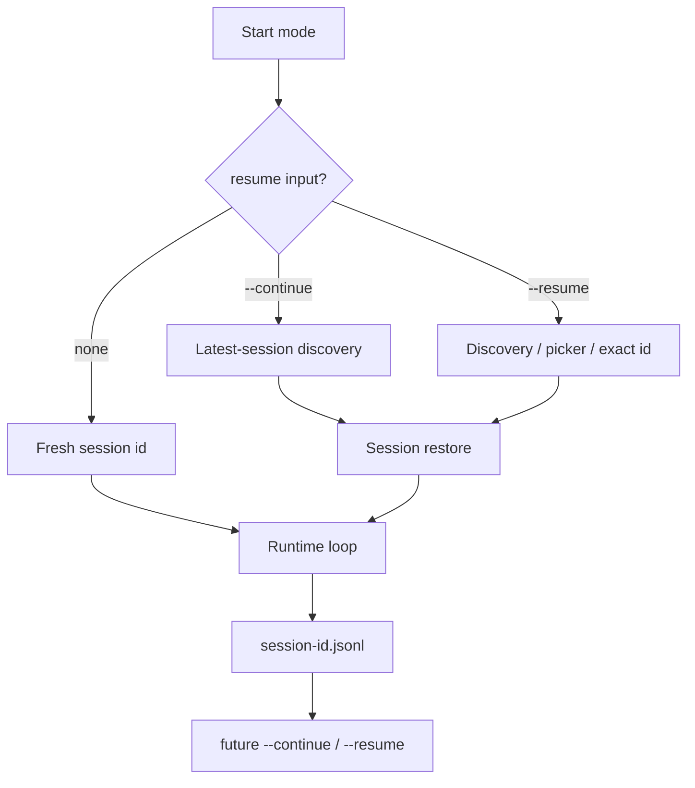
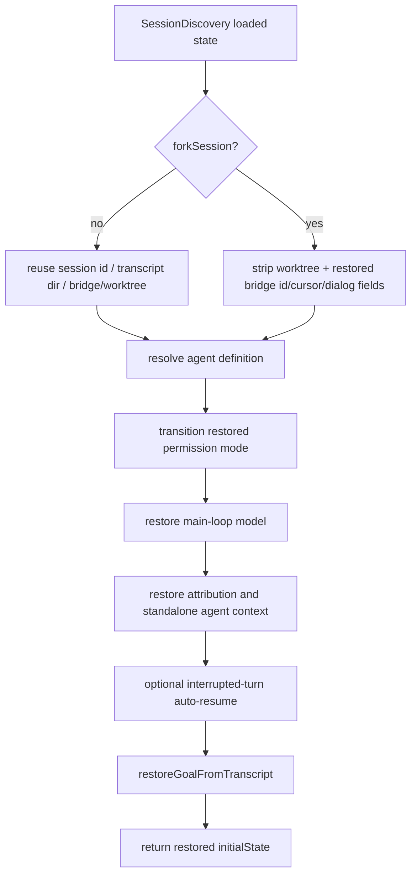

# Session resume and transcripts

This page reverse-engineers the local session and transcript paths that explain how Claude Code resumes conversations and persists state.

## Source anchors

| Semantic alias | String or symbol | Meaning |
| --- | --- | --- |
| LocalJsonlTranscriptSource | `transcriptSource:"local-jsonl"` | Default local transcript source classification. |
| ProjectStateRoot | `projects` | Config/project root helper under the Claude config directory. |
| SessionJsonlLookup | `${H}.jsonl` | JSONL transcript filename lookup helper. |
| CurrentSessionJsonlPath | `${v$()}.jsonl` | Current session JSONL transcript path. |
| SessionDiscovery | [~335,407](../../claude-code-pkg/src/entrypoints/cli.renamed.js#L335407) `async function loadConversationForResume(e,t,r)` | Latest/explicit session discovery and resume normalization. |
| ConversationChainBuilder | [~581,220](../../claude-code-pkg/src/entrypoints/cli.renamed.js#L581220) `buildConversationChain` | Walks `parentUuid` from a selected leaf and recovers selected related records. |
| UnchainedTranscriptWarning | [~581,248](../../claude-code-pkg/src/entrypoints/cli.renamed.js#L581248) `warnIfTranscriptUnchained` | Reports producers that wrote multiple conversation records without links. |
| SessionRestore | [~860,505](../../claude-code-pkg/src/entrypoints/cli.renamed.js#L860505) `async function f7o(e,t,r)` | Applies compatible saved state to the current runtime. |
| OrderedTranscriptStore | [~579,533](../../claude-code-pkg/src/entrypoints/cli.renamed.js#L579533) `class ROd` | Queues writes per target file and serializes drain batches. |
| SessionStorageShutdown | [~579,483](../../claude-code-pkg/src/entrypoints/cli.renamed.js#L579483) `flushSessionStorageAtExit` | Flushes transcript queues and re-appends metadata during coordinated shutdown. |
| MetadataCheckpoint | [~579,650](../../claude-code-pkg/src/entrypoints/cli.renamed.js#L579650) `bytesSinceMetadataReAppend`, `LITE_READ_BUF_SIZE / 2` | Re-appends cached metadata after approximately 32 KiB of successful UTF-8 current-session writes. |
| TranscriptRelocation | [~580,520](../../claude-code-pkg/src/entrypoints/cli.renamed.js#L580520) `relocateSessionTranscript`, `cOd` | Flushes and buffers in-process writers while moving transcript state between project directories. |
| LegacyRemoteHydration | [~580,700](../../claude-code-pkg/src/entrypoints/cli.renamed.js#L580700) `hydrateRemoteSession` | Fetches legacy ingress logs and performs a guarded local replacement. |
| CcrV2Hydration | [~580,840](../../claude-code-pkg/src/entrypoints/cli.renamed.js#L580840) `hydrateFromCCRv2InternalEvents`, `.ccr-tip.json` | Chooses anchored delta append or guarded full replacement for foreground and subagent transcripts. |
| CcrPersistenceBackfill | [~833,666](../../claude-code-pkg/src/entrypoints/cli.renamed.js#L833666) `Epf`, `bpf` | Starts uploading local UUID-bearing suffix records absent from the server event set. |
| ContinueFlag | `-c, --continue` | Continue most recent conversation. |
| ResumeFlag | `-r, --resume [value]` | Resume by ID or picker/search term. |
| ForkSessionFlag | `--fork-session` | Resume into a new session ID. |
| NoSessionPersistenceFlag | `--no-session-persistence` | Disables transcript writes and resume. |
| EndedByModelResume | `ended-by-model`, `applyEndedByModelOnResume` | Rehydrates the terminal conversation state and blocks new turns. |
| ObserverRefResume | `observer-ref`, `readLastObserverRef` | Lets an observed main/agent transcript reattach a compatible observer task. |
| ResumeSessionAtGuard | `--resume-session-at requires --resume` | Headless resume validation. |
| RewindFilesResumeGuard | `--rewind-files requires --resume` | Rewind validation. |
| BackgroundForkCommand | `Usage: /fork \<directive\>` | Copies the current conversation into a new background session with its own agent-view row. |
| InSessionSubtaskCommand | `Usage: /subtask \<task\>` | Runs the former in-session `/fork` delegation behavior as a subagent. |
| ClearConversationCommand | `clearConversation()`, `conversation_reset`, `regenerateSessionId` | Runs SessionEnd, clears transient state, rotates identity, and leaves the prior transcript resumable [~498,650–499,000](../../claude-code-pkg/src/entrypoints/cli.renamed.js#L498650). |
| RenameConversationCommand | `performRename()`, `Jcr()` | Persists an explicit or generated session name locally and to eligible bridge metadata [~556,100–556,235](../../claude-code-pkg/src/entrypoints/cli.renamed.js#L556100). |
| BranchConversationCommand | `createFork()`, `branchAndResume()` | Rewrites the selected chain under a new session ID and reconnects it as a resumable branch [~558,800–559,075](../../claude-code-pkg/src/entrypoints/cli.renamed.js#L558800). |
| RecapCommand | `Otn()`, `Rqy` | Runs a one-turn, no-tool fork to generate a short session recap [~563,450–563,760](../../claude-code-pkg/src/entrypoints/cli.renamed.js#L563450). |

## Bundle module in `cli.renamed.js`

| Semantic alias | Loader line | Representative renamed exports | Atlas entry |
|---|---:|---|---|
| `TranscriptAgentMetadataStore` | 623491 | `writeRemoteAgentMetadata`, `writeAgentMetadata`, `readAgentMetadata`, `getMaterializedSessionFile`, `getTranscriptPathForSession`, `transcriptCursorEnd`, `trackSessionWrite`, `subscribeSessionTitleChanged`, `subscribeSessionAgentNameChanged`, `setInternalEventWriter`, `setInternalEventReader`, `worktreeStateSignal`, `sessionIdExists` | [Bundle module map — session, transcript, agent metadata, and teammate IPC](../99-research-atlas/module-map-from-renamed-cli.md#session-transcript-agent-metadata-and-teammate-ipc) |

## Local transcript flow

```mermaid
flowchart TD
    Start[Start mode] --> Choice{resume input?}
    Choice -->|none| Fresh[Fresh session id]
    Choice -->|--continue| Latest[Latest-session discovery]
    Choice -->|--resume| Resolve[Discovery / picker / exact id]
    Latest --> Restore[Session restore]
    Resolve --> Restore
    Fresh --> Loop[Runtime loop]
    Restore --> Loop
    Loop --> Jsonl[session-id.jsonl]
    Jsonl --> Future[future --continue / --resume]
```

## Session flags

| Surface | Runtime role |
|---|---|
| `--continue` / `-c` | Loads the most recent conversation in the current directory. |
| `--resume [value]` / `-r` | Resumes by explicit ID or opens a search/picker path when ambiguous. |
| `--from-pr [value]` | Opens the resume picker with a PR filter: a bare flag keeps sessions carrying any `prNumber`; a number or supported PR URL keeps the matching PR number. |
| `--session-id <uuid>` | Uses a specific session ID, with validation and incompatibility checks in SDK/bridge paths. |
| `--fork-session` | Resumes into a new session ID rather than mutating the original. |
| `--no-session-persistence` | Disables transcript writes and therefore future resume. |
| `--resume-session-at <message id>` | Truncates resumed context to an assistant message in print mode. |
| `--rewind-files <user-message-id>` | Restores files to the state at a user message and exits. |

### `/fork`, `/subtask`, and `--fork-session`

These similarly named surfaces now have distinct contracts:

| Surface | Contract in `2.1.215` |
|---|---|
| `/fork <directive>` | Copies the current conversation into a new background session while the parent keeps running. The copy gets its own `claude agents` row and is named from the directive when no title exists. |
| `/subtask <task>` | Launches an in-session delegated subagent; this is the behavior older `/fork` implementations provided. |
| `--fork-session` | When used with CLI `--resume`/`--continue`, restores the selected transcript under a new session ID rather than mutating the original. |

Background sessions participate in `/resume`; from the agent view, `/resume` opens a picker and resumes the selected entry as a background session. The persisted transcript remains the durable source even when the original agent-view row was deleted.

## Session lifecycle commands

The [command catalog](../01-runtime-lifecycle/command-line-reference.md#core-session-context-and-interface-commands) lists every name and gate. Four commands have persistence behavior that is easy to miss if they are treated as UI shortcuts.

### `/clear`: a new identity, not transcript deletion

`/clear [name]` (aliases `/reset`, `/new`) starts by running `SessionEnd` hooks with reason `clear` under the configured hook timeout. It then separates work that can outlive the foreground conversation from work that must be stopped:

- backgrounded agents/tasks are retained and their IDs are passed to cache cleanup so their skill/task state is not blindly discarded;
- foreground running shell/agent tasks are killed or aborted and their task output is evicted;
- eligible retained task-output links are recreated after the new session path exists.

The command clears conversation messages, read-file state, loaded nested-memory paths, session environment variables, memory selection, plan slugs, file-history snapshots, transient frame/browser state, command/prompt/tool caches, send-message pins, and agent-name entries that no longer resolve. It returns to the original cwd when it still exists, otherwise tries the project root.

The identity transition is ordered after the visible reset event:

1. emit `conversation_reset` with a fresh conversation UUID;
2. save transition costs, reset cost accounting, and clear session metadata;
3. regenerate the session ID with the old session as parent;
4. reset the active transcript pointer and register the new session file; and
5. run the `SessionStart` hook path for source `clear`.

An explicit clear name can be saved against the cleared session path; otherwise the current title is carried to the new session. Agent/web-search spawn budgets reset only when no retained task remains. The prior JSONL file is not deleted, which is why `/resume` can return to it.

### `/branch`: physical transcript rewriting

`/branch [name]` is distinct from `/fork <directive>` and CLI `--fork-session`. It creates a new random session ID and scans the current materialized transcript for only the UUIDs in the selected live message chain. For each retained record it:

- rewrites `sessionId` to the new ID;
- rebuilds a linear `parentUuid` chain across non-progress records;
- clears sidechain/session-kind state; and
- records `forkedFrom: {sessionId, messageUuid}`.

Content-replacement records and the latest relocated-cwd record are copied separately. Optional extra messages are stamped with the source message's cwd/user type/entrypoint/version/branch. The output file is created under the project transcript directory with owner-only mode; a read/write failure deletes the partial fork.

After the file closes, the runtime chooses an explicit title or derives one from the first meaningful prompt. Automatic titles use `(<name>) (Branch)`, `(Branch 2)`, and so on to avoid collisions. `branchAndResume()` can immediately resume the newly constructed session; otherwise it reports the new ID for later `/resume`.

### `/rename`: explicit metadata or a bounded model helper

With an argument, `/rename <name>` persists that exact trimmed name as both the custom session title and standalone-agent display name, updates app state, and best-effort mirrors it to the active bridge. The explicit path also emits a hidden reminder that the user named the session, so the name can inform later conversation context without pretending it was model-generated.

With no argument, the runtime asks for a 2–4 word kebab-case name. A feature-gated warm-cache path uses a one-turn fork of the existing context; the fallback sends at most the last 1,000 characters of non-meta conversation through a structured `{name}` request. Both paths deny tools. No usable conversation context returns the usage hint instead of inventing a name. Teammate sessions refuse because the team leader owns their names.

### `/recap`: disposable one-turn fork

`/recap` is not compaction and does not replace conversation history. It reuses the last cache-safe request parameters when available; if the session has messages but no saved parameters, it rebuilds a reduced analysis-only prompt/context envelope. It then runs a one-turn fork with:

- all tools denied;
- cache writes and transcript persistence disabled for the helper turn; and
- a prompt requesting one or two plain sentences under 40 words: overall goal/current task, then the next action.

The command returns the helper text directly. An API error can be rendered as the command result, an abort returns `Recap cancelled`, and a session with no turn returns `Nothing to recap yet`. The same helper also powers automatic away summaries; eligible Remote Control sessions can publish the result as `recap` metadata, but the explicit command itself is only a read-only summary operation.

## Persistence interpretation

The `local-jsonl` and `${sessionId}.jsonl` anchors show that local sessions are durable, append-oriented JSONL transcript files. They are not strictly append-only: queued UUID removal can truncate and rewrite a file. `SessionDiscovery` and `SessionRestore` then form the semantic pair for session discovery and restore. The root action routes `--continue`, `--resume`, PR resume, teleport, and picker fallback into these restoration surfaces before entering `InteractiveSessionLoop` or `HeadlessRunner`; hosted `--remote` has its own runtime rather than first becoming a local resume.

### Append and mirror ordering

Main transcript writes are not independent `appendFile` calls. `ROd` routes records by `ENTRY_APPEND_POLICY`, queues them per file, schedules a default 100 ms drain, and chains drains so one process preserves queue order. Legacy remote ingress or a registered CCR internal-event writer lowers that store instance's interval to 10 ms; clearing the writer does not restore 100 ms. For each append chunk the order is:

1. append JSONL to the local target (creating its directory on the first failure path);
2. after that append succeeds, invoke session-mirror callbacks with the corresponding records;
3. resolve the queued writers.

The 100 MiB constant is a flush trigger, not a hard chunk or record limit. Before adding a record, the drain compares the accumulated serialized JavaScript strings' `.length` with `104857600`; if the threshold would be reached, it flushes what was already accumulated and then adds the next record. A single serialized record can therefore exceed the threshold and is still written whole. The check counts JavaScript string units rather than `Buffer.byteLength` or on-disk bytes.

Removal operations split append chunks and run in sequence with them. `performRemoveByUuid()` first searches the last 64 KiB for the final exact `"uuid":"<target>"` substring. When both line boundaries are available, it truncates at that line's start and writes the bytes after the line back, removing one physical tail match without parsing the record. Because this is substring matching rather than top-level JSON inspection, the fast path can remove a line where that text occurs in a nested object or array; spacing such as `"uuid": "..."` misses the fast path. If the fast path cannot act, files at or below 50 MiB are read and rewritten after filtering every parseable line whose top-level UUID matches; for larger files the fallback is skipped.

Neither removal route uses a temp-file/rename transaction, `O_NOFOLLOW`, or an opened-path identity recheck. A transcript-path symlink is followed; a failure after truncate/write begins can leave a partially changed target and is swallowed, while an out-of-process writer or path replacement can race the rewrite despite the in-process queue. Removals emit neither an SDK mirror deletion nor an internal-CCR deletion event. They also do not evict the UUID from the process-local `Gut` cache, so the same UUID can still be treated as present until that cache is cleared or rebuilt.

On append-drain failure, the runtime debug-logs/reports `tengu_transcript_write_failed` and resolves all remaining waiters in that drained batch so a model turn is not permanently blocked. Those failed records are not mirrored by that drain, and the source does not switch all subsequent persistence off. Because a transcript UUID is added to `Gut` when its write is enqueued, however, an identical-UUID retry can be suppressed in the same process even though the record never reached disk; cache invalidation/reload is what reconciles that case.

Auxiliary `appendEntryToFileAsync` writers use a separate per-file serial executor and likewise mirror only after successful append. Their rejection is logged and remains observable to a caller that awaits the returned Promise. `flushSessionStorageAtExit()` waits for both families and then re-appends cached metadata best-effort. This establishes in-process order, not cross-process locking, atomic multi-line transactions, or `fsync` durability.

Successful appends to the active main transcript are counted separately in UTF-8 bytes. Once `bytesSinceMetadataReAppend` reaches `LITE_READ_BUF_SIZE / 2` (32,768 bytes), the current drain best-effort re-appends cached metadata and mirrors those records. The checkpoint can include last prompt/leaf, titles, tag, relocated cwd, agent identity/settings, mode/permission/isolation, worktree, PR, and bridge linkage. It resets the counter and snapshots only values already cached in `ROd`; in particular, it does not continuously query a live bridge for a newer sequence number.

The Remote Control internal-event writer is a distinct persistence path. For transcript records, the local write is enqueued and then `persistToRemote()` invokes the CCR writer without waiting for that local append to finish; its server acknowledgement/retry behavior therefore does not inherit SDK mirror ordering. Bridge metadata helpers also update in-memory state immediately while their transcript append is asynchronous/best-effort when a session file exists.

### Lifecycle records beyond message replay

Two `2.1.215` records affect resumed runtime behavior without becoming ordinary chat messages:

- **`ended-by-model`** — `EndConversation` appends `{type, timestamp, sessionId}` before aborting. Transcript load records the ended session ID, and `applyEndedByModelOnResume()` restores `appState.endedByModel`. A resumed original conversation therefore remains unable to accept another prompt; the user starts a new conversation or uses `/clear`.
- **`observer-ref`** — after observer delivery, the observed transcript records optional observed `agentId`, `observerTaskId`, and `observerAgentType`. The observer installer scans the transcript tail and reuses the prior task only when the type still matches, its transcript exists, and it was not stopped by the user; otherwise it allocates a fresh observer.

These records illustrate why resume is broader than rebuilding the model-visible message chain: runtime lifecycle registries are reconstructed from transcript metadata too. See [Conversation termination](../01-runtime-lifecycle/conversation-termination.md) and [Observer agents](../06-agents-automation/observer-agents.md) for their complete gates and failure behavior.

## Edge cases

- `--resume-session-at` and `--rewind-files` require `--resume`.
- `--rewind-files` is a standalone operation and cannot be used with a prompt.
- `--no-session-persistence` explicitly prevents saving and resuming.
- Resuming may warn when permission mode differs from the saved session.
- A transcript marked `ended-by-model` restores as ended; resume does not silently clear the marker.
- A stale/missing `observer-ref` target falls back to a fresh observer rather than failing the observed session.
- Remote full hydration preserves content-bearing local history only against a candidate set with zero `user`/`assistant` content; it does not merge two independently content-bearing histories.
- Transcript relocation buffers cooperating in-process writers but provides no cross-process exclusion or all-files rollback.

## Restore internals

This section reconstructs how resume/continue state is loaded and transformed before re-entering the runtime loop. The core pair is `SessionDiscovery` (find/load a resumable session) and `SessionRestore` (apply restored state into the current runtime envelope).

### Additional anchors

| Semantic alias | String or symbol | Meaning |
| --- | --- | --- |
| LiveSessionFilter | `listAllLiveSessions` | Used to filter out live non-interactive sessions during latest-session lookup. |
| TranscriptFileResumeBranch | `isTranscriptFileResumeArg`, `loadTranscriptFromFile` | Validates and loads an absolute `.jsonl` selector before resume normalization. |
| SessionIdLoadBranch | `getLastSessionLog(e) ?? SGg(e)` | Resolves a string session ID in the current project, then tries the worktree-project fallback. |
| ResumeHookMessages | `k$e(r.forkSession ? "fork" : "resume", ...)`, `dedupeSessionStartHookMessages` | Runs the matching `SessionStart` hook and appends only hook messages not already represented in restored history. |
| DeferredToolResumeState | `turnInterruptionState`, `deferredToolUse` | Resume returns interruption and deferred-tool metadata. |
| ForkSessionRestore | `forkSession` | Forking changes which session/bridge/worktree fields are reused. |
| PermissionModeTransition | `transitionPermissionMode` | Restored permission mode is transitioned into current permission context. |
| InterruptedTurnResumeGate | `CLAUDE_CODE_RESUME_INTERRUPTED_TURN` | Optional interrupted-turn auto-resume gate. |
| TranscriptGoalRestore | `restoreGoalFromTranscript` | Restores goal-like state from transcript messages. |
| WorktreeProjectConfigPersistence | [~260,592](../../claude-code-pkg/src/entrypoints/cli.renamed.js#L260592) `persistWorktreeSession`, `activeWorktreeSession` | Updates process worktree state and persists the current-project copy. |
| WorktreeTranscriptPersistence | [~582,145](../../claude-code-pkg/src/entrypoints/cli.renamed.js#L582145) `saveWorktreeState`, `worktree-state` | Caches normalized worktree metadata and appends it to the current transcript when one exists. |
| ExistingWorktreeEntry | `enterExistingWorktreeForSession`, `is not a registered worktree` | Existing-worktree attach validates canonical git root and registered worktrees. |
| BridgeGroupingBoundary | `bridgeSessionGroupingId`, `loadConversationForResume` | Transcript/log loading retains grouping metadata, but the ordinary CLI resume return object omits it. |

### Session discovery: finding and normalizing a session

The root resume path and `SessionDiscovery` together support several inputs:

| Input shape | Branch | Meaning |
|---|---|---|
| no selector | latest-session lookup | Takes the first sorted visible candidate with no `sessionKind`, excluding IDs currently reported as live non-interactive sessions. |
| absolute `.jsonl` selector | `isTranscriptFileResumeArg` → `loadTranscriptFromFile` → `loadConversationForResume` | Validates the transcript file, reconstructs its selected branch, and passes the loaded object through normal resume normalization. |
| string session ID | `getLastSessionLog(e) ?? SGg(e)` | Resolves the ID in the current project and then through the worktree-project fallback. |
| object `H` | direct object branch | Uses an already-loaded session-like object. |

After loading, `SessionDiscovery` normalizes and enriches the result by resolving the session ID, mapping/validating the transcript path, loading messages and marking them as resume input, looking for deferred tool state, calling a resume hook, and returning a large state object.

The visible-candidate scan itself filters sidechains, team sessions, daemon/daemon-worker sessions, programmatic entrypoints when the current entrypoint is interactive, and `/loop` sessions. Background (`sessionKind: "bg"`) sessions can remain available in the explicit `/resume` picker, but latest/`--continue` additionally requires no `sessionKind`, so it does not silently select them. Explicit ID/path resolution follows its direct lookup branch rather than this latest-candidate choice. If live-session enumeration fails, discovery continues without that extra live-ID filter.

### Transcript chain reconstruction

The loader does not replay every physical line in file order as one conversation. It indexes records by UUID, tracks referenced UUIDs to identify leaves, and selects the newest non-sidechain user/assistant leaf by parsed timestamp (with a constrained fallback when no leaf set exists and the conversation was not cleared). `buildConversationChain` then walks `parentUuid` backward and reverses the result.

- A cycle is logged and returns the partial chain accumulated before detection.
- If an expected parent is missing, the builder may fall back to the closest earlier record on the same sidechain within five seconds; it telemeters that fallback rather than pretending the link existed.
- Parallel assistant records with the same provider message ID and their tool-result children can be recovered next to the selected assistant record.
- Non-conversation descendants attached to the selected tail are appended in timestamp order.
- If multiple user/assistant records have no `parentUuid` links at all, only the selected tail can survive; `warnIfTranscriptUnchained` emits telemetry/debug output (and a stderr warning in selected entrypoints) explaining the required chain format.

Consequently, a syntactically valid JSONL file can still resume only a partial branch when parents are missing, cyclic, or unlinked. This is deliberate branch reconstruction, not last-line concatenation.

### Session discovery return state families

| State family | Returned fields |
|---|---|
| Conversation | `messages`, `turnInterruptionState`, `deferredToolUse`, `sessionId`, `fullPath` |
| File/history | `fileHistorySnapshots`, `attributionSnapshots`, `contentReplacements` |
| Context collapse | `contextCollapseCommits`, `contextCollapseSnapshot` |
| Agent identity | `agentName`, `agentColor`, `agentSetting`, `customTitle`, `aiTitle`, `tag`, `mode` |
| Model/effort | Model history plus the reasoning effort stored on each assistant message; this preserves per-message execution context for transcript/SDK presentation. |
| Permission/isolation | `permissionMode`, `isolationLatch` |
| Worktree/PR | `worktreeSession`, `prNumber`, `prUrl`, `prRepository` |
| Bridge/remote | `bridgeSessionId`, `bridgeLastSeq`, `bridgeDialogKinds`; parsed `bridgeSessionGroupingId` is not returned by this resume path. |

Resume is not simply replaying chat messages — it rehydrates a broad runtime envelope.

### Session restore: applying restored state

```mermaid
flowchart TD
    Loaded[SessionDiscovery loaded state] --> Fork{forkSession?}
    Fork -->|no| Reuse[reuse session id / transcript dir / bridge/worktree]
    Fork -->|yes| Strip[strip worktree + restored bridge id/cursor/dialog fields]
    Reuse --> ResolveAgent[resolve agent definition]
    Strip --> ResolveAgent
    ResolveAgent --> Permission[transition restored permission mode]
    Permission --> Model[restore main-loop model]
    Model --> Attribution[restore attribution and standalone agent context]
    Attribution --> Interrupted[optional interrupted-turn auto-resume]
    Interrupted --> Goal[restoreGoalFromTranscript]
    Goal --> InitialState[return restored initialState]
```

Key mechanics:

- **Session reuse versus fork.** Non-fork restores set the active session ID and transcript directory. Forked restores intentionally clear worktree/relocated-cwd state plus the restored bridge session ID, last sequence, and dialog-kind metadata before applying state.
- **Content replacement handling.** Forked sessions with `contentReplacements` apply those replacements separately.
- **Agent resolution.** Restored agent settings are resolved against the currently available definitions. A missing agent falls back to default behavior; an agent-specific model is accepted only when currently available/allowed.
- **Permission transition.** An explicit current CLI permission mode wins. Saved `plan` and `bypassPermissions` are not restored, saved `auto` requires its current feature gate, and any accepted mode still passes through `transitionPermissionMode`; rejection is logged with `[sessionRestore]`.
- **Model restore.** Explicit current model/environment overrides suppress transcript restoration. Otherwise the last eligible assistant model is checked against known family, account allowlist, retirement, mode-dependent settings, and fallback-latch state. A declined model yields a warning and current/default model rather than a blind copy.
- **Bridge restore.** A non-fork session with a bridge ID makes the restored REPL bridge inbound-capable unless the current initial state is already enabled and inbound-capable. An outbound-only initial state is therefore upgraded to `replBridgeEnabled: true` and `replBridgeOutboundOnly: false`; it is not an exclusion. The transcript parser and intermediate log objects also retain optional `bridgeSessionGroupingId`, but `loadConversationForResume()` returns only the bridge ID, last sequence, and dialog kinds. Consequently this ordinary CLI resume path does not pass grouping metadata to `restoreSessionMetadata()`; that is an omission at this boundary, not a tombstone written to the original transcript.
- **Interrupted turn.** With `CLAUDE_CODE_RESUME_INTERRUPTED_TURN` set and an `interrupted_prompt` turn-interruption kind, the runtime re-injects the interrupted user message as the initial message.
- **Goal restore.** `restoreGoalFromTranscript` rebuilds goal-like state from transcript messages before returning.

### Worktree session state

Worktree continuity has two persistence surfaces. `persistWorktreeSession()` updates the process-level worktree state and writes `activeWorktreeSession` in current project config. Independently, `saveWorktreeState()` caches a normalized copy in the transcript store and, when a session file exists, appends a `worktree-state` record; metadata re-append emits that record again. The transcript loader keeps the latest per-session value, and resume applies it through `ubt()`/`restoreWorktreeSession()`. The retained artifact does not expose an atomic transaction joining the project-config and JSONL writes.

The normalized transcript record stores the original cwd, optional pre-entry cwd, worktree path/name/branch, original branch/head, session ID, optional tmux session, and hook/existing-worktree flags. A `null` `worktreeSession` is a persisted clear rather than an absent record.

Attaching to an existing worktree is stricter than checking whether a path exists. `enterExistingWorktreeForSession` resolves the current canonical git root, rejects paths that are the main worktree or current cwd, runs `git -C <root> worktree list --porcelain`, and only persists `enteredExisting: true` after the real path matches a registered worktree. This keeps resume/worktree continuity tied to git's registered worktree set.

### Physical transcript relocation

Persisting a changed cwd/worktree can move the active transcript rather than merely recording a new path. If the current JSONL target changes, `relocateSessionTranscript()` enables one buffer in `ROd` and another around auxiliary `appendEntryToFileAsync` calls for the old main path, flushes both writer families, creates the destination project directory, and moves two objects independently:

1. `${sessionId}.jsonl`;
2. the sibling `${sessionId}/` directory containing associated session state.

`cOd()` first tries `rename`. On `EEXIST`, `EPERM`, `EBUSY`, or `ENOTEMPTY`, it recursively removes the destination and retries; on `EXDEV`, it copies and then recursively removes the source. After the main move, the runtime switches the active transcript path/cwd and best-effort appends `{type:"relocated", sessionId, relocatedCwd}`. After an associated-directory move it separately repoints task-output symlinks. In `finally`, auxiliary operations replay to the path the store currently owns and main-store entries are re-routed through normal append policy.

This is in-process coordination, not an atomic relocation transaction. The main file can move while the associated directory, relocation stamp, or symlink repoint fails; copy/delete can leave source or target artifacts when an intermediate operation fails; target-conflict recovery can delete a pre-existing destination. No rollback or cross-process lock is visible. If persistence is disabled or the transcript was never materialized, only the in-memory/current-project state changes and there is no file to move.

## Remote hydration and persistence reconciliation

Remote recovery does not use the ordinary `SessionDiscovery` branch alone. Two source-visible hydrators can materialize server state into local JSONL before normal restore.

### Legacy session-ingress hydration

`hydrateRemoteSession()` switches to the requested local session ID, fetches the server log set, and normally rewrites the local transcript directly with `writeEntriesToJsonlFile()`. Before replacement, it scans the existing file for a parseable top-level `user` or `assistant` record. If local content exists but the fetched set contains no such content-bearing record, replacement is skipped. Otherwise even an empty fetched set can truncate a metadata-only local file. The rewrite uses a direct `"w"` stream rather than temp-file/rename, so an I/O failure can leave a partial file.

The legacy live writer is installed in `finally`, including after a fetch failure or zero-content skip. It serializes writes per session, sends the cached server predecessor as `Last-Uuid`, retries each entry up to ten times with exponential backoff, and handles 409 by accepting an already-present current UUID or adopting/refetching the server's last UUID before retrying. This does not make the initial file rewrite and later ingress stream one transaction.

### CCR v2 anchored hydration

CCR v2 keeps a sibling `.ccr-tip.json` containing `{eventId, updatedAt}`. The sidecar is written best-effort via temp-file replacement after a successful foreground hydration write and after an acknowledged outgoing foreground internal-event batch. Delta mode is client-gated and accepts the sidecar only when its `eventId` also appears among UUIDs in the local transcript's last 64 KiB. The JSONL and sidecar are separate files with no joint commit.

The foreground hydrator requests events after that anchor and then checks both response and local-tail coherence:

- If the response does not include the anchor, reports no anchor fallback, and the local tail still contains the anchor and ends with a newline, it appends returned payloads whose UUIDs are absent from the tail UUID set.
- If that tail is incoherent, it refetches without an anchor.
- If the server rejects/cannot find the anchor, returns the anchor in its response, or no valid sidecar exists, the path uses the returned/full event set as a replacement candidate.
- Before any full replacement, the same content guard preserves a local file containing `user`/`assistant` records when the candidate set has none.

Delta deduplication is limited to UUIDs visible in the 64 KiB tail, so it is not a whole-file uniqueness proof. Full foreground replacement is a direct JSONL rewrite. Subagent events are fetched separately, grouped by `session_agent_id`, and each returned agent file is fully rewritten under the same zero-content guard; local agent files absent from the response are not deleted by this loop. Foreground and subagent writes can therefore succeed or fail independently.

### Local-to-server backfill

The interactive bridge's persistence-ready callback reconciles in the other direction before installing its live CCR writer. `Epf()` reads server foreground and subagent events, builds one union of their payload UUIDs, and scans local transcripts backward. It keeps UUID-bearing `user`, `assistant`, `attachment`, and `system` records absent from that set, stops each scan after the newest compaction record, reverses the result back into local file order, and starts queuing those records as internal events.

Main history has no file-size admission check in this scan. Subagent backfill first keeps files at most 5 MiB, sorts by modification time, and selects at most the 20 newest; live writes are unaffected by those startup caps. Because foreground and subagent server UUIDs share one comparison set, an identical UUID already present in either scope suppresses backfill from the other scope.

The loop attaches `.catch()` handlers but does not await each writer Promise, so its reported counts are records selected/scheduled, not server acknowledgements. Once `Epf()` returns, a transport-generation check installs the live writer/readers only if that persistence transport is still current. Teardown prevents stale installation, but already-started writes use the old writer and are not converted into a transactional initialization barrier.

### Failure behavior

`SessionDiscovery` records `session_resume` feature markers. If no session is found it marks `not_found` and returns `null`. If loading fails it marks `load_failed`, reports the error, and rethrows. Broken parent chains can instead produce a warned partial conversation as described above; they are not automatically repaired on disk.

The restore path treats stale runtime metadata defensively: unavailable agents fall back, disallowed/retired models are declined, incompatible saved permission modes are skipped or transitioned, an invalid/missing worktree is cleared, and a fork discards worktree state plus the bridge attachment fields that this resume path returns. A non-fork can retain the persisted Remote Control bridge sequence for replay, but server-side replay retention and compatibility are outside the local transcript artifact.

### Implementation takeaways

1. Resume is a state rehydration pipeline, not just JSONL replay.
2. Forking is explicit and strips worktree state plus restored bridge attachment/cursor/dialog fields to avoid mutating the original session lineage; grouping metadata is already omitted by the preceding resume-return boundary.
3. Permission mode and model state are restored through transition helpers, not blindly copied.
4. Remote/bridge continuity is preserved only when compatible with the current runtime initial state.

## Related docs

- [Session and remote-control architecture](architecture.md)
- [Session API, events, and storage](session-api-events-and-storage.md)
- [CLI main paths](../01-runtime-lifecycle/cli-main-paths.md)
- [Context, memory, compaction, checkpoints, and rewind](../02-context-model-loop/context-memory-compaction-checkpoints.md)
- [Headless streaming and resilience](../02-context-model-loop/headless-streaming-and-resilience.md)
- [Remote control and teleport](remote-control-and-teleport.md)
- [Conversation termination](../01-runtime-lifecycle/conversation-termination.md)
- [Observer agents](../06-agents-automation/observer-agents.md)
