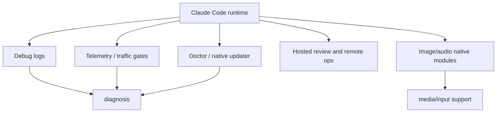

# Hosted agent ops

This chapter covers operational surfaces that sit around the main local agent runtime: debug logs, telemetry/traffic policy, updater/doctor paths, crash/error reporting, cloud/hosted review signals, and embedded native media helpers.

Read this chapter when the question is: **how does Claude Code report, diagnose, update, or support host/native capabilities around a session?**

## Source-anchor policy

This page is a chapter guide. Linked implementation pages carry concrete `cli.renamed.js` or Bun-graph anchors.

| Semantic alias | Minified anchor | Scope |
|---|---|---|
| Ops chapter | N/A — navigation page | Groups diagnostics, telemetry, update, crash/debug logs, hosted review signals, and native media modules. |
| Ops implementation pages | See linked source-anchor tables | Concrete anchors live in destination pages. |

## Ops map

## Primary reading order

| Order | Page | Ops question answered |
|---:|---|---|
| 1 | [Diagnostics and debug logs](diagnostics-and-debug-logs.md) | Which debug flags, log files, startup marks, stall diagnostics, and crash/error reporting surfaces exist? |
| 2 | [Telemetry and tracing](telemetry-and-tracing.md) | Which traffic gates, telemetry sinks, `tengu_*` signal families, OTEL config, and trace export paths exist? |
| 3 | [Feature gates reference](feature-gates-reference.md) | Which GrowthBook, `tengu_*`, env, policy, settings, and CLI gates switch runtime behavior? |
| 4 | [Updater and doctor](updater-and-doctor.md) | How do `doctor`, `update`/`upgrade`, `install`, native auto-updater state, and hosted preflights work? |
| 5 | [Environment variables reference](environment-variables-reference.md) | Which auth, provider, debug, telemetry, feature, MCP, plugin, agent, remote, UI, and update env vars are visible? |
| 6 | [Media native modules](media-native-modules.md) | Which non-`cli.js` graph modules are embedded, and how are image/audio native helpers loaded? |
| 7 | [Audio capture and voice mode](audio-capture-and-voice.md) | How does `/voice` use local audio capture, recorder fallbacks, a transcription stream, and transcript injection? |
| 8 | [Audio capture native module](audio-capture-native.md) | Which Rust crates (`cpal`/`alsa`), ALSA PCM surface, and N-API exports ship inside `audio-capture.node`? |
| 9 | [Image processor native module](image-processor-native.md) | Which Rust crates / N-API exports / defensive limits ship inside `image-processor.node`, and how is it wired into the `sharp()`-shaped JS facade? |
| 10 | [Operations and native-support architecture](architecture.md) | How does the ops periphery (debug, telemetry, updater, doctor, native helpers) sit around the runtime without entering the inner loop? |

## Handoffs

- Remote Control/session tokens are documented in [Sessions, persistence, and remote](../04-sessions-persistence-remote/README.md).
- Agents and hosted review command surfaces are documented in [Agents and automation](../06-agents-automation/README.md).
- Protocol boundaries for voice streams and remote/provider transports are documented in [Runtime communication protocols](../00-start-here/runtime-communication-protocols.md).

## Navigation

- [Start here](../00-start-here/README.md)
- [Full table of contents](../SUMMARY.md)
