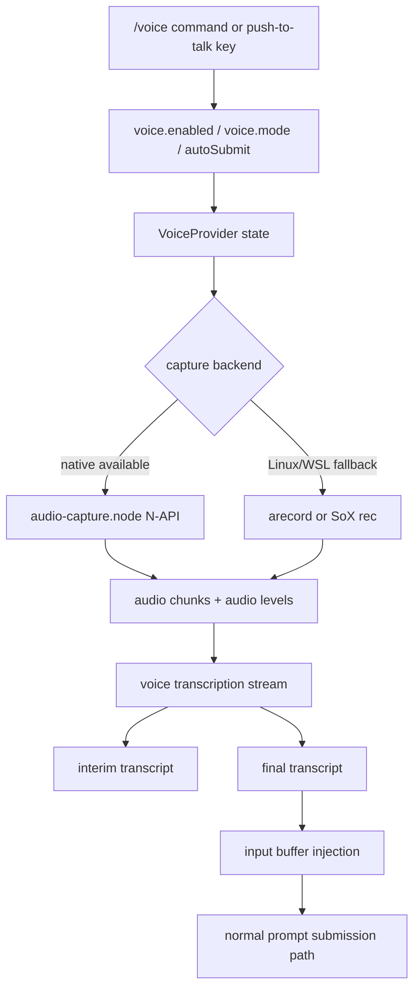
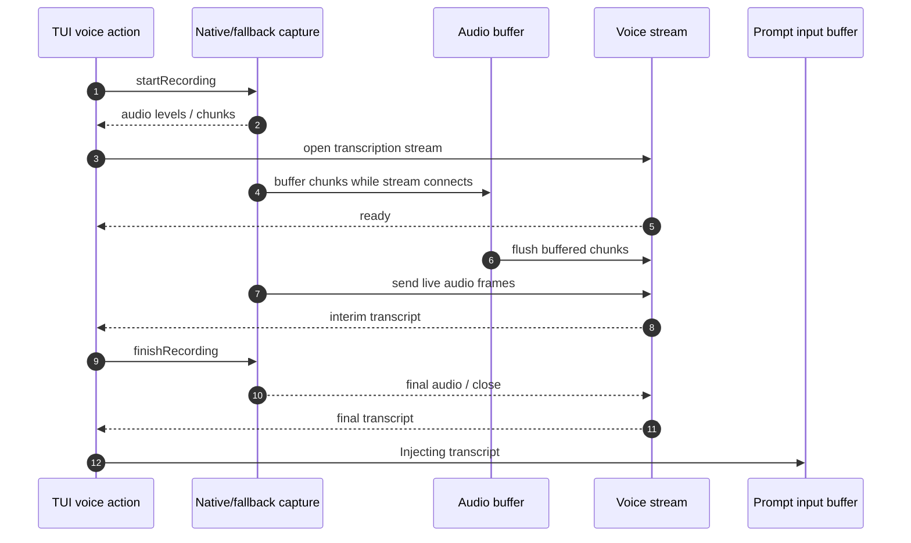

# Audio capture and voice mode

This page uses reverse-engineered `cli.renamed.js` and shim anchors to answer the voice question: **does Claude Code support voice, and how is it designed?**

Yes. The runtime contains a source-confirmed voice dictation path. It is local microphone capture plus remote transcription: `/voice` enables hold-to-talk or tap-to-toggle recording, audio is captured through a native N-API module or OS recorder fallback, a voice stream receives transcript chunks, and the final transcript is injected into the prompt input.

## Source anchors

| Semantic alias | String or symbol | Meaning |
| --- | --- | --- |
| AudioNativeAddonRequire | `require("/$bunfs/root/audio-capture.node")` | Main bundle can load the embedded audio native addon. |
| AudioCaptureShim | `require("/$bunfs/root/audio-capture.node")` | Retained JS shim references the audio N-API binary from the original Bun payload. |
| LegacyVoiceEnabledSetting | `voiceEnabled:y.boolean` | Legacy/global voice setting surface. |
| VoiceModeSettingsSchema | `Voice mode settings (hold-to-talk / tap-to-toggle dictation)` | Structured voice settings schema. |
| VoiceLanguageSetting | `Preferred language for Claude responses and voice dictation` | Voice dictation shares the language setting. |
| VoiceIdleState | `voiceState:"idle"` | TUI voice state starts idle. |
| VoiceInterimTranscriptState | `voiceInterimTranscript` | Interim transcript is part of TUI state. |
| VoiceAudioLevelsState | `voiceAudioLevels` | Audio-level visualization state. |
| PushToTalkAction | `voice:pushToTalk` | Keybinding/action for voice recording. |
| NativeAudioWrapper | `writeNativePlaybackData:()=>writeNativePlaybackData` | Native audio wrapper exports playback and recording methods. |
| AudioNapiLoadedLog | `audio-capture-napi loaded` | Native audio addon load path succeeds when available. |
| MicrophoneAccessGuard | `Voice mode requires microphone access` | Remote/no-device guard for voice mode. |
| WslRecorderFallbackGuard | `Voice mode could not find a working audio recorder in WSL` | WSL fallback error. |
| SoxRecorderRequirement | `Voice mode requires SoX for audio recording` | SoX fallback requirement. |
| VoiceAccountGate | `Voice mode requires a Claude.ai account` | Voice stream is account-gated. |
| VoiceSlashCommand | `Toggle voice mode` | `/voice` slash command description. |
| VoiceTuiComponents | `VoiceIndicator`, `VoiceWarmupHint` | TUI components render recording/warmup state. |
| VoiceFinishRecording | `finishRecording: stopping recording` | Recording state machine finalizes capture. |
| VoiceWebSocketBuffering | `startRecording: buffering audio while WebSocket connects` | Captured chunks are buffered until the transcription stream is ready. |
| VoiceFinalTranscript | `Final transcript assembled` | Transcription stream produces final text. |
| VoiceTranscriptInjection | `Injecting transcript` | Final transcript is injected into the input buffer. |
| VoiceConnectionFailureTelemetry | `voice_transcription_connection_failed` | Voice stream connection failure telemetry. |
| VoiceStreamErrorPath | `voice_stream error` | Voice stream error path. |
| VoiceStreamAuthFailure | `voice_stream_no_auth` | Voice stream auth failure telemetry. |
| VoiceDiscoveryHint | `Use /voice to enable push-to-talk dictation` | User-visible discovery hint. |

## High-level design

Voice mode is dictation, not a separate agent loop. After transcription, the result flows back into the same text prompt pipeline used by keyboard input.

## User-facing controls

| Surface | Meaning |
|---|---|
| `/voice` | Toggle or configure voice mode. |
| `/voice hold` | Hold-to-talk dictation. |
| `/voice tap` | Tap-to-toggle dictation. |
| `/voice off` | Disable voice mode. |
| `voice:pushToTalk` | TUI keybinding/action; the default chat binding includes space for push-to-talk. |
| `voice.autoSubmit` | Setting that can submit after transcript injection rather than only inserting text. |
| `language` | Preferred language for Claude responses and voice dictation. |

The state model contains `voiceState`, `voiceError`, `voiceInterimTranscript`, `voiceAudioLevels`, `voiceWarmingUp`, and `awaitingVoiceSubmitDoubleTap`, which explains the visible warmup/recording/transcribing feedback.

## Capture backends

### Native N-API path

The original Bun payload ships `audio-capture.js` and `audio-capture.node`; the local extraction pipeline now writes the `.node` binary alongside the shim (`*.node` is gitignored). The full binary-level reverse engineering of the addon — cpal + ALSA dependency set, 49-function PCM surface, N-API export list, microphone-authorization Linux stub — lives in [Audio capture native module](audio-capture-native.md).

`cli.renamed.js` loads the native addon when it is available at runtime and exports wrappers such as:

- `startNativeRecording`
- `stopNativeRecording`
- `isNativeRecordingActive`
- `startNativePlayback`
- `writeNativePlaybackData`
- `stopNativePlayback`
- `microphoneAuthorizationStatus`
- `isNativeAudioAvailable`

The `audio-capture-napi loaded` anchor confirms the runtime attempts to use this addon when available.

### Recorder fallback path

When native capture is unavailable, the runtime falls back to command-line recorders:

- Linux/WSL can use `arecord`.
- A SoX `rec` path exists and produces user-facing guidance when missing.
- WSL has explicit failure messaging when no working recorder exists.

This fallback design keeps the JS/TUI voice state machine independent from any one capture backend.

## Transcription stream and injection

The recording flow has two phases:

1. **Capture phase**: start local recording, collect chunks, and surface audio levels.
2. **Stream phase**: connect to the voice stream, buffer audio while the WebSocket-like stream is connecting, send audio frames, receive interim/final transcript messages, and close/finalize.

The source strings `Final transcript assembled` and `Injecting transcript` confirm that the transcribed text is not merely displayed; it becomes input to the regular prompt flow.

## Availability and gates

Voice mode is constrained by environment and account state:

| Gate | Source-confirmed behavior |
|---|---|
| Local audio device | Remote/no-device environments show `Voice mode requires microphone access... run Claude Code locally instead.` |
| Account/auth | `/voice` can report `Voice mode requires a Claude.ai account`; stream errors include `voice_stream_no_auth`. |
| Recorder dependencies | WSL and SoX-specific errors guide the user when no recorder backend is available. |
| Settings | `voiceEnabled`, `voice.enabled`, `voice.mode`, `voice.autoSubmit`, and `language` all affect behavior. |
| Feature/availability check | The TUI renders voice indicators only when the availability helper says voice can run. |

The current evidence supports documenting voice as **supported local dictation**, not as always available in every environment.

## Telemetry and error handling

The bundle contains voice-specific telemetry/error names:

| Event/string | Meaning |
|---|---|
| `tengu_voice_toggled` | Voice setting changed. |
| `tengu_voice_recording_started` | Local recording began. |
| `tengu_voice_recording_completed` | Recording completed. |
| `voice_transcription_connection_failed` | Could not connect to the transcription stream. |
| `voice_transcription_no_audio_signal` | Capture produced no usable audio signal. |
| `voice_transcription_no_speech` | Speech was not detected in the recorded audio. |
| `voice_stream_no_auth` | Voice stream rejected/failed auth. |
| `voice_stream error` | General stream failure. |

Failures are surfaced in the TUI as `voiceError` and do not replace the normal text-input path.

## Recording chain and dependency probe

The voice recorder picks one of three backends at start time. Selection lives in `startRecording` ([cli.renamed.js line 611897](../../claude-code-pkg/src/entrypoints/cli.renamed.js#L611897)) and prefers the embedded N-API addon when both the addon and a sound card are present, then falls back to `arecord`, then to SoX:

1. **`audio-capture.node` (N-API)** — `RP8()` lazy-loads `audio-capture-napi` from `./vendor/audio-capture/${arch-platform}/audio-capture.node` (also probed at `../audio-capture/...`), caching the binding on `LG$` and emitting `[voice] audio-capture-napi loaded in Xms`. Selected when `isNativeAudioAvailable()` is true and `/proc/asound/cards` exists with at least one card.
2. **`arecord` (ALSA)** — used when `arecord --version` succeeds and `arecord -f S16_LE -r MQ6 -c wQ6 -t raw /dev/null` returns a clean stderr within 150 ms (`ON4()` is cached in `fQ6` after first probe).
3. **`rec` (SoX)** — spawned with `[-q, --buffer 1024, -t raw, -r MQ6, -e signed, -b 16, -c wQ6, -]` and, when `silenceDetection !== false`, the trailing `silence 1 0.1 YN4 1 Yb5 YN4` arguments so the recorder stops after detected silence.

`checkRecordingAvailability()` runs the same chain in dry-run mode before voice mode is unlocked. The diagnostic messages drive UX strings:

| Environment | Resulting reason |
|---|---|
| Remote / `CLAUDE_CODE_REMOTE` set | `"Voice mode requires microphone access, but no audio device is available in this environment. To use voice mode, run Claude Code locally instead."` |
| WSL without working ALSA/SoX | `"Voice mode could not find a working audio recorder in WSL..."` plus the `sudo apt install sox libsox-fmt-pulse` install hint |
| Generic Linux missing SoX | install command resolved by `MN4()` from the first detected package manager |

`MN4()` (the install-command picker) probes `apt-get`, `dnf`, then `pacman` in that order with `WJH` (3,000 ms `--version` execFile check), returning `{ cmd, args, displayCommand }` so `checkVoiceDependencies()` can surface a single-line install hint like `sudo apt-get install sox`.

Permission gating runs through `requestMicrophonePermission()`: when the N-API addon is available it triggers a brief no-silence-detection recording and immediately stops it, which fires the OS permission prompt on macOS; everywhere else the function returns `true` because the OS gate is enforced by the recorder process. `microphoneAuthorizationStatus()` exposes the addon's reported status (`0` when the addon is missing).

## Relationship to media native modules

The older [Media native modules](media-native-modules.md) inventory correctly identified `audio-capture.node` as shipped payload. This page adds the missing runtime call path: the main bundle can load the module when present, starts/stops recording, falls back to OS recorders, and injects the resulting transcript.

## Caveats

- The `.node` binary itself is stripped. This page documents the JavaScript call boundary, exported wrapper names, and user-visible behavior, not native implementation details such as device enumeration internals.
- The stream endpoint and server-side transcription implementation are not recoverable from this source alone. The bundle proves a client-side voice stream and auth/error handling, not the backend model details.
- Voice mode should be described as dictation. There is no evidence here that the agent loop itself becomes audio-native; text remains the prompt handoff after transcription.

## Related docs

- [Media native modules](media-native-modules.md)
- [Operations and native-support architecture](architecture.md)
- [Prompt, context, and memory](../02-context-model-loop/prompt-context-memory.md)
- [Runtime communication protocols](../00-start-here/runtime-communication-protocols.md)
- [Models, providers, and auth](../02-context-model-loop/models-providers-auth.md)
