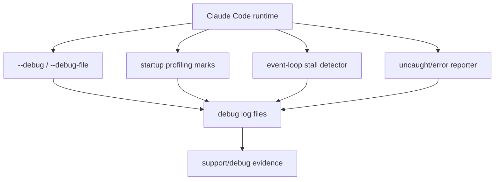

# Diagnostics and debug logs

This page owns the diagnostics/debug-log side of the ops layer: debug flags, debug log files, startup profiling marks, event-loop stall diagnostics, crash/error reporting, and support-oriented local evidence.

Use [Telemetry and tracing](telemetry-and-tracing.md) for traffic/telemetry/OTEL export behavior, [Feature gates reference](feature-gates-reference.md) for GrowthBook and `tengu_*` feature gates, and [Updater and doctor](updater-and-doctor.md) for the user-facing `doctor` and updater command paths.

## Source anchors

| Semantic alias | String or symbol | Meaning |
| --- | --- | --- |
| DebugLogsDirEnv | `CLAUDE_CODE_DEBUG_LOGS_DIR` | Debug-log directory override. |
| DebugLogLevelEnv | `CLAUDE_CODE_DEBUG_LOG_LEVEL` | Debug-log level override. |
| DebugFileFlagParser | `--debug-file` | Specific debug-log path flag parser. |
| DebugFilterFlag | `-d, --debug [filter]` | Debug mode with category filtering. |
| RootDebugFlag | `--debug [filter]` | Root debug flag/filter. |
| DoctorDiagnosticsScreen | `/doctor diagnostics screen` | Interactive diagnostics surface. |
| EventLoopStallDetector | `startEventLoopStallDetector` | Optional event-loop stall diagnostic. |
| StartupProfilingMarkers | `import_time`, `cli_entry`, `main_tsx_imports_loaded` | Startup profiling markers. |
| ShutdownErrorFlushCoordinator | `recordUncaughtAndCheckBreaker`, `gracefulShutdown`, `flushAnalyticsSinks` | Error/crash recording and shutdown flush coordination. |

## Bundle modules in `cli.renamed.js`

| Semantic alias | Loader line(s) | Representative renamed exports | Atlas entry |
|---|---:|---|---|
| `SecretRedaction` | 11510 | `redact`, `redactObject`, `redactSensitiveKeys`, `redactedJsonPreview`, `stripUrlSecrets`, `scan` | [Bundle module map — observability and ops](../99-research-atlas/module-map-from-renamed-cli.md#observability-and-ops) |
| `StartupPerformanceProfiler` | 12438 | `profileReport`, `profileCheckpoint`, `logStartupPerf`, `isDetailedProfilingEnabled`, `getStartupPerfLogPath` | [Bundle module map — observability and ops](../99-research-atlas/module-map-from-renamed-cli.md#observability-and-ops) |
| `ProcessIoErrorHandlers` | 11183, 11235 | `writeToStdout`, `writeToStderr`, `registerProcessOutputErrorHandlers`, `peekForStdinData`, `exitWithError`, `setBgExitCause`, `readAndClearBgExitCause` | [Bundle module map — observability and ops](../99-research-atlas/module-map-from-renamed-cli.md#observability-and-ops) |

## Diagnostic map

```mermaid
flowchart TD
    Runtime[Claude Code runtime] --> DebugFlags[--debug / --debug-file]
    Runtime --> StartupMarks[startup profiling marks]
    Runtime --> Stall[event-loop stall detector]
    Runtime --> Errors[uncaught/error reporter]
    DebugFlags --> Logs[debug log files]
    StartupMarks --> Logs
    Stall --> Logs
    Errors --> Logs
    Logs --> Support[support/debug evidence]
```

## Debug-log controls

| Surface | Runtime role |
|---|---|
| `--debug [filter]` / `-d` | Enables debug logging, optionally filtered by categories such as `api,hooks` or negated filters. |
| `--debug-to-stderr` / `-d2e` | Sends debug logs to stderr instead of only file-backed output. |
| `--debug-file <path>` | Writes debug logs to a specific file and implicitly enables debug mode. |
| `DEBUG`, `DEBUG_SDK` | Environment switches that can also enable debug behavior in selected paths. |
| `CLAUDE_CODE_DEBUG_LOGS_DIR` | Overrides the default debug-log directory. |
| `CLAUDE_CODE_DEBUG_LOG_LEVEL` | Sets the log-level threshold when recognized. |
| `latest` symlink | The debug writer updates a `latest` symlink next to log files. |

## Debug writer lifecycle

`getDebugLogPath()` resolves the destination in this order:

1. `--debug-file` (either `--debug-file=<path>` or the next CLI argument), resolved to an absolute path;
2. a per-process fallback path cached after the originally selected path cannot be appended;
3. `CLAUDE_CODE_DEBUG_LOGS_DIR`;
4. `<claude-dir>/debug/<sessionId>.txt`.

Each accepted entry is trimmed, redacted by the secret scanner, timestamped as ISO-8601, and formatted as `[LEVEL]` before it reaches the writer. Multiline formatted output is normalized when needed. `CLAUDE_CODE_DEBUG_LOG_LEVEL` recognizes `verbose`, `debug`, `info`, `warn`, and `error`; an absent or invalid value falls back to `debug`.

The writer uses a one-second flush interval and a maximum buffer of 100 entries, with immediate mode while debug mode is active. Writes are serialized through a promise chain so batches do not race. It creates the parent directory on the first write to a new directory and installs both asynchronous shutdown disposal and a synchronous process-`exit` fallback for queued entries.

After a write, `maybeRotateDebugLog()` tracks the file size. Once it exceeds 10 MiB, the current file is renamed to `<name>.1.txt` (or `<name>.1` for a non-`.txt` path), replacing or removing an older single rotated generation if necessary. Rotation failure is swallowed to avoid turning diagnostics into a runtime failure. The writer then refreshes a sibling `latest` symlink to the active path on a best-effort basis.

This is a support log, not a durability guarantee: directory creation, fallback, rotation, and symlink errors are deliberately non-fatal.

## Startup and runtime diagnostics

| Diagnostic family | Evidence | Meaning |
|---|---|---|
| Startup marks | `import_time`, `cli_entry`, `main_tsx_imports_loaded`, `cli_before_main_import` | Gives support a boot timeline before the main loop starts. |
| Event-loop stalls | `startEventLoopStallDetector` | Adds a runtime liveness diagnostic around bootstrap/session execution. |
| Doctor diagnostics screen | `/doctor diagnostics screen` | Interactive diagnostics entry; command-level ownership is in [Updater and doctor](updater-and-doctor.md). |
| Crash/error recording | `recordUncaughtAndCheckBreaker` | Centralizes uncaught exception/breaker classification before shutdown. |
| Shutdown flush | `gracefulShutdown`, `flushAnalyticsSinks` | Gives logs/telemetry sinks a final best-effort drain. |

### Startup profiler artifacts

Startup profiling uses performance marks independently of the ordinary debug-file name. When detailed startup profiling is enabled, `profileReport()` writes:

- `<claude-dir>/startup-perf/<sessionId>.txt` — a human-readable checkpoint timeline with optional RSS/heap snapshots;
- `<claude-dir>/startup-perf/<sessionId>.json` — metadata, raw marks, memory snapshots, and process boot timing.

The same report is also sent through the debug logger. A sampled non-detailed path can emit `tengu_startup_perf` metrics without writing the detailed files. Therefore the existence of startup performance telemetry does not imply that the two local profiling files were enabled for that session.

## Error reporting boundary

Error reporting is related to diagnostics but gated separately from debug logs. `DISABLE_ERROR_REPORTING` and traffic policy determine whether error reports are sent externally; local debug logs can still exist depending on debug settings. Date-stamped local error and MCP JSONL writers are also distinct from this debug writer and are covered in [Telemetry and tracing](telemetry-and-tracing.md). Disabling one route should not be described as disabling every other route.

## Interpretation rules

1. Treat debug logs as local support evidence, not as public API.
2. Do not log credential/token values from env vars or settings.
3. Keep debug-log controls here; keep traffic/telemetry/OTEL controls in [Telemetry and tracing](telemetry-and-tracing.md).
4. Use [Environment variables reference](environment-variables-reference.md) for canonical env-var names.

## Related docs

- [Telemetry and tracing](telemetry-and-tracing.md)
- [Feature gates reference](feature-gates-reference.md)
- [Updater and doctor](updater-and-doctor.md)
- [Environment variables reference](environment-variables-reference.md)
- [Operations and native-support architecture](architecture.md)
