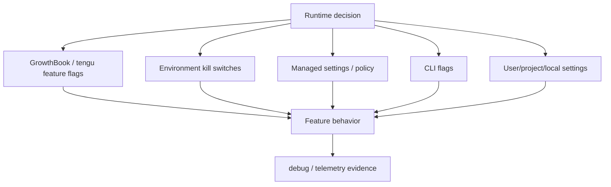
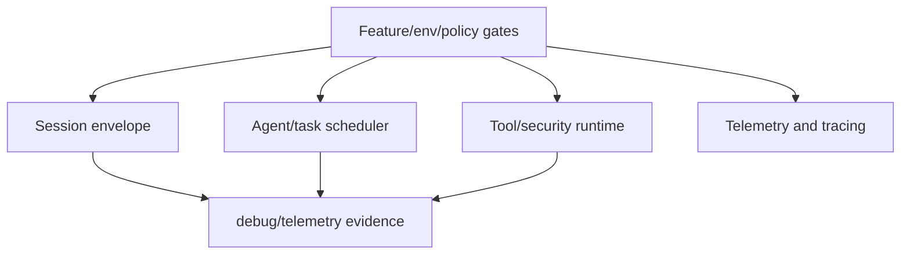
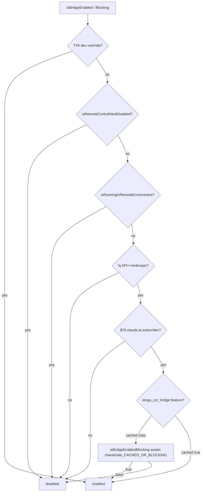
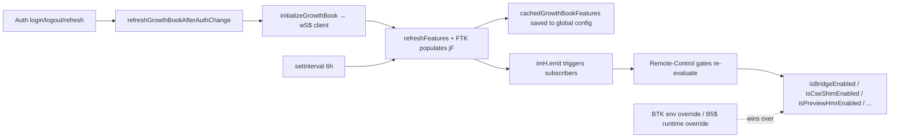

# Feature gates reference

This page owns the feature-gate taxonomy visible in `cli.renamed.js`: GrowthBook evaluation, `tengu_*` gates/signals, environment kill switches, managed-policy gates, and CLI/settings gates that switch operational behavior.

Use [Telemetry and tracing](telemetry-and-tracing.md) for telemetry/export behavior and [Environment variables reference](environment-variables-reference.md) for canonical env-var names.

## Source anchors

| Semantic alias | String or symbol | Meaning |
| --- | --- | --- |
| GrowthBookClient | `GrowthBook` | Embedded feature/experiment client. |
| FeatureFlagLookupWrapper | `Z$("..."` | Feature-flag lookup wrapper pattern. |
| DisableGrowthBookEnv | `DISABLE_GROWTHBOOK` | Environment kill switch for GrowthBook. |
| DisableCronEnv | `CLAUDE_CODE_DISABLE_CRON` | Cron/scheduled-task kill switch. |
| KairosCronGate | `isKairosCronEnabled` | Scheduled-task feature gate wrapper. |
| CronSchedulerRuntime | `createCronScheduler` | Scheduled-task runtime. |
| DisableRemoteControlPolicy | `disableRemoteControl` | Managed policy gate for Remote Control. |
| DisableSkillShellPolicy | `disableSkillShellExecution` | Managed policy gate for skill/slash shell execution. |
| XaaEnvGate | `CLAUDE_CODE_ENABLE_XAA` | MCP cross-app access is disabled unless this env gate is set. |
| RemoteTriggerGate | `tengu_surreal_dali`, `allow_remote_sessions` | Remote routine management is feature-, subscription-, mode-, and policy-gated. |

## Bundle modules in `cli.renamed.js`

| Semantic alias | Loader line | Representative renamed exports | Atlas entry |
|---|---:|---|---|
| `RemoteControlFeatureGates` | 325388 | `isRunningInRemoteEnvironment`, `isRemoteControlInternalEventsEnabled`, `isRemoteControlHardDisabled`, `isPreviewHmrEnabled`, `isPersistentRemoteSessionEnabled`, `isCseShimEnabled`, `isCcrV2SendEventsEnabled`, `isCcrMirrorEnabled` | [Bundle module map — remote control, feature flags, networking](../99-research-atlas/module-map-from-renamed-cli.md#remote-control-feature-flags-networking) |
| `GrowthBookFeatureFlags` | 167597 | `refreshGrowthBookFeatures`, `refreshGrowthBookAfterAuthChange`, `setupPeriodicGrowthBookRefresh`, `stopPeriodicGrowthBookRefresh`, `setGrowthBookConfigOverride`, `onGrowthBookRefresh`, `isGrowthBookEnabled`, `resetGrowthBook` | [Bundle module map — remote control, feature flags, networking](../99-research-atlas/module-map-from-renamed-cli.md#remote-control-feature-flags-networking) |

## Gate taxonomy

| Gate type | Examples | What it controls |
|---|---|---|
| GrowthBook/feature flag | `GrowthBook`, `Z$("...")`, many `tengu_*` keys | Experiments, staged rollout, runtime feature defaults. |
| Environment kill switch | `DISABLE_GROWTHBOOK`, `CLAUDE_CODE_DISABLE_CRON`, telemetry/update/context UI env vars | Coarse process-level enable/disable decisions. |
| Managed policy/settings | `disableRemoteControl`, `disableAllHooks`, `disableAgentView`, `disableSkillShellExecution`, `cleanupPeriodDays` | Organization/admin and persisted configuration controls. |
| CLI flag | `--debug`, `--debug-file`, `--add-trace-attribute`, `--no-session-persistence`, `--agents` | Per-invocation behavior. |
| Provider/env selector | `CLAUDE_CODE_USE_BEDROCK`, `CLAUDE_CODE_USE_VERTEX`, `CLAUDE_CODE_USE_FOUNDRY`, `CLAUDE_CODE_USE_ANTHROPIC_AWS`, `CLAUDE_CODE_USE_MANTLE` | Provider/auth/reporting paths. |

## High-signal feature-gate families

The table groups source-visible keys by nearby behavior. It does **not** claim every opaque `tengu_*` name is fully decoded.

| Family | Source-visible gates | Interpreted scope |
|---|---|---|
| Remote / bridge / CCR | `tengu_ccr_bridge`, `tengu_remote_backend`, `tengu_bridge_repl_v2_cse_shim_enabled`, `tengu_bridge_attestation_enforce`, `tengu_bridge_attestation_enforce_config`, `tengu_ccr_v2_send_events_cli`, `tengu_bridge_requires_action_details`, `tengu_bridge_system_init`, `tengu_surreal_dali`, `CLAUDE_CODE_REMOTE`, `disableRemoteControl`, `allow_remote_sessions` | Remote Control, bridge transport, attestation, event forwarding, and remote routine management. |
| Scheduled tasks / Kairos cron | `tengu_kairos_cron`, `tengu_kairos_cron_durable`, `tengu_kairos_loop_dynamic`, `tengu_kairos_loop_persistent`, `tengu_kairos_loop_prompt`, `tengu_kairos_push_notifications`, `tengu_kairos_input_needed_push`, `CLAUDE_CODE_DISABLE_CRON` | Cron/scheduled prompt feature family and autonomous-loop behavior. |
| Agents / background agents | `tengu_auto_background_agents`, `tengu_agent_list_attach`, `tengu_mcp_subagent_prompt`, `tengu_slim_subagent_claudemd`, `CLAUDE_AGENT_SDK_DISABLE_BUILTIN_AGENTS`, `CLAUDE_CODE_DISABLE_AGENT_VIEW` | Agent UI, background agents, subagent prompt/context behavior. |
| Auto-mode / permission automation | `tengu_auto_mode_config`, `tengu_disable_bypass_permissions_mode`, `tengu_auto_notice_once`, policy `defaultMode=auto` | Auto-mode defaults, consent, permission automation. |
| Tool/runtime security | `tengu_streaming_tool_execution2`, `tengu_harbor_permissions`, `tengu_destructive_command_warning`, `tengu_bash_allowlist_strip_all`, `CLAUDE_CODE_DISABLE_ADVISOR_TOOL`, `CLAUDE_CODE_ENABLE_EXPERIMENTAL_ADVISOR_TOOL` | Tool execution mode, warnings, advisory/permission behavior. |
| MCP/plugins/skills | `tengu_mcp_directory_visibility`, `tengu_mcp_directory_bff`, `tengu_mcp_singleton_unwrap`, `tengu_skills_dashboard_enabled`, `tengu_plugin_official_mkt_git_fallback`, `CLAUDE_CODE_PLUGIN_PREFER_HTTPS`, `CLAUDE_CODE_PLUGIN_USE_ZIP_CACHE`, `CLAUDE_CODE_SYNC_PLUGIN_INSTALL`, `CLAUDE_CODE_ENABLE_XAA` | MCP discovery, plugin install/update, skills UI, and cross-app OAuth. |
| Context/model behavior | `CLAUDE_CODE_DISABLE_1M_CONTEXT`, `DISABLE_COMPACT`, `DISABLE_INTERLEAVED_THINKING`, `USE_API_CONTEXT_MANAGEMENT`, `CLAUDE_CODE_DISABLE_EXPERIMENTAL_BETAS`, `tengu_prompt_cache_1h_config`, `tengu_prompt_cache_diagnostics` | Context window, compaction, thinking, prompt cache, beta flags. |
| Web/search/fetch adjacent | `tengu_tool_search_unsupported_models`, `/api/web/domain_info?domain=` | Web/domain metadata and model support guardrails. |
| UI/terminal behavior | `CLAUDE_CODE_DISABLE_ALTERNATE_SCREEN`, `CLAUDE_CODE_NO_FLICKER`, `CLAUDE_CODE_DISABLE_MOUSE`, `CLAUDE_CODE_FORCE_SYNC_OUTPUT`, `CLAUDE_CODE_ACCESSIBILITY`, `CLAUDE_CODE_DISABLE_TERMINAL_TITLE` | Terminal rendering and accessibility behavior. |
| Updates | `DISABLE_UPDATES`, `DISABLE_AUTOUPDATER`, `FORCE_AUTOUPDATE_PLUGINS`, `auto-update` settings | Native/plugin updater behavior. |
| Telemetry/diagnostics | `CLAUDE_CODE_DISABLE_NONESSENTIAL_TRAFFIC`, `DISABLE_TELEMETRY`, `DO_NOT_TRACK`, `DISABLE_ERROR_REPORTING`, `DISABLE_GROWTHBOOK`, `OTEL_LOG_TOOL_DETAILS`, `OTEL_LOG_TOOL_CONTENT`, `OTEL_LOG_USER_PROMPTS` | Observability, analytics, error reporting, feature-evaluation fetching. |

## Relationship to sessions and agents

| Runtime area | Gate interaction |
|---|---|
| Sessions/remote | Remote Control can be disabled by managed policy; bridge state and transcript mirrors emit observable frames. |
| Tools/permissions | Permission automation and streaming execution are feature-gated; denials can surface as stream frames and telemetry. |
| Agents/tasks | Background agents, subagent prompt shape, scheduled tasks, and auto-mode are behind feature/env/policy gates. |
| Scheduled tasks | `CLAUDE_CODE_DISABLE_CRON` disables cron; scheduled-task telemetry tracks missed/fire/expired behavior. |
| Hosted review/update | Hosted review preflight and native updater emit operational telemetry but do not own model turns. |

## Safe interpretation rules

1. Treat `tengu_*` as **evidence of a gate or telemetry event**, not a fully decoded feature name unless adjacent strings confirm behavior.
2. Prefer env/policy strings for hard claims, because they are usually descriptive and user/admin-facing.
3. Distinguish a gate from an exported event: feature gates decide behavior; telemetry/tracing reports behavior.
4. Use [Telemetry and tracing](telemetry-and-tracing.md) for sink/export details.

## GrowthBook client lifecycle

The `GrowthBookFeatureFlags` module (loader at `cli.renamed.js:167597`, body at `cli.renamed.js:167263`) is the single source of truth for `tengu_*` features. It wraps a GrowthBook SDK client (`wS$`) initialized lazily against `https://api.anthropic.com/`. The module exports three read APIs with different freshness/blocking trade-offs, plus periodic refresh, auth-change reset, and config-override helpers.

### Initialization (`initializeGrowthBook`, `Qq6`)

Both factories are memoized via `L8(...)`:

1. **Disable kill switch** — `isGrowthBookEnabled()` returns `false` when `DISABLE_GROWTHBOOK` env is set or `DF()` (a baseline gate) is off. All read APIs degrade to the caller's `defaultValue` in this case.
2. **Trust gate** — auth headers are only attached when one of `checkHasTrustDialogAccepted()`, `getSessionTrustAccepted()`, or `getIsNonInteractiveSession()` holds; otherwise the client is constructed without `apiHostRequestHeaders` and the initial `init({timeout: 5000})` runs unauthenticated (and gets no remote-eval response). The flag `gq6` records whether auth was attached.
3. **Client construction** — passes `apiHost`, `clientKey` (per-build), `attributes` (see `getUserAttributes()`), `remoteEval: true`, and `cacheKeyAttributes: ["id", "organizationUUID"]`. Remote evaluation means the server returns only the feature values for this user's attributes, so the local cache never contains other users' assignments.
4. **`init({timeout: 5000})`** — the resulting promise is stored in `u5$`. `checkSecurityRestrictionGate(...)` awaits `u5$` so its first call after auth-change blocks until features are loaded.
5. **`FTK(client)`** — extracts the features payload, separates `experiment`-sourced features (tracked in `sYH`), normalizes `value`/`defaultValue`, populates the in-memory cache `jF`, and clears stale state. Returns `true` if anything changed.
6. **Process hooks** — registers `beforeExit` / `exit` listeners (`C5$`, `b5$`) that destroy the client on shutdown.
7. **Periodic refresh** — `setupPeriodicGrowthBookRefresh()` schedules a `setInterval(refreshGrowthBookFeatures, 21600000)` (6 h) and registers a `beforeExit` listener to clean it up.

### User attributes (`getUserAttributes`)

The attribute bag used for GrowthBook targeting and `cacheKeyAttributes`:

| Attribute | Source |
|---|---|
| `id`, `deviceID`, `sessionId`, `platform` | Stable device + session identity. |
| `organizationUUID`, `accountUUID` | OAuth account + `CLAUDE_CODE_ORGANIZATION_UUID` / `CLAUDE_CODE_ACCOUNT_UUID` env overrides. |
| `apiBaseUrlHost` | Non-default `ANTHROPIC_BASE_URL` host. |
| `userType`, `subscriptionType`, `rateLimitTier`, `firstTokenTime`, `email`, `appVersion` | Identity service / config. |
| `githubActionsMetadata` | Present when running inside GitHub Actions. |
| `releaseChannel` | Auto-update channel from initial settings. |
| `entrypoint` | `NRH()` — startup entry classification. |

Only `id` + `organizationUUID` are part of `cacheKeyAttributes`, so cache invalidation is per device per org.

### Read APIs and cache tiers

| API | Blocks? | Uses in-memory `jF`? | Uses persisted `cachedGrowthBookFeatures`? | Tracks experiment exposure? |
|---|---|---|---|---|
| `getFeatureValue_DEPRECATED(key, default)` | Yes — awaits init. | Yes (preferred). | Falls back to remote eval. | Yes (`Ri$(key)`). |
| `getFeatureValue_CACHED_MAY_BE_STALE(key, default)` | No. | Yes (preferred). | Yes (fallback). | Only if `sYH.has(key)` (already known experiment). Otherwise records `x5$` for batched tracking after next refresh. |
| `getFeatureValue_CACHED_WITH_REFRESH(key, default, _)` | No (alias of the stale getter; the refresh side effect lives elsewhere). | Yes. | Yes. | Same as stale. |
| `checkGate_CACHED_OR_BLOCKING(key)` | Only when not cached AND not env-/override-set. | Fast path: `cachedGrowthBookFeatures[key] === true` returns immediately. | Yes. | Yes on fast path. |
| `checkSecurityRestrictionGate(key)` | Yes — awaits in-flight `u5$` to ensure post-auth-change correctness; then reads `cachedGrowthBookFeatures`. | No. | Yes. | No (security gates do not feed experiment tracking). |
| `getDynamicConfig_BLOCKS_ON_INIT(key, default)` / `getDynamicConfig_CACHED_MAY_BE_STALE(key, default)` | Aliases of the deprecated/stale getters for typed dynamic-config blobs. | — | — | — |

Two override layers run before any of these:

- **Env override** — `m5$()` lazily reads `BTK` (parsed JSON from a hosted env). Any key in there wins.
- **Config override** — `B5$()` reads a runtime override map (currently always `undefined` for end users — the setter is a no-op).

### Caching surfaces

- `jF: Map<string, value>` — in-memory cache populated by `FTK(client)`.
- `sYH: Map<string, {experimentId, variationId}>` — features whose source is an experiment; experiment exposure is tracked once per process via `Ri$(key)`.
- `Si$: Set<string>` — feature keys whose value is not the default (`getNonDefaultFeatureKeys()`).
- `x5$: Set<string>` — keys observed by `_CACHED_MAY_BE_STALE` before init completed; the post-init `init().then(...)` callback walks this set and emits experiment exposure for any keys that turn out to be experiments.
- `Uq6: Set<string>` — keys already tracked, used to dedupe exposure events.
- `cachedGrowthBookFeatures` / `cachedExperimentFeatures` — persisted to global config via `QTK()` after each successful `FTK`. This is what `_CACHED_MAY_BE_STALE` reads when `jF` is empty (process startup) so the very first cold render still has a cached value.

### Refresh and reset

| Function | Trigger | Behavior |
|---|---|---|
| `setupPeriodicGrowthBookRefresh()` | After first init. | `setInterval(refreshGrowthBookFeatures, 21600000)` (6 h). `unref()`'d so it does not keep the event loop alive. |
| `stopPeriodicGrowthBookRefresh()` | `beforeExit`, manual reset. | Clears the interval and removes the `beforeExit` listener. |
| `refreshGrowthBookFeatures()` | Periodic timer, manual. | Calls `client.refreshFeatures({skipCache: true})`, then `FTK(client)`. On change: persists via `QTK()` and emits `imH.emit()` so subscribers (`onGrowthBookRefresh`) re-evaluate. |
| `refreshGrowthBookAfterAuthChange()` | Called by auth flows after login/logout/token refresh. | `resetGrowthBook()` then re-runs `initializeGrowthBook()` and tracks the in-flight promise in `u5$` so blocking gates await the new client. |
| `resetGrowthBook()` | Auth change, shutdown. | Stops the interval, removes process listeners, destroys the client, clears every cache map (`jF`, `sYH`, `Si$`, `x5$`, `Uq6`), and invalidates the memoized factories. |
| `onGrowthBookRefresh(cb)` | UI/runtime subscribers. | Subscribes `cb` to `imH`. If the cache already has values (`jF.size > 0`), schedules an immediate microtask call so late subscribers still see current state. Returns an unsubscribe handle. |

## Remote Control / Bridge feature gates

The `RemoteControlFeatureGates` module (loader at `cli.renamed.js:325388`, body at `cli.renamed.js:325146`) layers business logic on top of GrowthBook to decide whether Claude Code's Remote Control / Bridge / CCR / CSE features are available in the current session.

### Bridge entitlement chain

Functions:

- `isRemoteControlHardDisabled()` — managed setting `disableRemoteControl: true`.
- `isRunningInRemoteEnvironment()` — `CLAUDE_CODE_REMOTE` env OR `getIsRemoteMode()`. Bridge is one-way: a Bridge process never enables Bridge for itself.
- `hasBridgeEntitlement()` — synchronous, uses `_CACHED_MAY_BE_STALE`. Combines `hj()` + claude.ai subscriber check + `tengu_ccr_bridge` feature value.
- `isBridgeEnabled()` — fast-path; calls `hasBridgeEntitlement` and the hard-disable checks.
- `isBridgeEnabledBlocking()` — async; uses `checkGate_CACHED_OR_BLOCKING("tengu_ccr_bridge")` so the first call after auth change correctly waits for refreshed features.

### `getBridgeDisabledReason()` chain

When Bridge is unavailable the UI calls `getBridgeDisabledReason()` to render a user-friendly explanation. It returns the first matching reason:

1. API host is not `api.anthropic.com` ⇒ "only available when using Claude via api.anthropic.com".
2. `isRunningInRemoteEnvironment()` ⇒ "not available inside a remote session".
3. `isRemoteControlHardDisabled()` ⇒ "disabled by your organization's policy (managed setting `disableRemoteControl`)".
4. Not a claude.ai subscriber ⇒ "requires a claude.ai subscription. Run `claude auth login`…".
5. Auth-helper conflict (`Y2_()`) ⇒ describes the conflicting API key / token source (`ANTHROPIC_API_KEY`, `apiKeyHelper`, `ANTHROPIC_AUTH_TOKEN`, `ANTHROPIC_UNIX_SOCKET`, etc.) and how to unset it.
6. No full-scope profile token (e.g. only `claude setup-token` long-lived token) ⇒ "Long-lived tokens are limited to inference-only…".
7. Missing `oauthAccount.organizationUuid` ⇒ "Unable to determine your organization…".
8. `checkGate_CACHED_OR_BLOCKING("tengu_ccr_bridge")` returns false ⇒ "not yet enabled for your account".
9. Otherwise `null` (Bridge is available).

`getBridgeAuthDebugInfo()` — only emits content when `vv()` (a debug-flag predicate) is true. Returns a multi-line block enumerating `isBareMode`, OAuth token presence and scopes, claude.ai inference scope, claude.ai subscriber flag, profile scope, org UUID, plus the relevant env vars (`ANTHROPIC_API_KEY`, `ANTHROPIC_AUTH_TOKEN`, `apiKeyHelper`, `CLAUDE_CODE_API_KEY_FILE_DESCRIPTOR`, `CLAUDE_CODE_OAUTH_TOKEN`, `ANTHROPIC_UNIX_SOCKET`, and any third-party provider env (`USE_BEDROCK`, `USE_VERTEX`, `USE_FOUNDRY`, `USE_ANTHROPIC_AWS`, `USE_MANTLE`)).

### Secondary feature gates

| Function | Backing GrowthBook key | Default | Effect |
|---|---|---|---|
| `isCseShimEnabled()` | `tengu_bridge_repl_v2_cse_shim_enabled` | `true` | Bridge REPL v2 CSE shim. Default true means turning the feature off requires an explicit flip. |
| `isPreviewHmrEnabled()` | `tengu_bridge_vivid` | `false` | Preview HMR mode for Bridge. |
| `isRemoteControlInternalEventsEnabled()` | `tengu_amber_relay` | `false` | Internal-event relay for Remote Control. |
| `isCcrV2SendEventsEnabled()` | `tengu_ccr_v2_send_events_cli` | `false` | Whether CCR v2 sends event frames. |
| `isCcrMirrorEnabled()` | (hard-coded `false`) | — | Reserved; currently always disabled. |
| `isPersistentRemoteSessionEnabled()` | (hard-coded `false`) | — | Reserved; currently always disabled. |
| `getCcrAutoConnectDefault()` | derived | `false` | True only when persistent-remote is enabled AND we are not in a remote env. |
| `getAttestationFilterPolicy()` | `tengu_bridge_attestation_enforce` (+ `tengu_bridge_attestation_enforce_config`) | enforce off | When enforcement is on, returns a parsed policy object via `BM7(...)`; otherwise returns the default `ZX6`. |
| `checkBridgeMinVersion()` | `tengu_bridge_min_version` dynamic config | `0.0.0` | Compares the bundle `VERSION` (`2.1.143` for this build) against the required minVersion. Returns the formatted error message if too old, else `null`. |

### App-state appliers

- `applyRemoteControlToAppState(state, enabled)` — toggles `replBridgeEnabled` and clears `replBridgeOutboundOnly`. Short-circuits when an outbound-only session is already in progress.
- `applyAutoUploadSessionsToAppState(state, enabled)` — when neither flag would change, returns the same state; otherwise sets both `replBridgeEnabled` and `replBridgeOutboundOnly` to the new value. This is how the daemon-side "auto-upload sessions" toggle quietly opens an outbound-only Bridge connection.

### GrowthBook ↔ Remote-Control linkage

The complete dependency chain for "should this session have Remote Control?":

The practical outcomes:

- Logging in / out flips Bridge entitlement immediately because `refreshGrowthBookAfterAuthChange` resets the client and the next `_CACHED_MAY_BE_STALE` read will block on the in-flight init via `checkSecurityRestrictionGate`.
- Operators can pin a build's behavior via env overrides (parsed once by `m5$()`); those win over both the in-memory cache and the persisted cache.
- The 6-hour periodic refresh is `unref`'d, so it never keeps the process alive past its natural exit; daemon-mode processes still get periodic updates because they have their own keep-alive sources.

## Related docs

- [Telemetry and tracing](telemetry-and-tracing.md)
- [Diagnostics and debug logs](diagnostics-and-debug-logs.md)
- [Environment variables reference](environment-variables-reference.md)
- [Agent runtime, scheduling, and completion](../06-agents-automation/agent-runtime-scheduling-and-completion.md)
- [Operations and native-support architecture](architecture.md)
