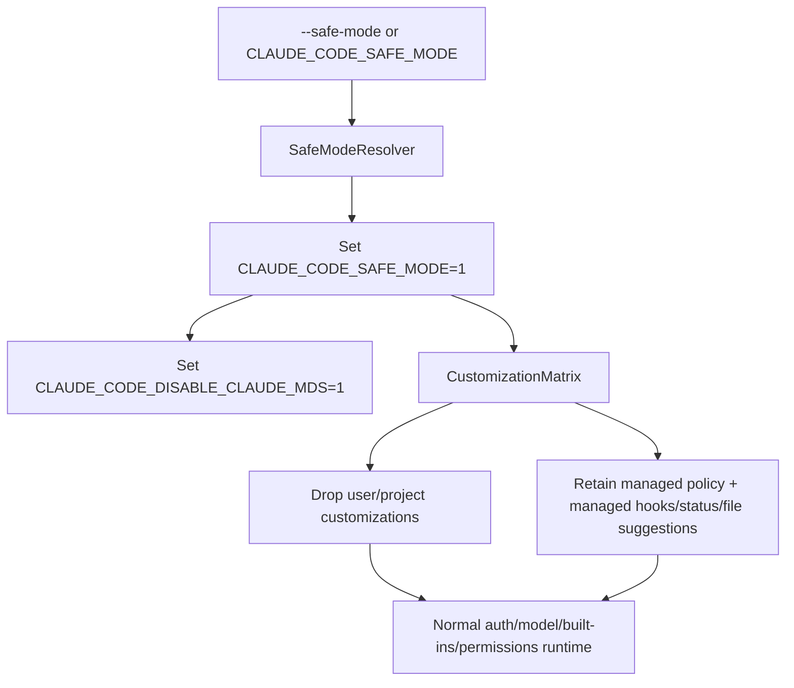

# Safe mode and recovery

Safe mode is Claude Code's configuration-isolation startup path. `--safe-mode` or `CLAUDE_CODE_SAFE_MODE` starts the normal authenticated agent runtime while suppressing user/project customizations that can break startup or tool assembly. It deliberately preserves managed policy, model/auth selection, built-in tools, and permission enforcement.

The flag, environment variable, centralized customization matrix, and startup banner are new relative to the retained `2.1.143` parent bundle.

## Source anchors

| Semantic alias | Approximate location in `cli.renamed.js` | Exact string or symbol | Meaning |
|---|---:|---|---|
| SafeModeResolver | [~16,252-16,260](../../claude-code-pkg/src/entrypoints/cli.renamed.js#L16252) | `xl`, `CLAUDE_CODE_SAFE_MODE`, `--safe-mode` | Resolves process-wide safe-mode state and restart guidance. |
| ManagedHookBoundary | [~253,950](../../claude-code-pkg/src/entrypoints/cli.renamed.js#L253950) | `allowManagedHooksOnly || xl()` | Reduces settings-file hooks to the managed-policy set. |
| CustomizationMatrix | [~260,268-260,330](../../claude-code-pkg/src/entrypoints/cli.renamed.js#L260268) | `Yu`, `hvg` | Central switch for CLAUDE.md, skills, workflows, plugins, MCP, agents, themes, and related customizations. |
| SafeModeBanner | [~774,206](../../claude-code-pkg/src/entrypoints/cli.renamed.js#L774206) | `Safe mode: all customizations are disabled` | Persistent interactive warning and managed-policy caveat. |
| MCPStartupFilter | [~931,597](../../claude-code-pkg/src/entrypoints/cli.renamed.js#L931597) | `D5f` | Keeps only host/SDK-typed dynamic MCP configs and drops other MCP servers. |
| StartupMutation | [~932,410](../../claude-code-pkg/src/entrypoints/cli.renamed.js#L932410) | `CLAUDE_CODE_SAFE_MODE = "1"`, `CLAUDE_CODE_DISABLE_CLAUDE_MDS = "1"` | Canonicalizes the environment and disables CLAUDE.md loading early. |
| RootFlagHelp | [~958,429](../../claude-code-pkg/src/entrypoints/cli.renamed.js#L958429) | `Start with all customizations ... disabled` | User-facing contract for recovery startup. |

## Startup call path

The CLI flag and environment variable are equivalent inputs. Once active, startup writes `CLAUDE_CODE_SAFE_MODE=1` back into the environment so covered child/self-spawn paths see the same mode. It also sets the CLAUDE.md hard-disable before system context is assembled.

## Suppression matrix

The `Yu()` helper is the central “skip customization?” decision. In safe mode it suppresses these source families:

| Suppressed family | Consequence |
|---|---|
| `claudeMd` and auto-memory | User/project/local CLAUDE.md, rules, and memory files are not loaded into context. Managed policy text remains a separate policy surface. |
| `skills`, custom commands, and `workflows` | User/project/plugin skill and workflow loading is disabled; built-in runtime commands remain. |
| `plugins` and plugin monitors | Plugin registration, plugin hooks, plugin MCP, and related customizations are skipped. |
| MCP discovery/integrations | Auto-discovered, claude.ai, agent-frontmatter, plugin, and ordinary dynamic MCP configuration is dropped. Dynamic startup input is filtered to entries explicitly typed `sdk`; this preserves host wiring, not ordinary user MCP customization. |
| custom `agents` | Settings/frontmatter agents and `--agents` JSON are ignored. Built-in agent/runtime machinery remains available where otherwise supported. |
| output styles, themes, syntax languages, keybindings, LSP | Custom presentation/editor integration layers do not load. Edits can still be saved for the next normal restart. |

## Managed-policy boundary

Safe mode is **not** “ignore all configuration.” The runtime continues to apply admin-managed settings and security policy. In the central `hvg` matrix, only `hooks`, `statusLine`, and `fileSuggestion` are exception categories; their resolvers then constrain surviving values to managed policy. In particular:

- `Bzi()` returns only managed settings-file hooks;
- `Bxt()` resolves the status line to the managed value, and `cQn()` resolves file suggestions to managed policy after its trust/disable checks;
- permission modes, allow/deny policy, sandbox rules, model restrictions, and authentication continue normally;
- the banner explicitly notes that managed policy applies even though managed plugins, skills, CLAUDE.md, and MCP servers are not loaded as customizations.

Other runtime-owned hook machinery can still exist outside the settings-file collection, but safe mode does not restore user/project/plugin settings hooks. This distinction is why safe mode is a diagnostic isolation boundary rather than a hook-free alternate engine.

## What remains active

The root help text explicitly preserves:

- authentication and account state;
- model selection/provider resolution;
- built-in tools;
- normal permission checks.

Session/transcript machinery and the core interactive/headless loop also continue. Safe mode therefore lets an operator inspect files, run built-in diagnostics, edit a broken settings file, or disable a bad customization without granting broader execution rights.

## Recovery workflow

1. Start with `--safe-mode` (or set `CLAUDE_CODE_SAFE_MODE`).
2. Confirm the persistent Safe mode banner is present.
3. Inspect `/status`, `/doctor`, settings, plugin/MCP config, CLAUDE.md, skills, agents, themes, or keybindings as appropriate.
4. Make the minimal correction. UI flows warn that edits save but do not load into the current safe-mode session.
5. Restart without `--safe-mode`, or unset `CLAUDE_CODE_SAFE_MODE`, to test normal loading.

The runtime exposes `Rw()` specifically to render the correct restart instruction for the activation source.

## Caveats

- Safe mode does not bypass permissions, managed policy, sandboxing, workspace trust, provider restrictions, or authentication.
- It is broader than `--bare`/`CLAUDE_CODE_SIMPLE`; the two modes have separate suppression matrices and different intended uses.
- A host/SDK may retain explicitly SDK-typed MCP wiring needed to run the hosted session, even though ordinary MCP customization is disabled.
- Saved configuration changes intentionally take effect only after safe mode is turned off and the process restarts.

## Related docs

- [Command-line reference](../01-runtime-lifecycle/command-line-reference.md)
- [Settings, policy, and integrations](../03-tools-integrations-security/settings-policy-and-integrations.md)
- [Settings schema reference](../03-tools-integrations-security/settings-schema-reference.md)
- [Updater and doctor](updater-and-doctor.md)
- [Environment variables reference](environment-variables-reference.md)
- [Accessibility and screen-reader mode](../01-runtime-lifecycle/accessibility-and-screen-reader-mode.md)