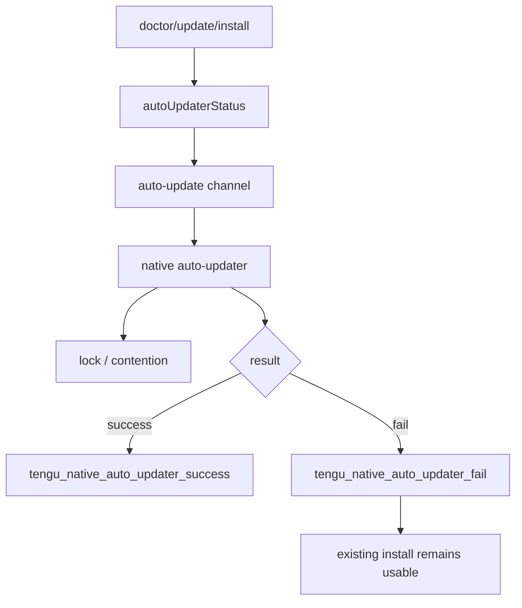

# Updater and doctor

This page owns the user-facing maintenance command surface: `doctor`, `update`/`upgrade`, `install`, native auto-updater state, update failure modes, and hosted/remote operational preflight signals.

Use [Diagnostics and debug logs](diagnostics-and-debug-logs.md) for local log/debug evidence, [Telemetry and tracing](telemetry-and-tracing.md) for emitted telemetry/export sinks, and [Feature gates reference](feature-gates-reference.md) for updater-related gates.

## Source anchors

| Semantic alias | String or symbol | Meaning |
| --- | --- | --- |
| NativeUpdaterStartEvent | `tengu_native_auto_updater_start` | Updater entry telemetry. |
| NativeUpdaterLockContentionEvent | `tengu_native_auto_updater_lock_contention` | Updater lock/contention telemetry. |
| NativeUpdaterFailureLog | `Native auto-updater failed` | Native updater failure logging path. |
| NativeUpdaterFailureEvent | `tengu_native_auto_updater_fail` | Updater failure classification. |
| NativeUpdaterSuccessEvent | `tengu_native_auto_updater_success` | Updater success telemetry. |
| AutoUpdateReleaseChannel | `auto-update` (`latest`, `stable`, `rc`) | Settings-driven release channel selection. |
| UpdaterPermissionPreflight | `Insufficient permissions for auto-updates` | Doctor-style updater permission preflight. |
| AutoUpdaterStatusMachine | `autoUpdaterStatus`: `migrated`, `installed`, `disabled`, `enabled` | Updater install-kind/state machine. |
| DoctorDiagnosticsScreen | `/doctor diagnostics screen` | Interactive diagnostics/doctor surface. |
| DoctorCommand | `H.command("doctor")` | Auto-updater health check command. |
| UpdateCommandFamily | `H.command("update").alias("upgrade")` | Update/upgrade command family. |

## Command surface

| Command | Role |
|---|---|
| `doctor` | Runs diagnostics/health checks, including auto-updater and environment preflights. |
| `update` / `upgrade` | Checks for updates and installs when available. |
| `install [target]` | Installs a stable/latest/specific native build. |
| `ultrareview [target]` | Cloud-hosted multi-agent review preflight and execution path; operationally adjacent but owned by agents/automation. |

## Native updater model

| Updater concern | Observable evidence | Interpretation |
|---|---|---|
| State | `autoUpdaterStatus`: `migrated`, `installed`, `disabled`, `enabled` | Runtime tracks install/update status separately from normal model turns. |
| Channel | `auto-update` with `latest`, `stable`, `rc` | Settings can shape release channel. |
| Locking | `tengu_native_auto_updater_lock_contention` | Multiple invocations are coordinated; a second updater should not race the first. |
| Failure | `Native auto-updater failed`, `tengu_native_auto_updater_fail` | Failures are classified/logged while preserving existing install usability. |
| Success | `tengu_native_auto_updater_success` | Successful update path emits operational evidence. |

## Doctor behavior

The `doctor` command is the canonical user-facing diagnostics surface. It can check updater state and environment issues; the older mixed ops docs noted that `doctor` also warns that workspace trust is skipped and stdio MCP servers from `.mcp.json` may be spawned for health checks.

Use [Diagnostics and debug logs](diagnostics-and-debug-logs.md) for the log/debug evidence generated around these checks.

## Hosted review and operational preflights

The bundle also includes hosted multi-agent review strings and preflight calls around `ultrareview`, plus remote-session tokens documented in the sessions chapter. Those surfaces are operationally related because they use cloud/hosted control planes rather than only local TUI state.

## Failure modes

| Failure | Behavior |
|---|---|
| Updater times out, checksum fails, or binary not found | Classified failure event emitted; existing install remains usable. |
| Updater lock already held by another process | Lock-contention event; no second updater runs. |
| Auto-update permissions are insufficient | Doctor-style preflight reports a fix-up message instead of silently failing. |
| Hosted review preflight rejects | UX surfaces the result; local workflow is not blocked. |

## Related docs

- [Diagnostics and debug logs](diagnostics-and-debug-logs.md)
- [Telemetry and tracing](telemetry-and-tracing.md)
- [Feature gates reference](feature-gates-reference.md)
- [Command-line reference](../01-runtime-lifecycle/command-line-reference.md)
- [Agents, tasks, and subagents](../06-agents-automation/agents-tasks-and-subagents.md)
- [Operations and native-support architecture](architecture.md)
