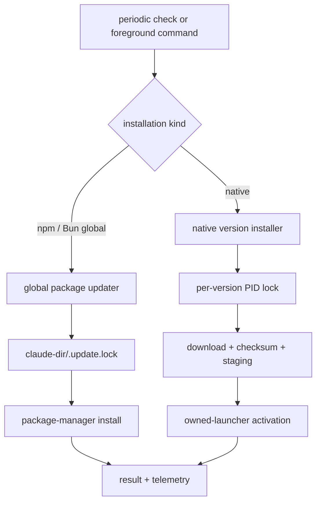

# Updater and doctor

This page owns the user-facing maintenance command surface: `doctor`, `update`/`upgrade`, `install`, native auto-updater state, update failure modes, and hosted/remote operational preflight signals.

Use [Diagnostics and debug logs](diagnostics-and-debug-logs.md) for local log/debug evidence, [Telemetry and tracing](telemetry-and-tracing.md) for emitted telemetry/export sinks, and [Feature gates reference](feature-gates-reference.md) for updater-related gates.

## Source anchors

| Semantic alias | String or symbol | Meaning |
| --- | --- | --- |
| NativeUpdaterStartEvent | `tengu_native_auto_updater_start` | Updater entry telemetry. |
| NativeUpdaterLockContentionEvent | `tengu_native_auto_updater_lock_contention` | Updater lock/contention telemetry. |
| NativeUpdaterFailureLog | `Native auto-updater failed` | Native updater failure logging path. |
| NativeUpdaterFailureEvent | `tengu_native_auto_updater_fail` | Updater failure classification. |
| NativeUpdaterSuccessEvent | `tengu_native_auto_updater_success` | Updater success telemetry. |
| AutoUpdateReleaseChannel | `auto-update` (`latest`, `stable`, `rc`) | Settings-driven release channel selection. |
| UpdaterPermissionPreflight | `Insufficient permissions for auto-updates` | Doctor-style updater permission preflight. |
| AutoUpdaterStatusMachine | `autoUpdaterStatus`: `migrated`, `installed`, `disabled`, `enabled` | Updater install-kind/state machine. |
| DoctorDiagnosticsScreen | `/doctor diagnostics screen` | Interactive diagnostics/doctor surface. |
| DoctorCommand | `H.command("doctor")` | Read-only installation/settings diagnostics command. |
| UpdateCommandFamily | `H.command("update").alias("upgrade")` | Update/upgrade command family. |
| InteractiveDoctorSkill | `Health-check my Claude Code setup and fix what's wrong` | Bundled `/doctor` (`/checkup`) skill that diagnoses and proposes fixes. |

## Command surface

| Command | Role |
|---|---|
| `claude doctor` | Non-interactive installation/settings health check. It reads settings in the current directory without a trust prompt. |
| `/doctor` / `/checkup` | Full interactive setup checkup that can diagnose, explain, and apply approved fixes. |
| `update` / `upgrade` | Checks for updates and installs when available. |
| `install [target]` | Installs a stable/latest/specific native build. |
| `ultrareview [target]` | Cloud-hosted multi-agent review preflight and execution path; operationally adjacent but owned by agents/automation. |

## Update execution model

```mermaid
flowchart TD
    Trigger[periodic check or foreground command] --> Kind{installation kind}
    Kind -->|npm / Bun global| Global[global package updater]
    Kind -->|native| Native[native version installer]
    Global --> GlobalLock[claude-dir/.update.lock]
    Native --> VersionLock[per-version PID lock]
    GlobalLock --> GlobalInstall[package-manager install]
    VersionLock --> Stage[download + checksum + staging]
    Stage --> Activate[owned-launcher activation]
    GlobalInstall --> Result[result + telemetry]
    Activate --> Result
```

Periodic checks begin from the interactive updater component and repeat every 30 minutes. By contrast, `claude update`/`upgrade` and `claude install` are foreground commands: they await version checks, downloads, and filesystem work before returning. “Outside the model loop” therefore does not mean “never blocks the invoking CLI.”

### Global npm/Bun updater

The global-package path uses `<claude-dir>/.update.lock`:

- acquisition writes the current PID with exclusive `wx` creation;
- a lock younger than five minutes is treated as live;
- stale removal is rechecked before unlinking;
- release removes the file only when its contents still equal the current PID;
- contention returns `{ status: "in_progress" }` and does not wait indefinitely or start a second package-manager install;
- the lock is released in `finally`.

On bundled Windows package layouts, the updater can rename executable paths aside before running the global install. If installation fails, it first attempts to rename each preserved executable back, then attempts a copy-based restore. If both operations fail, it keeps the renamed file and records `{ originalPath, preservedPath }` so the UI can tell the user where the old bytes remain. This is a specific Windows recovery path, not a guarantee that every package-manager or filesystem failure preserves a runnable launcher.

### Native version installer

The native path is versioned rather than package-manager based:

1. `installLatest()` coalesces callers within one process onto a single in-flight promise.
2. The running native version takes a lifetime PID lock; a candidate version must acquire its own lock before installation.
3. The release binary is streamed to a staging path and checked against the release SHA-256 before it is made executable or installed.
4. Copy/chmod/rename activation uses bounded retries (`100`, `500`, and `2000` ms) for selected file-lock errors.
5. Unix activation swaps an owned launcher symlink atomically. An existing launcher whose ownership cannot be established is not overwritten.
6. Windows activation renames the old launcher, copies the new executable, and attempts to restore the old one if copying fails.
7. Lock acquisition failure returns `lockFailed: true`; that invocation does not perform a destructive partial activation.

The downloaded version and active launcher are separate states. If launcher activation is refused or fails, the old launcher can remain active while the candidate version stays installed. Cleanup protects the running version, launcher target, and any locked versions; among other unlocked historical versions it retains the two newest. Cleanup is skipped when launcher ownership is unknown.

| Updater concern | Source-confirmed result |
|---|---|
| State/channel | `autoUpdaterStatus` and `auto-update` (`latest`, `stable`, `rc`) shape checks separately from model turns. |
| Global contention | Returns `status: "in_progress"` and emits lock-contention telemetry. |
| Native contention | Returns `lockFailed: true` and emits native lock-contention telemetry. |
| Candidate integrity | A checksum mismatch removes/rejects the partial candidate before activation. |
| Unknown launcher | Native activation refuses to overwrite it. |
| Success/failure | `tengu_native_auto_updater_success` / `tengu_native_auto_updater_fail` record the applicable native outcome. |

## Doctor behavior

The terminal `claude doctor` command is the non-interactive, read-only installation/settings surface. Its registered description explicitly says that it reads current-directory settings without a trust prompt and directs users to `/doctor` for a full checkup that can also fix issues.

The handler gathers the installation type, version and path, invoked binary, configuration method, search status, update state/channel, and last update result. It reports invalid settings, problematic environment variables, multiple installations, Remote Control checks, installation warnings, and PATH/launcher issues. The traced handler renders diagnostics and recommendations; it does not itself apply the interactive fixes.

The in-session `/doctor` (alias `/checkup`) is broader. Its bundled prompt at approximately `cli.renamed.js:886764` checks installation health, stale/context-heavy extensions, duplicated local versus checked-in memories, oversized checked-in `CLAUDE.md`, opportunities to move always-loaded guidance into lazy skills/nested instructions, slow hooks, installed-version freshness, auto mode as the default permission mode, and frequently denied read-only commands. Proposed edits or setting changes still require normal tool permissions.

This distinction matters: `claude doctor` is a deterministic CLI diagnostic; `/doctor` is an agent-assisted repair workflow over the current project and user configuration. Any `/doctor` edit or setting change still follows normal tool-permission rules.

When a customization prevents normal startup or makes `/doctor` unusable, [safe mode](safe-mode-and-recovery.md) is the recovery envelope: it keeps auth, models, built-in tools, permissions, and managed policy active while suppressing project/user CLAUDE.md, plugins, MCP servers, skills, agents, workflows, themes, keybindings, and related customizations. Repairs save normally but are intentionally tested only after restarting without safe mode.

Use [Diagnostics and debug logs](diagnostics-and-debug-logs.md) for the log/debug evidence generated around these checks.

## Hosted review and operational preflights

The bundle also includes hosted multi-agent review strings and preflight calls around `ultrareview`, plus remote-session tokens documented in the sessions chapter. Those surfaces are operationally related because they use cloud/hosted control planes rather than only local TUI state.

## Failure modes

| Failure | Behavior |
|---|---|
| Global updater lock held by another process | Returns `in_progress`; no second package-manager install starts. |
| Native version lock cannot be acquired | Returns `lockFailed`; no candidate activation starts for that invocation. |
| Native download stalls, checksum mismatches, or connection drops | Download retry/cleanup logic rejects the partial candidate before launcher activation. |
| Native launcher is not owned by Claude Code | Activation is refused; the external launcher is not overwritten. |
| Windows global install fails after executables were renamed | Rename restore is attempted, then copy restore; if both fail, the preserved path is surfaced. |
| Native launcher activation fails | The candidate may remain installed while the previous launcher remains active; exact preservation is path- and failure-specific. |
| Auto-update permissions are insufficient | Doctor-style preflight reports a fix-up message instead of silently failing. |
| Hosted review preflight rejects | UX surfaces the result; local workflow is not blocked. |

## Related docs

- [Diagnostics and debug logs](diagnostics-and-debug-logs.md)
- [Telemetry and tracing](telemetry-and-tracing.md)
- [Feature gates reference](feature-gates-reference.md)
- [Safe mode and recovery](safe-mode-and-recovery.md)
- [Command-line reference](../01-runtime-lifecycle/command-line-reference.md)
- [Agents, tasks, and subagents](../06-agents-automation/agents-tasks-and-subagents.md)
- [Operations and native-support architecture](architecture.md)
