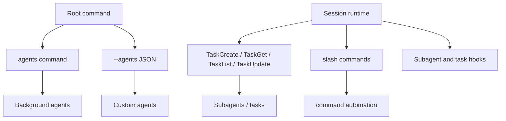

# Agents and automation

This chapter documents the agent/task automation layer: custom agents, background agents, task tool constants, subagent lifecycle hooks, slash-command automation, `ultrareview`, and `auto-mode`.

Read this chapter when the question is: **how does Claude Code delegate work, run subagents, or automate runtime behavior?**

## Source-anchor policy

This page is a chapter guide. Linked implementation pages carry concrete `cli.renamed.js` anchors.

| Semantic alias | Minified anchor | Scope |
|---|---|---|
| Agents/automation chapter | N/A — navigation page | Groups custom agents, background agents, task tools, subagent hooks, slash commands, and automation commands. |
| Agent implementation pages | See linked source-anchor tables | Concrete bundle anchors live in destination pages. |

## Automation map

## Primary reading order

| Order | Page | Automation question answered |
|---:|---|---|
| 1 | [Agents, tasks, and subagents](agents-tasks-and-subagents.md) | Which command/flag/tool/hook surfaces define custom agents, tasks, background agents, and hosted review, and how do `TaskCreate`/`TaskGet`/`TaskList`/`TaskUpdate`, subagent hooks, cron scheduling, and `ultrareview` preflight work? |
| 2 | [Agent runtime, scheduling, and completion](agent-runtime-scheduling-and-completion.md) | How are agent families designed, how are tasks scheduled, how is completion detected, and how do timed/cron tasks work? |
| 3 | [Slash commands and automation](slash-commands-and-automation.md) | Which slash-command, hook, skill, and auto-mode surfaces automate behavior around the main session? |
| 4 | [Agent and automation architecture](architecture.md) | How are custom agents, tasks, slash commands, `auto-mode`, and hosted review orchestrated over the same runtime without parallel loops? |

## Handoffs

- Custom-agent prompt/context inputs are documented in [Context and model loop](../02-context-model-loop/README.md).
- Tool permissions and hooks are documented in [Tools, integrations, and security](../03-tools-integrations-security/README.md).
- Remote/hosted session state is documented in [Sessions, persistence, and remote](../04-sessions-persistence-remote/README.md).
- Task/agent communication protocol families are summarized in [Runtime communication protocols](../00-start-here/runtime-communication-protocols.md).

## Navigation

- [Start here](../00-start-here/README.md)
- [Full table of contents](../SUMMARY.md)
