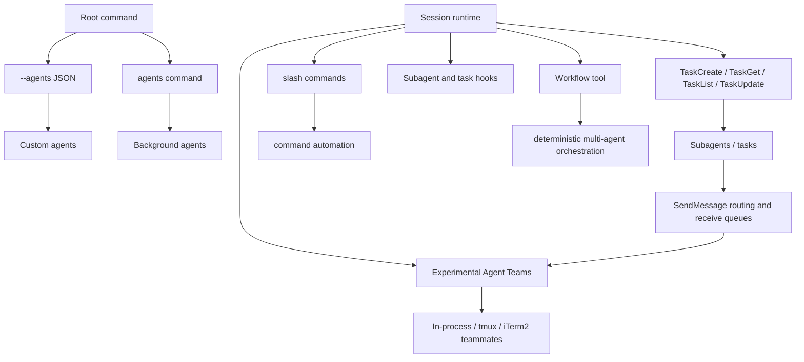

# Agents and automation

This chapter documents the agent/task automation layer: custom agents, background-by-default subagents, worktree isolation, cross-agent messaging, experimental Agent Teams and observer agents, background sessions, deterministic dynamic workflows, task tools, lifecycle hooks, slash-command automation, `ultrareview`, and `auto-mode`.

Read this chapter when the question is: **how does Claude Code delegate work, run subagents, or automate runtime behavior?**

## Source-anchor policy

This page is a chapter guide. Linked implementation pages carry concrete `cli.renamed.js` anchors.

| Semantic alias | Minified anchor | Scope |
|---|---|---|
| Agents/automation chapter | N/A — navigation page | Groups custom agents, background agents, task tools, subagent hooks, slash commands, and automation commands. |
| Agent implementation pages | See linked source-anchor tables | Concrete bundle anchors live in destination pages. |

## Automation map

```mermaid
flowchart TD
    Root[Root command] --> AgentsCmd[agents command]
    Root --> AgentsFlag[--agents JSON]
    Runtime[Session runtime] --> TaskTools[TaskCreate / TaskGet / TaskList / TaskUpdate]
    Runtime --> Slash[slash commands]
    Runtime --> Hooks[Subagent and task hooks]
    AgentsFlag --> Custom[Custom agents]
    AgentsCmd --> Background[Background agents]
    TaskTools --> Subagents[Subagents / tasks]
    Subagents --> Messages[SendMessage routing and receive queues]
    Runtime --> Teams[Experimental Agent Teams]
    Messages --> Teams
    Teams --> Teammates[In-process / tmux / iTerm2 teammates]
    Slash --> Automation[command automation]
    Runtime --> Workflow[Workflow tool]
    Workflow --> Orchestration[deterministic multi-agent orchestration]
```

## Primary reading order

| Order | Page | Automation question answered |
|---:|---|---|
| 1 | [Agents, tasks, and subagents](agents-tasks-and-subagents.md) | Which built-in/native agent roles exist, what are they for, and how does `Agent` resolve its model, run concurrency-safe calls in parallel, choose foreground/background/isolation, and coexist with task tools and hooks? |
| 2 | [Worktree isolation and handoffs](worktree-isolation-and-handoffs.md) | How do session-wide `EnterWorktree`/`ExitWorktree`, per-Agent isolation, background edit guards, hooks/Git backends, locks, persistence, resume, and safe cleanup compose? |
| 3 | [Agent messaging and communication](agent-messaging.md) | How does `SendMessage` resolve a recipient and route through an Agent queue, team mailbox, main queue, local socket, or cloud API; when does the receiver see it; and how do acknowledgement, reply, and completion differ? |
| 4 | [Agent Teams](agent-teams.md) | How does the gated implicit team spawn named teammates, choose in-process/tmux/iTerm2 backends, coordinate through locked roster/task/inbox files, forward permissions, stop, clean up, and narrowly resume evicted workers? |
| 5 | [Observer agents](observer-agents.md) | How do agent declarations auto-spawn read-only observers, persist pairings, deliver digests, and route one-way `ObserverReport` messages? |
| 6 | [Agent runtime, scheduling, and completion](agent-runtime-scheduling-and-completion.md) | How do Agent launch, task claiming, `now`/`next`/`later` steering, TUI/SDK interruption, cancellation, completion, and cron injection compose? |
| 7 | [Dynamic workflows](dynamic-workflows.md) | How does `Workflow` schedule `parallel`/`pipeline` agents through a FIFO concurrency limiter with shared model, effort, budget, abort, progress, and journal state? |
| 8 | [Slash commands and automation](slash-commands-and-automation.md) | How are core, bundled, plugin, workflow, filesystem, and MCP commands assembled and filtered; how do `/btw`, `/goal`, `/autofix-pr`, and `/ultraplan` isolate, resume, or hand off work; and which bundled workflow families have independent control flow? |
| 9 | [Cron and scheduled tasks](cron-and-scheduled-tasks.md) | How do `/loop`, cron tools, wakeups, persistence, and missed-task handling inject later work? |
| 10 | [Agent and automation architecture](architecture.md) | How are custom agents, teams, tasks, workflows, slash commands, `auto-mode`, and hosted review orchestrated over the same runtime? |

## Handoffs

- Custom-agent prompt/context inputs are documented in [Context and model loop](../02-context-model-loop/README.md).
- Tool permissions and hooks are documented in [Tools, integrations, and security](../03-tools-integrations-security/README.md).
- Remote/hosted session state is documented in [Sessions, persistence, and remote](../04-sessions-persistence-remote/README.md).
- Local-history analysis and hosted onboarding-guide sharing are documented in [Team onboarding and share flows](../04-sessions-persistence-remote/team-onboarding-and-share-flows.md).
- Task/agent communication protocol families are summarized in [Runtime communication protocols](../00-start-here/runtime-communication-protocols.md).

## Navigation

- [Start here](../00-start-here/README.md)
- [Full table of contents](../SUMMARY.md)
