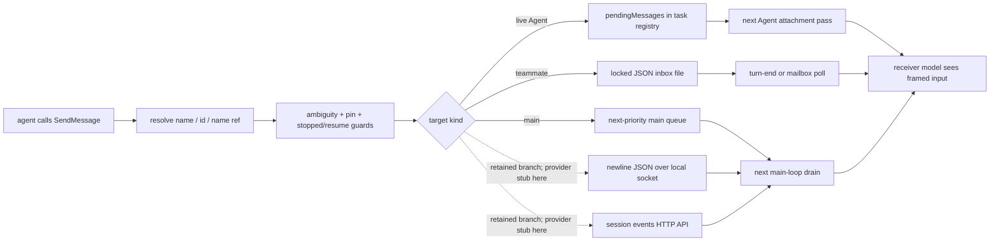
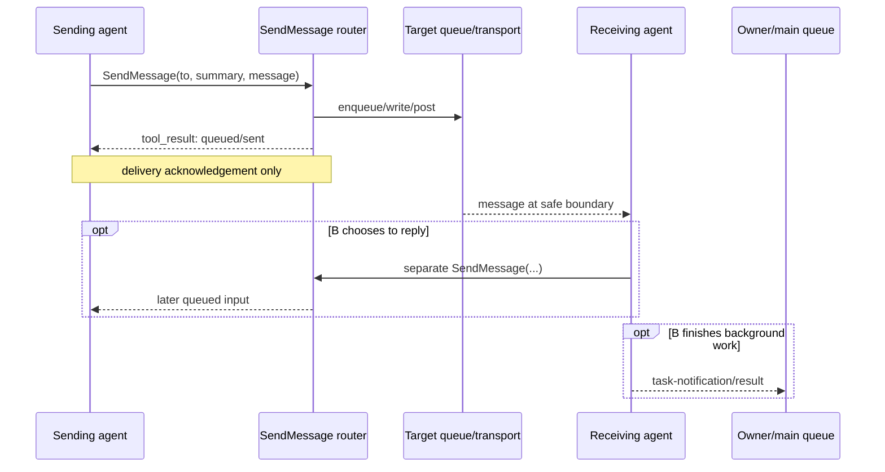

# Agent messaging and communication

Claude Code agents do not share one universal chat bus. `SendMessage` is a **recipient router**: it resolves a name or reference, applies identity and resume guards, then hands the payload to the transport owned by that target. The receiver sees the message only at a safe model-loop boundary; the runtime never mutates an in-flight provider request.

This page reconstructs the message path in `@anthropic-ai/claude-code@2.1.215`. It unifies ordinary Agent steering, Agent Teams mailboxes, main-conversation insertion, local/cloud peer sessions, completion notifications, and the observer channel without replacing their detailed owner pages.

## Short answer



A successful `SendMessage` tool result means the message was **queued, written, or accepted by the target transport**. It is not an acknowledgement that the recipient model read it, acted on it, or replied. Replies are separate messages, and background-Agent completion normally returns through a separate `task-notification` path.

One exact-build caveat matters: the dispatcher contains complete `local-session` and `cloud-session` branches, but the candidate providers it actually calls in this retained artifact are stubs — `Efo()` returns `[]`, and `r7r()` returns `{sessions:[], unavailable:undefined}`. Separate local/cloud discovery implementations exist elsewhere in the bundle, but they are not wired into this `SendMessage` resolver. The peer rows below therefore document implemented route code, not a claim that normal standalone name resolution reaches it in `2.1.215`.

## Source anchors

| Semantic alias | Approximate location in `cli.renamed.js` | Exact string or symbol | Meaning |
|---|---:|---|---|
| MainPriorityQueue | [~256,890](../../claude-code-pkg/src/entrypoints/cli.renamed.js#L256890) | `OQn = { now: 0, next: 1, later: 2 }`, `CSg()` | Stores main-thread prompts/notifications by priority. |
| CrossSessionEnvelope | [~333,549–334,856](../../claude-code-pkg/src/entrypoints/cli.renamed.js#L333549) | `sso()`, `Cso()`, `sendToUdsSocket()` | Frames peer input and sends local-session events over a local socket. |
| TeammateMailboxStore | [~341,330–341,975](../../claude-code-pkg/src/entrypoints/cli.renamed.js#L341330) | `writeToMailbox()`, `readUnreadMessages()`, `markMessagesAsRead()` | Locked, atomically rewritten per-recipient JSON-array inboxes. |
| InProcessTeammatePoller | [~391,849](../../claude-code-pkg/src/entrypoints/cli.renamed.js#L391849) | `w7g()`, `hju()`, `S7g = 500` | Consumes pending user input, mailbox frames, and shared tasks while idle. |
| RecipientResolver | [~413,000–413,585](../../claude-code-pkg/src/entrypoints/cli.renamed.js#L413000) | `vfo()`, `Hms()`, `Sfo()`, `s6u()` | Resolves main, Agent, teammate, local-session, cloud-session, ambiguity, and pins. |
| PeerCandidateProviders | [~412,984, ~413,481](../../claude-code-pkg/src/entrypoints/cli.renamed.js#L412984) | `r7r()`, `Efo()` | Both return empty candidate sets in this build; peer route variants remain in the resolver/dispatcher. |
| SeparatePeerDiscovery | [~334,994, ~418,965](../../claude-code-pkg/src/entrypoints/cli.renamed.js#L334994) | `listAllLiveSessions()`, `listLivePeerSessions()`, `listBridgePeerSessions()` | Concrete discovery functions used by other surfaces; no call from `vfo()` in this artifact. |
| ResumeGuards | [~413,612–414,470](../../claude-code-pkg/src/entrypoints/cli.renamed.js#L413612) | `c6u()`, `ResumeAgentStateError`, `AgentStoppedByUserError` | Rebuilds resumable recipients but preserves explicit user stops. |
| ObserverReportTool | [~413,761](../../claude-code-pkg/src/entrypoints/cli.renamed.js#L413761) | `ObserverReport` | One-way observer report to the paired main conversation or task. |
| SendMessageRouter | [~419,614–420,280](../../claude-code-pkg/src/entrypoints/cli.renamed.js#L419614) | `SendMessageTool`, `agent-live`, `mailbox`, `local-session`, `cloud-session` | Public schema, validation, delivery branches, and tool-result acknowledgements. |
| PeerIsolationSetting | [~73,998, ~420,725](../../claude-code-pkg/src/entrypoints/cli.renamed.js#L73998) | `hasIsolatePeerMachines()`, `SendFile` | Adds approval to cross-session file transfer; it is not consulted by plain-text `SendMessage`. |
| AgentPendingQueue | [~434,301](../../claude-code-pkg/src/entrypoints/cli.renamed.js#L434301) | `y6e()`, `iho()` | Appends and atomically drains process-local Agent steering messages. |
| AgentCompletionNotification | [~434,320](../../claude-code-pkg/src/entrypoints/cli.renamed.js#L434320) | `ERt()`, `task-notification` | Sends terminal Agent state/results back to the owner/main queue. |
| PendingMessageAttachment | [~571,670](../../claude-code-pkg/src/entrypoints/cli.renamed.js#L571670) | `getAgentPendingMessageAttachments()` | Converts drained Agent messages into `queued_command` attachments. |
| InteractiveInboxPoller | [~910,450](../../claude-code-pkg/src/entrypoints/cli.renamed.js#L910450) | `lFf()`, `paS = 1000` | Routes lead/external-teammate inbox traffic, control frames, and busy-session buffering. |
| HeadlessLeadMailboxLoop | [~953,260](../../claude-code-pkg/src/entrypoints/cli.renamed.js#L953260) | `readUnreadMessages("team-lead", ...)` | Polls the lead inbox while headless teammates remain active. |

## `SendMessage` input contract

For a plain message, the model-visible shape is:

```json
{
  "to": "researcher",
  "summary": "request test review",
  "message": "Please review the failing authentication tests."
}
```

| Field | Rule |
|---|---|
| `to` | Name, raw Agent ID when needed, or a resolver-compatible `name [ref]`. A host/build that exposes `ListAgents` can print those references. Empty targets are rejected. |
| `summary` | Required and non-empty for string messages; maximum 200 characters. It is a UI/mailbox preview, not a separate hidden instruction. |
| `message` | Plain string normally. With Agent Teams enabled, the public object form also supports shutdown request/response and plan-approval response records. |

Additional validation boundaries:

- `to: "*"` broadcast is rejected; the sender must address each recipient separately.
- `to` cannot contain `@`; team names are not part of the public address because a session has one implicit team.
- Plain strings that parse as teammate permission/mode/plan/shutdown protocol frames are rejected. Lifecycle/task frames such as `idle_notification` and `task_assignment` also cannot be smuggled as ordinary text.
- `SendMessage` is unavailable from observer agents. Observers use `ObserverReport` only.
- Structured team-protocol objects are unavailable when Agent Teams is off and cannot be originated by an ordinary background subagent.

The tool's own permission check returns allow, but that authorizes **message delivery only**. The receiving agent still evaluates any later tool call through its own permission mode, rules, hooks, and sandbox boundary.

## Address resolution and identity safety

The bundle carries a `ListAgents` name and model-facing description, and `SendMessage` checks whether that tool is present, but this retained source contains no concrete `Ai({...})` definition for it. Treat the roster tool as a conditional/host-supplied surface rather than universally available.

`vfo()` resolves in fast paths followed by an indexed fallback:

1. Match reserved `main`, a raw/current Agent ID or exact registered name, then exact in-process teammate/team-roster names.
2. Try normalized exact teammate and Agent names.
3. For explicit `name [ref]`, build the complete available candidate index and select the matching reference.
4. Otherwise build that index, resolve an exact normalized name, then try a unique normalized prefix of at least three characters.

The index is designed to combine main, subagents, teammates, local sessions, and cloud sessions. In this exact artifact, however, its `Efo()` local and `r7r()` cloud providers are empty. `listLivePeerSessions()` and `listBridgePeerSessions()` are real implementations, but no wiring from those functions into `vfo()` was found.

The resolver does not silently pick among collisions. It returns up to three candidates and asks the sender to retry with `name [ref]`.

### Conversation pins

After an Agent or peer-session conversation is established, the runtime can pin normalized name → recipient identity. Subagent sends can include a `pin` in the successful tool result, and transcript rehydration rebuilds those pins. The retained local/cloud branches instead update process app state with `X6u()`; their tool results do not carry the same persisted `pin` object. If a pinned display name later points to a different recipient, `send_message_pin_guard` refuses the send rather than silently moving the conversation. The caller must explicitly select the new reference.

Team routing adds another check immediately before a structured send: the selected member ID must still exist in the current in-process team map or roster. This prevents a stale reference from reaching a different teammate that reused the display name.

### Stopped and evicted recipients

| Recipient state | Result |
|---|---|
| Live ordinary Agent | Queue for its next model/tool boundary. |
| Completed/failed/killed ordinary Agent without user-stop marker | Resume from retained transcript/metadata and deliver the message as the new prompt. |
| Explicitly stopped by the user | Refuse automatic resumption; treat the old work as cancelled. |
| Evicted in-process teammate with teammate metadata and an active team | Rebuild the teammate from transcript/metadata, discard stale structured mailbox frames, and use the message as its next prompt. |
| Missing/invalid transcript or metadata | Report a resume failure; do not invent an unrelated new identity. |

Concurrent sends to the same evicted teammate share an in-flight resume map. Once the teammate is running, later sends go to its mailbox rather than starting duplicate resumes.

## Target-by-target transport map

| Resolved target | Send transport | When it becomes model-visible | Send result means |
|---|---|---|---|
| `main` from a background Agent | Global main-thread queue, `mode:"prompt"`, priority `next`, meta input | Next main queue drain; it may fold at a safe continuation boundary | Enqueued for the main conversation. Main cannot send to itself. |
| Live ordinary Agent | `pendingMessages[]` on its task-registry record | `getAgentPendingMessageAttachments()` drains it into `queued_command` attachments during an upcoming Agent iteration/tool round | Queued in process, not read yet. |
| Stopped/evicted ordinary Agent | Transcript-backed `z_e()` resume path | First resumed turn or awaited resumed run | Resume started; when background tasks are disabled, the tool awaits completion and includes final text directly. |
| Agent Teams teammate | Locked JSON-array inbox file | In-process: turn-end check or 500 ms idle poll. External/interactive process: dedicated inbox poller. | Inbox write completed (or the tool reports failure). |
| Another local Claude session | Retained dispatcher branch: newline-delimited JSON user event over its local UDS/named-pipe endpoint | Receiver's `next`-priority input drain | Client socket write/close completed; no recipient-model acknowledgement. The normal candidate provider is empty here. |
| Cloud/Remote Control session | Retained dispatcher branch: HTTP session-events API with a cross-session user event | Remote session event ingestion/queue | Accepted HTTP response and message ID; not proof of processing. The normal candidate provider is empty here. |
| Observer's paired target | `ObserverReport`, not `SendMessage` | Main `next` queue or observed Agent pending queue | Report queued; channel is one-way. |

## Ordinary Agent steering

For a live local/background Agent, `SendMessage` calls `y6e()`:

1. Build `{text, origin, isMeta}`.
2. Append it to that task's `pendingMessages` array.
3. Continue the sender immediately with a tool result saying delivery is queued.
4. On a later Agent attachment pass, `iho()` returns the entire pending array and clears it from the task record.
5. `getAgentPendingMessageAttachments()` converts each item into a `queued_command` attachment with a fresh UUID.
6. The next Agent provider request receives those attachments as additional input.

This is cooperative steering. It does not cancel the recipient's current provider request or tool call. Several messages can be drained together on the next boundary.

When one Agent sends to another, the text is framed with sender identity and an origin record. The receiving prompt explicitly labels it as peer/coordinator traffic, not user input. Main-thread sends do not need the cross-session XML wrapper but still carry coordinator origin.

## Agent Teams mailbox delivery

Team messages use files so in-process and tmux/iTerm2 teammates share one transport:

```text
~/.claude/teams/<team>/inboxes/<recipient>.json
```

The top level is one JSON array, not JSONL. `writeToMailbox()`:

1. validates the outer envelope (`from`, string `text`, timestamp, optional summary/color);
2. creates `[]` if the inbox does not exist;
3. acquires `<inbox>.json.lock`;
4. rereads and validates the array;
5. appends `msgV`, `msg_id`, `type:"message"`, and `read:false`; and
6. atomically rewrites the whole array.

Structured control frames are serialized as JSON **inside the outer `text` string**. Ordinary content is formatted for the model as one or more `<teammate-message teammate_id="..." summary="...">` blocks, with conflicting close tags scrubbed.

### Receive cadence

| Receiver | Poll/transfer behavior |
|---|---|
| In-process teammate | Checks once at turn end, then every 500 ms while idle. `pendingUserMessages` is checked before the mailbox; a shutdown request is prioritized over older unread mailbox messages. |
| External pane teammate / interactive lead | Dedicated inbox poller runs every 1 second. If idle, it submits model-visible text immediately; if busy, it moves the messages into an in-memory inbox queue and submits them after the turn. |
| Headless team lead | While teammates remain active, checks the lead inbox every 500 ms, processes shutdown state, filters displayable frames, and enqueues the remainder as a prompt. |

Delivered entries are removed by locked atomic rewrite; the inbox does not retain a `read:true` archive. Interactive busy-session handling first transfers disk entries into process-local pending state, then removes them from disk.

### Structured mailbox frames

The internal mailbox protocol is broader than the public SendMessage object schema. It includes permission and sandbox requests/responses, plan approval, mode changes, shutdown, task assignment/completion, idle state, and termination signals. See [Agent Teams](agent-teams.md#internal-mailbox-protocol) for the complete frame table.

Control-like frames are role checked:

- only `team-lead` can resolve permission/sandbox requests, approve plans, or set teammate mode;
- a teammate accepts matching permission responses only when the outer envelope sender is `team-lead`;
- `team_permission_update` is always dropped; and
- unknown, stale, or peer-authored structured frames are removed and logged rather than becoming ordinary model prose.

## Main conversation and peer sessions

The peer subsections describe concrete transport implementations and dispatcher cases. They are source-visible but dormant behind empty `SendMessage` candidate providers in this standalone artifact. This is different from saying local IPC is unused globally: other background-session paths call `sendToUdsSocket()` directly.

### `to: "main"`

Only a background Agent can use `main` as a recipient. The runtime wraps peer identity when applicable and enqueues a meta prompt at `next` priority with slash-command expansion disabled. The active main request is not modified; the message is consumed at the next safe main-loop drain.

### Another local Claude session

`sendToUdsSocket()` constructs a user event with:

- a versioned message ID;
- `priority:"next"`;
- the sender's local socket address when its provider supplies one, plus its display title; and
- content wrapped as `<cross-session-message from="uds:..." from-name="...">...</cross-session-message>`.

It writes one newline-delimited JSON object to the recipient's local socket with a five-second send timeout. Socket close is treated as send completion; there is no application-level “model processed this” response on this path. The local sender-address helper `Qos()` returns `undefined` in this build, so the `from` attribute is omitted unless another variant supplies it; `from-name` can still carry the display title.

### Cloud or Remote Control session

`postInterClaudeMessage()` creates the same logical user event and posts it to the target session-events API. The request carries OAuth/organization/trusted-device headers where required and accepts HTTP 200/201/204 as delivery success.

The receiver sees a user-role event, but the wrapper and prompt framing state that it came from another Claude session. If the sender does not have an active Remote Control bridge, the tool result warns that the cloud delivery is one-way because the receiver cannot address a reply back to this session.

## Acknowledgement, reply, and completion are different



There are three independent return paths:

1. **Send acknowledgement** — immediate SendMessage tool result from the router.
2. **Peer reply** — a new SendMessage call made by the recipient, using the sender name/address from the received frame.
3. **Work completion** — synchronous Agent calls return a normal tool result; background Agents enqueue a `task-notification` containing status, output path, optional result text, usage, and worktree metadata.

For a stopped/evicted Agent when background tasks are disabled, `SendMessage` awaits the resumed run and includes its final text in the same tool result. That is the narrow case where delivery acknowledgement and completion are intentionally combined.

A task notification can occur more than once for the same task ID if the Agent is later resumed and stops again. An Agent's plain final assistant text is not automatically broadcast to teammates; it reaches its owner through the Agent result/notification lifecycle. Teammates additionally send `idle_notification` frames to the lead, but substantive peer coordination still uses SendMessage or shared tasks.

## Adjacent channels that are not peer chat

| Mechanism | Purpose |
|---|---|
| `TaskCreate` / `TaskUpdate` / shared task files | Shared status, ownership, and dependencies. Updating a task does not inject a message into a running model request. Assignment can emit a mailbox `task_assignment` frame. |
| `task-notification` | Completion/progress edge back to an owner/main queue; not an interactive reply. |
| `ObserverReport` | One-way advisory from an observer to its paired target. Observers cannot receive or send ordinary peer messages. |
| Workflow `agent()` return value | Final text returned synchronously to the restricted workflow script; Workflow does not use the Agent Teams roster/mailbox protocol. |
| Hooks (`SubagentStart`, `SubagentStop`, `TaskCreated`, `TaskCompleted`) | Lifecycle extension points. They observe or influence boundaries but are not an agent message transport. |

## Authority and prompt-injection boundary

An agent message is task direction, never user consent.

- The receiver's permissions are re-evaluated when it later calls a tool.
- Peer/cross-session input is wrapped and labeled as non-user traffic.
- A peer cannot authorize edits to permissions, `CLAUDE.md`, or configuration, or relay an action it was denied and thereby gain execution through another Agent.
- Structured team permission/plan/mode responses require both a matching request and an authorized outer sender.
- Plain text cannot masquerade as a structured protocol frame.
- Observer reports carry an explicit observer origin and cannot grant authority.
- `isolatePeerMachines` does not add an approval prompt to plain-text `SendMessage`; its source-visible checks belong to the disabled `SendFile` tool. This changes transport approval for files, not the authority of peer text.

This is why relaying “the user approved” through SendMessage does not clear another Agent's permission gate. User-approved privileged work must enter that Agent through a surface that actually carries user authority; a peer message does not.

## Ordering, durability, and failure guarantees

| Property | Source-confirmed boundary |
|---|---|
| In-flight mutation | None of these message paths edits a provider request already in flight. Delivery waits for queue, turn-end, or idle boundaries. |
| Ordering | Process-local Agent messages preserve append order within one pending drain. Mailbox writes serialize under a file lock and append to the reread array. Main `next` items share the priority queue's insertion order within that tier. |
| Broadcast | Not supported by SendMessage. |
| Identity | Names can be ambiguous/reused; references and pins prevent silent rebinding. |
| Delivery acknowledgement | Queue/write/socket/API acceptance only; not model consumption or action. |
| Exactly once | Not guaranteed. File locking prevents common same-host races, but queue drain, disk-to-memory handoff, process crashes, retries, and remote acceptance are not one atomic transaction. |
| Persistence | Team inboxes and Agent transcripts/metadata are disk-backed; process-local pending arrays and controllers are not durable by themselves. Clean Agent Teams exit removes the team directory. |
| Failure | Not-found/ambiguous/stale targets fail without guessing. Local socket/API errors are surfaced. Resume fails closed when transcript/metadata is unavailable. |

## Practical mental model

- When a host exposes `ListAgents`, use it to discover the current address, then send by name; use the shown reference when names collide. In this standalone artifact, rely on Agent spawn results and the active team roster instead of assuming a peer-session roster exists.
- Treat “queued” or “sent” as transport acknowledgement, not a reply.
- Expect a live Agent to read the message at its next tool/model boundary, not immediately.
- Use shared tasks for durable ownership/dependencies and SendMessage for prose coordination.
- Do not send approval authority through another Agent.
- Expect background completion through a task notification unless the Agent call was synchronous.

## Evidence limits

- The retained client establishes local routing, queue/file/socket/API framing, and receive-side insertion. It does not prove server-side scheduling latency or delivery after an accepted cloud request.
- File locks are same-host coordination, not distributed transactions.
- Provider behavior after a message becomes model-visible is outside the transport implementation.
- The local/cloud SendMessage cases are implemented but not normally discoverable from this exact artifact because `Efo()`/`r7r()` are stubs. A different host/build may supply the roster described by the retained `ListAgents` prompt; that integration is not proved here.
- `source-atlas/` was intentionally left untouched: no package-version comparison was requested, and the retained readable bundle supplied the enclosing control flow.

## Related docs

- [Agents, tasks, and subagents](agents-tasks-and-subagents.md)
- [Agent Teams](agent-teams.md)
- [Agent steering, interruption, and completion](agent-steering-interruption-and-completion.md)
- [Observer agents](observer-agents.md)
- [Dynamic workflows](dynamic-workflows.md)
- [Runtime communication protocols](../00-start-here/runtime-communication-protocols.md)
- [Session resume and transcripts](../04-sessions-persistence-remote/session-resume-and-transcripts.md)
- [Remote control and teleport](../04-sessions-persistence-remote/remote-control-and-teleport.md)
