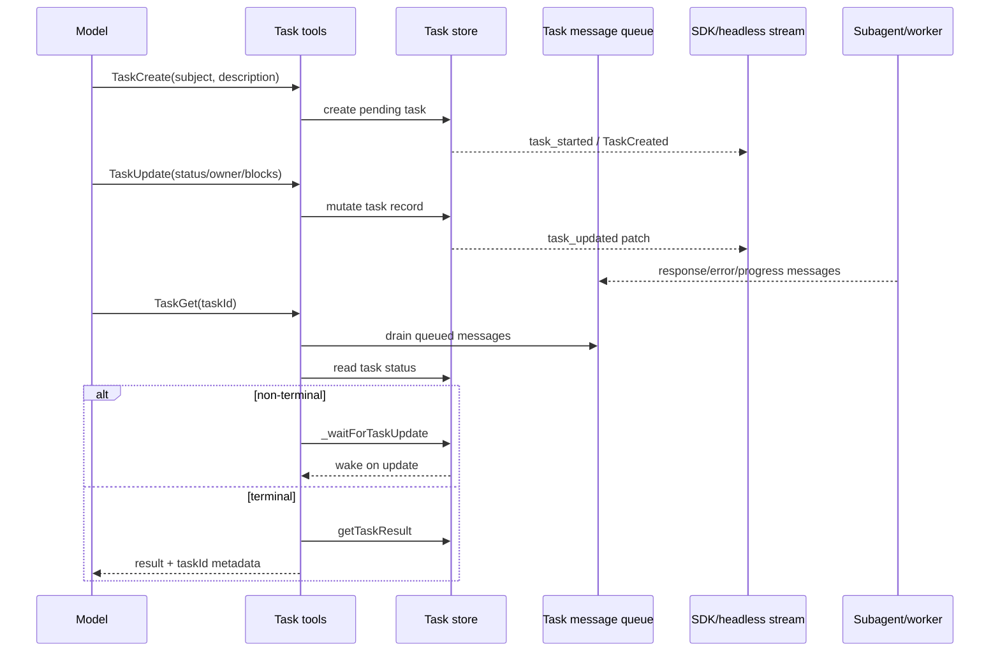

# Agent runtime, scheduling, and completion

This page answers the agent/task part of the `cli.renamed.js` analysis: **how the agent system is designed, which agent families exist, how tasks are scheduled, which patterns are used, how completion is detected, what is unusual about the runtime, and whether timed tasks exist.**

It complements [Agents, tasks, and subagents](agents-tasks-and-subagents.md), [Slash commands and automation](slash-commands-and-automation.md), and [Agent and automation architecture](architecture.md). Those pages list individual tools/commands; this page focuses on scheduling and lifecycle mechanics.

## Short answer

- The agent system is **orchestration over the existing session runtime**, not a second runtime. Agents/subagents reuse the same context loop, tool permission boundary, hooks, JSONL session storage, and telemetry/debug surfaces.
- The source-visible agent families are: inline custom agents (`--agents <json>`), the `claude agents` command family, subagents created through task/delegation tools, teammate/background-agent modes, hosted review agents (`ultrareview`), and automation helpers such as slash commands/skills/auto-mode.
- Tasks are scheduled with a **task store + task message queue + stream-frame patching** pattern. `TaskGet` can block until a terminal status; task updates emit patch events.
- Completion is detected primarily through task status. In the SDK/task protocol, terminal statuses are `completed`, `failed`, and `cancelled`; internal UI eviction also treats `killed` as terminal.
- Timed tasks do exist. A Kairos/cron family exposes prompt scheduling with session-only or durable tasks, recurring/one-shot cron expressions, missed-task surfacing, jitter, lock files, and a `CLAUDE_CODE_DISABLE_CRON` kill switch. A separate `RemoteTrigger` tool can manage Claude.ai remote routines through the CCR trigger API when its gates are enabled.

## Source anchors

| Semantic alias | String or symbol | Meaning |
| --- | --- | --- |
| AgentsCommandFamily | `H.command("agents")` | Root command family for agents/background agents. |
| InlineAgentsFlag | `--agents <json>` | Inline custom-agent definitions at session start. |
| RemoteControlAgentCoordination | `--remote-control [name]` | Remote Control can expose/coordinate running agent sessions. |
| UltraReviewCommand | `H.command("ultrareview [target]")` | Hosted multi-agent review command family. |
| AutoModeCommand | `H.command("auto-mode")` | Permission/automation classifier inspection command. |
| TaskCreateTool | `TaskCreate` | Task creation tool constant. |
| TaskGetTool | `TaskGet` | Task status/result retrieval tool constant. |
| TaskListTool | `TaskList` | Task listing tool constant. |
| TaskUpdateTool | `TaskUpdate` | Task update tool constant/request family. |
| TaskUpdateWaiter | `_waitForTaskUpdate` | Blocking wait path used by `TaskGet`. |
| TaskTerminalStatusPredicate | `function R5H(H){return H==="completed"||H==="failed"||H==="cancelled"}` | SDK/task protocol terminal-status predicate. |
| TerminalTaskCancelGuard | `Cannot cancel task in terminal status` | Cancellation is rejected for terminal tasks. |
| TaskStartedFrame | `task_started` | Runtime task registration stream frame. |
| TaskUpdatedFrame | `task_updated` | Patch-style task update stream frame. |
| TaskProgressFrame | `task_progress` | Task progress stream frame. |
| TaskNotificationContract | `Each stdout line is delivered to the model as a <task_notification> event` | Long-running monitor notification contract. |
| SubagentStartHook | `SubagentStart` | Subagent lifecycle hook. |
| SubagentStopHook | `SubagentStop` | Subagent lifecycle hook. |
| TaskCreatedHook | `TaskCreated` | Task lifecycle hook. |
| TaskCompletedHook | `TaskCompleted` | Task lifecycle hook. |
| SubagentContextClassifier | `agentType==="subagent"` | Runtime distinction for subagent context. |
| KairosCronGate | `isKairosCronEnabled` | Scheduled-task feature gate. |
| DisableCronEnv | `CLAUDE_CODE_DISABLE_CRON` | Scheduled-task kill switch. |
| CronSchedulerRuntime | `createCronScheduler` | Runtime scheduled-task engine. |
| ScheduledTaskLockFile | `.claude/scheduled_tasks.lock` | Scheduled-task lock file. |
| RemoteTriggerTool | `RemoteTriggerTool` | Model-visible tool for managing scheduled remote agent routines. |
| RemoteTriggerGate | `tengu_surreal_dali`, `allow_remote_sessions` | Remote-trigger availability is gated by subscription, remote mode, feature flag, and policy. |
| RemoteTriggerApi | `/v1/code/triggers`, `tengu_remote_trigger` | Remote routines use the Claude.ai CCR trigger API and emit create/update telemetry. |
| RemoteTriggerBeta | `ccr-triggers-2026-01-30` | Remote-trigger calls use a dedicated beta header. |
| RemoteTriggerPrompt | `Call the claude.ai remote-trigger API`, `Use this instead of curl` | Tool prompt directs the model to avoid exposing OAuth tokens through shell commands. |
| UltraReviewPreflightApi | `/v1/ultrareview/preflight` | Hosted review preflight API. |

## Agent families visible in the bundle

`cli.renamed.js` does not expose one clean static roster of every shipped agent persona. Instead, it exposes **agent families and loading mechanisms**.

| Family | Source-visible entry | Design role |
|---|---|---|
| Inline custom agents | `--agents <json>` | Session-scoped custom agent definitions, useful for scripted/headless runs. |
| Agent command family | `H.command("agents")` | User-facing/background-agent management and dispatch. |
| Subagents | `agentType==="subagent"`, `SubagentStart`, `SubagentStop` | Delegated model contexts that run as projections of the same session runtime. |
| Task agents | `TaskCreate`, `TaskUpdate`, `TaskGet`, `TaskList` | Structured tasks used by the model/runtime to plan, assign, wait, and report progress. |
| Teammate/background modes | `--agent-id`, `--agent-name`, `--team-name`, `--teammate-mode`, `--agent-type` | Multi-agent/teammate coordination around the same CLI runtime. |
| Hosted review agents | `ultrareview [target]`, `/v1/ultrareview/preflight` | Explicit hosted multi-agent review workflow. |
| Skills/slash automation | `Skill`, slash command metadata, keybinding `command:*` | Human/plugin/keybinding-triggered automation that can look agent-like but enters through commands/tools. |
| Auto-mode classifier | `auto-mode`, `hasAutoModeOptIn`, `tengu_auto_mode_config` | Permission/automation classifier; not an agent itself, but affects whether agents/tools can proceed without prompts. |

The important design point: these families share the same session envelope, settings/policy, MCP/plugin registry, tool-permission boundary, and transcript system.

## Task scheduling model

| Component | Behavior |
|---|---|
| `TaskCreate` | Creates a structured task with `pending` status and metadata; source prompt says to use it for complex multi-step work and plan mode. |
| `TaskUpdate` | Updates status/description/owner/dependencies/metadata; runtime emits patch-style `task_updated` frames. |
| `TaskList` | Lists current tasks with cursor support. |
| `TaskGet` | Retrieves a task; if non-terminal, drains queued messages and waits for updates until terminal. |
| Task message queue | Carries response/error/progress messages related to a task, then clears when the terminal result is returned. |
| Stream frames | `task_started`, `task_updated`, `task_progress`, `task_notification` let UIs/SDK hosts display progress without polling raw files. |
| Hooks | `TaskCreated` and `TaskCompleted` are hook events; `SubagentStart`/`SubagentStop` are separate context lifecycle events. |

## Completion detection

There are several completion signals, depending on the layer.

| Layer | Terminal/completion rule | Evidence |
|---|---|---|
| SDK/task protocol | `completed`, `failed`, `cancelled` | `TaskTerminalStatusPredicate` returns true for exactly those strings. |
| Cancellation path | Cannot cancel if already terminal | `Cannot cancel task in terminal status: ${status}`. |
| Internal UI eviction | `completed`, `failed`, `killed` can be evicted after notification/retention checks | Internal task-eviction snippet checks those statuses. |
| Hook layer | `TaskCompleted` | Hook event emitted when task lifecycle completes. |
| Subagent layer | `SubagentStop` | Runtime-context completion, distinct from task-record completion. |
| Remote bash command | `onCommandLifecycle(uuid,"completed")` after output/error is enqueued | Remote bridge `bash_command` handling. |
| Scheduled one-shot task | Fired prompt is removed/deleted after fire | `createCronScheduler` removes non-recurring fired tasks. |
| Scheduled recurring task | `lastFiredAt` persisted; task expires if aged out | `isRecurringTaskAged`, `tengu_scheduled_task_expired`. |

The hidden footgun is that **task completion and subagent completion are not identical**. A subagent can stop, a task record can complete, and a remote/host command can acknowledge completion through different frames.

## Scheduling patterns

| Pattern | How it works | Why it matters |
|---|---|---|
| Deferred tool result | Task tools can defer and wait (`shouldDefer`, `_waitForTaskUpdate`). | Lets the model start long work and later request the result without blocking every frame. |
| Patch streaming | `task_updated` contains a minimal patch (`status`, `description`, `end_time`, `error`, etc.). | UIs/SDK hosts can update state incrementally. |
| Queue draining before wait | `TaskGet` drains task messages before checking terminal state. | Prevents progress/errors from being stranded while a caller waits. |
| Dependency/ownership metadata | Task prompts mention `owner`, `blocks`, and `blockedBy`. | Supports multi-agent planning without a separate workflow engine. |
| Subagent projection | `agentType==="subagent"` changes runtime context inside the same loop. | Avoids a second permission/model/session stack. |
| Long-running notification process | Each stdout line becomes `<task_notification>`. | External monitors can feed the model with a narrow text-line contract. |
| Worktree/tmux/in-process teammate modes | CLI exposes teammate identity and mode flags. | Enables multi-agent work without assuming one deployment topology. |
| Hosted preflight | `ultrareview` calls `/v1/ultrareview/preflight` before hosted work. | Hosted runs are explicit and preflighted rather than silently triggered. |
| Cron prompt injection | Scheduled tasks call `onFire(prompt)` or `onFireTask(task)`. | Timed automation is implemented as prompt/task injection into the existing session. |
| Remote routine management | `RemoteTrigger` calls `/v1/code/triggers` list/get/create/update/run. | Cloud routines are managed through in-process OAuth and policy gates rather than shelling out with a token. |

## Timed tasks and cron

The scheduled-task family is source-visible and feature-gated.

| Surface | Behavior |
|---|---|
| `isKairosCronEnabled` | Returns false when `CLAUDE_CODE_DISABLE_CRON` is set; otherwise checks a feature flag. |
| `isDurableCronEnabled` | Separate gate for durable scheduled tasks. |
| Cron create/list/delete tools | Prompt strings describe scheduling prompts for future times, list/delete operations, and durable vs session-only tasks. |
| Standard 5-field cron | Prompt says minute/hour/day/month/day-of-week in the user's local timezone. |
| One-shot tasks | `recurring: false`; fire once and auto-delete. |
| Recurring tasks | `recurring: true`; persist/update `lastFiredAt`; may age out if not permanent. |
| Jitter guidance | Prompt explicitly tells the model to avoid `:00` and `:30` when approximate timing allows. |
| Durable storage | Prompt says `durable: true` persists to `.claude/scheduled_tasks.json`; scheduler code uses `.claude/scheduled_tasks.lock`. |
| Locking | Scheduler lock records `sessionId`, `pid`, `procStart`, and `acquiredAt`; stale PID locks can be recovered. |
| Missed tasks | Missed one-shot tasks are surfaced and then removed; telemetry includes `tengu_scheduled_task_missed`. |
| Fire telemetry | Runtime emits `tengu_scheduled_task_fire`; aged recurring tasks emit `tengu_scheduled_task_expired`. |

The scheduler is **not** a separate always-on daemon in the analyzed path. It is an in-session scheduler with locking, periodic checks, and optional durable files so future/parallel processes can coordinate.

### RemoteTrigger and cloud routines

`RemoteTrigger` is a distinct scheduled-automation surface from local Kairos cron. The decoded enablement predicate includes `hj()`, `isClaudeAISubscriber()`, not already running under `CLAUDE_CODE_REMOTE`, the `tengu_surreal_dali` gate, and `allow_remote_sessions` policy. Its actions map to `GET /v1/code/triggers`, `GET /v1/code/triggers/{trigger_id}`, `POST /v1/code/triggers`, `POST /v1/code/triggers/{trigger_id}`, and `POST /v1/code/triggers/{trigger_id}/run`.

The call path refreshes OAuth in process, requires a Claude.ai access token and organization UUID, adds the `ccr-triggers-2026-01-30` beta header, and returns HTTP status/JSON plus a human schedule summary when create/update responses parse. This keeps remote routine management inside the tool/permission boundary; the prompt explicitly says to use the tool instead of `curl` so OAuth tokens are not exposed to the shell.

## Unique runtime design choices

1. **Agents are runtime projections.** Subagents and background agents reuse session, model, tool, permission, hook, and telemetry infrastructure.
2. **Tasks are model-visible tools.** The model can create/update/list/get structured tasks through normal tool pathways, which makes planning auditable in the transcript.
3. **Completion is status-driven.** Waiting is implemented by `TaskGet` + `_waitForTaskUpdate`, not by guessing from text output.
4. **The task stream is patch-oriented.** `task_updated` carries minimal changes, which is friendlier for SDK/TUI consumers than replaying full task lists.
5. **Cron fires prompts, not arbitrary code.** Timed automation injects prompts/tasks into the same agent loop; tool execution still goes through permissions.
6. **Long-running monitors speak one line at a time.** The `<task_notification>` stdout contract avoids embedding an arbitrary subprocess protocol inside the model loop.
7. **Remote and local use the same envelope.** Remote Control can send commands/control responses, but task and permission semantics stay aligned with local runs.
8. **Hosted review is explicit.** `ultrareview` is a command with preflight, not an ambient background service.
9. **Feature gates surround advanced automation.** Cron, background agents, bridge behavior, auto-mode, and agent views all have feature/env/policy gates.

## Diagnostics and telemetry for agents

| Signal | Meaning |
|---|---|
| `task_started`, `task_updated`, `task_progress`, `task_notification` | Runtime-visible progress frames. |
| `TaskCreated`, `TaskCompleted`, `SubagentStart`, `SubagentStop` | Hook-level lifecycle events. |
| `tengu_scheduled_task_missed`, `tengu_scheduled_task_fire`, `tengu_scheduled_task_expired` | Scheduled-task telemetry. |
| `tengu_auto_mode_*` | Auto-mode decision/fallback/denial telemetry family. |
| `tengu_worktree_kept`, `tengu_worktree_removed` | Worktree teammate/task cleanup telemetry. |
| Debug logs (`--debug`, `CLAUDE_CODE_DEBUG_LOGS_DIR`) | Low-level traces for scheduler locks, task updates, bridge state, and errors. |

For the broader gates and observability story, see [Feature gates reference](../05-hosted-agent-ops/feature-gates-reference.md) and [Telemetry and tracing](../05-hosted-agent-ops/telemetry-and-tracing.md).

## Caveats

- The source-visible agent list is a list of **families/loading surfaces**, not a guaranteed complete persona catalog. Some agent definitions can come from plugins, settings, marketplace data, or hosted services.
- Status names differ by layer. Do not assume `killed` is part of the SDK terminal predicate; `TaskTerminalStatusPredicate` only includes `completed`, `failed`, and `cancelled`.
- Cron behavior depends on feature gates and environment. If `CLAUDE_CODE_DISABLE_CRON` is set, scheduled-task creation should be treated as unavailable.
- `tengu_*` names are opaque unless adjacent code explains them. This page only interprets names with nearby behavioral evidence.

## Related docs

- [Agents, tasks, and subagents](agents-tasks-and-subagents.md)
- [Slash commands and automation](slash-commands-and-automation.md)
- [Agent and automation architecture](architecture.md)
- [Feature gates reference](../05-hosted-agent-ops/feature-gates-reference.md)
- [Telemetry and tracing](../05-hosted-agent-ops/telemetry-and-tracing.md)
- [Session API, events, and storage](../04-sessions-persistence-remote/session-api-events-and-storage.md)
- [Tool runtime, events, and integration flows](../03-tools-integrations-security/tool-runtime-events-and-integrations.md)
