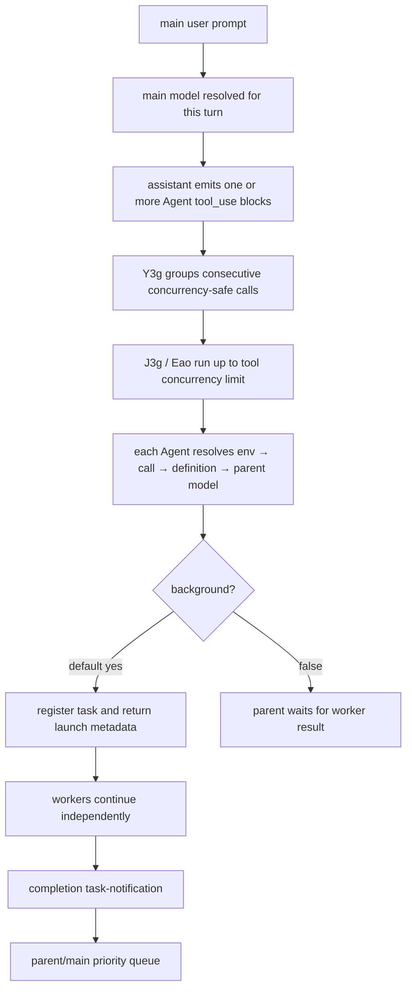
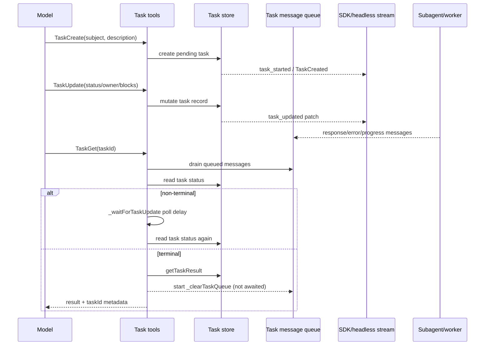
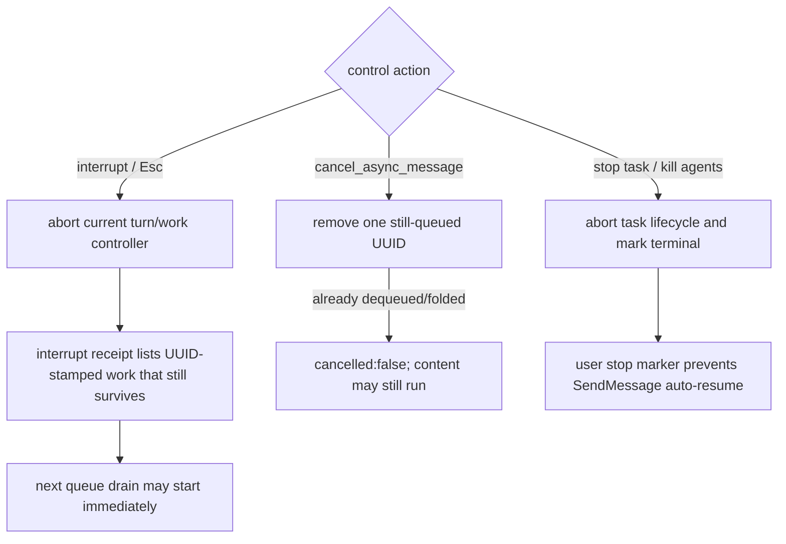

# Agent runtime, scheduling, and completion

This page answers the agent/task part of the `cli.renamed.js` analysis: **how the agent system is designed, which agent families exist, how tasks are scheduled, which patterns are used, how completion is detected, what is unusual about the runtime, and whether timed tasks exist.**

It complements [Agents, tasks, and subagents](agents-tasks-and-subagents.md), [Agent messaging and communication](agent-messaging.md), [Agent Teams](agent-teams.md), [Slash commands and automation](slash-commands-and-automation.md), and [Agent and automation architecture](architecture.md). Those pages own individual tools, transports, and commands; this page focuses on scheduling and lifecycle mechanics.

## Short answer

- The agent system is **orchestration over the existing session runtime**, not a second runtime. Agents/subagents reuse the same context loop, tool permission boundary, hooks, JSONL session storage, and telemetry/debug surfaces.
- The source-visible agent families are: inline custom agents (`--agents <json>`), the `claude agents` command family, background-by-default `Agent` subagents, the session's implicit team, deterministic `Workflow` runs, hosted review agents (`ultrareview`), and automation helpers such as slash commands/skills/auto-mode.
- The SDK/MCP task protocol uses a **task store + task message queue + stream-frame patching** pattern. Its `TaskGet` can block until a terminal status; the local Agent Teams `TaskGet` is a separate immediate shared-file read.
- Completion is detected primarily through task status. In the SDK/task protocol, terminal statuses are `completed`, `failed`, and `cancelled`; internal UI eviction also treats `killed` as terminal.
- Timed tasks do exist. A Kairos/cron family exposes prompt scheduling with session-only or durable tasks, recurring/one-shot cron expressions, missed-task surfacing, jitter, lock files, and a `CLAUDE_CODE_DISABLE_CRON` kill switch. A separate `RemoteTrigger` tool can manage Claude.ai remote routines through the CCR trigger API when its gates are enabled.

## Source anchors

| Semantic alias | String or symbol | Meaning |
| --- | --- | --- |
| AgentsCommandFamily | `H.command("agents")` | Root command family for agents/background agents. |
| InlineAgentsFlag | `--agents <json>` | Inline custom-agent definitions at session start. |
| RemoteControlAgentCoordination | `--remote-control [name]` | Remote Control can expose/coordinate running agent sessions. |
| UltraReviewCommand | `H.command("ultrareview [target]")` | Hosted multi-agent review command family. |
| AutoModeCommand | `H.command("auto-mode")` | Permission/automation classifier inspection command. |
| TaskCreateTool | `TaskCreate` | Task creation tool constant. |
| TaskGetTool | `TaskGet` | Task status/result retrieval tool constant. |
| TaskListTool | `TaskList` | Task listing tool constant. |
| TaskUpdateTool | `TaskUpdate` | Task update tool constant/request family. |
| TaskUpdateWaiter | `_waitForTaskUpdate` | Blocking wait path used by SDK/MCP `TaskGet`, not the local shared-task tool. |
| TaskPollInterval | `task.pollInterval ?? defaultTaskPollInterval ?? 1000` | Task-result waits poll every 1 second by default; a task-level interval can override it. |
| TaskQueueCleanup | `_clearTaskQueue`, `Task cancelled or completed` | Terminal-result and cancellation paths start asynchronous cleanup of residual messages and queued request resolvers. |
| TaskTerminalStatusPredicate | `function R5H(H){return H==="completed"||H==="failed"||H==="cancelled"}` | SDK/task protocol terminal-status predicate. |
| TerminalTaskCancelGuard | `Cannot cancel task in terminal status` | Cancellation is rejected for terminal tasks. |
| TaskStartedFrame | `task_started` | Runtime task registration stream frame. |
| TaskUpdatedFrame | `task_updated` | Patch-style task update stream frame. |
| TaskProgressFrame | `task_progress` | Task progress stream frame. |
| TaskNotificationContract | `Each stdout line is delivered to the model as a <task_notification> event` | Long-running monitor notification contract. |
| SubagentStartHook | `SubagentStart` | Subagent lifecycle hook. |
| SubagentStopHook | `SubagentStop` | Subagent lifecycle hook. |
| TaskCreatedHook | `TaskCreated` | Task lifecycle hook. |
| TaskCompletedHook | `TaskCompleted` | Task lifecycle hook. |
| SubagentContextClassifier | `agentType==="subagent"` | Runtime distinction for subagent context. |
| KairosCronGate | `isKairosCronEnabled` | Scheduled-task feature gate. |
| DisableCronEnv | `CLAUDE_CODE_DISABLE_CRON` | Scheduled-task kill switch. |
| CronSchedulerRuntime | `createCronScheduler` | Runtime scheduled-task engine. |
| ScheduledTaskLockFile | `.claude/scheduled_tasks.lock` | Scheduled-task lock file. |
| RemoteTriggerTool | `RemoteTriggerTool` | Model-visible tool for managing scheduled remote agent routines. |
| AgentSpawnCap | `CLAUDE_CODE_MAX_SUBAGENTS_PER_SESSION` | Session-wide spawn cap, default 200. |
| NestedAgentDepth | `Sub-agents can now spawn their own sub-agents (up to 5 levels deep)` | Bounded recursive delegation. |
| ToolUseConcurrencyScheduler | `Mss()` → `Y3g()` → `J3g()`, `CLAUDE_CODE_MAX_TOOL_USE_CONCURRENCY` | Runs consecutive concurrency-safe tool calls in parallel, default 10 [~343,247–343,330](../../claude-code-pkg/src/entrypoints/cli.renamed.js#L343247). |
| MessageQueuePriority | `OQn = {now:0,next:1,later:2}`, `CSg()` | Shared prompt/notification queue chooses the lowest priority number and preserves insertion order within a tier [~256,890–257,215](../../claude-code-pkg/src/entrypoints/cli.renamed.js#L256890). |
| MidTurnQueueFold | `getCommandsByMaxPriority("next")`, `registerFoldInFlight()`, `queued_command` | Eligible `now`/`next` messages can be attached between tool batches before the next recursive model call [~462,520–462,610](../../claude-code-pkg/src/entrypoints/cli.renamed.js#L462520). |
| InterruptReceipt | `interrupt`, `still_queued`, `cancel_async_message` | Aborts the active turn while reporting queued/in-flight UUIDs that survive; queued-message cancellation is a separate operation [~943,331–943,350, ~953,700–954,130](../../claude-code-pkg/src/entrypoints/cli.renamed.js#L943331). |
| AgentSteeringQueue | `y6e()`, `getAgentPendingMessageAttachments()` | `SendMessage` queues a live local agent message for an upcoming model/tool round rather than preempting its current call [~434,301, ~571,670](../../claude-code-pkg/src/entrypoints/cli.renamed.js#L434301). |
| TeammateWorkInterrupt | `PDu()`, `currentWorkAbortController`, `pendingUserMessages` | Escape can abort an in-process teammate's current turn while keeping its lifecycle available for subsequent work [~340,439, ~391,860–392,330](../../claude-code-pkg/src/entrypoints/cli.renamed.js#L340439). |
| IdleTaskClaim | `A7g()`, `mju()` | An idle in-process teammate can claim the first unowned pending task whose blocker IDs are completed or absent [~391,728–391,765](../../claude-code-pkg/src/entrypoints/cli.renamed.js#L391728). |
| InteractivePromptInsert | `h7o()`, `hasInterruptibleToolInProgress` | A prompt submitted during active TUI work is queued; when an interruptible tool is active, the current turn is aborted first [~860,880–860,930](../../claude-code-pkg/src/entrypoints/cli.renamed.js#L860880). |
| InteractiveCancel | `onPreRestore()`, `user-cancel`, `remote-cancel` | Esc/remote cancel aborts the active interactive turn and records its cancellation boundary [~924,380–924,430](../../claude-code-pkg/src/entrypoints/cli.renamed.js#L924380). |
| WorkflowRuntime | `Workflow`, `/workflows`, `workflow.run_id`, `workflow.name` | Deterministic background orchestration and correlated progress. |
| RemoteTriggerGate | `tengu_surreal_dali`, `allow_remote_sessions` | Remote-trigger availability is gated by subscription, remote mode, feature flag, and policy. |
| RemoteTriggerApi | `/v1/code/triggers`, `tengu_remote_trigger` | Remote routines use the Claude.ai CCR trigger API and emit create/update telemetry. |
| RemoteTriggerBeta | `ccr-triggers-2026-01-30` | Remote-trigger calls use a dedicated beta header. |
| RemoteTriggerPrompt | `Call the claude.ai remote-trigger API`, `Use this instead of curl` | Tool prompt directs the model to avoid exposing OAuth tokens through shell commands. |
| UltraReviewPreflightApi | `/v1/ultrareview/preflight` | Hosted review preflight API. |

## Agent families visible in the bundle

`getBuiltInAgents()` exposes a clean but conditional roster of bundled personas: up to six in a normal session, with three additional mode-specific/internal built-in role definitions elsewhere in the bundle. The **complete live roster** is still dynamic because settings/frontmatter, plugins, policy, entrypoint, and feature gates can add, replace, or remove entries. See [Built-in or “native” agent inventory](agents-tasks-and-subagents.md#built-in-or-native-agent-inventory) for the exact count and purpose of each built-in role.

| Family | Source-visible entry | Design role |
|---|---|---|
| Inline custom agents | `--agents <json>` | Session-scoped custom agent definitions, useful for scripted/headless runs. |
| Agent command family | `H.command("agents")` | User-facing/background-agent management and dispatch. |
| Subagents | `agentType==="subagent"`, `SubagentStart`, `SubagentStop` | Delegated model contexts that run as projections of the same session runtime. |
| Task agents | `TaskCreate`, `TaskUpdate`, `TaskGet`, `TaskList` | Structured tasks used by the model/runtime to plan, assign, wait, and report progress. |
| Teammate/background modes | `--agent-id`, `--agent-name`, `--team-name`, `--teammate-mode`, `--agent-type` | Multi-agent/teammate coordination around the same CLI runtime. |
| Hosted review agents | `ultrareview [target]`, `/v1/ultrareview/preflight` | Explicit hosted multi-agent review workflow. |
| Skills/slash automation | `Skill`, slash command metadata, keybinding `command:*` | Human/plugin/keybinding-triggered automation that can look agent-like but enters through commands/tools. |
| Auto-mode classifier | `auto-mode`, `hasAutoModeOptIn`, `tengu_auto_mode_config` | Permission/automation classifier; not an agent itself, but affects whether agents/tools can proceed without prompts. |
| Dynamic workflows | `Workflow`, `/workflows`, `.claude/workflows/*.js` | Explicit user-opted deterministic fan-out/pipeline/verification over many agents. |

The important design point: these families share the same session envelope, settings/policy, MCP/plugin registry, tool-permission boundary, and transcript system.

## Delegation budgets and implicit team

`Agent` launches asynchronously by default and can be addressed by ID or name through `SendMessage`. Recursive delegation is permitted but bounded to five levels. The session-wide spawn counter defaults to 200 (`CLAUDE_CODE_MAX_SUBAGENTS_PER_SESSION`) and is reset by `/clear`; the limit protects against runaway delegation independently of context/token limits.

The `team_name` parameter remains accepted for compatibility but is ignored: an enabled interactive lead derives one implicit team. `TeamCreate` and `TeamDelete` are no longer model tools. When the explicit Agent Teams gate and lead context are active, an eligible `Agent({name: ...})` call becomes a teammate; otherwise it remains an ordinary named Agent. Permission mode is inherited from the parent by default, and agent-to-agent messages never inherit the user's approval authority. See [Agent Teams](agent-teams.md) for the exact branch, execution backends, files, permission forwarding, and teardown.

Dynamic workflows add a separate deterministic scheduler over this same agent runtime. A workflow's own concurrency, item, nesting, and lifetime caps are documented in [Dynamic workflows](dynamic-workflows.md); workflow completion still resolves through the normal task registry and notifications.

## From one model turn to concurrent agents

```mermaid
flowchart TD
    Prompt[main user prompt] --> MainModel[main model resolved for this turn]
    MainModel --> ToolUses[assistant emits one or more Agent tool_use blocks]
    ToolUses --> Group[Y3g groups consecutive concurrency-safe calls]
    Group --> Launch[J3g / Eao run up to tool concurrency limit]
    Launch --> AgentModel[each Agent resolves env → call → definition → parent model]
    AgentModel --> Sync{background?}
    Sync -->|default yes| Registered[register task and return launch metadata]
    Sync -->|false| Await[parent waits for worker result]
    Registered --> Workers[workers continue independently]
    Workers --> Notify[completion task-notification]
    Notify --> Queue[parent/main priority queue]
```

`Agent.isConcurrencySafe()` makes multiple Agent tool calls in one assistant response eligible for the general tool scheduler. Consecutive safe calls run concurrently up to `CLAUDE_CODE_MAX_TOOL_USE_CONCURRENCY` (10 by default); a non-safe tool creates an ordering barrier. This scheduler limit applies while the tool handlers are executing. A default-background Agent returns after task registration and continues independently, so active background workers can outlive and outnumber those launch slots. The separate hard boundaries remain five levels of nesting and 200 spawned agents per session by default.

Each worker resolves its model independently through `oue()`: `CLAUDE_CODE_SUBAGENT_MODEL` → one-call model → agent definition → current parent runtime model. A fork always inherits. Workflow calls add their own FIFO concurrency limiter and share a workflow abort/token budget; see [Dynamic workflows](dynamic-workflows.md#limits-and-sizing).

## SDK/MCP task scheduling model

The sequence below is the method-oriented task-result protocol with queues and stream patches. Agent Teams uses a distinct local shared-task directory; its `TaskGet` returns current record state immediately and idle teammates claim eligible pending tasks under file locks.

```mermaid
sequenceDiagram
    participant Model
    participant TaskTool as Task tools
    participant Store as Task store
    participant Queue as Task message queue
    participant Stream as SDK/headless stream
    participant Worker as Subagent/worker

    Model->>TaskTool: TaskCreate(subject, description)
    TaskTool->>Store: create pending task
    Store-->>Stream: task_started / TaskCreated
    Model->>TaskTool: TaskUpdate(status/owner/blocks)
    TaskTool->>Store: mutate task record
    Store-->>Stream: task_updated patch
    Worker-->>Queue: response/error/progress messages
    Model->>TaskTool: TaskGet(taskId)
    TaskTool->>Queue: drain queued messages
    TaskTool->>Store: read task status
    alt non-terminal
        TaskTool->>TaskTool: _waitForTaskUpdate poll delay
        TaskTool->>Store: read task status again
    else terminal
        TaskTool->>Store: getTaskResult
        TaskTool-->>Queue: start _clearTaskQueue (not awaited)
        TaskTool-->>Model: result + taskId metadata
    end
```

| Component | Behavior |
|---|---|
| `TaskCreate` | Creates a structured task with `pending` status and metadata; source prompt says to use it for complex multi-step work and plan mode. |
| `TaskUpdate` | Updates status/description/owner/dependencies/metadata; runtime emits patch-style `task_updated` frames. |
| `TaskList` | Lists current tasks with cursor support. |
| SDK/MCP `TaskGet` | Retrieves a protocol task; if non-terminal, drains queued messages and polls for updates until terminal. The default poll interval is 1 second, overridden by the task's `pollInterval` when present. |
| Task message queue | Carries response/error/progress messages related to a task. Terminal result retrieval and cancellation both invoke asynchronous cleanup without awaiting it before returning; cleanup drains residual messages and rejects queued request resolvers with `Task cancelled or completed`. |
| Stream frames | `task_started`, `task_updated`, `task_progress`, `task_notification` let UIs/SDK hosts display progress without polling raw files. |
| Hooks | `TaskCreated` and `TaskCompleted` are hook events; `SubagentStart`/`SubagentStop` are separate context lifecycle events. |

Task records coordinate work but do not themselves execute a model. `TaskUpdate` changes shared status/owner/dependency metadata; it does not preempt the worker currently running. When an in-process teammate becomes idle, `A7g()` finds the first `pending` task with no owner for which every `blockedBy` ID is either `completed` or absent from the current task list, and `mju()` claims it and sets it `in_progress`. Thus inserting a new task changes the next eligible assignment, not the middle of an already-running provider call.

## Interruption, steering, and queued insertion

Claude Code has several mechanisms that look like “send new work,” but they have different timing and cancellation semantics.

### Main-session priority queue

The shared command queue stores `now`, `next`, or `later`, ordered as `0`, `1`, and `2`. Dequeue selects the first entry in the highest-priority available tier.

| Priority/path | When it becomes model-visible | Does it abort current work? |
|---|---|---|
| `now` | Highest-priority next drain. Both the TUI and headless/SDK queue watchers abort an active main turn when a `now` entry appears. | Yes; the queued entry itself survives for the next drain. |
| `next` | Default for ordinary enqueues. Between tool batches, the common model loop can fold eligible `now`/`next` entries into `queued_command` attachments before its next recursive provider call. | No. It steers the continuation at a safe model-loop boundary. |
| `later` | Excluded from mid-turn folding; waits for a later top-level drain after higher tiers. | No. Cron wakeups and low-urgency remote/task traffic commonly use this tier. |

Compatible same-priority top-level prompts can be coalesced into one turn. Mid-turn folding removes commands only after their attachments were produced successfully; an abort during absorption leaves them queued rather than silently losing them.

Interactive typed input has an additional UX branch. If a query is active, the prompt is normally queued at `next`. When `hasInterruptibleToolInProgress` is true, submitting that prompt first aborts the current turn with reason `interrupt`, then keeps the new prompt queued for the following drain. Without an interruptible tool it waits/folds normally. Pressing Esc uses `user-cancel` (or `remote-cancel` from the remote surface) to abort the active interactive turn; it does not, by itself, mean every detached background Agent was permanently stopped.

### Agent-specific steering

| Target | Insertion behavior |
|---|---|
| Live local/background Agent | `SendMessage` appends `pendingMessages`. `getAgentPendingMessageAttachments()` drains them as `queued_command` attachments on an upcoming agent model iteration/tool round. It does not stop an in-flight provider/tool call. |
| In-process teammate | Direct user messages enter `pendingUserMessages`; peer messages enter its mailbox. They are consumed at turn-end/idle polling. A shutdown request is prioritized ahead of ordinary unread mailbox messages. |
| Main conversation | `SendMessage({to:"main"})` enqueues a `next` meta prompt. |
| Stopped/evicted Agent | May be rebuilt from retained transcript and resumed, except an explicit stopped-by-user marker refuses resurrection. |

An Agent message is task direction, not user approval. It cannot launder permission consent into another worker; normal tool checks still run.

### Abort versus stop versus cancel

```mermaid
flowchart TD
    Input{control action} -->|interrupt / Esc| Abort[abort current turn/work controller]
    Input -->|cancel_async_message| Cancel[remove one still-queued UUID]
    Input -->|stop task / kill agents| Stop[abort task lifecycle and mark terminal]
    Abort --> Receipt[interrupt receipt lists UUID-stamped work that still survives]
    Receipt --> Drain[next queue drain may start immediately]
    Cancel -->|already dequeued/folded| Noop[cancelled:false; content may still run]
    Stop --> Marker[user stop marker prevents SendMessage auto-resume]
```

- An SDK `interrupt` aborts the active conversation controller, clears pending suggestion state, runs interrupt cleanup for eligible turn-owned tasks, and returns `still_queued`. That list includes UUID-stamped main-thread messages still in the queue plus the already-dequeued imminent batch. It does **not** mean the queue was cleared.
- A TUI prompt submitted while an interruptible tool is active aborts the current turn and then runs later from the queue; ordinary queued input without that condition does not preempt the turn. Esc directly cancels the active interactive turn.
- `cancel_async_message` is reliable while a UUID is still queued and also remembers a narrow cancel-before-dispatch race. Once a message is already folded or coalesced, individual cancellation can return `cancelled:false`; batch granularity applies.
- Escape while viewing a running in-process teammate calls its `currentWorkAbortController`. The interrupted turn records an interruption and the teammate returns idle; this is not the same as killing the teammate task.
- Explicit task/agent stop invokes the task-type kill handler and marks terminal state. A user stop is persisted specifically so later `SendMessage` does not automatically resume that agent.
- `control_cancel_request` is yet another scope: it cancels a correlated pending control operation (for example a side question) by `request_id`, not a queued user message or the whole session turn.

Completion and scheduled work re-enter through the same queue rather than mutating an active model request. Agent completion notifications are explicitly enqueued at `next`; normal pending notifications default to `later`; local scheduled prompts use `later`, or target a teammate's pending-message queue. Permissions are re-evaluated when that inserted work eventually executes.

## Completion detection

There are several completion signals, depending on the layer.

| Layer | Terminal/completion rule | Evidence |
|---|---|---|
| SDK/task protocol | `completed`, `failed`, `cancelled` | `TaskTerminalStatusPredicate` returns true for exactly those strings. |
| Cancellation path | Cannot cancel if already terminal | `Cannot cancel task in terminal status: ${status}`. |
| Internal UI eviction | `completed`, `failed`, `killed` can be evicted after notification/retention checks | Internal task-eviction snippet checks those statuses. |
| Hook layer | `TaskCompleted` | Hook event emitted when task lifecycle completes. |
| Subagent layer | `SubagentStop` | Runtime-context completion, distinct from task-record completion. |
| Remote bash command | `onCommandLifecycle(uuid,"completed")` after output/error is enqueued | Remote bridge `bash_command` handling. |
| Scheduled one-shot task | Fired prompt is removed/deleted after fire | `createCronScheduler` removes non-recurring fired tasks. |
| Scheduled recurring task | `lastFiredAt` persisted; task expires if aged out | `isRecurringTaskAged`, `tengu_scheduled_task_expired`. |

The hidden footgun is that **task completion and subagent completion are not identical**. A subagent can stop, a task record can complete, and a remote/host command can acknowledge completion through different frames.

Terminal status is not, by itself, the internal registry's eviction signal. A task must also have produced its terminal notification, after which retention/grace checks apply. Active keepalive ownership defers eviction, and workflows may supply their own `evictAfter` deadline. This lets the runtime preserve a completed task long enough to deliver its result without treating terminal work as permanently live.

## Scheduling patterns

| Pattern | How it works | Why it matters |
|---|---|---|
| Deferred SDK/MCP task result | The method-oriented task protocol can defer and wait (`shouldDefer`, `_waitForTaskUpdate`). | Lets the model start long work and later request the result without blocking every frame. |
| Patch streaming | `task_updated` contains a minimal patch (`status`, `description`, `end_time`, `error`, etc.). | UIs/SDK hosts can update state incrementally. |
| Queue draining before wait | `TaskGet` drains task messages before checking terminal state. | Prevents progress/errors from being stranded while a caller waits. |
| Dependency/ownership metadata | Task prompts mention `owner`, `blocks`, and `blockedBy`. | Supports multi-agent planning without a separate workflow engine. |
| Subagent projection | `agentType==="subagent"` changes runtime context inside the same loop. | Avoids a second permission/model/session stack. |
| Long-running notification process | Each stdout line becomes `<task_notification>`. | External monitors can feed the model with a narrow text-line contract. |
| Worktree/tmux/in-process teammate modes | CLI exposes teammate identity and mode flags. | Enables multi-agent work without assuming one deployment topology. |
| Hosted preflight | `ultrareview` calls `/v1/ultrareview/preflight` before hosted work. | Hosted runs are explicit and preflighted rather than silently triggered. |
| Cron prompt injection | Scheduled tasks call `onFire(prompt)` or `onFireTask(task)`. | Timed automation is implemented as prompt/task injection into the existing session. |
| Remote routine management | `RemoteTrigger` calls `/v1/code/triggers` list/get/create/update/run. | Cloud routines are managed through in-process OAuth and policy gates rather than shelling out with a token. |
| Deterministic workflow | `Workflow` runs restricted JavaScript with `agent`/`pipeline`/`parallel`. | Makes multi-agent control flow explicit, observable, and resumable rather than model-driven. |

## Timed tasks and cron

The scheduled-task family is source-visible and feature-gated.

| Surface | Behavior |
|---|---|
| `isKairosCronEnabled` | Returns false when `CLAUDE_CODE_DISABLE_CRON` is set; otherwise checks a feature flag. |
| `isDurableCronEnabled` | Separate gate for durable scheduled tasks. |
| Cron create/list/delete tools | Prompt strings describe scheduling prompts for future times, list/delete operations, and durable vs session-only tasks. |
| Standard 5-field cron | Prompt says minute/hour/day/month/day-of-week in the user's local timezone. |
| One-shot tasks | `recurring: false`; fire once and auto-delete. |
| Recurring tasks | `recurring: true`; persist/update `lastFiredAt`; may age out if not permanent. |
| Jitter guidance | Prompt explicitly tells the model to avoid `:00` and `:30` when approximate timing allows. |
| Durable storage | Prompt says `durable: true` persists to `.claude/scheduled_tasks.json`; scheduler code uses `.claude/scheduled_tasks.lock`. |
| Locking | Scheduler lock records `sessionId`, `pid`, `procStart`, and `acquiredAt`; stale PID locks can be recovered. |
| Missed tasks | Missed one-shot tasks are surfaced and then removed; telemetry includes `tengu_scheduled_task_missed`. |
| Fire telemetry | Runtime emits `tengu_scheduled_task_fire`; aged recurring tasks emit `tengu_scheduled_task_expired`. |

The scheduler is **not** a separate always-on daemon in the analyzed path. It is an in-session scheduler with locking, periodic checks, and optional durable files so future/parallel processes can coordinate.

### RemoteTrigger and cloud routines

`RemoteTrigger` is a distinct scheduled-automation surface from local Kairos cron. The decoded enablement predicate includes `hj()`, `isClaudeAISubscriber()`, not already running under `CLAUDE_CODE_REMOTE`, the `tengu_surreal_dali` gate, and `allow_remote_sessions` policy. Its actions map to `GET /v1/code/triggers`, `GET /v1/code/triggers/{trigger_id}`, `POST /v1/code/triggers`, `POST /v1/code/triggers/{trigger_id}`, and `POST /v1/code/triggers/{trigger_id}/run`.

The call path refreshes OAuth in process, requires a Claude.ai access token and organization UUID, adds the `ccr-triggers-2026-01-30` beta header, and returns HTTP status/JSON plus a human schedule summary when create/update responses parse. This keeps remote routine management inside the tool/permission boundary; the prompt explicitly says to use the tool instead of `curl` so OAuth tokens are not exposed to the shell.

## Unique runtime design choices

1. **Agents are runtime projections.** Subagents and background agents reuse session, model, tool, permission, hook, and telemetry infrastructure.
2. **Tasks are model-visible tools.** The model can create/update/list/get structured tasks through normal tool pathways, which makes planning auditable in the transcript.
3. **SDK/MCP completion is status-driven.** Waiting is implemented by protocol `TaskGet` + `_waitForTaskUpdate`, not by guessing from text output. Local shared-task reads remain immediate.
4. **The task stream is patch-oriented.** `task_updated` carries minimal changes, which is friendlier for SDK/TUI consumers than replaying full task lists.
5. **Cron fires prompts, not arbitrary code.** Timed automation injects prompts/tasks into the same agent loop; tool execution still goes through permissions.
6. **Long-running monitors speak one line at a time.** The `<task_notification>` stdout contract avoids embedding an arbitrary subprocess protocol inside the model loop.
7. **Remote and local use the same envelope.** Remote Control can send commands/control responses, but task and permission semantics stay aligned with local runs.
8. **Hosted review is explicit.** `ultrareview` is a command with preflight, not an ambient background service.
9. **Feature gates surround advanced automation.** Cron, background agents, bridge behavior, auto-mode, and agent views all have feature/env/policy gates.
10. **Delegation has hard budgets.** Session, workflow, nesting, and concurrency caps fail explicitly rather than silently truncating coverage.

## Diagnostics and telemetry for agents

| Signal | Meaning |
|---|---|
| `task_started`, `task_updated`, `task_progress`, `task_notification` | Runtime-visible progress frames. |
| `TaskCreated`, `TaskCompleted`, `SubagentStart`, `SubagentStop` | Hook-level lifecycle events. |
| `tengu_scheduled_task_missed`, `tengu_scheduled_task_fire`, `tengu_scheduled_task_expired` | Scheduled-task telemetry. |
| `tengu_auto_mode_*` | Auto-mode decision/fallback/denial telemetry family. |
| `tengu_worktree_kept`, `tengu_worktree_removed` | Worktree teammate/task cleanup telemetry. |
| Debug logs (`--debug`, `CLAUDE_CODE_DEBUG_LOGS_DIR`) | Low-level traces for scheduler locks, task updates, bridge state, and errors. |

For the broader gates and observability story, see [Feature gates reference](../05-hosted-agent-ops/feature-gates-reference.md) and [Telemetry and tracing](../05-hosted-agent-ops/telemetry-and-tracing.md).

## Caveats

- The built-in role catalog is source-countable, but the live active-agent roster is not fixed: mode/gates can reduce it and plugins/settings/policy can add or override names.
- Status names differ by layer. Do not assume `killed` is part of the SDK terminal predicate; `TaskTerminalStatusPredicate` only includes `completed`, `failed`, and `cancelled`.
- Cron behavior depends on feature gates and environment. If `CLAUDE_CODE_DISABLE_CRON` is set, scheduled-task creation should be treated as unavailable.
- `tengu_*` names are opaque unless adjacent code explains them. This page only interprets names with nearby behavioral evidence.

## Related docs

- [Agents, tasks, and subagents](agents-tasks-and-subagents.md)
- [Agent messaging and communication](agent-messaging.md)
- [Agent Teams](agent-teams.md)
- [Slash commands and automation](slash-commands-and-automation.md)
- [Agent and automation architecture](architecture.md)
- [Feature gates reference](../05-hosted-agent-ops/feature-gates-reference.md)
- [Telemetry and tracing](../05-hosted-agent-ops/telemetry-and-tracing.md)
- [Session API, events, and storage](../04-sessions-persistence-remote/session-api-events-and-storage.md)
- [Tool runtime, events, and integration flows](../03-tools-integrations-security/tool-runtime-events-and-integrations.md)
