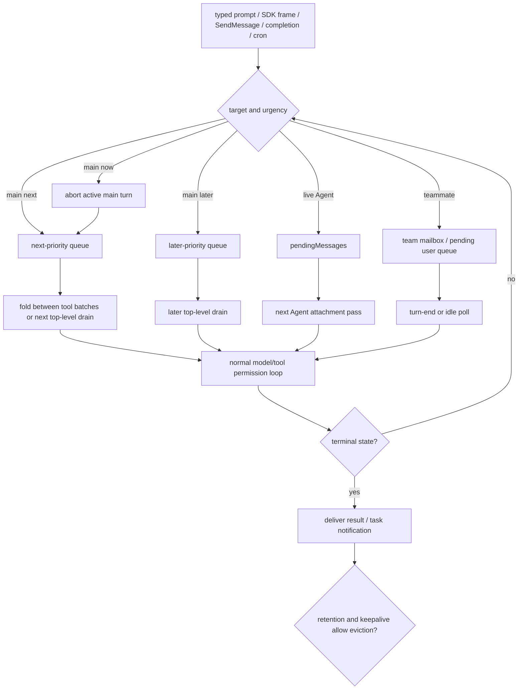
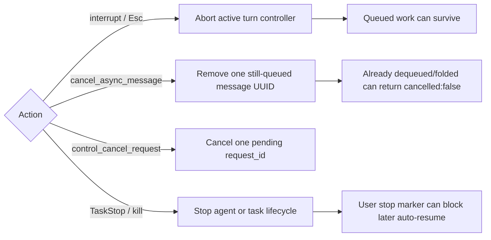

# Agent steering, interruption, and completion

This page owns the runtime boundaries for **inserting work into an active main or agent loop, interrupting or cancelling that work, and deciding when agent/task state is complete enough to notify or evict**.

It intentionally does not repeat adjacent owners:

- [Agents, tasks, and subagents](agents-tasks-and-subagents.md) owns agent definitions, model selection, launch concurrency, delegation limits, and the SDK/MCP-versus-local task protocols.
- [Agent messaging and communication](agent-messaging.md) owns recipient resolution and target-specific message transports.
- [Agent Teams](agent-teams.md) owns teammate task claiming, mailbox polling, and team lifecycle.
- [Cron and scheduled tasks](cron-and-scheduled-tasks.md) owns timed prompt injection and remote routines.
- [Dynamic workflows](dynamic-workflows.md) owns deterministic workflow scheduling and its FIFO limiter.

## Short answer

Claude Code never mutates an in-flight provider request. New work enters at a boundary owned by the target:

An interrupt aborts current work but does not imply that queued work disappeared. Cancelling one queued UUID is different from cancelling a correlated control request, and both are different from stopping an agent/task lifecycle.

## Source anchors

| Semantic alias | Approximate location in `cli.renamed.js` | Exact symbol or string | Meaning |
|---|---:|---|---|
| MainPriorityQueue | [~256,890–257,215](../../claude-code-pkg/src/entrypoints/cli.renamed.js#L256890) | `OQn = {now:0,next:1,later:2}`, `CSg()` | Orders main-thread prompts and notifications by priority, FIFO within a tier. |
| MidTurnQueueFold | [~462,520–462,610](../../claude-code-pkg/src/entrypoints/cli.renamed.js#L462520) | `getCommandsByMaxPriority("next")`, `registerFoldInFlight()`, `queued_command` | Folds eligible `now`/`next` input between tool batches before another provider call. |
| InteractivePromptInsert | [~860,880–860,930](../../claude-code-pkg/src/entrypoints/cli.renamed.js#L860880) | `h7o()`, `hasInterruptibleToolInProgress` | Queues typed input and, for an interruptible active tool, aborts the current turn first. |
| InteractiveTurnCancel | [~924,380–924,430](../../claude-code-pkg/src/entrypoints/cli.renamed.js#L924380) | `onPreRestore()`, `user-cancel`, `remote-cancel` | Cancels the active interactive turn without declaring every detached worker stopped. |
| SdkInterruptReceipt | [~943,331–943,350](../../claude-code-pkg/src/entrypoints/cli.renamed.js#L943331) | `interrupt`, `still_queued` | Aborts the active headless/SDK turn and reports UUID-stamped work that survives. |
| QueuedMessageCancel | [~954,118](../../claude-code-pkg/src/entrypoints/cli.renamed.js#L954118) | `cancel_async_message` | Removes one message only while it remains queued. |
| CorrelatedControlCancel | [~943,000–944,999](../../claude-code-pkg/src/entrypoints/cli.renamed.js#L943000) | `control_cancel_request`, `request_id` | Cancels one pending host/runtime control operation. |
| AgentSteeringQueue | [~434,301](../../claude-code-pkg/src/entrypoints/cli.renamed.js#L434301) | `y6e()`, `iho()` | Appends and atomically drains ordinary Agent steering messages. |
| AgentPendingAttachment | [~571,670](../../claude-code-pkg/src/entrypoints/cli.renamed.js#L571670) | `getAgentPendingMessageAttachments()` | Converts drained Agent messages into `queued_command` attachments. |
| TeammateWorkInterrupt | [~340,439, ~391,860–392,330](../../claude-code-pkg/src/entrypoints/cli.renamed.js#L391860) | `PDu()`, `currentWorkAbortController` | Aborts one in-process teammate turn while preserving the teammate lifecycle. |
| IdleTaskClaim | [~391,728–391,770](../../claude-code-pkg/src/entrypoints/cli.renamed.js#L391728) | `A7g()`, `mju()` | Lets an idle teammate lock-claim the first eligible pending task. |
| AgentCompletionNotification | [~434,320](../../claude-code-pkg/src/entrypoints/cli.renamed.js#L434320) | `ERt()`, `task-notification` | Delivers terminal Agent state/results to the owner/main queue. |
| SdkTaskTerminalPredicate | `function R5H(H)` | `completed`, `failed`, `cancelled` | Defines terminal states for the SDK/MCP task protocol. |
| InternalTaskEviction | [~350,180–350,363](../../claude-code-pkg/src/entrypoints/cli.renamed.js#L350180) | `notified`, `retain`, `evictAfter`, keepalive reasons | Separates terminal state from safe registry eviction. |
| UserStopResumeGuard | [~413,414–414,470](../../claude-code-pkg/src/entrypoints/cli.renamed.js#L413414) | `AgentStoppedByUserError` | Prevents a later message from silently resurrecting explicitly stopped work. |

## Main-session insertion priorities

The main queue has three priorities:

| Priority | Typical use | Visibility boundary | Preemption |
|---|---|---|---|
| `now` | Urgent SDK/headless steering | Highest-priority next drain; may fold before the next recursive provider call. | Queue watchers abort an active main turn so the queued entry can run next. |
| `next` | Typed prompts, main-directed Agent messages, completion notifications | May fold as `queued_command` input between tool batches; otherwise enters the next top-level drain. | Does not normally abort the current request. |
| `later` | Cron wakeups and low-urgency notifications | Excluded from mid-turn folding and waits for a later top-level drain. | No. |

Dequeue selects the earliest entry in the highest-priority non-empty tier. Compatible top-level prompts can be coalesced, so queue identity and eventual provider-turn identity are not always one-to-one.

Mid-turn folding is cooperative. The runtime first turns eligible entries into attachments, then removes them from the queue. An abort during attachment production leaves the entries available for a later drain rather than silently losing them.

### Interactive input while work is active

When the TUI receives a prompt during an active query, it normally queues the prompt at `next`. If an interruptible tool is active, submission first aborts the current turn and retains the new prompt for the following drain. Pressing Escape uses the interactive cancellation path (`user-cancel`, or `remote-cancel` from the remote surface); it cancels the active turn, not every detached Agent or scheduled task associated with the session.

## Target-specific steering

| Target | Insertion path | When the receiver sees it |
|---|---|---|
| Main conversation | `now`/`next`/`later` queue | Mid-turn fold or a later top-level drain. |
| Live ordinary Agent | `pendingMessages[]` via `y6e()` | `getAgentPendingMessageAttachments()` on a later Agent model/tool iteration. |
| In-process teammate | `pendingUserMessages` or team mailbox | Turn-end check or 500 ms idle poll. |
| External pane teammate / lead | Team mailbox | One-second inbox poll; busy sessions buffer until the turn boundary. |
| Stopped/evicted Agent | Transcript-backed resume path | First resumed turn, unless a user-stop marker forbids resumption. |

These paths carry task direction, not user authority. When inserted work later produces a tool call, normal permissions, hooks, and sandbox checks run again.

For transport acknowledgement, addressing, pins, mailbox persistence, peer-session branches, and reply semantics, use [Agent messaging and communication](agent-messaging.md).

## Interrupt, cancel, and stop are different

### Turn interruption

An SDK/headless `interrupt` aborts the active conversation controller and performs the applicable turn-owned cleanup. Its response includes `still_queued`, which can contain:

- UUID-stamped main-thread entries still in the queue;
- the already-dequeued imminent batch; and
- internally generated continuation or scheduled IDs.

An empty list is not proof that no work remains: an unstamped entry can still execute, and detached background work has its own lifecycle.

### Queued-message cancellation

`cancel_async_message` targets a prompt UUID, not the active turn. It succeeds only while the item is still queued, with a narrow pending-cancel set covering a cancel-before-dispatch race. Once work has been dequeued, folded, or coalesced, the command can return `cancelled:false` even though some of that content may already be executing.

### Correlated control cancellation

`control_cancel_request` targets one pending host/runtime operation by `request_id`, such as a side question. It does not identify a prompt UUID and does not cancel the whole session.

### Lifecycle stop

TaskStop/agent kill invokes the task-kind-specific stop handler, aborts lifecycle state, and marks a terminal status. An explicit user stop is persisted separately so later `SendMessage` delivery refuses automatic resumption. By contrast, aborting an in-process teammate's `currentWorkAbortController` ends only that turn; the teammate returns to idle and remains available.

## Completion is layered

No single status means every owner has finished cleanup.

| Layer | Completion or terminal rule | What it does not prove |
|---|---|---|
| SDK/MCP task protocol | `completed`, `failed`, or `cancelled` | Does not include internal `killed`, and does not prove queue cleanup finished before the response. |
| Internal task registry | `completed`, `failed`, or `killed`, plus notification/retention checks | Terminal status alone does not authorize eviction. |
| Subagent context | `SubagentStop` | Does not imply a paired task record already emitted `TaskCompleted`. |
| Task hook layer | `TaskCompleted` | Hook delivery is not the same as owner notification or registry eviction. |
| Ordinary background Agent | `task-notification` sent to owner/main | A later transcript-backed resume can produce another terminal notification for the same task identity. |
| Workflow | Workflow result plus workflow-specific retention/deadline state | Uses its own journal, abort, and `evictAfter` rules. |
| One-shot cron | Prompt fired and task removed | Scheduling is owned by the cron subsystem, not by agent completion status. |

### Notification before eviction

The internal registry keeps a terminal task until its result has had a chance to reach the owner. Eviction can depend on:

- whether terminal notification was emitted;
- `retain` or `evictAfter` state;
- active keepalive reasons;
- workflow-specific deadlines; and
- task-kind cleanup state.

This separation prevents a worker from disappearing before its result is delivered. Agent-owned monitors and shell tasks can also be `keepaliveGated`, allowing selected resources to outlive the completed model turn while ownership remains active.

### SDK/MCP task-result cleanup

The method-oriented SDK/MCP `TaskGet` can wait until a protocol task reaches a terminal state. Terminal retrieval and cancellation start `_clearTaskQueue()`, which drains residual task messages and rejects queued request resolvers with `Task cancelled or completed`; those callers do not await the cleanup promise before returning. The complete protocol belongs in [Agents, tasks, and subagents](agents-tasks-and-subagents.md#external-sdkmcp-task-result-waiting).

The local Agent Teams `TaskGet` is intentionally different: it reads the current shared JSON task record immediately. Idle teammate claiming and task-file locking belong in [Agent Teams](agent-teams.md#shared-task-lifecycle).

## Scheduling handoffs

“Scheduling” names several mechanisms that should not be merged into this page:

| Mechanism | Canonical owner |
|---|---|
| Consecutive concurrency-safe Agent tool calls and model precedence | [Agents, tasks, and subagents](agents-tasks-and-subagents.md#how-agent-calls-select-models-and-run-concurrently) |
| Teammate idle claim of a dependency-ready task | [Agent Teams](agent-teams.md#shared-task-lifecycle) |
| Workflow FIFO agent-slot limiting and deterministic pipeline/parallel control | [Dynamic workflows](dynamic-workflows.md#limits-and-sizing) |
| Local `/loop`, `CronCreate`, durable scheduled tasks, jitter, missed tasks, and cloud `RemoteTrigger` routines | [Cron and scheduled tasks](cron-and-scheduled-tasks.md) |

All of them eventually insert work into an existing runtime boundary, but they have different state stores, clocks, concurrency rules, and cleanup owners.

## Failure and observability

| Condition | Source-confirmed behavior |
|---|---|
| Interrupt received with queued work | Active turn aborts; `still_queued` reports only the UUID-stamped subset the receipt can identify. |
| Queued cancellation loses the dequeue race | Returns `cancelled:false`; it does not retroactively remove folded content. |
| Agent was explicitly stopped by the user | Message-triggered auto-resume fails with `AgentStoppedByUserError`. |
| Terminal task still has keepalive ownership | Notification can be delivered while eviction remains deferred. |
| SDK/MCP queue cleanup is still running | Terminal retrieval/cancellation can already have returned; residual resolvers are rejected asynchronously. |
| Teammate current work is interrupted | Current turn stops and teammate returns idle; lifecycle remains registered. |

Useful signals include `task_started`, `task_updated`, `task_progress`, `task_notification`, `TaskCreated`, `TaskCompleted`, `SubagentStart`, and `SubagentStop`. Use [Telemetry and tracing](../05-hosted-agent-ops/telemetry-and-tracing.md) for sink behavior and [Hooks and events reference](../03-tools-integrations-security/hooks-and-events-reference.md) for canonical event names.

## Caveats

- Queue and task state is coordinated in-process unless an owning subsystem explicitly persists it. Process-local ordering is not a cross-process transaction.
- A delivery/interrupt/cancellation acknowledgement describes the local boundary reached; it is not proof of provider interpretation or remote exactly-once handling.
- Status vocabularies differ by layer. Do not add `killed` to the SDK/MCP terminal predicate or treat `cancelled` as the internal UI's universal terminal name.
- Operating-system scheduling fairness and provider cancellation latency are outside the retained client artifact.

## Related docs

- [Agents, tasks, and subagents](agents-tasks-and-subagents.md)
- [Agent messaging and communication](agent-messaging.md)
- [Agent Teams](agent-teams.md)
- [Dynamic workflows](dynamic-workflows.md)
- [Cron and scheduled tasks](cron-and-scheduled-tasks.md)
- [Headless streaming and resilience](../02-context-model-loop/headless-streaming-and-resilience.md)
- [Hooks and events reference](../03-tools-integrations-security/hooks-and-events-reference.md)
