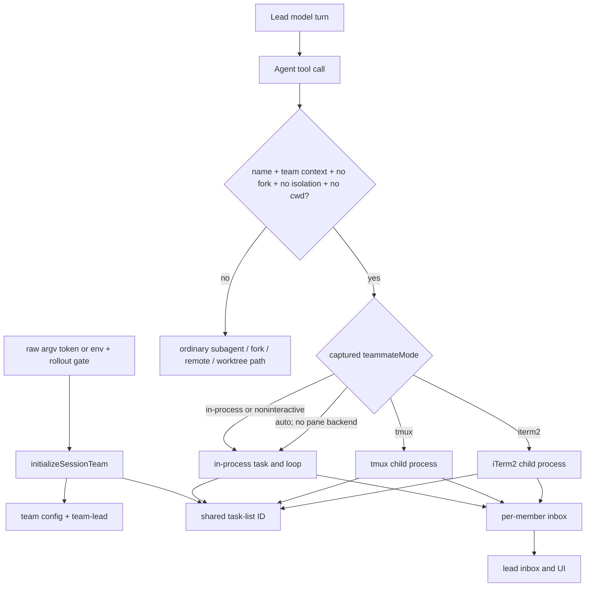

# Agent teams: teammates, shared tasks, mailboxes, and lifecycle

This page reverse-engineers the experimental Agent Teams implementation in Claude Code `2.1.215`: how one session initializes an implicit team, how a named `Agent` call becomes a teammate, how in-process and terminal-pane teammates run, how shared tasks and mailboxes coordinate work, how permissions and plan approval cross the team boundary, and what shutdown or resume actually preserves.

Scope: local Agent Teams only. Ordinary background subagents, `/fork`, deterministic `Workflow` runs, other local/cloud Claude sessions, and Remote Control peers are compared where necessary but retain their own lifecycles. The target-by-target `SendMessage` router and reply/completion distinction are documented in [Agent messaging and communication](agent-messaging.md).

## Short answer

Agent Teams is a gated orchestration layer over the existing `Agent`, task, permission, transcript, and tool runtimes:

1. For an interactive lead, the gate accepts `CLAUDE_CODE_EXPERIMENTAL_AGENT_TEAMS` or an exact raw-argv token `--agent-teams`, subject to `tengu_amber_flint`. The raw token is not a registered Commander help option in this build.
2. Startup creates one implicit team, normally named `session-<first 8 session-id characters>`, with `team-lead` as its first member.
3. While that team context is active, `Agent({name, prompt, ...})` takes the teammate branch when the call is not a fork and has neither `isolation` nor `cwd`. The deprecated `team_name` input is ignored.
4. A teammate runs either inside the lead process or in a tmux/iTerm2 pane. The session captures one `teammateMode` choice; the default is `in-process`.
5. Team coordination uses two filesystem roots: roster/inbox files under `~/.claude/teams/` and shared task files under `~/.claude/tasks/`.
6. Teammates poll their pending-user queue, mailbox, and task list at safe model-loop boundaries. They do not mutate an in-flight provider request.
7. Permission asks still require the user's authority. Mailbox replies are accepted as permission, mode, or plan decisions only from `team-lead`; peer prose is never user consent.
8. Clean process shutdown kills registered pane teammates and removes the generated team directory. An evicted in-process teammate can be rebuilt from retained agent metadata/transcript while an active team exists, but the client does not restore a whole team as a durable service after clean exit.

## Source anchors

| Semantic alias | String or symbol | Meaning |
|---|---|---|
| AgentTeamsGate | `isAgentSwarmsEnabled()`, `--agent-teams`, `CLAUDE_CODE_EXPERIMENTAL_AGENT_TEAMS`, `tengu_amber_flint` | Requires an explicit environment or raw-argv opt-in plus the rollout gate [~333,255–333,270](../../claude-code-pkg/src/entrypoints/cli.renamed.js#L333255). |
| SessionTeamInitializer | `initializeSessionTeam()`, `sessionTeamName()` | Creates or adopts the session's single team and lead member [~931,990–932,045](../../claude-code-pkg/src/entrypoints/cli.renamed.js#L931990). |
| TeamContext | `getTeammateContext()`, `setDynamicTeamContext()`, `getTeamName()`, `isTeammate()` | Resolves in-process `AsyncLocalStorage` identity or external-process CLI identity [~133,149–133,225](../../claude-code-pkg/src/entrypoints/cli.renamed.js#L133149). |
| ImplicitTeamAgentInput | `team_name`, `"Deprecated; ignored. The session has a single implicit team."` | Preserves Agent input compatibility without allowing model-created named teams [~394,180–394,210](../../claude-code-pkg/src/entrypoints/cli.renamed.js#L394180). |
| RetiredTeamTools | `TeamCreate`, `TeamDelete`, `k5r` | Retains legacy names as expected-absent render/deferred-tool entries; no active tool objects are registered [~257,406–257,414](../../claude-code-pkg/src/entrypoints/cli.renamed.js#L257406), [~569,715–569,730](../../claude-code-pkg/src/entrypoints/cli.renamed.js#L569715). |
| TeammateModeSnapshot | `captureTeammateModeSnapshot()`, `DEFAULT_TEAMMATE_MODE = "in-process"` | Freezes the CLI/settings mode for the session [~333,208–333,244](../../claude-code-pkg/src/entrypoints/cli.renamed.js#L333208). |
| PaneBackendRegistry | `detectAndGetBackend()`, `isInProcessEnabled()` | Selects explicit/automatic tmux, iTerm2, or in-process execution [~338,765–339,030](../../claude-code-pkg/src/entrypoints/cli.renamed.js#L338765). |
| NamedAgentTeamBranch | `E && i && !P && !s && !a`, `vju()` | Converts an eligible named Agent call into a teammate before ordinary Agent background/sync selection [~394,300–394,390](../../claude-code-pkg/src/entrypoints/cli.renamed.js#L394300). |
| ExternalTeammateSpawner | `O7g()`, `Xds()`, `--agent-id`, `--agent-name`, `--team-name` | Reserves roster identity, creates a pane, and launches a child Claude process [~393,100–393,360](../../claude-code-pkg/src/entrypoints/cli.renamed.js#L393100). |
| InProcessTeammateSpawner | `_ju()`, `ydo()`, `C7g()` | Registers a teammate task and runs its model/tool loop in the lead process [~392,500–393,710](../../claude-code-pkg/src/entrypoints/cli.renamed.js#L392500). |
| InProcessPollLoop | `w7g()`, `S7g = 500` | Polls pending user messages, mailbox frames, and claimable tasks every 500 ms while idle [~391,849–391,930](../../claude-code-pkg/src/entrypoints/cli.renamed.js#L391849). |
| TeamRosterStore | `getTeamFilePath()`, `updateTeamFile()`, `config.json` | Stores lead/member identity and pane/backend metadata under a file lock [~340,512–340,590](../../claude-code-pkg/src/entrypoints/cli.renamed.js#L340512). |
| SharedTaskStore | `p5()`, `OV()`, `QDu()`, `DVe()`, `ePu()` | Stores numeric task JSON files and coordinates locked assignment/claim operations [~341,000–341,340](../../claude-code-pkg/src/entrypoints/cli.renamed.js#L341000). |
| TeammateMailbox | `getInboxPath()`, `writeToMailbox()`, `markMessagesAsRead()` | Uses locked atomic JSON-array rewrites for each recipient inbox [~341,618–341,850](../../claude-code-pkg/src/entrypoints/cli.renamed.js#L341618). |
| TeamMessageProtocol | `SendMessage`, `shutdown_request`, `plan_approval_response` | Sends plain messages and a restricted structured protocol through mailbox or agent queues [~419,540–420,430](../../claude-code-pkg/src/entrypoints/cli.renamed.js#L419540). |
| TeammatePermissionForwarding | `E7g()`, `permission_request`, `D.from !== team-lead` | Forwards eligible asks and accepts mailbox permission responses only from the lead [~391,557–391,725](../../claude-code-pkg/src/entrypoints/cli.renamed.js#L391557). |
| IdleTaskClaim | `A7g()`, `mju()` | Claims the first pending, unowned task whose live blockers are cleared [~391,728–391,770](../../claude-code-pkg/src/entrypoints/cli.renamed.js#L391728). |
| TeammateHooks | `TeammateIdle`, `TaskCreated`, `TaskCompleted` | Exposes team/task lifecycle hook boundaries [~574,776–574,838](../../claude-code-pkg/src/entrypoints/cli.renamed.js#L574776). |
| TeammateResume | `l6u()`, `c6u()`, `taskKind:"in_process_teammate"` | Rebuilds an evicted teammate from agent metadata/transcript into the current active team [~413,612–413,720](../../claude-code-pkg/src/entrypoints/cli.renamed.js#L413612). |
| TeamCleanup | `cleanupSessionTeams()`, `cleanupTeamDirectories()` | Kills registered pane members and removes team/worktree directories during clean shutdown [~340,785–340,850](../../claude-code-pkg/src/entrypoints/cli.renamed.js#L340785), [~931,020–931,038](../../claude-code-pkg/src/entrypoints/cli.renamed.js#L931020). |

## What one implicit team means

The implementation removed model-visible team creation, not the team runtime itself.

- `TeamCreate` and `TeamDelete` remain in an expected-absent tool-name set so old transcript/deferred-tool records do not look like unknown tools. No corresponding active `Ai({...})` tool definitions are registered in this build.
- `Agent.team_name` remains in the schema only as a deprecated ignored field.
- The lead session initializes one team at startup. `sessionTeamName(sessionId)` produces `session-<first8>` unless an inherited `CLAUDE_INTERNAL_ASSISTANT_TEAM_NAME` supplies an existing name.
- Member IDs are qualified internally as `<name>@<team>` through `KTe()`. The public `SendMessage.to` field nevertheless requires a bare name because there is only one team in a session.
- `team-lead` is reserved. A spawned teammate cannot use the name `main`, which is reserved for routing to the main conversation.
- The roster is flat. A teammate cannot call `Agent` with another `name`; it can still launch eligible ordinary subagents, with in-process teammates restricted to synchronous subagents.

The feature remains experimental. The implicit team is initialized only for an interactive, non-teammate startup when `isAgentSwarmsEnabled()` passes. That predicate inspects raw `process.argv` for the exact `--agent-teams` token, but the root Commander option table does not register that spelling; the environment variable is therefore the unambiguous parsed opt-in. A normal session without the gate still has ordinary named/background Agent behavior, but no team context or mailbox roster.

## Architecture and branch selection



The named-teammate branch is more specific than “every named Agent is a teammate.” It requires all of the following:

- Agent Teams is enabled and the lead has `teamContext`.
- `name` is present.
- The call is not a `fork`.
- `isolation` is absent.
- `cwd` is absent.

If any condition fails, the call continues through the ordinary Agent lifecycle. In particular, `Agent({name, isolation:"worktree"})` is an ordinary isolated named agent, not a team teammate. Once the team branch is selected, it returns `teammate_spawned` metadata and does not use the ordinary `run_in_background` foreground/background decision; teammates run asynchronously.

## Team identity and startup state

`initializeSessionTeam()` creates this source-visible roster shape:

| Field | Meaning |
|---|---|
| `name` | Team name, normally `session-<first8>`. |
| `createdAt` | Creation timestamp in milliseconds. |
| `leadAgentId` | Qualified lead ID, normally `team-lead@<team>`. |
| `leadSessionId` | Lead's Claude session UUID. |
| `members[]` | Lead and teammate roster records. |

A member record can contain:

- `agentId`, `name`, optional `agentType`, and `color`;
- `joinedAt`, `cwd`, `subscriptions`, and optional `planModeRequired`;
- `tmuxPaneId` and `backendType` (`in-process`, `tmux`, or `iterm2`);
- optional `model`, `prompt`, and `worktreePath` fields used by spawn/cleanup paths;
- mutable `mode` and `isActive` fields maintained by teammate transitions.

The lead also holds a process-local `teamContext` containing the roster projection used by the UI and message resolver. In-process teammates receive an `AsyncLocalStorage` context. External pane teammates reconstruct identity from hidden CLI flags:

- `--agent-id`
- `--agent-name`
- `--team-name`
- `--agent-color`
- `--parent-session-id`
- optional `--agent-type` and `--plan-mode-required`

All three identity flags (`agent-id`, `agent-name`, `team-name`) must appear together. The child adds the teammate prompt addendum and reads the shared team file to identify the lead and team-wide state.

## Teammate execution modes

The accepted setting values are `auto`, `tmux`, `iterm2`, and `in-process`. `captureTeammateModeSnapshot()` freezes the CLI override or `teammateMode` setting; later setting changes do not re-route already running teammates.

| Mode | Selection behavior | Failure behavior |
|---|---|---|
| `in-process` | Default. Runs the teammate as an async loop in the lead process. If an inherited/nonstandard non-interactive context reaches teammate spawning, backend selection also forces this path; a normal non-interactive lead does not initialize a team. | No pane dependency. A loop failure marks the teammate task failed and notifies the lead. |
| `tmux` | Explicit mode avoids in-process execution. If already inside tmux, panes share the leader window; otherwise Claude creates/uses a separate `claude-swarm` style session/window. | Missing/failed tmux is an explicit error. Too-small windows produce a targeted “spawn fewer/enlarge/switch mode” message. |
| `iterm2` | Explicit mode requires iTerm2 plus reachable `it2`; automatic detection prefers it inside iTerm2 unless the user chose tmux preference. | Explicit mismatch or missing Python API/CLI fails. Automatic detection can offer setup or fall back to tmux. |
| `auto` | Uses in-process outside tmux/iTerm2. In those terminals it tries a pane backend. If pane detection fails, it marks an in-process fallback and shows one warning. | Degrades to in-process rather than failing the spawn. |

### Pane teammates

The external path reserves a unique sanitized name under the team-file lock before creating a pane. A duplicate name gets `-2`, `-3`, and so on. It then:

1. creates the pane/window and records its ID/backend in the roster;
2. clears the teammate inbox and writes the initial prompt there;
3. constructs a child command with the hidden identity flags;
4. carries selected provider, proxy/CA, settings, plugin, model, effort, and permission inputs;
5. rejects control characters in names or commands before terminal dispatch; and
6. sends the command to the pane and registers a lead-side teammate task.

Inside tmux, the first teammate gets a 70% horizontal split; later panes alternate split direction and the window is rebalanced. With the lead present, `main-vertical` keeps the lead around 30%; an external swarm window uses `tiled`. iTerm2 uses `it2 session split` and tracks created session IDs for later closure.

### In-process teammates

The in-process path registers an `in_process_teammate` task and starts `C7g()` without another OS process. Its agent context is explicitly `agentType:"teammate"`, background, non-lead, and depth-aware. It reuses the root tool surface and ordinary provider loop, adding `TEAMMATE_SYSTEM_PROMPT_ADDENDUM` plus custom-agent instructions when applicable.

Each work cycle:

1. marks the teammate running/non-idle and creates a current-work abort controller;
2. runs the normal agent loop with the teammate model, permission mode, tools, hooks, and transcript mirror;
3. compacts its retained history through the normal compact path when the configured threshold is crossed;
4. processes tool and model events into progress/transcript state;
5. checks the mailbox at turn end;
6. marks itself idle and sends an `idle_notification` to the lead; and
7. enters a 500 ms poll loop for pending user input, mailbox work, or an eligible shared task.

The current-work controller is separate from the teammate lifecycle controller. Escape while viewing an in-process teammate aborts only the current work turn; the teammate records the interruption and returns to idle. TaskStop/kill aborts the lifecycle and marks the teammate killed.

## Storage and consistency model

```text
~/.claude/
├── teams/
│   └── <sanitized-team>/
│       ├── config.json
│       ├── config.json.lock
│       └── inboxes/
│           ├── team-lead.json
│           └── <sanitized-agent>.json
└── tasks/
    └── <sanitized-task-list-id>/
        ├── .lock
        ├── .highwatermark
        ├── 1.json
        ├── 1.json.lock
        └── 2.json
```

The tree above is exact for the generated `session-...` names. Roster directories use `sanitizeName()` (lowercase; every non-alphanumeric character becomes `-`), while inbox/task roots use `mrr()` (case-preserving; `_` and `-` survive). Those mappings coincide for generated names but can differ for an internally inherited custom team name.

### Roster file

`updateTeamFile()` obtains `config.json.lock`, rereads the roster, mutates it, writes formatted JSON, and releases the lock. Identity reservation therefore happens before pane/process launch. A failed pre-commit launch removes the reserved member; failures after the process is committed leave the entry so the running teammate remains addressable.

### Inbox files

An inbox is a JSON **array**, not JSONL. Each outer entry is a loose envelope with `from`, `text`, `timestamp`, optional `color`/`summary`, generated message identity fields, and `read:false`. `writeToMailbox()`:

1. creates `[]` exclusively if the file is absent;
2. takes `<inbox>.lock`;
3. validates and rereads the array;
4. appends one outer `type:"message"` envelope; and
5. atomically rewrites the file.

Structured protocol frames are JSON serialized inside the envelope's `text` field. Reads validate entries and asynchronously prune malformed ones. Delivery does not accumulate `read:true` history: mark-as-read operations atomically rewrite the inbox with delivered entries removed, preserving only still-unread messages.

### Shared task files

The task-list ID resolves in this order:

1. `CLAUDE_CODE_TASK_LIST_ID`;
2. in-process teammate team name;
3. current team name;
4. process-local task-list override; or
5. current session ID.

Each task is a separate JSON file. A high-watermark preserves monotonically increasing numeric IDs even after deletion. List-wide and per-task locks protect create, claim, update, dependency, and delete operations. This is disk-backed shared coordination, not a transaction with the roster or transcript; the retained client does not prove cross-file atomicity.

## Shared task lifecycle

| Tool | Team behavior |
|---|---|
| `TaskCreate` | Creates one pending, unowned task; `TaskCreated` hooks can block and roll back creation. |
| `TaskList` | Reads all non-internal tasks, hides completed blockers, and exposes owner/status. |
| `TaskGet` | Immediately reads one local shared-task record; unlike an external MCP task waiter, this local tool does not block for terminal completion. |
| `TaskUpdate` | Mutates fields, status, owner, metadata, and dependency edges. Assigning an owner writes a `task_assignment` frame to that teammate's inbox. `TaskCompleted` hooks can block completion. |
| `TaskStop` | Stops a running teammate by qualified ID or bare teammate name through the task kill registry. |

The shared record fields are `id`, `subject`, `description`, optional `activeForm`, optional `owner`, `status` (`pending`, `in_progress`, `completed`), `blocks`, `blockedBy`, and optional metadata. Deletion removes the file and prunes that ID from other dependency arrays.

When an in-process teammate is idle, `A7g()` chooses the first task that is:

- `pending`;
- unowned; and
- not blocked by any task whose status is not `completed`.

`ePu()` then takes the task lock and revalidates ownership/status/blockers before writing the owner. `mju()` marks the successfully claimed task `in_progress` and turns it into the teammate's next prompt. Two idle teammates can race optimistically, but only one lock-protected claim succeeds.

Explicit `TaskUpdate({owner})` is different: it assigns the task and writes a mailbox notification. Updating task state does not interrupt a teammate's current provider/tool call; the new assignment is consumed at a later mailbox/idle boundary.

## Messaging and protocol frames

### Public `SendMessage` contract

With Agent Teams enabled, `SendMessage` accepts:

- a plain string message plus required short `summary`;
- `shutdown_request`;
- `shutdown_response`; or
- `plan_approval_response`.

`to:"*"` broadcast is rejected. `to` must be a bare name and cannot contain `@`. Plain messages to `main` are queued for the main conversation's next turn; live ordinary subagents receive pending-message attachments at their next tool round; teammates receive mailbox entries. The resolver retains local/cloud peer-session variants, but its candidate providers return empty lists in this exact artifact; in a host/build that supplies those candidates, peers still would not become members of the implicit team.

Names are resolved against process state and the team roster without silently guessing. Ordinary named subagents/local/cloud sessions can acquire a pin so later name reuse cannot redirect a conversation. Team-member routing revalidates the member ID against the current roster before structured sends.

### Internal mailbox protocol

The runtime recognizes these source-visible frame families inside `text`:

| Frame | Direction / effect |
|---|---|
| `permission_request` / `permission_response` | Teammate asks; lead/UI decides; teammate resumes or rejects the tool. |
| `sandbox_permission_request` / `sandbox_permission_response` | Network/sandbox approval exchange. |
| `plan_approval_request` / `plan_approval_response` | Plan-required teammate submits its plan; only the team lead can approve/reject. |
| `shutdown_request` / `shutdown_approved` / `shutdown_rejected` | Cooperative teammate termination handshake. |
| `mode_set_request` | Lead changes the teammate permission mode after validation. |
| `task_assignment`, `task_completed` | Task lifecycle delivery/display. |
| `idle_notification`, `teammate_terminated` | Availability/termination signals for the lead. |
| `team_permission_update` | Recognized as a protocol name, but the inbox poller drops permission-rule updates; rules are never accepted from inbox prose. |

A shutdown request is prioritized over older unread ordinary messages. Other structured frames are processed before ordinary messages. Only lead-authored plan responses and mode changes are applied; unrecognized or peer-authored protocol frames are dropped and logged.

## Permission and plan boundaries

Agent messages direct work but never carry the user's approval authority. This is enforced at several layers:

- The teammate system prompt states that launcher/peer messages are not user consent and cannot authorize permission-setting, `CLAUDE.md`, or configuration changes.
- A teammate tool ask first runs normal permission checks and hooks.
- If the in-process context has a local dialog host, it can queue the normal permission UI behind the active work.
- Otherwise `E7g()` writes a `permission_request` to the lead and polls the teammate inbox every 500 ms.
- A matching `permission_response` is accepted only when the outer mailbox sender is exactly `team-lead`; responses from any other member are marked delivered but ignored.
- `localDisplayOnly` consent disclosures are denied rather than flattened into a static mailbox description.
- Team-wide allowed paths from the roster can be applied when a child starts, but they are ignored when `allowManagedPermissionRulesOnly` reserves permission rules for managed settings.

Plan-required teammates begin in plan mode. `ExitPlanMode` writes a `plan_approval_request` to the lead and marks the teammate as awaiting approval. Only the lead can send a `plan_approval_response`; approval carries a validated post-plan permission mode, while rejection returns feedback and leaves the teammate planning.

## Shutdown, cleanup, and resume

### Cooperative shutdown

```mermaid
sequenceDiagram
    participant Lead
    participant Inboxes as Team inbox files
    participant Mate as Teammate loop/process
    Lead->>Inboxes: shutdown_request to teammate inbox
    Mate->>Inboxes: poll; prioritize request
    Inboxes-->>Mate: model-visible shutdown request
    Mate->>Inboxes: shutdown_response to lead inbox
    alt approved in-process
        Mate->>Mate: abort lifecycle controller
    else approved pane process
        Mate->>Mate: gracefulShutdown
    else rejected
        Mate->>Mate: continue work
    end
```

The request itself does not kill the teammate. It is passed to the teammate model, which responds through the structured `SendMessage` form. Approval writes `shutdown_approved`; an in-process teammate aborts its lifecycle controller, while an external teammate schedules normal process shutdown. Rejection writes `shutdown_rejected` and keeps working.

### Forced stop

`TaskStop` or the agents UI kill path invokes the `in_process_teammate` task handler. It aborts the lifecycle, resolves idle callbacks, marks the task `killed`/notified, clears pending input, removes the member from process state and the roster, and invokes pane teardown when present. Pane teardown is bounded to 10 seconds for the stop result; a timeout is logged because the separate process might still exist.

When a teammate shuts down or is terminated, its open owned tasks can be reset to `pending` with no owner, and the lead notification names the unassigned task IDs so they can be reassigned.

### Clean session exit

Global initialization registers `cleanupSessionTeams()` as a shutdown cleanup. For each team created/adopted by the process, it:

1. reads the roster;
2. asks tmux/iTerm2 backends to kill pane members;
3. removes roster-listed worktree directories; and
4. recursively removes `~/.claude/teams/<team>`.

These are best-effort asynchronous cleanup steps. Abrupt process death can leave roster, inbox, pane, task, or worktree state behind; no cross-resource crash transaction is visible.

### What can be resumed

There are two narrower recovery paths, neither equivalent to restoring an entire team after clean exit:

1. An external child launched with hidden identity flags can reconstruct its `teamContext` from the existing roster while the team directory still exists.
2. `SendMessage` to an evicted teammate can read agent metadata with `taskKind:"in_process_teammate"`, load its agent transcript, discard stale structured mailbox frames, re-register/re-add the member in the current team, and start a new in-process teammate task with retained messages.

The evicted-recipient branch is shared with ordinary named Agents. If metadata for that same agent ID does **not** identify `taskKind:"in_process_teammate"`, `SendMessage` invokes the ordinary transcript-backed Agent resume path instead; missing or invalid transcript state is reported as a resume failure rather than creating an unrelated identity.

Clean exit removes the team directory, and durable cron creation explicitly rejects teammate contexts because “teammates do not persist across sessions.” Shared task files are disk-backed, but the retained startup path does not establish automatic whole-team reconstruction from those files. Active controllers, retry wakes, callbacks, `AsyncLocalStorage`, and pane-backend caches are process-local.

## Concurrency, limits, and failure boundaries

| Boundary | Source-confirmed behavior |
|---|---|
| Feature | Explicit Agent Teams opt-in plus rollout gate. |
| Team count | One implicit team per lead session; no model-visible create/delete lifecycle. |
| Roster topology | Flat; teammates cannot spawn named teammates. |
| Nesting | Ordinary subagent nesting is capped at five levels. |
| Spawn budget | Session task registry defaults to 200 total Agent spawns; `/clear` resets it. Teammates count against the same budget. |
| Launch concurrency | `Agent.isConcurrencySafe()` uses the general tool scheduler, default 10 concurrent handler launches; this is not a cap of ten live teammates. |
| Mailbox/permission cadence | In-process idle and permission polls use 500 ms intervals. |
| Idle retention | In-process idle transitions normally set a 30-second `evictAfter` deadline; active viewing/resume/transient-failure conditions can defer it. The poll loop itself does not promise a fixed 30-second exit. |
| Name | Agent schema allows up to 64 letters/digits/underscores/hyphens; roster reservation sanitizes `@` and suffixes duplicates. |
| Pane command safety | Control characters are rejected before terminal execution. |
| Mailbox/task consistency | File locks and atomic inbox rewrites prevent common same-host races, but no exactly-once or multi-file transaction guarantee exists. |

Representative failures include:

| Failure | Runtime behavior |
|---|---|
| Gate off | Named Agent uses ordinary Agent behavior; no team is initialized. |
| Team initialization write fails | Error is logged; a later team spawn fails closed if no team context/file exists. |
| Explicit tmux/iTerm2 unavailable | Spawn fails with setup guidance. `auto` alone can fall back in-process. |
| Pane too small | Spawn fails with a targeted sizing/concurrency message; reserved roster identity is rolled back before commit. |
| Duplicate name | Roster assigns a suffixed name rather than rebinding the existing member. |
| Malformed mailbox entry | Entry is dropped, logged, and asynchronously pruned. |
| Permission response from peer | Ignored; only `team-lead` can resolve the request. |
| Plan response from non-lead | Refused by `SendMessage` or dropped by the teammate poller. |
| Current work interrupted | Turn aborts; teammate returns idle and remains available. |
| Lifecycle killed | Task becomes terminal and member/pane cleanup starts. |
| Evicted recipient lacks teammate-typed metadata | The same-ID ordinary Agent resume path is tried; missing/invalid transcript state reports failure rather than inventing a new identity. |

## How Agent Teams differs from adjacent agent features

| Feature | Execution/state model | Relationship to Agent Teams |
|---|---|---|
| Ordinary Agent/subagent | Fresh/forked context in the task registry; named agents can be resumed by `SendMessage`. | The team branch is an early special case of the same `Agent` tool. Calls with no team, no name, a fork, `cwd`, or isolation remain ordinary Agents. |
| `/fork` | Background copy of the main conversation. | Never becomes a teammate; forks inherit context/model and have their own restrictions. |
| `Workflow` | Restricted JavaScript schedules deterministic `parallel`/`pipeline` calls through a separate FIFO limiter and journal. | Can run many agents but does not use the team roster/mailbox protocol. |
| `claude agents` / background sessions | Separate managed session/job lifecycle. | Not the implicit team despite similar UI terminology. |
| `ListAgents` peer sessions | Can include other local/cloud/Remote Control sessions. | `SendMessage` may reach them, but they are not in the team's roster or shared task list. |
| Hosted review/remote agent | Claude.ai session and polling lifecycle. | Separate server-backed execution; not a local teammate. |

## Evidence limits

- The retained client proves local gates, process/pane orchestration, files, locks, mailbox/task schemas, and cleanup calls. It does not prove terminal-host or operating-system scheduling fairness.
- File locks are same-host coordination. No distributed, exactly-once, or crash-atomic protocol is visible across roster, inbox, task, transcript, and worktree files.
- `tengu_*` rollout availability and organization targeting are server/client-data decisions outside this bundle.
- Abrupt crash behavior is inferred only from the absence of an atomic recovery transaction; no destructive crash test was performed.
- Model/tool prompts describe intended teammate conduct, but this page uses them only where connected runtime checks enforce the same boundary.

## Related docs

- [Agents, tasks, and subagents](agents-tasks-and-subagents.md)
- [Agent messaging and communication](agent-messaging.md)
- [Agent runtime, scheduling, and completion](agent-runtime-scheduling-and-completion.md)
- [Dynamic workflows](dynamic-workflows.md)
- [Observer agents](observer-agents.md)
- [Sandbox and isolation](../03-tools-integrations-security/sandbox-and-isolation.md)
- [Hooks and events reference](../03-tools-integrations-security/hooks-and-events-reference.md)
- [Session resume and transcripts](../04-sessions-persistence-remote/session-resume-and-transcripts.md)
- [Data models and frame schemas](../04-sessions-persistence-remote/data-models-and-frame-schemas.md)
