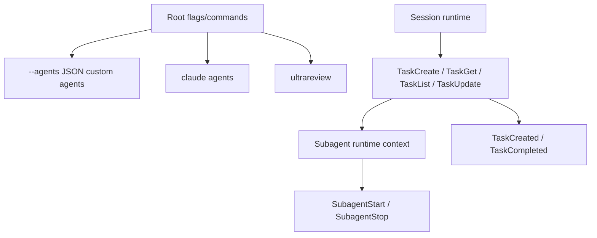

# Agents, tasks, and subagents

This page reverse-engineers the task and subagent paths that show how Claude Code delegates work inside a session.

## Source anchors

| Semantic alias | String or symbol | Meaning |
| --- | --- | --- |
| AgentsCommandFamily | `H.command("agents")` | Background agents command family. |
| InlineAgentsFlag | `--agents <json>` | Custom agent definitions injected from root flags. |
| TaskCreateTool | `var LX="TaskCreate"` | Task-create tool/action constant. |
| TaskGetTool | `var DQ="TaskGet"` | Task status/result retrieval constant. |
| TaskListTool | `var UZ="TaskList"` | Task list constant. |
| TaskUpdateTool | `var J0="TaskUpdate"` | Task update constant. |
| SubagentLifecycleHooks | `SubagentStart`, `SubagentStop` | Subagent lifecycle hook events. |
| TaskLifecycleHooks | `TaskCreated`, `TaskCompleted` | Task lifecycle hook events. |
| SubagentContextClassifier | `agentType==="subagent"` | Runtime subagent context classifier. |
| UltraReviewCommand | `H.command("ultrareview [target]")` | Cloud-hosted multi-agent code-review command. |

## Bundle modules in `cli.renamed.js`

| Semantic alias | Loader line | Representative renamed exports | Atlas entry |
|---|---:|---|---|
| `AgentWorktreeManager` | 631021 | `worktreeBranchName`, `validateWorktreeSlug`, `restoreWorktreeSession`, `persistWorktreeSession`, `removeAgentWorktree`, `listRegisteredWorktrees`, `parsePRReference`, `killTmuxSession` | [Bundle module map — git, worktree, and daemon](../99-research-atlas/module-map-from-renamed-cli.md#git-worktree-and-daemon) |
| `TeammateMailboxIpc` | 286598 | `writeToMailbox`, `sendShutdownRequestToMailbox`, `readUnreadMessages`, `formatTeammateMessages`, `createIdleNotification`, `isTaskAssignment`, `isStructuredProtocolMessage`, `getInboxPath` | [Bundle module map — session, transcript, agent metadata, and teammate IPC](../99-research-atlas/module-map-from-renamed-cli.md#session-transcript-agent-metadata-and-teammate-ipc) |
| `HookEventDispatcher` | 629735 | `getTeammateIdleHookMessage`, `getTaskCreatedHookMessage`, `getTaskCompletedHookMessage`, `hasHookForEvent`, `persistHookOutput` | [Bundle module map — permission, trust, hooks, and policy](../99-research-atlas/module-map-from-renamed-cli.md#permission-trust-hooks-and-policy) |

## Agent/task map

## Confirmed automation surfaces

| Surface | Runtime role |
|---|---|
| `claude agents` | Manages background agents; root flags on this command pass settings/MCP/plugins/model/permission defaults into dispatched sessions. |
| `--agents <json>` | Defines custom agents inline for the current session. The help example includes description and prompt fields. |
| `TaskCreate`, `TaskGet`, `TaskList`, `TaskUpdate` | Task tool/action names used by agent/task orchestration paths. |
| `SubagentStart`, `SubagentStop` | Hook events around subagent lifecycle. |
| `TaskCreated`, `TaskCompleted` | Hook events around task lifecycle. |
| `agentType === "subagent"` | Runtime context marker distinguishing subagent execution. |
| `ultrareview [target]` | Cloud-hosted multi-agent code-review command. |

## Background agents command flags

The `agents` command accepts settings/integration defaults for dispatched sessions, including:

- `--setting-sources`
- `--add-dir`
- `--plugin-dir`
- `--settings`
- `--mcp-config`
- `--strict-mcp-config`
- `--permission-mode`
- `--dangerously-skip-permissions`
- `--model`

This shows that background-agent sessions inherit the same core runtime surfaces as foreground sessions: settings, working directories, plugins, MCP, permissions, and models.

## Hosted review

`ultrareview [target]` is described as a cloud-hosted multi-agent code review command. Adjacent strings include `/ultrareview`, `/review`, and `/v1/ultrareview/preflight`, indicating both local command UX and remote preflight/API surfaces.

## Task and subagent runtime internals

This section deepens the surfaces above by mapping the task tool family, subagent lifecycle events, background/scheduled task mechanics, and hosted review surfaces.

### Additional anchors

| Semantic alias | String or symbol | Meaning |
| --- | --- | --- |
| TaskCreatePrompt | `Use this tool to create a structured task list for your current coding session` | `TaskCreate` prompt/description. |
| TaskGetDeferredDescriptor | `TaskGet`, `shouldDefer:!0`, `isReadOnly(){return!0}` | `TaskGet` is deferred, concurrency-safe, and read-only. |
| TaskUpdateFreshnessGuard | ``Make sure to read a task's latest state using `TaskGet` before updating it.`` | Task staleness guard in `TaskUpdate` prompt text. |
| TaskStoreNotFoundError | `Task not found:` | Task-store error path. |
| TaskUpdateWaiter | `_waitForTaskUpdate` | Task polling/wait behavior for not-yet-completed task results. |
| SubagentStartHookSchema | `SubagentStart`, `agent_id`, `agent_type` | Subagent start hook input schema. |
| SubagentStopHookSchema | `SubagentStop`, `agent_transcript_path`, `last_assistant_message` | Subagent stop hook input schema. |
| TaskLifecycleHookSchema | `TaskCreated`, `TaskCompleted` | Task lifecycle hook input schema. |
| LargeAgentDescriptionWarning | `Large agent descriptions` | Token-pressure warning for large custom-agent descriptions. |
| CronSchedulerPromptInjection | `createCronScheduler` | Scheduled/recurring task prompt injection inside headless loop. |
| UltraReviewPreflightApi | `/v1/ultrareview/preflight` | Hosted review preflight API path. |

### Task tool family

The task constants are grouped near `TodoWrite` and `Skill`, placing task orchestration in the same capability family as planning and skill dispatch: `TaskCreate`, `TaskGet`, `TaskList`, `TaskUpdate`.

`TaskUpdate` prompt text defines a status workflow `pending → in_progress → completed` and also allows `deleted`. It explicitly tells the model to read fresh task state with `TaskGet` before updating — a staleness warning implying the runtime expects concurrent/multi-agent task state to change underneath the current agent.

### Task result waiting

The task-store path around line ~99 follows a request handler pattern:

1. Fetch the task by ID.
2. If absent, throw `Task not found: <id>`.
3. If status is non-terminal, wait via `_waitForTaskUpdate(...)` and retry.
4. If terminal, fetch the task result, clear the task queue, and include task metadata in `_meta`.

This is why `TaskGet` is marked `shouldDefer: true` — a task query may wait for completion/update rather than returning immediately.

### Subagent context and hooks

The runtime has an async-local context classifier `agentType === "subagent"`. Related helpers derive whether the current execution is a built-in or user-defined subagent. Hook schemas then expose subagent lifecycle data:

| Hook | Fields | Runtime meaning |
|---|---|---|
| `SubagentStart` | `agent_id`, `agent_type` | A subagent execution started. |
| `SubagentStop` | `agent_id`, `agent_transcript_path`, `agent_type`, `last_assistant_message` | A subagent stopped and can expose transcript/summary context. |
| `TaskCreated` | `task_id`, `task_subject`, optional description/team fields | A task was created. |
| `TaskCompleted` | `task_id`, `task_subject`, optional description/team fields | A task completed. |

`SubagentStop` carrying `agent_transcript_path` and `last_assistant_message` indicates that subagent execution is transcript-backed and can surface a concise final message without parsing the full transcript.

### Background and scheduled task mechanics

Inside `HeadlessControlLoop`, when `isKairosCronEnabled()` is true, the runtime creates a cron scheduler whose `onFire` callback resolves a loop-default prompt and enqueues it as a later-priority prompt with a workload marker. Scheduled/recurring task behavior is therefore implemented by feeding prompts back into the same headless loop, not by a separate executor.

### Custom-agent token pressure

The `Large agent descriptions` warning is produced when custom-agent descriptions exceed a threshold. It lists the largest contributors and reports total tokens versus threshold — agent descriptions are counted as context budget contributors and can produce warnings before model execution.

### Hosted review path

`ultrareview [target]` is a top-level command described as cloud-hosted multi-agent code review. The preflight API path `/v1/ultrareview/preflight` checks whether the hosted review can run and returns user-facing blockers such as essential-traffic-only mode and data residency constraints.

### Implementation takeaways

1. Tasks are shared mutable runtime state; `TaskGet`/`TaskUpdate` are designed for staleness and concurrency.
2. Subagents have explicit runtime context, transcript paths, and lifecycle hooks.
3. Scheduled tasks re-enter the same loop as prompt injections.
4. Hosted multi-agent review is gated by a preflight API path and traffic/data policy conditions.
5. Custom-agent descriptions are budgeted as model context and can trigger token-pressure warnings.

## Agent communication protocol handoff

The source-confirmed agent/subagent communication surface is not a separate peer socket protocol. It is tool/state/event mediated: `SendMessage`, `TaskCreate`, `TaskGet`, `TaskList`, and `TaskUpdate` feed task stores, task queues, transcript-backed subagent contexts, and lifecycle hooks. Remote/team updates such as `team_permission_update` are typed envelopes on the broader runtime control channel. For the cross-cutting protocol view, see [Runtime communication protocols](../00-start-here/runtime-communication-protocols.md).

## Custom agent definitions lifecycle

The `AgentDefinitions` module (`cli.renamed.js:277638`-`277700`) classifies agent records and decides which agents are visible to a given session, including how each agent's MCP requirements interact with the configured MCP roster.

### Agent provenance

Every agent record carries a provenance tag. The classifiers:

| Helper | Returns true for |
|---|---|
| `isBuiltInAgent(agent)` | Agents bundled with Claude Code itself. |
| `isCustomAgent(agent)` | Agents loaded from a user-supplied JSON (CLI flag `--agents`, `.claude/agents/*.md`, etc.). |
| `isPluginAgent(agent)` | Agents contributed by an installed plugin. |

The provenance decides where edits are persisted and which permission tier owns the agent's frontmatter.

### MCP scope translation (`agentMcpSpecsToScopedConfigs`)

Each custom agent can declare `mcpServers` (the list of MCP servers it requires). `agentMcpSpecsToScopedConfigs(agent)` translates those specs into a scoped MCP config bag the MCP coordinator can merge into the session's roster:

- Agent-scoped MCP servers (only visible while that agent is active) are mounted with a private scope.
- Session-scoped MCP servers (declared by the agent but expected to be globally available) are merged into the regular session roster.

This is the mechanism that lets a subagent template say "I need this MCP server" without forcing the operator to register the server globally.

### MCP requirement filtering (`hasRequiredMcpServers`, `filterAgentsByMcpRequirements`)

Before the session offers an agent to the model, the runtime calls `filterAgentsByMcpRequirements(agents, availableMcpServers)`:

- For each agent, `hasRequiredMcpServers(agent, availableMcpServers)` checks that every `mcpServers[*]` entry is satisfied by the live MCP roster (after `agentMcpSpecsToScopedConfigs` has run).
- Agents whose requirements are unmet are dropped from the active list. The UI lists them under "unavailable agents" with the missing-server reason so the operator can install or enable the right MCP server.

### Active-agent resolution (`getActiveAgentsFromList`)

`getActiveAgentsFromList(allAgents)` is the final selector. It:

1. Filters by enabled / disabled / explicitly-allowlisted state.
2. Applies `filterAgentsByMcpRequirements(...)`.
3. Sorts by source priority (built-in < plugin < custom — later wins on name collision).
4. Returns the deduped active list the rest of the runtime treats as the source of truth.

### Cache invalidation (`clearAgentDefinitionsCache`)

Agent definitions are cached because parsing `.claude/agents/*.md` frontmatter on every turn would be wasteful. `clearAgentDefinitionsCache()` is called when:

- The user adds/removes an agent file (via the file watcher).
- A plugin install / uninstall flips the plugin-contributed agent list.
- The user runs `agents reload` from the CLI.

After invalidation, the next `getActiveAgentsFromList(...)` call re-parses everything.

## Related docs

- [Agent and automation architecture](architecture.md)
- [Agent runtime, scheduling, and completion](agent-runtime-scheduling-and-completion.md)
- [Slash commands and automation](slash-commands-and-automation.md)
- [Built-in tools and permissions](../03-tools-integrations-security/built-in-tools-and-permissions.md)
- [Headless streaming and resilience](../02-context-model-loop/headless-streaming-and-resilience.md)
- [Remote control and teleport](../04-sessions-persistence-remote/remote-control-and-teleport.md)
- [SDK query, session API, and subagent surface](../04-sessions-persistence-remote/sdk-query-and-session-api.md)
