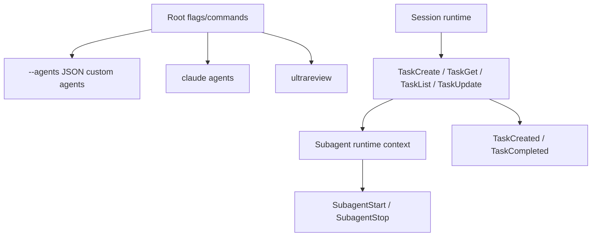

# Agents, tasks, and subagents

This page reverse-engineers the ordinary task and subagent paths that show how Claude Code delegates work inside a session. The cross-target send/receive lifecycle is documented in [Agent messaging and communication](agent-messaging.md), while the gated named-teammate special case is documented end to end in [Agent Teams](agent-teams.md).

## Source anchors

| Semantic alias | String or symbol | Meaning |
| --- | --- | --- |
| AgentsCommandFamily | `H.command("agents")` | Background agents command family. |
| InlineAgentsFlag | `--agents <json>` | Custom agent definitions injected from root flags. |
| TaskCreateTool | `var LX="TaskCreate"` | Task-create tool/action constant. |
| TaskGetTool | `var DQ="TaskGet"` | Task status/result retrieval constant. |
| TaskListTool | `var UZ="TaskList"` | Task list constant. |
| TaskUpdateTool | `var J0="TaskUpdate"` | Task update constant. |
| SubagentLifecycleHooks | `SubagentStart`, `SubagentStop` | Subagent lifecycle hook events. |
| TaskLifecycleHooks | `TaskCreated`, `TaskCompleted` | Task lifecycle hook events. |
| SubagentContextClassifier | `agentType==="subagent"` | Runtime subagent context classifier. |
| UltraReviewCommand | `H.command("ultrareview [target]")` | Cloud-hosted multi-agent code-review command. |
| AgentTool | `Agents run in the background by default` | Delegated agents launch asynchronously unless `run_in_background: false` is explicit. |
| ToolUseConcurrencyScheduler | `Y3g()` → `J3g()` → `Eao()`, `CLAUDE_CODE_MAX_TOOL_USE_CONCURRENCY` | Consecutive concurrency-safe tool calls run together, with a default scheduler limit of 10 [~343,247–343,330](../../claude-code-pkg/src/entrypoints/cli.renamed.js#L343247). |
| AgentConcurrencyDeclaration | `Agent.isConcurrencySafe() { return true }` | Multiple Agent calls in one assistant tool block are eligible for concurrent launch [~395,316](../../claude-code-pkg/src/entrypoints/cli.renamed.js#L395316). |
| AgentModelResolver | `oue()`, `CLAUDE_CODE_SUBAGENT_MODEL`, `model` | Environment, call, definition, and inherited-parent model precedence [~333,311–333,390](../../claude-code-pkg/src/entrypoints/cli.renamed.js#L333311). |
| ListAgentsContract | `ListAgents`, `Names are the address`, ` [ref]` | Describes conditional roster/reference semantics. No concrete `Ai({...})` definition is present in this retained source, and the SendMessage peer-candidate providers are empty. |
| SendMessagePinGuard | `send_message_pin_guard`, `now resolves to a different agent` | Prevents a reused display name from silently rebinding an established conversation recipient. |
| SendMessageResumeGuard | `AgentStoppedByUserError`, `ResumeAgentStateError` | User-stopped agents stay stopped; other stopped or evicted agents can be resumed from retained state/transcript. |
| AgentCleanupStages | `nonShellMonitors`, `shellTasks`, `keepaliveGated` | Agent-owned monitors and shell tasks can survive the completed turn while keepalive ownership remains active. |
| ObserverDeclaration | `observer`, `observerMessage`, `ObserverReport` | Experimental auto-spawned observer and its one-way report channel. |
| SessionSpawnCap | `CLAUDE_CODE_MAX_SUBAGENTS_PER_SESSION` | Session-wide spawn budget (default 200); `/clear` resets it. |
| ImplicitTeamContract | `team_name: "Deprecated; ignored. The session has a single implicit team."` | Explicit model-visible team setup is retired; actual teammate spawning still requires the [Agent Teams gate](agent-teams.md#what-one-implicit-team-means). |
| ForkAndSubtask | `Usage: /fork \<directive\>`, `Usage: /subtask \<task\>` | Background conversation copy versus in-session delegated subagent. |
| WorkflowTool | `Execute a workflow script that orchestrates multiple subagents deterministically` | Starts resumable deterministic orchestration as a background task. |
| BuiltInAgentRegistry | `getBuiltInAgents()` | Builds the conditional native-agent roster: up to six normal personas, or the coordinator-only worker roster [~282,836–282,862](../../claude-code-pkg/src/entrypoints/cli.renamed.js#L282836). |
| BuiltInAgentClassifier | `isBuiltInAgent(agent)`, `source === "built-in"` | Separates bundled definitions from plugin and settings/frontmatter agents [~282,933–282,948](../../claude-code-pkg/src/entrypoints/cli.renamed.js#L282933). |
| ForkAgentDefinition | `FORK_AGENT`, `agentType:"fork"` | Special inherited-context worker outside the normal registry [~259,981–260,006](../../claude-code-pkg/src/entrypoints/cli.renamed.js#L259981). |
| WorkflowSubagentDefinition | `agentType:"workflow-subagent"` | Internal default worker for deterministic Workflow `agent()` calls [~387,968–387,981](../../claude-code-pkg/src/entrypoints/cli.renamed.js#L387968). |

## Bundle modules in `cli.renamed.js`

| Semantic alias | Loader line | Representative renamed exports | Atlas entry |
|---|---:|---|---|
| `AgentWorktreeManager` | 631021 | `worktreeBranchName`, `validateWorktreeSlug`, `restoreWorktreeSession`, `persistWorktreeSession`, `removeAgentWorktree`, `listRegisteredWorktrees`, `parsePRReference`, `killTmuxSession` | [Bundle module map — git, worktree, and daemon](../99-research-atlas/module-map-from-renamed-cli.md#git-worktree-and-daemon) |
| `TeammateMailboxIpc` | 286598 | `writeToMailbox`, `sendShutdownRequestToMailbox`, `readUnreadMessages`, `formatTeammateMessages`, `createIdleNotification`, `isTaskAssignment`, `isStructuredProtocolMessage`, `getInboxPath` | [Bundle module map — session, transcript, agent metadata, and teammate IPC](../99-research-atlas/module-map-from-renamed-cli.md#session-transcript-agent-metadata-and-teammate-ipc) |
| `HookEventDispatcher` | 629735 | `getTeammateIdleHookMessage`, `getTaskCreatedHookMessage`, `getTaskCompletedHookMessage`, `hasHookForEvent`, `persistHookOutput` | [Bundle module map — permission, trust, hooks, and policy](../99-research-atlas/module-map-from-renamed-cli.md#permission-trust-hooks-and-policy) |

## Agent/task map

```mermaid
flowchart TD
    Root[Root flags/commands] --> Custom[--agents JSON custom agents]
    Root --> AgentsCmd[claude agents]
    Root --> Ultra[ultrareview]
    Runtime[Session runtime] --> TaskTools[TaskCreate / TaskGet / TaskList / TaskUpdate]
    TaskTools --> Subagent[Subagent runtime context]
    Subagent --> Hooks[SubagentStart / SubagentStop]
    TaskTools --> TaskHooks[TaskCreated / TaskCompleted]
```

## Confirmed automation surfaces

| Surface | Runtime role |
|---|---|
| `claude agents` | Manages background agents; root flags on this command pass settings/MCP/plugins/model/permission defaults into dispatched sessions. |
| `--agents <json>` | Defines custom agents inline for the current session. The help example includes description and prompt fields. |
| `TaskCreate`, `TaskGet`, `TaskList`, `TaskUpdate` | Task tool/action names used by agent/task orchestration paths. |
| `SubagentStart`, `SubagentStop` | Hook events around subagent lifecycle. |
| `TaskCreated`, `TaskCompleted` | Hook events around task lifecycle. |
| `agentType === "subagent"` | Runtime context marker distinguishing subagent execution. |
| `ultrareview [target]` | Cloud-hosted multi-agent code-review command. |
| `Agent` | Spawns a named/custom subagent in the background by default; can run synchronously, in a worktree, or on a gated remote environment. |
| Experimental Agent Teams | With the team gate and lead context active, an eligible named `Agent` call becomes an asynchronous in-process/tmux/iTerm2 teammate instead of an ordinary named subagent. |
| `ListAgents` / `SendMessage` | `SendMessage` addresses in-process subagents and teammates. The bundle describes a conditional peer roster and retains local/cloud delivery branches, but this exact build's resolver candidate providers return empty lists; another host/build would have to supply that roster. |
| `ObserverReport` | Sends an observer's one-way advisory report to its paired task or main conversation; unavailable as a normal peer-message channel. |
| `Workflow` | Runs explicit deterministic multi-agent orchestration and returns a background task/run ID. |
| `/fork` / `/subtask` | `/fork` creates a separate background-session copy; `/subtask` launches the old in-session delegation path. |

## Background agents command flags

The `agents` command accepts settings/integration defaults for dispatched sessions, including:

- `--setting-sources`
- `--add-dir`
- `--plugin-dir`
- `--settings`
- `--mcp-config`
- `--strict-mcp-config`
- `--permission-mode`
- `--dangerously-skip-permissions`
- `--model`
- `--effort`
- `--agent`
- `--json` (non-TTY roster output)
- `--all` (include completed rows with `--json`)

This shows that background-agent sessions inherit the same core runtime surfaces as foreground sessions: settings, working directories, plugins, MCP, permissions, and models.

## Built-in or “native” agent inventory

In this page, **native agent** means an agent definition whose source is exactly `"built-in"`. That produces two useful counts for Claude Code `2.1.215`:

- **Up to 6 normal built-in personas** returned by `getBuiltInAgents()` in a standard CLI session.
- **9 built-in role definitions in the bundle** when the coordinator-only `worker`, experimental `fork`, and internal `workflow-subagent` roles are included.

The live count can be lower because the registry is mode- and gate-dependent. Custom `.claude/agents/*.md`, `--agents` JSON, and plugin agents are dynamic and are not included in either count.

### Normal registry: up to six personas

| Agent type | Purpose | Tool/model profile | Availability boundary |
|---|---|---|---|
| `general-purpose` | Broad research, code search, analysis, and multi-step execution when no narrower persona fits. It is also the default ordinary `Agent` definition. | Full tool pool; model and permission mode normally inherit from the parent/call. | Always seeded in the normal roster [~282,480–282,497](../../claude-code-pkg/src/entrypoints/cli.renamed.js#L282480). |
| `Explore` | Fast, read-only file/symbol/pattern discovery. Its prompt explicitly forbids edits, file creation, deletion, and state-changing shell commands. | Read/search-oriented surface with mutation, delegation, and Artifact tools removed; normally inherits the parent model, with a provider-aware Explore override; omits `CLAUDE.md`. | Added together with `Plan` unless `CLAUDE_CODE_DISABLE_EXPLORE_PLAN_AGENTS` or `tengu_slate_ibis` disables the pair [~282,443–282,475, ~282,731–282,740](../../claude-code-pkg/src/entrypoints/cli.renamed.js#L282443). |
| `Plan` | Read-only software architect: explores existing patterns, evaluates trade-offs, and returns a step-by-step implementation strategy plus critical files. | Same read-only restrictions as Explore; inherits the model; omits `CLAUDE.md`. | Shares the Explore/Plan gate [~282,505–282,574](../../claude-code-pkg/src/entrypoints/cli.renamed.js#L282505). |
| `statusline-setup` | Creates or updates the user's Claude Code `statusLine` configuration, including PS1 conversion and settings edits; it does not execute the later [status-line runtime](../03-tools-integrations-security/status-line.md). | Exactly `Read` and `Edit`; fixed `sonnet`; orange UI color. | Omitted in safe mode because its persisted user setting would not render there [~282,577–282,729](../../claude-code-pkg/src/entrypoints/cli.renamed.js#L282577). |
| `claude-code-guide` | Documentation specialist for Claude Code, Claude Agent SDK, Claude API/Managed Agents, and Claude Tag; fetches official docs and considers the current configuration. | Read/search plus WebFetch/WebSearch-style documentation tools; fixed `haiku`; `dontAsk` permission mode. | Omitted from `sdk-ts`, `sdk-py`, and `sdk-cli` entrypoints [~282,323–282,350, ~282,853–282,859](../../claude-code-pkg/src/entrypoints/cli.renamed.js#L282323). |
| `claude` | Catch-all background-job/FleetView persona. Its extra prompt requires narration and machine-readable `result:`, `needs input:`, or `failed:` state signals. | Full tool pool; appends its background-job instructions to the normal prompt. | Omitted when `CLAUDE_CODE_DISABLE_AGENT_VIEW` or managed `disableAgentView` disables the agents view [~282,807–282,833](../../claude-code-pkg/src/entrypoints/cli.renamed.js#L282807). |

### Three special/internal built-in roles

| Agent type | Purpose | Why it is outside the normal-six count |
|---|---|---|
| `worker` | Autonomous research, implementation, or verification for coordinator mode; commits only its own edits and reports back to the coordinator. | When coordinator mode is active, `getBuiltInAgents()` returns **only** this persona instead of the normal roster [~282,742–282,804, ~282,842–282,846](../../claude-code-pkg/src/entrypoints/cli.renamed.js#L282742). |
| `fork` | Executes one directive with the parent's full conversation context while keeping intermediate tool output out of the parent context. | Defined as built-in but selected by a separate interactive experiment path, not returned by the normal registry; disabled in coordinator/noninteractive modes [~259,901–260,006](../../claude-code-pkg/src/entrypoints/cli.renamed.js#L259901). |
| `workflow-subagent` | Default synchronous return-value worker behind Workflow `agent()`; its final text is data returned verbatim to the script. | Internal to the Workflow runtime, not an ordinary user-selectable registry persona; cannot spawn Agent/Workflow recursively through its default tools [~387,952–387,983](../../claude-code-pkg/src/entrypoints/cli.renamed.js#L387952). |

`main`, `subagent`, `main-session`, `team-lead`, and `teammate` are runtime context/task labels, not additional built-in definitions. Observer agents are also not a fixed native persona: an observer names another available built-in, custom, or plugin agent definition.

### Registry gates and overrides

| Condition | Result |
|---|---|
| Noninteractive session plus `CLAUDE_AGENT_SDK_DISABLE_BUILTIN_AGENTS=true` | Returns no built-in agents. |
| Coordinator mode | Replaces the normal roster with `[worker]`. |
| Safe mode | Keeps built-ins but omits `statusline-setup`. |
| Agent view disabled | Omits `claude`; it does not remove the other normal personas. |
| Explore/Plan env or rollout gate off | Omits both `Explore` and `Plan`. |
| SDK TypeScript/Python/CLI entrypoint | Omits `claude-code-guide`. |
| Custom/plugin definition uses the same name | Active-agent precedence can replace a built-in by name; policy/flag sources win later in the merge. |

## Agent execution contract and limits

The `Agent` tool's current contract differs from the older synchronous Task mental model:

- `run_in_background` defaults to true. Set it to false only when the parent must block on that result before continuing.
- `name` makes a running agent addressable through `SendMessage`.
- `model` overrides the agent definition for one call; otherwise the definition or parent model is used.
- `isolation: "worktree"` creates an isolated checkout whose creation, locking, retained-change, and cleanup rules are documented in [Worktree isolation and handoffs](worktree-isolation-and-handoffs.md); gated `remote` isolation launches in a cloud environment.
- The deprecated `mode` input is ignored; subagents inherit the parent permission mode unless agent frontmatter overrides it.
- The deprecated `team_name` input is ignored because an enabled session derives one implicit team. This does **not** mean Agent Teams is always on; without the experimental gate, named calls follow the ordinary Agent path.

Subagents may spawn subagents up to five levels deep. A process-local session budget defaults to 200 spawned agents; exceeding it returns an explicit stop-delegating message and names `CLAUDE_CODE_MAX_SUBAGENTS_PER_SESSION` as the override. This budget is separate from a Workflow run's own 1,000-agent runaway backstop.

Messages from the launching agent are task direction, not user authorization. Cross-agent messages cannot approve permission requests; permission prompts from background subagents surface in the parent session.

Background-session completion and input-needed states can fire `Notification` hooks (`agent_completed`, `agent_needs_input`). `claude agents --json --all` exposes active/completed state for scripts, including what a waiting row is blocked on.

## How Agent calls select models and run concurrently

Agent model selection is configuration-driven rather than a general task-difficulty classifier. The exact order is:

| Priority | Source | Behavior |
|---:|---|---|
| 1 | `CLAUDE_CODE_SUBAGENT_MODEL` | Wins for every ordinary subagent when set to a value other than `inherit`. |
| 2 | `Agent({model})` | One-call override; ignored for fork agents. |
| 3 | `.claude/agents/*.md` or SDK agent-definition `model` | Agent-specific default. |
| 4 | Parent runtime model | `inherit` calls `getRuntimeMainLoopModel()` with the current permission mode, so plan-mode alias behavior and policy checks still apply. |

Every candidate still crosses `availableModels` and entitlement checks. If an Agent override is denied, the runtime logs the drop and inherits the parent runtime model instead of silently calling the forbidden model. Workflow `agent({model, effort})` uses the same model resolver and a separate effort override. See [Model selection, calls, usage, quota, and billing](../02-context-model-loop/model-selection-usage-quota-billing.md#resolution-matrix-by-execution-role).

There are two independent meanings of “parallel”:

1. **Parallel tool-call launch.** `Agent.isConcurrencySafe()` is always true. `Y3g()` groups consecutive concurrency-safe tool uses from one assistant response, and `J3g()` runs each group through `Eao()` with `CLAUDE_CODE_MAX_TOOL_USE_CONCURRENCY` or a default of 10. A non-concurrency-safe tool splits the sequence into an ordered barrier, so safe calls on opposite sides do not leapfrog it.
2. **Background lifetime.** Once an Agent call launches asynchronously (the default), its worker remains registered after the tool call returns. The tool scheduler slot is then free, so the default 10 is a concurrent **tool-handler/launch** limit, not a cap of ten live background agents. Live delegation is instead bounded by nesting depth, the default 200 session spawn budget, permissions, and available resources.

If several `run_in_background:false` Agent calls appear in one concurrency-safe block, the workers can still execute concurrently, but the parent model does not receive the combined tool-result message until the block settles. For asynchronous calls, it receives launch metadata quickly and later gets independent task notifications. Concurrent writers share the current checkout unless `isolation:"worktree"` (or an eligible remote environment) is selected; scheduler concurrency is not filesystem isolation.

## Peer addressing with `ListAgents`

The source-visible `ListAgents` description treats names as the primary address. The resolver's candidate-index shape can combine:

- in-process subagents spawned by the current session;
- other live local Claude sessions;
- the user's cloud Claude sessions when cloud access is available;
- Remote Control bridge sessions, which are reply-only from this path.

That is a capability shape, not proof of a live standalone roster in this artifact. No concrete `ListAgents` tool definition appears in the retained bundle, `Efo()` returns an empty local-session list, and `r7r()` returns an empty cloud-session list. Concrete `listLivePeerSessions()` and `listBridgePeerSessions()` implementations exist elsewhere, but are not called by `vfo()` here. The `SendMessage` local/cloud switch cases are therefore implemented route code whose normal discovery path is dormant in this exact build.

Callers copy the printed name into `SendMessage({to: "<name>", ...})`. A row's bracketed reference is appended only when duplicate names make the bare name ambiguous or an error requests disambiguation. The resolver returns candidate rows rather than guessing.

After a recipient resolves, the runtime can pin that identity. If the same display name later points to a different agent/session, `send_message_pin_guard` refuses the send and asks for an explicit reference instead of silently redirecting the message. This name-plus-ref contract also appears in the fully implemented `SendFile` body, but `SendFile.isEnabled()` is hard-coded false in this build and must not be treated as an available peer capability.

Delivery also distinguishes an explicit user stop from ordinary lifecycle cleanup. `SendMessage` refuses to resurrect an agent carrying the stopped-by-user marker. An otherwise stopped or evicted agent can be resumed, including by rebuilding resumable state from its transcript; failure to recover that state is reported instead of silently starting an unrelated recipient. The established name pin still applies after resumption.

Observers are intentionally excluded from ordinary messaging: `SendMessage` rejects observer callers/targets, and observers report only through `ObserverReport`. See [Observer agents](observer-agents.md) for pairing, repeated permission checks, digest framing, and resume behavior.

## Hosted review

`ultrareview [target]` is described as a cloud-hosted multi-agent code review command. Adjacent strings include `/ultrareview`, `/review`, and `/v1/ultrareview/preflight`, indicating both local command UX and remote preflight/API surfaces.

## Task and subagent runtime internals

This section deepens the surfaces above by mapping the task tool family, subagent lifecycle events, background/scheduled task mechanics, and hosted review surfaces.

### Additional anchors

| Semantic alias | String or symbol | Meaning |
| --- | --- | --- |
| TaskCreatePrompt | `Use this tool to create a structured task list for your current coding session` | `TaskCreate` prompt/description. |
| TaskGetDeferredDescriptor | `TaskGet`, `shouldDefer:!0`, `isReadOnly(){return!0}` | `TaskGet` is deferred, concurrency-safe, and read-only. |
| TaskUpdateFreshnessGuard | ``Make sure to read a task's latest state using `TaskGet` before updating it.`` | Task staleness guard in `TaskUpdate` prompt text. |
| TaskStoreNotFoundError | `Task not found:` | Task-store error path. |
| TaskUpdateWaiter | `_waitForTaskUpdate` | Task polling/wait behavior for not-yet-completed task results. |
| SubagentStartHookSchema | `SubagentStart`, `agent_id`, `agent_type` | Subagent start hook input schema. |
| SubagentStopHookSchema | `SubagentStop`, `agent_transcript_path`, `last_assistant_message` | Subagent stop hook input schema. |
| TaskLifecycleHookSchema | `TaskCreated`, `TaskCompleted` | Task lifecycle hook input schema. |
| LargeAgentDescriptionWarning | `Large agent descriptions` | Token-pressure warning for large custom-agent descriptions. |
| CronSchedulerPromptInjection | `createCronScheduler` | Scheduled/recurring task prompt injection inside headless loop. |
| UltraReviewPreflightApi | `/v1/ultrareview/preflight` | Hosted review preflight API path. |

### Task tool family

The task constants are grouped near `TodoWrite` and `Skill`, placing task orchestration in the same capability family as planning and skill dispatch: `TaskCreate`, `TaskGet`, `TaskList`, `TaskUpdate`.

`TaskUpdate` prompt text defines a status workflow `pending → in_progress → completed` and also allows `deleted`. It explicitly tells the model to read fresh task state with `TaskGet` before updating — a staleness warning implying the runtime expects concurrent/multi-agent task state to change underneath the current agent.

### External SDK/MCP task-result waiting

This subsection describes the method-oriented SDK/MCP task protocol, not the local shared-task files used by Agent Teams. Local `TaskGet` reads one shared JSON task record immediately; see [Agent Teams — shared task lifecycle](agent-teams.md#shared-task-lifecycle).

The task-store path around line ~99 follows a request handler pattern:

1. Fetch the task by ID.
2. If absent, throw `Task not found: <id>`.
3. If status is non-terminal, wait via `_waitForTaskUpdate(...)` and retry.
4. If terminal, fetch the task result, clear the task queue, and include task metadata in `_meta`.

This is why the SDK/MCP `TaskGet` is marked `shouldDefer: true` — that protocol query may wait for completion/update rather than returning immediately. The local shared-task `TaskGet` does not use this waiter.

### Subagent context and hooks

The runtime has an async-local context classifier `agentType === "subagent"`. Related helpers derive whether the current execution is a built-in or user-defined subagent. Hook schemas then expose subagent lifecycle data:

| Hook | Fields | Runtime meaning |
|---|---|---|
| `SubagentStart` | `agent_id`, `agent_type` | A subagent execution started. |
| `SubagentStop` | `agent_id`, `agent_transcript_path`, `agent_type`, `last_assistant_message` | A subagent stopped and can expose transcript/summary context. |
| `TaskCreated` | `task_id`, `task_subject`, optional description/team fields | A task was created. |
| `TaskCompleted` | `task_id`, `task_subject`, optional description/team fields | A task completed. |

`SubagentStop` carrying `agent_transcript_path` and `last_assistant_message` indicates that subagent execution is transcript-backed and can surface a concise final message without parsing the full transcript.

Agent-turn completion is staged cleanup rather than an unconditional kill of every descendant resource. Cleanup stages for agent-owned non-shell monitors and shell tasks are `keepaliveGated`: active ownership can preserve those background resources beyond the agent's completed turn, after which the normal task cleanup/eviction path can retire them. This is separate from worktree cleanup: an unchanged native Git worktree is removed, while a changed worktree is unlocked and retained so its path and branch can be returned.

### Background and scheduled task mechanics

Inside `HeadlessControlLoop`, when `isKairosCronEnabled()` is true, the runtime creates a cron scheduler whose `onFire` callback resolves a loop-default prompt and enqueues it as a later-priority prompt with a workload marker. Scheduled/recurring task behavior is therefore implemented by feeding prompts back into the same headless loop, not by a separate executor.

### Custom-agent token pressure

The `Large agent descriptions` warning is produced when custom-agent descriptions exceed a threshold. It lists the largest contributors and reports total tokens versus threshold — agent descriptions are counted as context budget contributors and can produce warnings before model execution.

### Hosted review path

`ultrareview [target]` is a top-level command described as cloud-hosted multi-agent code review. The preflight API path `/v1/ultrareview/preflight` checks whether the hosted review can run and returns user-facing blockers such as essential-traffic-only mode and data residency constraints.

### Implementation takeaways

1. Tasks are shared mutable runtime state; `TaskGet`/`TaskUpdate` are designed for staleness and concurrency.
2. Subagents have explicit runtime context, transcript paths, and lifecycle hooks.
3. Scheduled tasks re-enter the same loop as prompt injections.
4. Hosted multi-agent review is gated by a preflight API path and traffic/data policy conditions.
5. Custom-agent descriptions are budgeted as model context and can trigger token-pressure warnings.

Deterministic multi-agent fan-out is owned by the separate [`Workflow` lifecycle](dynamic-workflows.md). Use individual `Agent` calls for ordinary delegation; use `Workflow` only after explicit user opt-in to multi-agent orchestration.

Experimental read-only supervision is owned by [Observer agents](observer-agents.md). It composes with the Agent permission boundary but uses a separate pairing registry and `observer-ref` transcript record.

## Agent communication protocol handoff

Ordinary live subagents receive `SendMessage` through process-local pending-message queues at a later model/tool boundary. Experimental teammates instead use locked JSON-array inbox files under `~/.claude/teams/<team>/inboxes/`, with structured frames serialized inside each envelope's `text`; `team_permission_update` is deliberately dropped. Shared task records are a third, separate file protocol. See [Agent messaging and communication](agent-messaging.md) for the complete resolve → transport → receive → reply path, [Agent Teams](agent-teams.md#messaging-and-protocol-frames) for exact team paths and trust checks, and [Runtime communication protocols](../00-start-here/runtime-communication-protocols.md) for the cross-module view.

## Custom agent definitions lifecycle

The `AgentDefinitions` module (`cli.renamed.js:277638`-`277700`) classifies agent records and decides which agents are visible to a given session, including how each agent's MCP requirements interact with the configured MCP roster.

### Agent provenance

Every agent record carries a provenance tag. The classifiers:

| Helper | Returns true for |
|---|---|
| `isBuiltInAgent(agent)` | Agents bundled with Claude Code itself. |
| `isCustomAgent(agent)` | Agents loaded from a user-supplied JSON (CLI flag `--agents`, `.claude/agents/*.md`, etc.). |
| `isPluginAgent(agent)` | Agents contributed by an installed plugin. |

The provenance decides where edits are persisted and which permission tier owns the agent's frontmatter.

### MCP scope translation (`agentMcpSpecsToScopedConfigs`)

Each custom agent can declare `mcpServers` (the list of MCP servers it requires). `agentMcpSpecsToScopedConfigs(agent)` translates those specs into a scoped MCP config bag the MCP coordinator can merge into the session's roster:

- Agent-scoped MCP servers (only visible while that agent is active) are mounted with a private scope.
- Session-scoped MCP servers (declared by the agent but expected to be globally available) are merged into the regular session roster.

This is the mechanism that lets a subagent template say "I need this MCP server" without forcing the operator to register the server globally.

### MCP requirement filtering (`hasRequiredMcpServers`, `filterAgentsByMcpRequirements`)

Before the session offers an agent to the model, the runtime calls `filterAgentsByMcpRequirements(agents, availableMcpServers)`:

- For each agent, `hasRequiredMcpServers(agent, availableMcpServers)` checks that every `mcpServers[*]` entry is satisfied by the live MCP roster (after `agentMcpSpecsToScopedConfigs` has run).
- Agents whose requirements are unmet are dropped from the active list. The UI lists them under "unavailable agents" with the missing-server reason so the operator can install or enable the right MCP server.

### Active-agent resolution (`getActiveAgentsFromList`)

`getActiveAgentsFromList(allAgents)` is the final selector. It:

1. Filters by enabled / disabled / explicitly-allowlisted state.
2. Applies `filterAgentsByMcpRequirements(...)`.
3. Sorts by source priority (built-in < plugin < custom — later wins on name collision).
4. Returns the deduped active list the rest of the runtime treats as the source of truth.

### Cache invalidation (`clearAgentDefinitionsCache`)

Agent definitions are cached because parsing `.claude/agents/*.md` frontmatter on every turn would be wasteful. `clearAgentDefinitionsCache()` is called when:

- The user adds/removes an agent file (via the file watcher).
- A plugin install / uninstall flips the plugin-contributed agent list.
- The user runs `agents reload` from the CLI.

After invalidation, the next `getActiveAgentsFromList(...)` call re-parses everything.

## Related docs

- [Agent and automation architecture](architecture.md)
- [Worktree isolation and handoffs](worktree-isolation-and-handoffs.md)
- [Agent messaging and communication](agent-messaging.md)
- [Agent Teams](agent-teams.md)
- [Agent steering, interruption, and completion](agent-steering-interruption-and-completion.md)
- [Observer agents](observer-agents.md)
- [Slash commands and automation](slash-commands-and-automation.md)
- [Built-in tools and permissions](../03-tools-integrations-security/built-in-tools-and-permissions.md)
- [Headless streaming and resilience](../02-context-model-loop/headless-streaming-and-resilience.md)
- [Remote control and teleport](../04-sessions-persistence-remote/remote-control-and-teleport.md)
- [SDK query, session API, and subagent surface](../04-sessions-persistence-remote/sdk-query-and-session-api.md)
