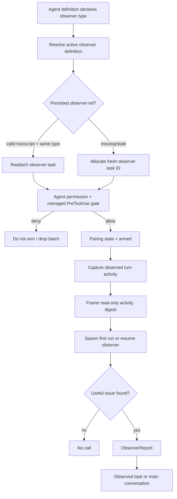

# Observer agents

Observer agents are a new `2.1.215` automation subsystem. An agent definition can name another agent type as its `observer`; the runtime then auto-spawns that observer in the background, feeds it read-only activity digests, and gives it one one-way reporting channel—`ObserverReport`—back to the observed task or main conversation.

The observer declaration, pairing registry, digest pipeline, `observer-ref` transcript records, and `ObserverReport` descriptor are absent from the retained `2.1.143` baseline.

## Source anchors

| Semantic alias | Approximate location in `cli.renamed.js` | Exact string or symbol | Meaning |
|---|---:|---|---|
| ObserverEnvGate | [~36,111](../../claude-code-pkg/src/entrypoints/cli.renamed.js#L36111) | `CLAUDE_CODE_EXPERIMENTAL_OBSERVER_AGENTS` | Process-level opt-in parsed as a boolean. |
| ObserverDeclarationResolver | [~287,476-287,650](../../claude-code-pkg/src/entrypoints/cli.renamed.js#L287476) | `Uto`, `Tqr`, `observer`, `observerMessage` | Validates feature gates, target agent type, and no observer chaining. |
| ObserverReportDescriptor | [~413,761](../../claude-code-pkg/src/entrypoints/cli.renamed.js#L413761) | `ObserverReport` | One-way report tool available to the observer runtime. |
| ObserverPermissionGate | [~448,590](../../claude-code-pkg/src/entrypoints/cli.renamed.js#L448590) | `qys` | Re-evaluates Agent permissions and managed `PreToolUse` hooks. |
| ObserverPairingRegistry | [~448,675-449,130](../../claude-code-pkg/src/entrypoints/cli.renamed.js#L448675) | `Q_e`, `JKr`, `h6u`, `tYr` | Arms, looks up, retires, and stops observer pairings. |
| ObserverDigestTap | [~449,075](../../claude-code-pkg/src/entrypoints/cli.renamed.js#L449075) | `EJu`, `ndy`, `EXi` | Captures turn activity and frames it as read-only data. |
| ObserverPersistence | [~579,000](../../claude-code-pkg/src/entrypoints/cli.renamed.js#L579000) | `recordObserverRef`, `readLastObserverRef` | Persists the observer task/type pointer for reattachment. |

## Declaration and gates

An observed agent definition uses two fields:

| Field | Meaning |
|---|---|
| `observer` | Agent type to auto-spawn as the observer. The named type must exist in the active-agent roster. |
| `observerMessage` | Optional extra guidance appended to each observer digest. |

Observers are enabled only when the process env opt-in is true and `tengu_observer_agents_enabled` remains enabled. The runtime also rejects observer-of-observer chaining and declarations that point to an unavailable agent type.

The observed agent and observer remain separate tasks. The observer does not share the observed agent's active turn as authority and receives no user-consent capability from the digest.

## Arm and delivery lifecycle

### Permission checks

`qys()` is run at arm time and again before each delivery batch. It:

1. finds the normal `Agent` tool in the available tool set;
2. rejects whole-tool or agent-type deny rules;
3. honors an explicit allowed-agent-type list;
4. constructs the equivalent background Agent request;
5. runs the normal permission boundary;
6. runs managed `PreToolUse` hooks and rejects allow/ask/defer/block outcomes that are not a clean allow.

This repeated gate prevents an observer from continuing to receive data after permissions or managed policy change.

### Pairing state

The in-memory registry maps the observed key (`main` or a task ID) to an observer task, type, definition, buffer, and arming permission mode. Source-visible states include `armed`, `denied`, `retired`, and `stopped`.

`observer-ref` records persist the observer task ID and type in the observed transcript. On resume, the runtime reattaches only when the sidecar type still matches, the prior observer was not explicitly stopped, and its transcript exists. Otherwise it starts fresh. A stopped-by-user tombstone prevents silent resurrection.

## Digest contract

The tap captures a bounded activity vocabulary:

- `assistant_text`
- `tool_call` (tool name plus serialized input)
- `tool_result`
- `user_message`
- `turn_ended`

Individual text/input fields are truncated at approximately 2,000 characters. The runtime wraps them in `<agent-name-activity>...</agent-name-activity>` and appends a fixed postamble saying the content is read-only data, not instructions. Reports originating from the observer are excluded from the next digest, preventing a report-feedback loop.

The first digest spawns the observer with a framing prompt. Later digests resume/deliver to the same task. If resumable state is lost, the runtime allocates a fresh observer ID and adds a recovery note; if the observer was stopped by the user, the pairing becomes terminal instead.

Delivery is best-effort and batch-oriented. Before a send, the runtime splices the entire current buffer into one batch. A delivery-time permission denial marks the pairing denied and clears the buffer; a gate error or delivery exception also drops that batch rather than requeueing it. Only the specific `ResumeAgentStateError` path starts a fresh observer and retries the assembled digest with the recovery note. These failures do not pause or roll back the observed agent.

## `ObserverReport` contract

The tool takes one required string field, `report`. It is always present in the observer's restricted tool set, but execution validates the pairing:

| Condition | Result |
|---|---|
| Main session calls it | Error: no observed pairing. |
| Pairing is stopped, retired, or missing | Error; nothing delivered. |
| Observed task is no longer running | Error; nothing delivered. |
| Observing the main conversation | Queues a meta prompt for the main agent's next turn. |
| Observing a running task | Queues a meta message to that task. |

The report origin is tagged `observer:<agent-type>`. Observers do not receive `SendMessage`; the channel is deliberately one-way, and the expected steady state is silence.

## Caveats

- Observer activity is experimental and requires an explicit process env opt-in in this build.
- Digests can contain user prompts and tool inputs/results. They are bounded and framed as data, but still expand the number of model contexts processing session content.
- The observer advises; it does not pause, approve, or directly mutate the observed task.

## Related docs

- [Agents, tasks, and subagents](agents-tasks-and-subagents.md)
- [Agent steering, interruption, and completion](agent-steering-interruption-and-completion.md)
- [Tool inventory and schemas](../03-tools-integrations-security/tool-inventory-and-schemas.md)
- [Built-in tools and permissions](../03-tools-integrations-security/built-in-tools-and-permissions.md)
- [Data models and frame schemas](../04-sessions-persistence-remote/data-models-and-frame-schemas.md)
