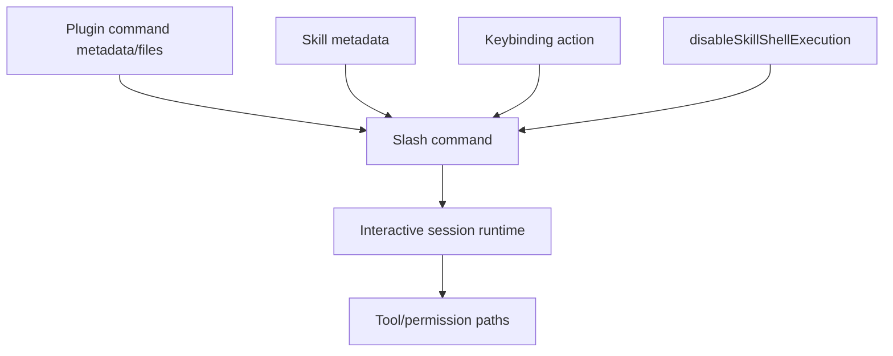

# Slash commands and automation

This page documents slash-command and automation surfaces that complement the agent/task runtime.

## Source anchors

| Semantic alias | String or symbol | Meaning |
| --- | --- | --- |
| PluginSlashCommandSchema | `slash command name` | Plugin schema surface for command files becoming slash commands. |
| SkillSlashDispatch | `via Skill tool or slash command` | Skill dispatch can be triggered by slash commands. |
| SkillShellExecutionPolicy | `Disable inline shell execution in skills and custom slash commands` | Policy boundary for slash-command shell execution. |
| SlashCommandKeybindings | `command:help`, `command:compact` | Keybinding action can execute slash commands. |
| PermissionsSlashCommandHint | `/permissions to manage` | Runtime UX string pointing to permission slash command. |
| DoctorSlashDiagnosticSurface | `/doctor diagnostics screen` | Slash/UI diagnostic surface. |
| AutoModeCommand | `H.command("auto-mode")` | Automation/classifier inspection command. |
| AutoModeConsentDebug | `[auto-mode] hasAutoModeOptIn=` | Auto-mode consent/config debug string. |

## Automation surfaces

| Surface | Runtime role |
|---|---|
| Slash command files | Plugin/schema strings state command name becomes slash command name, e.g. `about` → `/plugin:about`. |
| Skill dispatch | Skills can be dispatched through the `Skill` tool or slash command. |
| Inline shell policy | Managed policy can disable inline shell execution in skills/custom slash commands. |
| Keybindings | Keybinding actions can execute command names such as `command:help` and `command:compact`. |
| Permission UX | `/permissions` manages working-directory/tool permission state. |
| Doctor UX | `/doctor` is a diagnostic screen in the interactive UI. |
| `auto-mode` | Command for inspecting classifier defaults/config and critiquing custom rules. |

## Slash-command path



## Auto-mode

`auto-mode` is registered as a top-level command when the feature is not disabled. It exposes subcommands for defaults/config inspection and an AI critique path for custom rules. Nearby debug strings show opt-in logic from user/local/flag/policy values.

## Subcommand tokenization (`matchSubcommand`)

Slash commands that take an inline subcommand (Skills, `/loop`, `/dream`, `/schedule`, ...) share a single tokenizer at [cli.renamed.js line 718837](../../claude-code-pkg/src/entrypoints/cli.renamed.js#L718837):

```js
function matchSubcommand(H) {
  let $ = H.trim().toLowerCase().split(/\s+/)[0] ?? "";
  return jKA.find((q) => q === $) ?? "none";
}
```

The matcher is deliberately strict: only the first whitespace-separated token after the command name is inspected, the comparison is case-insensitive, and anything not in the registered list collapses to `"none"`. The accepted list is owned by each skill / command — e.g. the Claude API skill ships `jKA = ["migrate", "managed-agents-onboard"]`, so `"/claude-api migrate help me port to 4.7"` resolves to `migrate` and everything after the first token becomes the free-form argument string. The result is reported as both a telemetry dimension (`tengu_claude_api_skill_loaded` carries `subcommand` and `has_args`) and a prompt-template selector.

This pattern explains why the same skill can answer different shapes of question with different prompt blocks: the runtime never tries to parse flags or sub-flags inside the slash command — the registered subcommand is just a small finite set that picks a prompt branch, and the rest of the user input is appended verbatim under `## User Request`. That keeps the parser tiny and predictable while still letting skills declare multi-mode behavior without growing a real argument parser.

## Related docs

- [Agents, tasks, and subagents](agents-tasks-and-subagents.md)
- [Agent runtime, scheduling, and completion](agent-runtime-scheduling-and-completion.md)
- [MCP, plugins, and hooks](../03-tools-integrations-security/mcp-plugins-hooks.md)
- [Settings, policy, and integrations](../03-tools-integrations-security/settings-policy-and-integrations.md)
