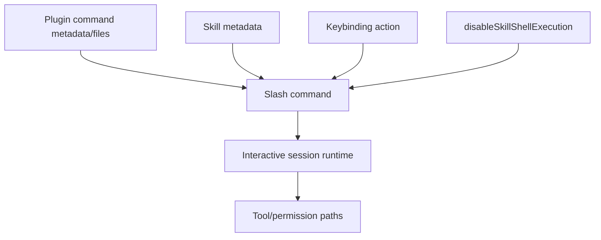
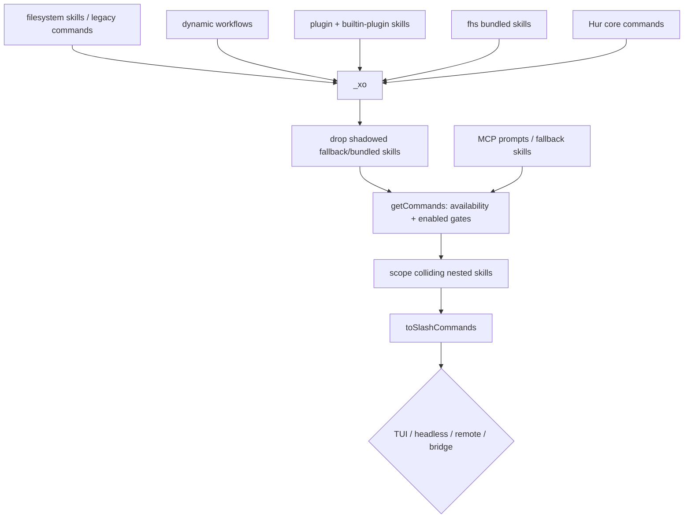
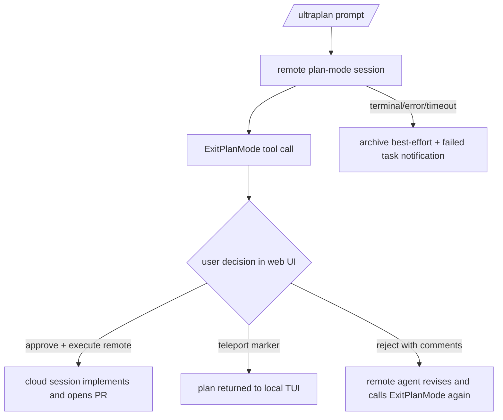
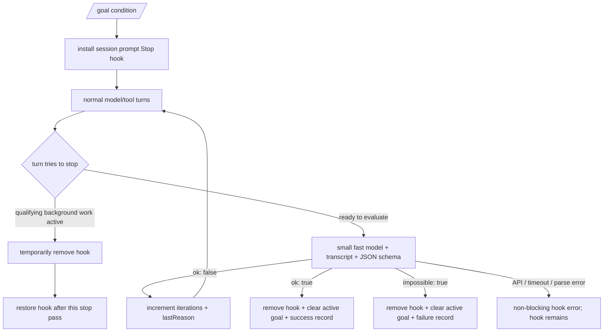

# Slash commands and automation

This page documents slash-command and automation surfaces that complement the agent/task runtime.

## Source anchors

| Semantic alias | String or symbol | Meaning |
| --- | --- | --- |
| PluginSlashCommandSchema | `slash command name` | Plugin schema surface for command files becoming slash commands. |
| SkillSlashDispatch | `via Skill tool or slash command` | Skill dispatch can be triggered by slash commands. |
| SkillShellExecutionPolicy | `Disable inline shell execution in skills and custom slash commands` | Policy boundary for slash-command shell execution. |
| SkillShellPlaceholder | `[shell command execution disabled by policy]` | Literal replacement inserted for eligible fenced or inline shell forms when execution is disabled. |
| ModelInvocationBoundary | `disableModelInvocation` | Excludes a skill from model/`Skill` invocation while preserving direct user invocation when otherwise enabled. |
| UnknownCommandResult | `Unknown command: /...`, `Did you mean /...?` | Recognized unknown command names return locally without a model request. |
| SlashCommandKeybindings | `command:help`, `command:compact` | Keybinding action can execute slash commands. |
| PermissionsSlashCommandHint | `/permissions to manage` | Runtime UX string pointing to permission slash command. |
| DoctorSlashDiagnosticSurface | `/doctor diagnostics screen` | Slash/UI diagnostic surface. |
| CoreCommandRegistry | `Hur()`, `getBuiltinCommands()` | Memoized core `local`, `local-jsx`, and built-in `prompt` command array [~567,141–567,875](../../claude-code-pkg/src/entrypoints/cli.renamed.js#L567141). |
| CommandAggregation | `_xo()`, `getCommands()` | Merges filesystem skills, workflows, plugin/MCP/bundled skills, and core commands, then resolves gates and collisions [~567,226–567,327](../../claude-code-pkg/src/entrypoints/cli.renamed.js#L567226). |
| BundledSkillRegistration | `Lu()`, `fhs()`, `phs` | Converts bundled metadata/assets into `prompt` commands and applies the bundled-skill kill switch [~421,026–421,095](../../claude-code-pkg/src/entrypoints/cli.renamed.js#L421026). |
| CommandSurfaceFilters | `filterCommandsForHeadless`, `filterCommandsForRemoteMode`, `isThinClientSafe`, `findBridgeFallback` | Separates TUI-only, headless-capable, thin-client-safe, and bridge-fallback commands [~567,430–567,505](../../claude-code-pkg/src/entrypoints/cli.renamed.js#L567430). |
| SkillInvocationGate | `I8r()`, `getSkillOverride()`, `isSkillExcludedFromModel()` | Enforces user/model caller boundaries, allowlists, kill switches, and permission rules [~355,113–355,260](../../claude-code-pkg/src/entrypoints/cli.renamed.js#L355113). |
| AutoModeCommand | `H.command("auto-mode")` | Automation/classifier inspection command. |
| AutoModeConsentDebug | `[auto-mode] hasAutoModeOptIn=` | Auto-mode consent/config debug string. |
| ConfigKeyValueCommand | `Usage: /config key=value [key=value ...]` | Applies settings without opening the full settings UI. |
| ChangeDirectoryCommand | `Usage: /cd <path>` | Moves the live session to another working directory. |
| SideQuestionCommand | `name: "btw"`, `runSideQuestion()`, `side_question` | Runs a one-turn no-tool fork without interrupting or appending to the main transcript [~730,320–730,445](../../claude-code-pkg/src/entrypoints/cli.renamed.js#L730320). |
| AutofixPrCommand | `name: "autofix-pr"`, `H4_()`, `subscribeRemoteSessionToPR` | Resolves an open PR, creates/deduplicates a cloud repair session, and subscribes it to PR events [~740,445–740,690](../../claude-code-pkg/src/entrypoints/cli.renamed.js#L740445). |
| UltraplanCommand | `name: "ultraplan"`, `Zcr()`, `L3y()`, `YHd()` | Launches remote plan mode, polls structured events, and routes approval to remote execution or local teleport [~556,720–558,120](../../claude-code-pkg/src/entrypoints/cli.renamed.js#L556720). |
| ForkCommand | `Usage: /fork \<directive\>` | Starts a conversation copy as a background session. |
| SubtaskCommand | `Usage: /subtask \<task\>` | Starts an in-session delegated subagent. |
| WorkflowsCommand | `/workflows` | Opens dynamic workflow progress/history and stop controls. |
| GoalCommandRegistration | `name: "goal"`, `Set a goal Claude checks before stopping` | Interactive and non-interactive command registrations expose `/goal [<condition> | clear]` [~563,938-564,000](../../claude-code-pkg/src/entrypoints/cli.renamed.js#L563938). |
| GoalSessionStopHook | `gsr()`, `ysr()`, `sessionHooksRegistry.add(..., "Stop", ..., {type:"prompt"})` | Setting a goal installs one unscoped session prompt Stop hook; clearing removes matching hooks [~454,790-454,881](../../claude-code-pkg/src/entrypoints/cli.renamed.js#L454790). |
| GoalEvaluator | `JPd()`, `querySource: "hook_prompt"`, `impossible` | A small, tool-free model judges the condition against transcript evidence through structured JSON [~573,350-573,530](../../claude-code-pkg/src/entrypoints/cli.renamed.js#L573350). |
| GoalContinuationLoop | `active_goal`, `goal_status`, `tengu_goal_achieved` | Stop-hook results clear, fail, or update the active goal and force another normal-loop turn when unmet [~458,940-459,120](../../claude-code-pkg/src/entrypoints/cli.renamed.js#L458940). |
| GoalTranscriptRestore | `findGoalToRestore()`, `restoreGoalFromTranscript()` | Resume/fork reconstructs an unfinished goal from the newest goal-status attachment [~860,118-860,150](../../claude-code-pkg/src/entrypoints/cli.renamed.js#L860118). |
| GoalMetadataAndRemoteState | `notifyActiveGoalChanged`, `goal`, `lastActiveGoal` | Active-goal state is mirrored to metadata, SDK/remote events, and remote-history seeds [~632,689](../../claude-code-pkg/src/entrypoints/cli.renamed.js#L632689), [~977,700-978,040](../../claude-code-pkg/src/entrypoints/cli.renamed.js#L977700). |
| TeamOnboardingCommand | `name: "team-onboarding"`, `disableModelInvocation: true` | User-only workflow that analyzes recent local usage and drafts `ONBOARDING.md`. |
| TeamOnboardingShare | `ShareOnboardingGuide`, `allow_team_onboarding` | Optional organization-hosted share/update/delete layer for the generated guide. |

## Automation surfaces

| Surface | Runtime role |
|---|---|
| Slash command files | Plugin/schema strings state command name becomes slash command name, e.g. `about` → `/plugin:about`. |
| Skill dispatch | Skills can be dispatched through the `Skill` tool or slash command. |
| Inline shell policy | Managed policy can disable inline shell execution in skills/custom slash commands. |
| Keybindings | Keybinding actions can execute command names such as `command:help` and `command:compact`. |
| Permission UX | `/permissions` manages working-directory/tool permission state. |
| Doctor UX | `/doctor` is a diagnostic screen in the interactive UI. |
| `auto-mode` | Command for inspecting classifier defaults/config and critiquing custom rules. |
| `/config key=value` | Sets one or more settings directly; bare `/config` opens the interactive settings screen. |
| `/cd <path>` | Changes the session cwd and triggers associated root/MCP/hook updates. |
| `/btw <question>` | Answers one context-only side question in a disposable one-turn fork while the main agent continues. |
| `/fork <directive>` | Creates a separately managed background copy of the conversation. |
| `/subtask <task>` | Delegates one task inside the current session. |
| `/workflows` | Shows live and historical deterministic workflow runs. |
| `/goal [<condition> \| clear]` | Installs, inspects, or removes a session-scoped prompt Stop hook that checks whether Claude may finish. |
| `/team-onboarding` | Scans bounded recent local session usage, drafts `ONBOARDING.md`, collects team review input, and optionally preserves one hosted share link across the draft/final update. |
| Built-in command registry | Combines local TUI/text handlers, built-in prompts, bundled skills, workflows, plugin/filesystem skills, and MCP prompts before advertising a surface-specific subset. |

## Slash-command path


```mermaid
flowchart TD
    Plugin[Plugin command metadata/files] --> Slash[Slash command]
    Skill[Skill metadata] --> Slash
    Keybinding[Keybinding action] --> Slash
    Slash --> Runtime[Interactive session runtime]
    Runtime --> Tools[Tool/permission paths]
    Policy[disableSkillShellExecution] --> Slash
```

## Execution boundaries

Managed `disableSkillShellExecution` does not reject the whole skill. For eligible user/project/plugin skill and legacy-command content, the runtime replaces `` ```! ... ``` `` fenced blocks and inline `` !`...` `` forms with the literal `[shell command execution disabled by policy]`; it does not run those commands or substitute their output. Policy-sourced skills are trusted separately and bypass this replacement branch, remaining on the normal permission-checked local shell-expansion path. MCP-served prompts neither execute local shell expansion nor receive the placeholder replacement.

`disableModelInvocation` is a caller boundary, not a synonym for “disabled command.” It keeps the command out of model-visible Skill invocation and prevents workers/coordinators from invoking it through that path, while an otherwise enabled, user-invocable command can still run when the user types its slash command directly in the ordinary command path. Conversely, `user-invocable: false` blocks direct user execution and tells the user to ask Claude to use the skill.

If a slash-shaped first token is syntactically command-like but resolves to no enabled command, dispatch returns `Unknown command: /name` locally with an edit-distance suggestion when available and sets `shouldQuery: false`; the model is not invoked. Inputs that fail command parsing in non-interactive mode, or slash-prefixed text that does not meet the command-like branch, can instead fall back to ordinary prompt handling.

## Built-in and bundled command assembly

The command menu is assembled rather than declared in one monolithic switch. The current source path is:


```mermaid
flowchart TD
  Disk[filesystem skills / legacy commands] --> XO[_xo]
  Workflow[dynamic workflows] --> XO
  Plugin[plugin + builtin-plugin skills] --> XO
  Bundled[fhs bundled skills] --> XO
  Core[Hur core commands] --> XO
  XO --> Shadow[drop shadowed fallback/bundled skills]
  Shadow --> Merge[getCommands: availability + enabled gates]
  MCP[MCP prompts / fallback skills] --> Merge
  Merge --> Scope[scope colliding nested skills]
  Scope --> Advertise[toSlashCommands]
  Advertise --> Surface{TUI / headless / remote / bridge}
```

`_xo()` orders filesystem skills, workflows, plugin skills, bundled skills, builtin-plugin skills, and finally `Hur()` core commands. This ordering is observable: `findCommand()` returns the first name/alias match. For example, the bundled `/design` hub appears before the core local consent helper and therefore owns normal `/design ...` dispatch while routing `consent`, `revoke`, `login`, and `sync` toward dedicated surfaces.

`getCommands()` then merges an additional MCP/fallback set. It does not simply drop every duplicate:

- a nested `.claude/skills` collision can become `relative/path:name` when its directory is inside the current project;
- a fallback skill is dropped when a plugin, bundled, or MCP skill claims the same suffix;
- a bundled duplicate keeps its first registration;
- project/plugin entries that still collide without a safe scope can be omitted rather than ambiguously overriding a core name;
- `meetsAvailabilityRequirement()` and each command's `isEnabled()` run before the final list is returned.

`builtInCommandNames()` contains names and aliases from `Hur()` only. `shippedCommandNames()` adds bundled names and aliases. The distinction is used for attribution and caller policy; it is not a list of what one user can see after gates.

### TUI, headless, remote, and bridge boundaries

| Boundary | Selection rule |
|---|---|
| Headless | A `prompt` command is admitted unless it sets `disableNonInteractive`; a `local` command must set `supportsNonInteractive`. `local-jsx` never enters directly. |
| Remote mode | Only thin-client-safe built-in/bundled prompts plus objects in `REMOTE_SAFE_COMMANDS`. |
| Bridge | A command must be in `BRIDGE_SAFE_COMMANDS` or a `local-jsx` command must have a same-name `local` fallback there. |
| Thin client | A prompt is workspace-independent by default. A local/TUI entry that requires a workspace needs `thinClientDispatch` or stays local/unavailable. |
| Advertisement | `userInvocable: false`, an `off` skill override, `isHidden`, availability, and enablement gates keep support/model-only entries out of the ordinary menu. |

The common TUI/text twin pattern is deliberate. `/model`, `/effort`, `/fast`, `/usage`, `/context`, `/config`, `/goal`, and other commands have a TUI object plus a text `local` object for headless or bridge use. They are one user-facing name with surface-specific implementations, not two commands.

## `/btw`: isolated side questions

`/btw <question>` creates a lightweight fork of the current cache-safe request envelope rather than queueing another user turn on the main agent. The fork receives the current system/user/system context and normalized conversation chain, but it has a strict one-turn contract:

- every tool request is denied;
- `maxTurns` is one;
- prompt-cache writes and helper-transcript persistence are disabled; and
- the helper is told to answer only from existing conversation context, admit when it does not know, and never promise an action.

The main agent therefore continues independently. The answer does not become a normal main-conversation message and cannot modify files or inspect state that was not already in context.

The TUI keeps at most 20 successful, non-synthetic question/answer pairs in an in-memory side-question history. Later side questions include that thread history as alternating user/assistant messages, so follow-ups can refer to earlier `/btw` answers without polluting the main transcript. Bare `/btw` reopens the latest result; the side panel can switch among recent entries, copy an answer, or clear the history. No persistence write for this history is present in the inspected path.

If a helper tries to call a tool, or returns an API error without usable text, the UI synthesizes an explanatory response and does not append it to history. Escape/cancel uses a child abort controller and returns no answer rather than aborting the parent turn.

Remote Control has a correlated `side_question` control request. The worker reuses its last cache-safe parameters or rebuilds an analysis-only fallback envelope, emits `started` and `api_retry` progress, disables local thread history for that request, and accepts `control_cancel_request` cancellation by request ID. Viewer-only and transports without side-question support refuse locally. From a successful local result, the user can explicitly promote the question/answer into a full-context fork/branch; that is a new agent/session action, not an automatic consequence of `/btw`.

## `/autofix-pr`: PR event monitor and repair session

`/autofix-pr` is enabled only for eligible Claude.ai subscribers whose policy permits remote sessions. The first interactive use shows a durable notice that the cloud session can post comments under the user's GitHub identity; declining starts nothing.

The command then:

1. verifies remote-agent eligibility and refuses the default branch when resolving a local checkout;
2. uses `gh pr view` to resolve an explicit PR or the current branch's open PR and rejects closed/merged PRs;
3. captures owner/repository/number/head branch and warns about unpushed commits;
4. reuses an already-running `remote_agent` task whose metadata matches the same PR; otherwise
5. creates a cloud session on the PR branch with a self-contained monitor/fix prompt, subscribes the session to PR events, and registers a long-running `autofix-pr` task.

Failure to install the GitHub app or subscribe to webhooks does not pretend event delivery is active: the result reports the warning. The source retains a local-session helper that can subscribe an active Remote Control bridge and register a 30-minute cron fallback, but the inspected slash path selects the remote-session route. Cancellation before setup completes aborts the operation and archives an already-created remote session when possible.

The cloud prompt asks the worker to investigate CI failures, review comments, and merge conflicts and push fixes to the PR branch. That is an explicit outward-facing automation path; normal cloud-session, GitHub, and tool permission/account boundaries still apply.

## `/ultraplan`: remote plan approval and execution routing

`/ultraplan <prompt>` is available only when the feature configuration enables it, the account has bridge entitlement, the session is local rather than already remote, and organization policy allows remote sessions. A bare command shows usage and terms. The keyword detector can also route a non-slash prompt containing an unquoted/unpathed `ultraplan` token into the same pending-launch UI.

After local terms/precondition handling, `L3y()` creates a cloud session with:

- permission mode `plan`;
- a selected bundled planning prompt (`simple_plan`, `visual_plan`, or the gated three-subagent-with-critique variant);
- the user request and optional seed plan;
- the default remote environment; and
- an optional Git bundle of the current repository.

The local runtime registers a remote task and polls events every three seconds. `KHd` reconstructs `ExitPlanMode` tool calls plus their tool results, distinguishes pending/rejected/approved states, and tracks terminal failures. Transient network failures retry up to five consecutive poll errors; the configurable overall default is 5,400 seconds.


```mermaid
flowchart TD
  Local[/ultraplan prompt/] --> Remote[remote plan-mode session]
  Remote --> Exit[ExitPlanMode tool call]
  Exit --> Choice{user decision in web UI}
  Choice -->|approve + execute remote| RemoteRun[cloud session implements and opens PR]
  Choice -->|teleport marker| LocalChoice[plan returned to local TUI]
  Choice -->|reject with comments| Revise[remote agent revises and calls ExitPlanMode again]
  Remote -->|terminal/error/timeout| Fail[archive best-effort + failed task notification]
```

An ordinary approval leaves execution in the web session and marks the local polling task complete. A rejection whose tool result contains the private teleport marker returns the plan to a local choice dialog instead; the user can continue in this session or a fresh session. Other rejections stay remote for revision. Event streams that say approval occurred but omit the expected approved-plan marker fail rather than guessing a plan from arbitrary text.

Stopping the local task calls the remote kill path and reports the retained session URL. Unexpected failure archives the cloud session best-effort and clears the local URL/launch state. The local client can prove this orchestration, but not cloud-container durability, remote implementation quality, or PR completion after handoff.

### Bundled asset extraction and caller policy

`Lu()` carries aliases, descriptions, allowed/disallowed tools, hooks, model/effort overrides, `requires`, and dynamic prompt builders into a bundled `prompt` command. When a skill ships files, the first invocation extracts them below the bundled-skill root and prepends the resolved base directory to the prompt. Extraction uses exclusive creation with `O_NOFOLLOW` when available; absolute paths and `..` escapes are rejected.

The two caller flags are independent:

| Flag | Direct `/name` | Model `Skill({skill:name})` |
|---|---|---|
| `userInvocable: false` | Hidden/rejected as a direct user command. | May remain model-usable when other gates permit. |
| `disableModelInvocation: true` | Still works when the user typed it and it is enabled. | Rejected with `disable_model_invocation`. |

`disableBundledSkills` or `CLAUDE_CODE_DISABLE_BUNDLED_SKILLS` normally changes bundled prompts to user-invocable-only rather than silently granting model access; explicit `skillOverrides` can turn them fully off. `/doctor` marks `survivesBundledKillSwitch`, so its repair path remains available.

### Source-confirmed bundled workflow families

The [canonical command catalog](../01-runtime-lifecycle/command-line-reference.md#bundled-skill-commands) lists all 32 expanded bundled names. The mechanisms with behavior beyond static reference text are:

| Command family | Source-confirmed control flow |
|---|---|
| `/batch` | Refuses a non-Git workspace, enters plan mode, researches/decomposes 5–30 independent units, requires an end-to-end recipe, then launches every worker in an isolated worktree. Each worker runs `/code-review`, tests, the shared E2E recipe, and opens a PR; the coordinator tracks `PR: <url>` results. |
| `/code-review` | Parses effort plus `--fix`/`--comment` and a target. Model-family configuration selects an inline review cell or, for eligible high efforts, a dynamic workflow. `ultra` uses cloud review only through a user-triggerable route and otherwise falls back to a local maximum-effort review. `--fix` applies surviving findings; `--comment` posts inline only when a GitHub PR target is available. |
| `/simplify` | Runs reuse, simplification, efficiency, and abstraction-level cleanup angles. With an agent tool it launches four reviewers in parallel; without one it executes all four inline. It then deduplicates and applies only behavior-preserving fixes. |
| `/verify` | Deliberately rejects tests/typecheck as sufficient evidence. It identifies the user-visible runtime surface, prefers a project `verifier-*`/run skill, drives the application, captures output/screenshots, probes an adjacent edge case, and reports `PASS`, `FAIL`, `BLOCKED`, or `SKIP`. |
| `/run` and `/run-skill-generator` | `/run` first searches nested project skills for a verified launch path, then falls back by project type. The generator requires the app to be launched and interacted with in the current container before it writes a project `run-<unit>` skill; interactive apps also require a committed driver or executable harness. |
| `/debug` | Enables debug logging immediately, flushes it, and injects the tail of the session log plus bounded daemon lock/status/log evidence. If logging was previously off, it explicitly says pre-invocation events were not captured. |
| `/fewer-permission-prompts` and `/doctor` | Both mine bounded local evidence, but their scope differs. The former proposes read-only allow rules. `/doctor` is a broader propose-confirm-apply audit covering installation, unused extensions, memory files, hooks, version, auto mode, and permission posture; its permission expansion has a separate confirmation gate. |
| `/update-config` | Injects the live settings JSON schema. Its hook-only branch requires read-before-write, a raw stdin pipe test, JSON/schema validation, a live trigger where possible, cleanup, and an explicit restart/reload handoff if the watcher was not armed at session start. |
| Artifact skill family | `/artifact-design`, capability guidance, four template skills, `/dataviz`, `/plan-artifact`, and `/artifact-pr-review` extract templates/type references/validators and then use the guarded `Artifact` tool. Availability remains tied to the Artifact schema and account gates. |
| `/claude-api` and `/claude-code-docs` | These are version-sensitive reference routers. `/claude-api` detects a language from filenames and embeds only matching SDK/shared references. `/claude-code-docs` synthesizes the running command/settings/MCP/agent snapshot before consulting bundled/live docs, so stale training knowledge does not define the current surface. |

Pure-reference or surface-specific entries are intentionally narrower: `/keybindings-help` and `/memory-types` are model-only references; `/cowork-plugin` is model-only in remote Cowork; `/setup-cowork` is a Cowork onboarding flow; `/code-walkthrough` and `/pr-explainer` are retained but disabled in this build. `/loop`, `/schedule`, and `/design-sync` have dedicated mechanism pages linked below.

## Auto-mode

`auto-mode` is registered as a top-level command when the feature is not disabled. It exposes `config`, `defaults`, `critique`, and `reset`; reset removes the user-level `autoMode` section after confirmation (`--yes` skips the prompt). Classifier rules can only come from user, flag/SDK, or managed settings—project/local rules are ignored because repositories control those files.

## `/goal`: stop-condition automation

`/goal` is not a scheduler and does not create a background task. It modifies the main conversation's stopping boundary: Claude can work normally, but when a normal turn tries to conclude, a session-scoped prompt Stop hook asks a second model call whether the user-supplied condition is satisfied.

### Command forms and gates

| Form | Behavior |
|---|---|
| `/goal` | Shows the active condition, evaluation count, and last reason; the interactive form opens a status card. |
| `/goal <condition>` | Replaces the current matching session prompt Stop hook, creates active-goal state, appends a hidden transcript sentinel, and immediately sends model guidance to begin or continue the goal. |
| `/goal clear` | Removes the matching session prompt Stop hooks and appends a terminal sentinel so resume does not restore the goal. |

`stop`, `off`, `reset`, `none`, and `cancel` are accepted as aliases for `clear`. Conditions are trimmed and capped at 4,000 characters. Setting or restoring a goal in interactive mode requires accepted workspace trust, and setting/restoring is refused when policy disables all hooks or allows managed hooks only. Inspection and clearing do not call that gate. Safe mode itself still permits session hooks when those policy gates are not active. A separate local command registration supports non-interactive and remote sessions.

Before adding a goal, `gsr()` removes every session Stop hook that has an empty matcher, no `skillRoot`, and a `prompt` hook body, then adds the new prompt. `ysr()` uses the same shape when clearing. There is no separate persistent goal-hook identifier, so another session feature that installs the same unscoped prompt-hook shape can be replaced along with the previous goal.

The in-memory active state is:

| Field | Initial value | Role |
|---|---:|---|
| `condition` | command text | Exact prompt used as the Stop condition. |
| `iterations` | `0` | Number of completed goal evaluations; the terminal success/failure check is included. |
| `setAt` | `Date.now()` | Elapsed-time baseline. |
| `tokensAtStart` | current output-token total | Token-delta baseline for terminal reporting. |
| `lastReason` | absent | Latest evaluator explanation after an unmet check. |

### Evaluation and continuation


```mermaid
flowchart TD
  Goal[/goal condition/] --> Hook[install session prompt Stop hook]
  Hook --> Work[normal model/tool turns]
  Work --> StopAttempt{turn tries to stop}
  StopAttempt -->|qualifying background work active| Defer[temporarily remove hook]
  Defer --> Restore[restore hook after this stop pass]
  StopAttempt -->|ready to evaluate| Eval[small fast model + transcript + JSON schema]
  Eval -->|ok: false| Continue[increment iterations + lastReason]
  Continue --> Work
  Eval -->|ok: true| Achieved[remove hook + clear active goal + success record]
  Eval -->|impossible: true| Failed[remove hook + clear active goal + failure record]
  Eval -->|API / timeout / parse error| FailOpen[non-blocking hook error; hook remains]
```

The prompt-hook evaluator has these source-visible constraints:

- It uses the hook's configured model or, for `/goal`, the default small fast model.
- Thinking is disabled, no tools are supplied, and `querySource` is `hook_prompt`.
- The output schema requires `ok` and `reason`; `impossible` is optional and meaningful only when `ok` is false.
- The default timeout is 30 seconds.
- The evaluator is told to rely on transcript evidence, return “insufficient evidence in transcript” when proof is absent, and reserve `impossible: true` for genuinely unachievable conditions.
- If the transcript exceeds half of the evaluator model's context budget, recent message groups are retained and an omission notice is prepended. A prompt-too-long response triggers one retry at a quarter-context budget.

For an unmet condition, the prompt hook returns a blocking result. The normal query loop converts it into an `active_goal` update with `iterations + 1` and `lastReason`, emits a visible `goal_status` attachment, and invokes the model again with Stop-hook feedback. No explicit `/goal` iteration cap is present in this path.

When the condition is met, the hook is removed, `active_goal` is cleared, and the terminal attachment records duration, total checks, and output-token delta. `impossible: true` follows the same cleanup path but emits “Goal could not be achieved.” Evaluator API, timeout, malformed-JSON, or schema errors are non-blocking for that stop attempt: they do not increment the goal, and the hook remains registered for a later attempt. Likewise, end-turn paths that explicitly have no next model request log and discard a Stop-hook block rather than manufacturing a continuation.

If qualifying background tasks are still running, the normal loop temporarily removes the matching goal hook before Stop hooks execute and restores it in `finally`. This defers goal evaluation rather than treating background-task existence as evidence that the goal is met.

### Transcript restore, metadata, and UI

Setting, clearing, and evaluating goals writes `goal_status` attachments. `findGoalToRestore()` scans backward to the newest such attachment:

- `met: true` or `failed: true` means no goal is restored;
- otherwise its `condition` is reinstalled as a session Stop hook, provided current trust/hook-policy gates allow it.

Both local resume and fork paths call this reconstruction. Restoration intentionally resets `iterations` to zero and takes fresh time/token baselines; transcript history proves that the condition is still active but does not preserve those counters. Remote attach has a separate path: worker-origin `active_goal` events are retained as `lastActiveGoal` in the fetched history seed and forwarded through Remote Control/SDK streams.

App-state changes mirror an active goal into session metadata as `{condition, set_at, iterations, last_reason, met:false}`. A successful terminal snapshot uses `met:true`; `SessionState` retains that terminal metadata until the next transition to `running`, then clears it. The TUI renders an active card with elapsed time, turns, tokens, condition, and last check; transcript attachments render “not yet met,” “achieved,” or “could not be achieved.” Hidden sentinel attachments exist for reconstruction but are not rendered as status rows.

### Evidence boundaries

- Satisfaction is model judgment over available transcript evidence, not a deterministic assertion or test runner.
- Transcript truncation can hide earlier proof; the evaluator is explicitly instructed to return insufficient evidence in that case.
- Remote/server retention and delivery determine how much `active_goal` history is available during cloud attach; the local bundle does not establish server retention guarantees.
- Abrupt process termination can bypass normal hook execution. Resume can reconstruct an active condition from a successfully persisted transcript sentinel, but no crash transaction is claimed.

## `/team-onboarding`

`/team-onboarding` is a built-in skill-shaped command but cannot be invoked by the model. This is a meaningful privacy boundary: the user explicitly starts the workflow before Claude Code scans recent local JSONL sessions for command/MCP counts, bounded session descriptors, and repository metadata.

The workflow writes a local `ONBOARDING.md` first. When first-party OAuth, nonessential traffic, organization policy, and rollout gates permit, it can call `ShareOnboardingGuide` once for the draft and again with the same `short_code` after user review. Sharing failure leaves the local guide intact and falls back to manual distribution.

The complete scan limits, guide contract, API modes, and fallback statuses are documented in [Team onboarding and share flows](../04-sessions-persistence-remote/team-onboarding-and-share-flows.md).

## Subcommand tokenization (`matchSubcommand`)

Slash commands that take an inline subcommand (Skills, `/loop`, `/dream`, `/schedule`, ...) share a single tokenizer at [cli.renamed.js line 718837](../../claude-code-pkg/src/entrypoints/cli.renamed.js#L718837):

```js
function matchSubcommand(H) {
  let $ = H.trim().toLowerCase().split(/\s+/)[0] ?? "";
  return jKA.find((q) => q === $) ?? "none";
}
```

The matcher is deliberately strict: only the first whitespace-separated token after the command name is inspected, the comparison is case-insensitive, and anything not in the registered list collapses to `"none"`. The accepted list is owned by each skill / command — e.g. the Claude API skill ships `jKA = ["migrate", "managed-agents-onboard"]`, so `"/claude-api migrate help me port to 4.7"` resolves to `migrate` and everything after the first token becomes the free-form argument string. The result is reported as both a telemetry dimension (`tengu_claude_api_skill_loaded` carries `subcommand` and `has_args`) and a prompt-template selector.

This pattern explains why the same skill can answer different shapes of question with different prompt blocks: the runtime never tries to parse flags or sub-flags inside the slash command — the registered subcommand is just a small finite set that picks a prompt branch, and the rest of the user input is appended verbatim under `## User Request`. That keeps the parser tiny and predictable while still letting skills declare multi-mode behavior without growing a real argument parser.

## Related docs

- [Agents, tasks, and subagents](agents-tasks-and-subagents.md)
- [Agent runtime, scheduling, and completion](agent-runtime-scheduling-and-completion.md)
- [MCP, plugins, and hooks](../03-tools-integrations-security/mcp-plugins-hooks.md)
- [Settings, policy, and integrations](../03-tools-integrations-security/settings-policy-and-integrations.md)
- [Team onboarding and share flows](../04-sessions-persistence-remote/team-onboarding-and-share-flows.md)
