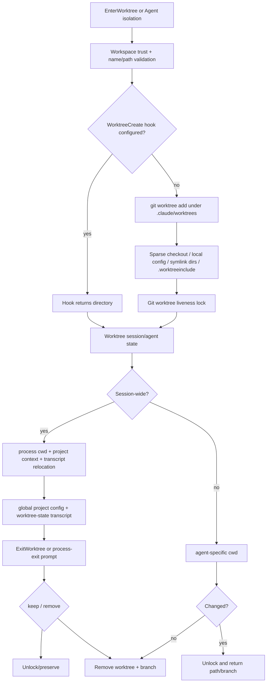

# Worktree isolation and handoffs

Claude Code `2.1.215` uses Git worktrees (or `WorktreeCreate`/`WorktreeRemove` hooks) to isolate concurrent mutations. There are two related lifecycles:

- `EnterWorktree`/`ExitWorktree` moves the **current session** into and out of an isolated directory.
- `Agent({isolation:"worktree"})` gives one delegated agent its own cwd without moving the parent session.

Background-session `worktree.bgIsolation` is a third control: it can block writes to the shared checkout until the background session explicitly enters a worktree.

## Architecture



## Source anchors

| Semantic alias | Approximate location in `cli.renamed.js` | Exact symbol or string | Meaning |
|---|---:|---|---|
| WorktreeSettings | [~70,960](../../claude-code-pkg/src/entrypoints/cli.renamed.js#L70960) | `symlinkDirectories`, `sparsePaths`, `baseRef`, `bgIsolation` | Public worktree configuration. |
| WorktreeManager | [~260,540–262,100](../../claude-code-pkg/src/entrypoints/cli.renamed.js#L260540) | `createWorktreeForSession()`, `createAgentWorktree()`, `cleanupWorktree()` | Native/hook creation, locks, setup, attach, keep/remove, and agent cleanup. |
| WorktreePathGuard | [~260,600–261,350](../../claude-code-pkg/src/entrypoints/cli.renamed.js#L260600) | `I8i()`, `isWorktreeWriteDestUnsafe()` | Rejects redirecting symlinks/traversal and verifies checkout containment. |
| ExistingWorktreeAttach | [~261,650–261,850](../../claude-code-pkg/src/entrypoints/cli.renamed.js#L261650) | `resolveExistingWorktreeTarget()`, `enterExistingWorktreeForSession()` | Requires a registered, safe, non-live-owned worktree. |
| WorktreeLock | [~261,400–261,550](../../claude-code-pkg/src/entrypoints/cli.renamed.js#L261400) | `git worktree lock --reason`, `claude session|agent ... pid ... start ...` | Ownership/liveness fence and stale-lock recovery. |
| BackgroundWriteGuard | [~321,950–321,990](../../claude-code-pkg/src/entrypoints/cli.renamed.js#L321950) | `CLAUDE_BG_ISOLATION`, `worktree.bgIsolation` | Blocks background edits in the shared checkout by default. |
| EnterWorktreeTool | [~404,350–404,720](../../claude-code-pkg/src/entrypoints/cli.renamed.js#L404350) | `EnterWorktree`, `w5u()`, `x5u` | Session entry, existing-path permission, cwd and cache transitions. |
| ExitWorktreeTool | [~404,720–405,050](../../claude-code-pkg/src/entrypoints/cli.renamed.js#L404720) | `ExitWorktree`, `keep`, `remove`, `discard_changes` | User-directed exit and destructive-change guard. |
| WorktreeHooks | [~574,893–575,053](../../claude-code-pkg/src/entrypoints/cli.renamed.js#L574893) | `executeWorktreeCreateHook()`, `executeWorktreeRemoveHook()` | VCS-agnostic create/remove contract. |
| WorktreeProjectState | [~260,591](../../claude-code-pkg/src/entrypoints/cli.renamed.js#L260591) | `persistWorktreeSession()`, `activeWorktreeSession` | Saves the current-project record in global config. |
| WorktreeTranscriptState | [~582,145](../../claude-code-pkg/src/entrypoints/cli.renamed.js#L582145) | `saveWorktreeState()`, `type:"worktree-state"` | Appends resumable worktree metadata to the session transcript. |
| TranscriptRelocation | [~580,520](../../claude-code-pkg/src/entrypoints/cli.renamed.js#L580520) | `relocateSessionTranscript()` | Moves transcript/associated session state after a session cwd change. |

## Three isolation shapes

| Shape | Cwd ownership | Entry/exit | Cleanup rule |
|---|---|---|---|
| Session `EnterWorktree` | Changes the main process/session cwd. | Explicit `EnterWorktree`; `ExitWorktree` or exit prompt. | User chooses keep/remove; destructive remove requires confirmation when changed. |
| Agent `isolation:"worktree"` | Agent-specific cwd override; parent remains in its checkout. | Created as part of Agent launch. | Unchanged worktree is removed; changed/committed worktree is retained and reported. |
| Background `bgIsolation` | Background session starts in the shared checkout but may be write-blocked. | Calls `EnterWorktree` before its first edit. | Follows the session lifecycle after entry. |

Scheduler concurrency is not isolation. Multiple agents can run concurrently in one checkout unless the caller selects a worktree (or another supported isolated environment).

## Configuration

```json
{
  "worktree": {
    "baseRef": "fresh",
    "sparsePaths": ["src", "packages/core"],
    "symlinkDirectories": ["node_modules", ".cache"],
    "bgIsolation": "worktree"
  }
}
```

| Key | Behavior |
|---|---|
| `baseRef:"fresh"` | Default. New worktrees branch from `origin/<default-branch>` when resolvable, fetching stale/missing remote state and falling back to local `HEAD` when necessary. |
| `baseRef:"head"` | Branches from the current local `HEAD`, retaining unpushed/feature-branch ancestry. |
| `sparsePaths` | Creates the worktree with `--no-checkout`, configures cone-mode sparse checkout, then checks out only listed paths. Failure aborts and cleans the partial worktree. |
| `symlinkDirectories` | After checkout, best-effort symlinks explicitly named directories from the main repository into the worktree to avoid disk duplication. No directory is symlinked by default. |
| `bgIsolation:"worktree"` | Default for eligible background sessions. Blocks Edit/Write in the shared checkout until isolation is established. |
| `bgIsolation:"none"` | Allows background work to edit the shared checkout directly. |

`CLAUDE_BG_ISOLATION=worktree|none` is the parent/daemon handoff override for background workers; it is not a general end-user settings replacement.

## Creating a worktree

### Eligibility and naming

`EnterWorktree` is model-instructed to run only when the user or project instructions explicitly request a worktree. Runtime validation then requires accepted workspace trust and either a Git repository or configured worktree hooks.

A new name is validated as at most 64 characters. Each `/`-separated segment must be non-empty and contain only letters, digits, dots, underscores, and dashes; `.`/`..` and `.git`-equivalent segments are rejected. Native Git storage encodes `/` as `+`:

```text
path:   <git-root>/.claude/worktrees/<encoded-name>
branch: worktree-<encoded-name>
```

If no name is supplied, the tool uses the current plan slug/random fallback.

### Hook backend wins when configured

When `hasWorktreeCreateHook()` is true, `createWorktreeForSession()` calls the hook even inside a Git repository. Command hooks return the worktree path as their last non-empty stdout line; HTTP/callback hooks use `hookSpecificOutput.worktreePath`. The returned path must exist as a directory.

Hook state is marked `hookBased:true`. Removal calls `WorktreeRemove` with the path. If a configured remove hook does not remove it, Claude Code keeps the directory rather than silently substituting destructive Git cleanup.

Without a create hook, the native Git path is used.

### Native Git creation and reuse

The native path:

1. resolves the Git root and base ref;
2. rejects symlinks at `.claude`, `.claude/worktrees`, or the destination;
3. checks whether the same managed worktree already exists;
4. can reset an existing clean/fully-upstream worktree to a fresher remote base;
5. otherwise resumes the existing worktree as-is;
6. runs `git worktree add --no-track -B <branch> <path> <base>` (plus sparse options when configured);
7. verifies the real result is the expected contained path;
8. writes the baseline commit into worktree administration state; and
9. acquires a liveness lock.

An orphaned directory is removed automatically only after safety checks establish that its branch has no unpushed work. Ambiguous Git failures refuse self-healing and give manual cleanup guidance.

### Post-checkout setup

For a newly created native worktree, Claude Code can:

- copy `.claude/settings.local.json` only when doing so will not resurrect a stale canonical local-settings overlay;
- point `core.hooksPath` at an absolute main-repository hook path;
- apply explicitly configured `symlinkDirectories` after destination-containment checks; and
- copy ignored files selected by `.worktreeinclude`, skipping source symlinks and destinations redirected by committed symlinks.

These convenience operations are subordinate to containment. A failed optional symlink/copy is logged and skipped; sparse-checkout failure aborts creation.

## Liveness locks and ownership

Native worktrees use `git worktree lock --reason` with a reason shaped like:

```text
claude session <name> (pid <pid> start <process-start>)
claude agent <name> (pid <pid> start <process-start>)
```

The process-start value protects against PID reuse. A lock written by another live matching process makes this session a guest/non-owner. A dead stale Claude lock can be cleared and reacquired. An unknown lock reason is preserved rather than assumed safe.

Ownership matters at cleanup: Claude Code removes/unlocks only a worktree whose lock it can safely release. If registry/lock verification fails while the directory still exists, cleanup keeps the worktree.

## Entering an existing worktree

`EnterWorktree({path})` has a stricter path than ordinary `chdir`:

- the current directory must belong to a Git repository;
- the target cannot be the main working tree or current cwd;
- UNC/network-automount targets are rejected;
- the real path must appear in `git worktree list --porcelain` for the owning repository (or an eligible nested repository on first entry);
- prunable/broken entries are rejected;
- another live Claude Code lock rejects entry; and
- when switching from a pinned agent/current worktree, the target must be under that repository's non-symlinked `.claude/worktrees/` and have a coherent `.git` backlink.

A model-supplied existing path outside the managed directory requires a local, non-classifier-approvable safety confirmation because it relocates write permissions and loads that directory's project configuration.

An entered-existing worktree is marked `enteredExisting:true`; `ExitWorktree` can leave it but will not remove it. Switching again leaves the previous worktree on disk and tracks only the newest target for session exit.

## Session transition and persistence

### Process and context transition

For session-wide entry, Claude Code changes process cwd, updates its internal cwd/original-cwd state, and then refreshes cwd-sensitive state:

- system-prompt section cache;
- beta/header latches;
- command/memory/project configuration;
- plan directories and slug collisions;
- Git file watcher and branch metadata; and
- relative tool permission roots.

For a native same-repository worktree, it also relocates the active transcript into the new project-key directory. Hook-based and nested-repository paths do not take that exact relocation branch.

A pinned subagent cannot create a new session-wide worktree because that would mutate the parent's process cwd. It may switch its own cwd to an existing managed worktree via `path`; that agent metadata/context layer is updated without moving the parent.

### Dual persistence

Worktree continuity uses two independent stores:

| Store | Record | Role |
|---|---|---|
| Global config current-project entry (`~/.claude.json` project map) | `activeWorktreeSession` | Fast process/project continuity for the active worktree. |
| Session JSONL | `type:"worktree-state"`, nullable `worktreeSession` | Transcript/resume continuity and explicit clear tombstone. |

The record includes original/pre-entry cwd, worktree path/name/branch, original branch/head, session ID, optional tmux session, and hook/existing/reuse metadata. These writes are not one atomic transaction. [Session resume and transcripts](../04-sessions-persistence-remote/session-resume-and-transcripts.md#worktree-session-state) owns reconstruction and transcript-relocation crash boundaries.

## Background write guard

For an eligible background session with no active worktree, `str()` blocks Edit/Write destinations inside the shared checkout when effective isolation is `worktree`. The error tells the background session to call `EnterWorktree`; a child subagent is told to be respawned with `isolation:"worktree"` or wait for its parent to isolate.

The guard does not fire when:

- `bgIsolation` resolves to `none`;
- the session already owns/entered a worktree;
- the cwd is itself a linked worktree;
- the target is outside the protected checkout; or
- neither Git nor an eligible create-hook backend is available.

An agent with its own `agentWorktree` is separately prevented from editing the corresponding path in the shared checkout.

## Exit and cleanup

`ExitWorktree` is intentionally user-directed. It refuses calls from pinned-cwd subagents and is a no-op when the current session did not enter a worktree.

### Keep

`action:"keep"`:

- returns to the original directory;
- leaves directory/branch and optional tmux session intact;
- releases an owned native worktree lock;
- clears active worktree state; and
- reports the retained path/branch and tmux reattach command.

### Remove

`action:"remove"` is destructive. Before removal, the tool runs `git status --porcelain` and counts commits after the recorded original head. When either count is nonzero, removal requires `discard_changes:true`; inability to verify state also requires explicit discard confirmation.

Entered-existing worktrees are never removed by the tool. Hook-backed removal delegates to `WorktreeRemove`; native removal verifies lock ownership, unlocks, runs forced `git worktree remove`, restores any worktree-config extension, and deletes the generated branch. If safe removal cannot be proven, the tool exits the session worktree but preserves the directory.

If the original cwd vanished, exit attempts the pre-entry cwd, home directory, and Claude temp directory. The session continues from the first valid fallback and reports that recovery.

### Agent completion

Ordinary `Agent({isolation:"worktree"})` cleanup is automatic rather than an `ExitWorktree` call. An unchanged worktree is removed. A worktree with uncommitted changes or commits is unlocked/retained and its path/branch is returned so the parent/user can inspect or publish it. This preserves useful work instead of deleting it at agent completion.

## Failure behavior

| Failure | Result |
|---|---|
| Workspace not trusted | Creation refused before hooks/Git. |
| Invalid name or redirecting `.claude` symlink | Creation refused. |
| No Git repository and no create hook | Explicit unsupported-backend error. |
| Create hook configured but not run/returns no directory | Failure; no fallback to shared-checkout execution. |
| Git branch already checked out elsewhere | Names conflicting worktree and requests another name/manual cleanup. |
| Sparse checkout setup fails | Partial worktree is removed when safely possible; creation fails. |
| Existing worktree has another live Claude lock | Entry/removal refused. |
| Existing path outside managed directory | Requires local confirmation; still must be Git-registered. |
| Remove with uncommitted/unmerged work | Refused until `discard_changes:true`. |
| Remove-hook or lock verification fails | Worktree kept and active state cleared; no unsafe recursive deletion. |
| Original cwd disappeared | Recovers to pre-entry/home/temp where possible. |
| Transcript relocation fails | Entry continues after logging in the source-visible best-effort branch; persistence may remain in the old project home. |

## Boundaries and caveats

- Git behavior depends on installed Git, repository topology, network/remotes, and filesystem semantics. The client proves command/guard ordering, not an atomic multi-file Git transaction.
- Hook-based worktrees are VCS-agnostic directories. Their branch/merge/durability semantics belong to the hook implementation.
- Global project config and transcript state can diverge after a crash; resume validates what remains rather than assuming a joint commit.
- Worktree locks reduce accidental concurrent cleanup; they are not a general filesystem lock around every external process that can modify the directory.
- `CLAUDE_BG_ISOLATION` is an internal worker handoff. Persistent policy should use `worktree.bgIsolation`.

## Related docs

- [Agents, tasks, and subagents](agents-tasks-and-subagents.md)
- [Agent runtime, scheduling, and completion](agent-runtime-scheduling-and-completion.md)
- [Agent Teams](agent-teams.md)
- [Dynamic workflows](dynamic-workflows.md)
- [Session resume and transcripts](../04-sessions-persistence-remote/session-resume-and-transcripts.md)
- [Hooks and events reference](../03-tools-integrations-security/hooks-and-events-reference.md)
- [Settings schema reference](../03-tools-integrations-security/settings-schema-reference.md)
- [Sandbox and isolation](../03-tools-integrations-security/sandbox-and-isolation.md)
