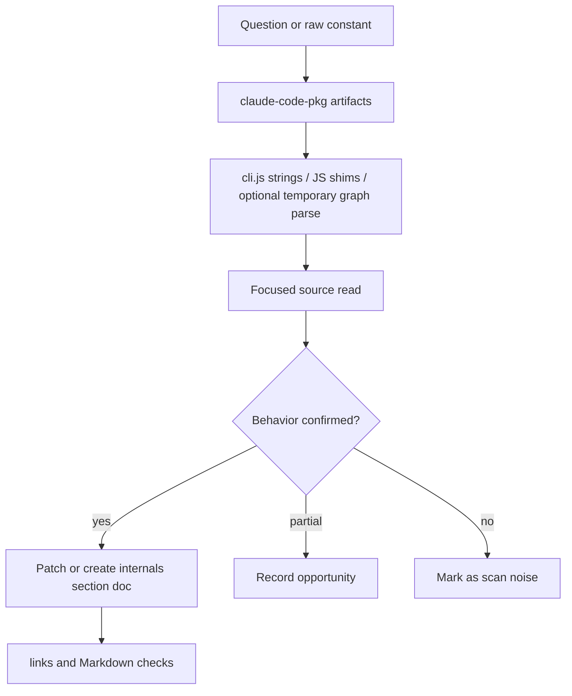

# Research atlas

This appendix keeps discovery machinery separate from the main runtime narrative. Use it when starting from a raw constant, byte offset, minified symbol, `.jsc` bytecode dump, native module, or documentation gap.

The atlas is a triage layer, not proof. Promote a finding into the main internals sections only after a focused source read confirms behavior.

## Source-anchor policy

This page is a research guide. Linked pages and generated artifacts carry concrete anchors.

| Semantic alias | Minified anchor | Scope |
|---|---|---|
| Research atlas chapter | N/A — navigation page | Groups artifact/bytecode notes, source-anchor methodology, and future watchpoints. |
| Atlas/research pages | See linked pages and `claude-code-pkg/` artifacts | Concrete bundle anchors and generated inventories live in destination artifacts. |

## Research workflow

## Primary reading order

| Order | Page or artifact | Research question answered |
|---:|---|---|
| 1 | [Artifact map and bytecode notes](artifact-map-and-bytecode.md) | What final artifacts exist, what can be read, and what cannot be decompiled? |
| 2 | [Decoded-classified decompilation audit](decoded-classified-decompilation-audit.md) | Which major decoded chunks were promoted to docs, skipped as vendor/static/UI, or left as lower-confidence watchpoints? |
| 3 | [Bundle module map from `cli.renamed.js`](module-map-from-renamed-cli.md) | Which Bun module loaders correspond to which Claude Code subsystems, and at what line ranges in the semantically renamed bundle? |

## Promotion rules

- Treat raw string hits as leads, not behavioral proof.
- Anchor every promoted claim with file path, approximate line/byte offset, exact string or symbol, and semantic meaning.
- Keep bytecode-only or native-binary-only observations as research notes unless paired with readable JS or safe runtime behavior.
- Update `docs/SUMMARY.md`, section README files, and adjacent cross-links whenever a finding becomes a main documentation page.

## Navigation

- [Start here](../00-start-here/README.md)
- [Decoded-classified decompilation audit](decoded-classified-decompilation-audit.md)
- [Bundle module map from `cli.renamed.js`](module-map-from-renamed-cli.md)
- [Full table of contents](../SUMMARY.md)
