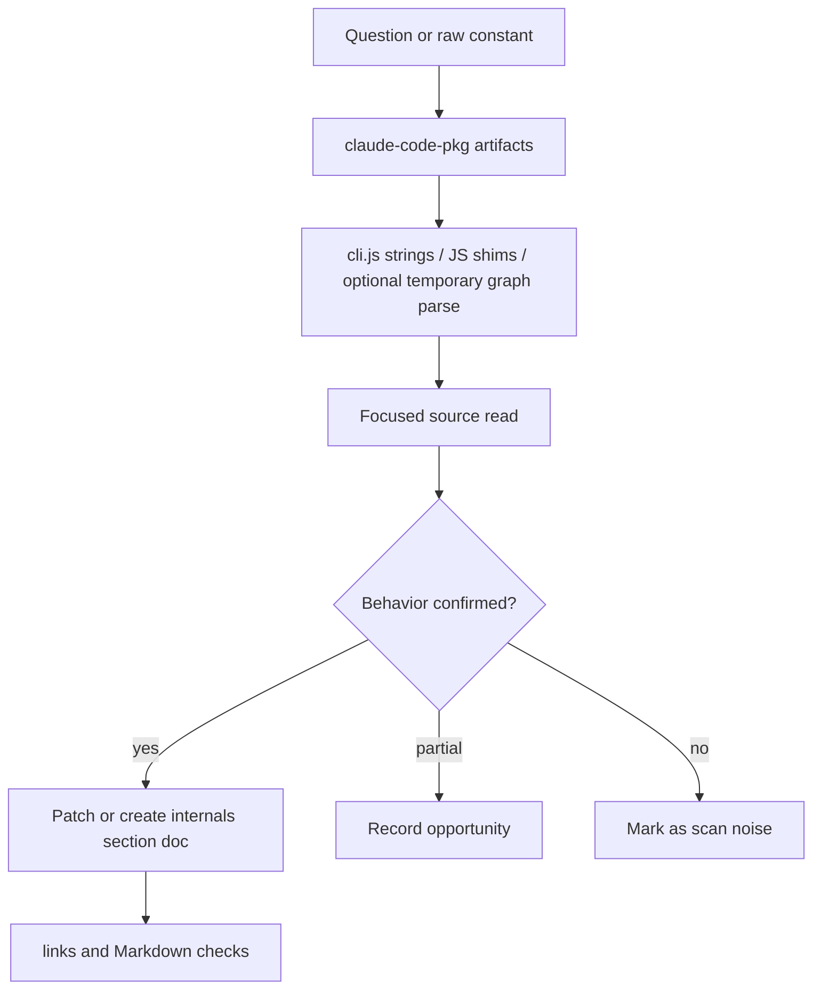

# Research atlas

This appendix keeps discovery machinery separate from the main runtime narrative. Use it when starting from a raw constant, generated module record, prompt-catalog entry, byte offset, minified symbol, native module, or documentation gap.

The atlas is a triage layer, not proof. Promote a finding into the main internals sections only after a focused source read confirms behavior.

It contains three deliberately separate document types:

| Type | Owner | Purpose |
|---|---|---|
| Source navigation | [Bundle module map](module-map-from-renamed-cli.md) and generated `data/` | Locate candidate source regions and literal surfaces. |
| Coverage evidence | [Full-system documentation coverage review](full-system-coverage-review.md) and domain audit ledgers | Record which source-confirmed mechanisms have an owner and which evidence limits remain. |
| Documentation architecture | [Documentation structure and duplication review](documentation-structure-review.md) | Record canonical ownership, merge/rename decisions, and intentional non-merges. |

## Source-anchor policy

This page is a research guide. Linked pages and generated artifacts carry concrete anchors.

| Semantic alias | Minified anchor | Scope |
|---|---|---|
| Research atlas chapter | N/A — navigation page | Groups artifact/bytecode notes, source-anchor methodology, and future watchpoints. |
| Atlas/research pages | See linked pages and `claude-code-pkg/` artifacts | Concrete bundle anchors and generated inventories live in destination artifacts. |

## Research workflow

```mermaid
flowchart TD
    Question[Question or raw constant] --> Artifact[claude-code-pkg artifacts]
    Artifact --> Surface[cli.js strings / JS shims / optional temporary graph parse]
    Surface --> Source[Focused source read]
    Source --> Classify{Behavior confirmed?}
    Classify -->|yes| MainDoc[Patch or create internals section doc]
    Classify -->|partial| Backlog[Record opportunity]
    Classify -->|no| Noise[Mark as scan noise]
    MainDoc --> Validate[links and Markdown checks]
```

## Primary reading order

| Order | Page or artifact | Research question answered |
|---:|---|---|
| 1 | [Bundle module map from `cli.renamed.js`](module-map-from-renamed-cli.md) | Which Bun module loaders correspond to which Claude Code subsystems, and at what line ranges in the semantically renamed bundle? |
| 2 | [Full-system documentation coverage review](full-system-coverage-review.md) | Which source-confirmed lifecycles were promoted, rejected as false gaps, or left evidence-bounded? |
| 3 | [Documentation structure and duplication review](documentation-structure-review.md) | Which pages are canonical owners, which duplicate was retired, and why do adjacent architecture/reference/lifecycle pages remain separate? |
| 4 | [`data/cli-modules.json`](data/cli-modules.json) | What loader, declaration, and export records did the structural extractor find? |
| 5 | [`data/cli-module-themes.json`](data/cli-module-themes.json) | Which semantic modules matched each populated runtime/vendor theme? |
| 6 | [`data/prompt-catalog.json`](data/prompt-catalog.json) | Which long literal prompts passed the domain/noise filter, with line/offset/hash provenance? |

## Mechanism-question audits

These ledgers record the question → source trace → documentation update → full reread loop for all **61 canonical mechanism pages** in the main wiki. The count follows the final page manifests in the six ledgers; it is not the total Markdown-page count and is not inferred from filename suffixes. Each page was asked at most ten questions per round, and each domain stopped only after a complete pass produced zero new questions answerable from the retained `2.1.215` artifacts. The [full-system coverage review](full-system-coverage-review.md) then compared the six converged domains and cross-cutting inventories to find lifecycles with no owner anywhere. It originally counted 62 pages; the later [structure review](documentation-structure-review.md) retired one duplicate command page without removing a mechanism.

| Domain | Audit ledger | Pages | Final result |
|---|---|---:|---|
| Runtime and startup | [Runtime mechanism question audit](mechanism-question-audit-runtime.md) | 10 | Converged |
| Context and model loop | [Context/model mechanism question audit](mechanism-question-audit-context-model.md) | 8 | Converged |
| Tools, integrations, and security | [Tools/security mechanism question audit](mechanism-question-audit-tools-security.md) | 15 | Converged |
| Sessions, persistence, and remote | [Sessions/remote mechanism question audit](mechanism-question-audit-sessions-remote.md) | 9 | Converged |
| Operations and native support | [Operations/native mechanism question audit](mechanism-question-audit-operations-native.md) | 9 | Converged |
| Agents and automation | [Agents/automation mechanism question audit](mechanism-question-audit-agents-automation.md) | 10 | Converged |

“Converged” is artifact-bounded: server, unavailable native/bootstrap, runtime-only, and future-version questions remain explicitly listed as evidence limits rather than guessed answers.

## Promotion rules

- Treat raw string hits as leads, not behavioral proof.
- Anchor every promoted claim with file path, approximate line/byte offset, exact string or symbol, and semantic meaning.
- Keep bytecode-only or native-binary-only observations as research notes unless paired with readable JS or safe runtime behavior.
- Update `docs/SUMMARY.md`, section README files, and adjacent cross-links whenever a finding becomes a main documentation page.

## Navigation

- [Start here](../00-start-here/README.md)
- [Bundle module map from `cli.renamed.js`](module-map-from-renamed-cli.md)
- [Full-system documentation coverage review](full-system-coverage-review.md)
- [Documentation structure and duplication review](documentation-structure-review.md)
- [Runtime mechanism question audit](mechanism-question-audit-runtime.md)
- [Context/model mechanism question audit](mechanism-question-audit-context-model.md)
- [Tools/security mechanism question audit](mechanism-question-audit-tools-security.md)
- [Sessions/remote mechanism question audit](mechanism-question-audit-sessions-remote.md)
- [Operations/native mechanism question audit](mechanism-question-audit-operations-native.md)
- [Agents/automation mechanism question audit](mechanism-question-audit-agents-automation.md)
- [Full table of contents](../SUMMARY.md)
