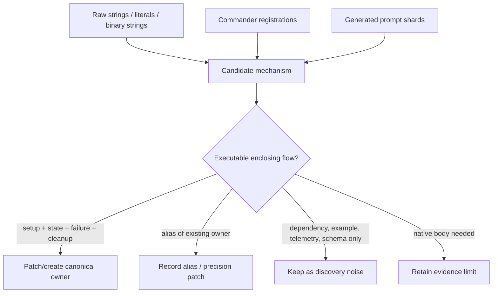

# Disassembled string-surface review

This review audits strings and text in the retained Claude Code `2.1.215` artifacts for product-owned runtime mechanisms that the existing wiki did not adequately own. It follows the repository-wide coverage and structure reviews, but uses an intentionally different discovery surface: executable JavaScript strings, actual Commander registrations, file/env/endpoint-shaped literals, generated prompt candidates, and native-binary strings.

The result corrects the earlier claim that no source-answerable lifecycle remained. Two substantial mechanisms warranted new canonical pages, and several smaller mechanisms belonged in existing owners. Most unmatched strings were still telemetry vocabulary, vendored dependency material, generated documentation/examples, regex fragments, internal host protocol, or aliases for already documented systems.

## Artifact identity and scope

| Property | Value |
|---|---|
| Package | `@anthropic-ai/claude-code@2.1.215` |
| Build time | `2026-07-19T00:01:04Z` |
| Git SHA | `316ce99628e89900bf0b1328fed3b8fec0c0c92d` |
| Primary behavioral surface | [`cli.renamed.js`](../../claude-code-pkg/src/entrypoints/cli.renamed.js) — 31,833,579 bytes |
| Artifact-identity surface | [`cli.js`](../../claude-code-pkg/src/entrypoints/cli.js) — 20,160,986 bytes |
| Formatted derivative | [`cli.formatted.js`](../../claude-code-pkg/src/entrypoints/cli.formatted.js) — 30,677,806 bytes |
| Native artifacts checked | `audio-capture.node` (492,184 bytes), `image-processor.node` (1,464,760 bytes) |
| Standalone disassembly / `source-atlas/` | Not present in this checkout; intentionally not fabricated or regenerated |

“Disassembled” in the filename reflects the question that triggered the audit. The strongest readable source here is the retained Bun bundle, not an `objdump`/decompiler output. The raw, formatted, and semantically renamed JavaScript files are three views of one artifact, not independent implementations.

## Evidence model

Evidence was ranked as follows:

1. Enclosing executable control flow in `cli.renamed.js` establishes JavaScript behavior.
2. Actual Commander `.command()`, `.option()`, and `.alias()` registrations establish parsed CLI surfaces; hidden/gated state remains part of the claim.
3. Raw/formatted source helps verify that formatting or renaming did not create a literal.
4. Generated prompt shards and embedded protocol/help text are discovery aids; they do not override executable handlers.
5. Native exports/dependencies/strings establish shipped capability or error vocabulary, not call order, limits, thread behavior, or active consumers without JS/N-API corroboration.
6. Vendored AWS/Google/Azure SDK, crypto, locale, syntax, HTML, and package documentation strings are rejected unless a Claude Code caller reaches them.

## Scan inventory

A temporary local extractor collected exact value, source line(s), category, and whether the value already occurred in authored documentation. Generated prompt shards were excluded from the “documented” corpus so generated source text could not satisfy its own lifecycle coverage.

| Category | Unique candidates | Absent from authored docs before review | Interpretation |
|---|---:|---:|---|
| Environment-like | 875 | 693 | Mix of public controls, test switches, feature experiments, credentials, and parent/worker handoffs. |
| `tengu_*` / gate-like | 1,695 | 1,600 | Mostly telemetry event/outcome labels; the prefix does not mean “feature gate.” |
| Endpoint-like | 215 | 125 | Mix of Claude Code routes, generated SDK resources, external providers, and examples. |
| File-like | 628 | 531 | Mix of real state paths, generated prompt examples, dependency files, and regex fragments. |
| Actual Commander registrations | 88 | 8 | Highest-signal inventory because these came from registration calls rather than slash-like strings. |

The eight initially absent registrations were:

| Kind | Registration | Resolution |
|---|---|---|
| Alias | `autoremove` | Documented as the alias of `plugin prune`. |
| Hidden command | `import-conversations <exportPath>` | Added to command and transcript owners with gate/dry-run/import semantics. |
| MCP option | `--client-id <clientId>` | Added to custom HTTP/SSE OAuth documentation. |
| Root option | `--disable-slash-commands` | Added to the root flag inventory and runtime command-registry behavior. |
| Plugin-eval option | `--keep-temp` | Added to plugin-eval cleanup semantics. |
| Plugin-eval option | `--no-scaffold` | Added with the source-confirmed default-off scaffold boundary. |
| XAA option | `--client-id <id>` | Added to shared IdP setup. |
| XAA option | `--issuer <url>` | Added with HTTPS/loopback validation. |

The scan report was retained only as temporary analysis at `/tmp/claude-code-string-surface-audit.json`; canonical findings and decision reasons live in this page and the linked implementation docs.

## Promoted lifecycle owners

### Enterprise gateway server

The root command was mentioned in the startup map, and embedded gateway protocol prose existed in generated prompt shards, but no page owned the executable server lifecycle.

Direct source confirmed:

- top-level `gateway --config <path>` registration [~978,332](../../claude-code-pkg/src/entrypoints/cli.renamed.js#L978332);
- YAML recursion and strict schema [~970,710–971,572](../../claude-code-pkg/src/entrypoints/cli.renamed.js#L970710);
- SSRF/DNS/metadata guards [~970,259](../../claude-code-pkg/src/entrypoints/cli.renamed.js#L970259);
- OIDC, provider adapters, inference, managed settings, spend APIs, and OTLP relay [~970,485–973,485](../../claude-code-pkg/src/entrypoints/cli.renamed.js#L970485);
- Postgres migrations/retention [~973,486–973,796](../../claude-code-pkg/src/entrypoints/cli.renamed.js#L973486); and
- `Bun.serve()` routes, health/readiness, response hardening, and stop handle [~973,797–974,621](../../claude-code-pkg/src/entrypoints/cli.renamed.js#L973797).

**Action:** created [Enterprise gateway server](../05-hosted-agent-ops/enterprise-gateway.md). Client-side gateway credential/provider routing remains separate in [Models, providers, and auth](../02-context-model-loop/models-providers-auth.md).

### Remote-environment egress and file staging

The prompt catalog contained a long agent-proxy README and sandbox docs mentioned an egress callback, but no owner joined the active relay, working sync, filestore staging, and staged MCP file protocol.

Direct source confirmed:

- a local HTTPS CONNECT proxy tunneled over `/v1/code/agent-proxy/ws`, including framed protocol v2, bounded buffering, retry, pooling, FIN, and cleanup [~929,300–930,087](../../claude-code-pkg/src/entrypoints/cli.renamed.js#L929300);
- remote/session/token gates, CA download, trust setup, governed Git/`gh`, env injection, and process cleanup [~930,088–931,324](../../claude-code-pkg/src/entrypoints/cli.renamed.js#L930088);
- `/mnt/user-data/working` ↔ `/working` optimistic sync with containment, scan/size/concurrency caps, and backoff [~948,806–949,575](../../claude-code-pkg/src/entrypoints/cli.renamed.js#L948806);
- `/uploads` staging plus filestore credential mint/remint, 60-second no-byte stall, and truncation checks [~949,576–949,901](../../claude-code-pkg/src/entrypoints/cli.renamed.js#L949576); and
- staged MCP input/output tokens, temp mediation, output containment/hard-link/size/stability checks, lane writes, and `finally` cleanup [~950,070–950,384](../../claude-code-pkg/src/entrypoints/cli.renamed.js#L950070).

**Action:** created [Remote-environment egress and file staging](../04-sessions-persistence-remote/remote-environment-egress-and-file-staging.md). Hosted-session replay/control remains in [Remote control and teleport](../04-sessions-persistence-remote/remote-control-and-teleport.md), and ordinary command sandboxing remains in [Sandbox and isolation](../03-tools-integrations-security/sandbox-and-isolation.md).

## Findings absorbed by existing owners

| Finding | Executable evidence | Canonical action |
|---|---|---|
| Plugin evaluation | Case/grader schemas, sandbox, arm runner, cost/interruption/report paths, and registrations [~657,872–660,964](../../claude-code-pkg/src/entrypoints/cli.renamed.js#L657872) | Added the early-access lifecycle to [Plugin lifecycle and configuration](../03-tools-integrations-security/plugin-lifecycle-and-configuration.md#plugin-evaluation-early-access). |
| Persistent scoped Agent memory | `memory:user|project|local`, root resolver, `MEMORY.md` addendum, permission classification, and main/subagent/teammate callers [~188,472–193,755](../../claude-code-pkg/src/entrypoints/cli.renamed.js#L188472) | Added [Persistent scoped Agent memory](../02-context-model-loop/prompt-context-memory.md#persistent-scoped-agent-memory) and a team-memory non-equivalence note. |
| Grove consumer terms/privacy | Account/cache/API helpers [~505,640–505,837](../../claude-code-pkg/src/entrypoints/cli.renamed.js#L505640), dialogs [~810,979–811,439](../../claude-code-pkg/src/entrypoints/cli.renamed.js#L810979), startup callers | Added [Consumer terms and privacy policy](../03-tools-integrations-security/settings-policy-and-integrations.md#consumer-terms-and-privacy-policy-grove) plus command/startup cross-links. |
| Prompt/paste history | `history.jsonl`, locking/retry, 1,024-unit inline split, SHA-256-derived paste cache, skip env [~504,851–505,200](../../claude-code-pkg/src/entrypoints/cli.renamed.js#L504851) | Added to [Terminal UI renderer and input](../01-runtime-lifecycle/terminal-ui-renderer-and-input.md#prompt-history-and-pasted-text-storage). |
| Background adoption carrier | Exact schema, bounded old-payload merge admission, claim-by-rename, 120-second non-exit freshness, final unlink [~628,072–628,307](../../claude-code-pkg/src/entrypoints/cli.renamed.js#L628072) | Added to [Daemon and background service](../01-runtime-lifecycle/daemon-and-background-service.md#adoptjson-bounded-handoff-not-durable-queue). |
| Conversation archive import | Hidden registration and feature gate, ZIP/JSON admission, deterministic transcript conversion, exclusive writes, dry-run/manifest comparison [~976,900–978,670](../../claude-code-pkg/src/entrypoints/cli.renamed.js#L976900) | Added to [Session resume and transcripts](../04-sessions-persistence-remote/session-resume-and-transcripts.md#hidden-conversation-archive-import). |
| Auto-mode decision trace | Exact `AUTOMODE_DECISION_LOG === "1"` and best-effort append [~446,940](../../claude-code-pkg/src/entrypoints/cli.renamed.js#L446940) | Added to [Diagnostics and debug logs](../05-hosted-agent-ops/diagnostics-and-debug-logs.md#auto-mode-decision-jsonl). |
| MCP OAuth/XAA flags | `mcp add` HTTP/SSE options and `xaa setup|login|show|clear` registration/handlers [~618,700–620,200](../../claude-code-pkg/src/entrypoints/cli.renamed.js#L618700) | Added to [MCP, plugins, and hooks](../03-tools-integrations-security/mcp-plugins-hooks.md#custom-oauth-options-and-xaa). |
| CLI registration drift | `--cloud` current hosted spelling, deprecated `--remote`, gateway, plugin eval/prune, disable slash commands, hidden import | Corrected [Command-line reference](../01-runtime-lifecycle/command-line-reference.md) and active session/architecture pages. |
| Product-owned env controls | Gateway controls, history/debug gates, MCP secrets, Agent-memory remap, hosted proxy/sync/staging handoffs | Added to [Environment variables reference](../05-hosted-agent-ops/environment-variables-reference.md) with operator/secret/internal classification. |

These additions do not each become a new mechanism page. Existing owners already had the correct reader contract; splitting them would recreate the duplication that the structure review removed.

## Rejected aliases and false gaps

| Candidate | Decision |
|---|---|
| `/api/frame/*` and Frame-shaped strings | Existing Artifact publication/version/live-page machinery owns this route family. “Frame” is an internal/older alias, not a new lifecycle page. |
| `/api/features`, `/api/eval`, `/api/eval-authed` | GrowthBook feature evaluation already belongs to [Feature gates reference](../05-hosted-agent-ops/feature-gates-reference.md). These are unrelated to `plugin eval`. |
| Thousands of `tengu_*` strings | Most are telemetry event names, result labels, experiment keys, or metrics. A `tengu_` prefix alone does not prove a user-settable gate or independent lifecycle. |
| AWS/Azure/Google/Anthropic SDK endpoint inventories | Generated dependency contracts are not proof that Claude Code invokes each resource. Only routes reached by a product caller were promoted. |
| `.claude/agent-registry.json`, `.claude/assistant-daemon-state.json` | In this artifact they appear in ignore-pattern data, not an active storage writer/reader path. |
| File-like regex fragments such as `-W.pid` | Extractor-shape false positives, not runtime filenames. |
| Generated prompt examples and embedded docs | Useful for finding source regions, but not executable activation/state/cleanup evidence. |
| Unified “all remote” page | Hosted sessions, Remote Control, enterprise gateway, agent egress proxy, working sync, and filestore have different identities/transports/authority and retain separate owners. |

## Native-binary review

Independent string/export/dependency review of `audio-capture.node` and `image-processor.node` found no additional source-provable documentation gap. Existing pages already cover:

- exact N-API export surfaces;
- Rust crate and dynamic-library evidence;
- readable JavaScript shims/consumers;
- observed error strings and safe runtime probes; and
- the distinction between shipped exports and active CLI consumers.

The remaining questions—audio playback consumers, exact capture/playback thread and cleanup order, image concurrency/limits below the JS facade, clipboard implementation, and platform parity—require native disassembly/tracing or additional artifacts. Binary strings do not justify asserting those behaviors.

## Corrections made during the audit

Independent candidate reviews were treated as hypotheses and corrected against direct source:

- `--disable-slash-commands` sets shared command availability and is propagated to relaunch/remote setup; it is not merely a parser that silently drops submitted slash text.
- Plugin case `scaffold_script` is off by default and runs only with `--scaffold`; it is not default setup behavior.
- `adopt.json` is claimed as `adopt.json.<pid>` and always unlinked after read. This claim path does not rename corruption to `.expired`.
- The adopt merge guard checks the old candidate's size/count before merging; it does not visibly re-check the final merged count in `Upr()`.
- Agent memory is neither AutoMem nor team memory, and team-memory service/mirror validators must not be attributed to it.
- Grove's missing cache causes a background refresh and skips the check for that session; stale cache returns its value while refreshing.
- `--cloud` is the current hosted-session spelling; `--remote` is registered as its deprecated hidden alias in this build.
- Agent proxy, enterprise gateway, and ordinary user proxy configuration are three different systems.

## Residual interpretation rules

After the documentation updates, an unmatched literal remains a review lead—not proof of a missing page. Promote only when all of these can be answered from the retained artifact:

1. What executable entrypoint or caller activates it?
2. What state or authority does it own?
3. What are the success, failure, and cleanup paths?
4. Is it materially independent from an existing canonical owner?
5. Is the behavior client-proven rather than generated SDK/server/native speculation?

This standard intentionally leaves many environment/test/rollout strings out of the public reference. Documenting every internal switch would reduce accuracy by presenting unstable parent/worker protocol as operator configuration.

## Documentation result

The follow-up adds two canonical mechanism pages:

| Domain | Previous count | Added owner | New count |
|---|---:|---|---:|
| Sessions, persistence, and remote | 9 | Remote-environment egress and file staging | 10 |
| Operations and native support | 9 | Enterprise gateway server | 10 |

Other domain counts remain 10 runtime, 8 context/model, 15 tools/security, and 10 agents/automation. Canonical arithmetic is therefore **10 + 8 + 15 + 10 + 10 + 10 = 63**.

## Related reviews

- [Full-system documentation coverage review](full-system-coverage-review.md)
- [Documentation structure and duplication review](documentation-structure-review.md)
- [Bundle module map from `cli.renamed.js`](module-map-from-renamed-cli.md)
- [Sessions/remote mechanism question audit](mechanism-question-audit-sessions-remote.md)
- [Operations/native mechanism question audit](mechanism-question-audit-operations-native.md)
