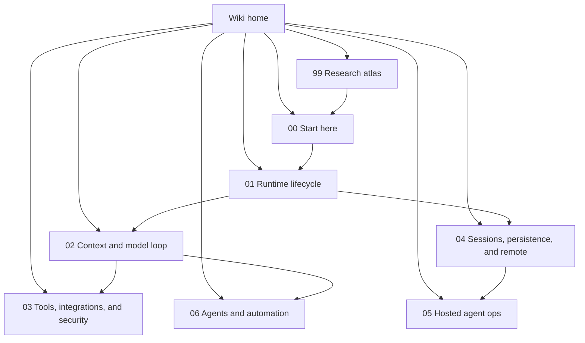

# Claude Code reverse-engineering wiki

This wiki reverse-engineers `@anthropic-ai/claude-code` to explain how Claude Code works, with source-anchored implementation notes. The primary readable artifact for this analysis is:

`claude-code-pkg/src/entrypoints/cli.js`

The wiki is organized around reverse-engineered internals questions: how the Bun standalone runtime starts, routes command-line modes, shapes model context, exposes tools, persists sessions, supports remote control, runs agents, and exposes operational/debug/native surfaces.

Because `cli.renamed.js` is a renamed view of a bundled/minified artifact, symbol names are unstable across builds. Source anchors are intended for searching the analyzed bundle, not as public API names. Implementation pages use `Semantic alias` as the first source-anchor table column, followed by the anchor string or symbol grep target and a one-line meaning.

## Semantic alias and minified anchor mapping

This home page is a navigation index, not a direct `cli.renamed.js` implementation analysis. Concrete topic pages map stable semantic aliases to version-specific minified anchors.

| Semantic alias | Minified anchor | Scope |
|---|---|---|
| Wiki home | N/A — navigation page | Orients readers to the canonical sections and reading paths. |
| Section indexes | N/A — see linked section README pages | Curated reader routes through source-anchored implementation pages. |
| Topic implementation pages | See page-level source anchor tables | Bundle-specific anchors live in focused implementation documents. |

## Internals wiki map

## Canonical sections

| Section | Purpose |
|---|---|
| [Start here](00-start-here/README.md) | Minimal orientation: what the bundle is, how to read anchors, and the first path through the runtime. |
| [Runtime lifecycle](01-runtime-lifecycle/README.md) | Package/Bun bootstrap, CLI flags, root command routing, headless/interactive modes, and subcommands. |
| [Context and model loop](02-context-model-loop/README.md) | Prompt/context sources, memory/settings, model/provider/auth selection, and headless stream-JSON turns. |
| [Tools, integrations, and security](03-tools-integrations-security/README.md) | Built-in tools, permissions, MCP, plugins, hooks, settings policy, IDE/Chrome/file integrations. |
| [Sessions, persistence, and remote](04-sessions-persistence-remote/README.md) | Local JSONL transcripts, resume/continue/fork/rewind, remote sessions, teleport, and Remote Control. |
| [Hosted agent ops](05-hosted-agent-ops/README.md) | Debug logs, telemetry/traffic policy, doctor/update, hosted review signals, and native image/audio modules. |
| [Agents and automation](06-agents-automation/README.md) | Custom/background agents, task/subagent tools, lifecycle hooks, slash commands, and auto-mode. |
| [Research atlas](99-research-atlas/README.md) | Artifact maps, bytecode caveats, decoded chunk audits, and promotion rules for future source reads. |

## Recommended reading paths

| Goal | Read this path |
|---|---|
| Get oriented quickly | [Start here](00-start-here/README.md) → [Glossary and aliases](00-start-here/glossary-and-aliases.md) → [Main feature map](00-start-here/main-feature-map.md) → [System architecture](00-start-here/system-architecture.md) → [CLI main paths](01-runtime-lifecycle/cli-main-paths.md) |
| Answer protocol and boundary questions | [System architecture](00-start-here/system-architecture.md) → [Runtime communication protocols](00-start-here/runtime-communication-protocols.md) → [Remote control and teleport](04-sessions-persistence-remote/remote-control-and-teleport.md) |
| Understand one complete local run | [CLI main paths](01-runtime-lifecycle/cli-main-paths.md) → [Prompt, context, and memory](02-context-model-loop/prompt-context-memory.md) → [Prompt assembly scenarios](02-context-model-loop/prompt-assembly-scenarios.md) → [Prompt template catalog](02-context-model-loop/prompt-template-catalog.md) |
| Understand context budgets and model billing | [Context, memory, compaction, checkpoints, and rewind](02-context-model-loop/context-memory-compaction-checkpoints.md) → [Model selection, calls, usage, quota, and billing](02-context-model-loop/model-selection-usage-quota-billing.md) → [Headless streaming and resilience](02-context-model-loop/headless-streaming-and-resilience.md) |
| Understand scriptable/headless mode | [Commands and flags](01-runtime-lifecycle/commands-and-flags.md) → [Headless streaming and resilience](02-context-model-loop/headless-streaming-and-resilience.md) → [Context and model loop architecture](02-context-model-loop/architecture.md) |
| Use canonical reference tables | [Command-line reference](01-runtime-lifecycle/command-line-reference.md) → [Tool inventory and schemas](03-tools-integrations-security/tool-inventory-and-schemas.md) → [Hooks and events reference](03-tools-integrations-security/hooks-and-events-reference.md) → [Settings schema reference](03-tools-integrations-security/settings-schema-reference.md) → [Environment variables reference](05-hosted-agent-ops/environment-variables-reference.md) |
| Understand durable sessions and remote control | [Sessions, persistence, and remote](04-sessions-persistence-remote/README.md) → [Session resume and transcripts](04-sessions-persistence-remote/session-resume-and-transcripts.md) → [Remote control and teleport](04-sessions-persistence-remote/remote-control-and-teleport.md) → [Session API, events, and storage](04-sessions-persistence-remote/session-api-events-and-storage.md) |
| Review trust boundaries | [Tools, integrations, and security](03-tools-integrations-security/README.md) → [Tool runtime, events, and integration flows](03-tools-integrations-security/tool-runtime-events-and-integrations.md) → [Built-in tools and permissions](03-tools-integrations-security/built-in-tools-and-permissions.md) → [Sandbox and isolation](03-tools-integrations-security/sandbox-and-isolation.md) → [MCP, plugins, and hooks](03-tools-integrations-security/mcp-plugins-hooks.md) |
| Understand voice/audio dictation | [Hosted agent ops](05-hosted-agent-ops/README.md) → [Media native modules](05-hosted-agent-ops/media-native-modules.md) → [Audio capture and voice mode](05-hosted-agent-ops/audio-capture-and-voice.md) |
| Study agents and automation | [Agents and automation](06-agents-automation/README.md) → [Agents, tasks, and subagents](06-agents-automation/agents-tasks-and-subagents.md) → [Agent runtime, scheduling, and completion](06-agents-automation/agent-runtime-scheduling-and-completion.md) → [Slash commands and automation](06-agents-automation/slash-commands-and-automation.md) |

## Cross-cutting implementation matrix

| Concern | Primary internals section | Supporting sections |
|---|---|---|
| Runtime mode selection | [Runtime lifecycle](01-runtime-lifecycle/README.md) | [Command-line reference](01-runtime-lifecycle/command-line-reference.md), [Start here](00-start-here/README.md), [Sessions, persistence, and remote](04-sessions-persistence-remote/README.md) |
| Communication protocols | [Runtime communication protocols](00-start-here/runtime-communication-protocols.md) | [MCP, plugins, and hooks](03-tools-integrations-security/mcp-plugins-hooks.md), [Remote control and teleport](04-sessions-persistence-remote/remote-control-and-teleport.md), [Agents and automation](06-agents-automation/README.md) |
| Context engineering | [Context and model loop](02-context-model-loop/README.md) | [Context, memory, compaction, checkpoints, and rewind](02-context-model-loop/context-memory-compaction-checkpoints.md), [Agents and automation](06-agents-automation/README.md), [Tools, integrations, and security](03-tools-integrations-security/README.md) |
| Model usage, quota, and billing | [Model selection, calls, usage, quota, and billing](02-context-model-loop/model-selection-usage-quota-billing.md) | [Models, providers, and auth](02-context-model-loop/models-providers-auth.md), [Headless streaming and resilience](02-context-model-loop/headless-streaming-and-resilience.md) |
| Tool execution | [Tool inventory and schemas](03-tools-integrations-security/tool-inventory-and-schemas.md) | [Built-in tools and permissions](03-tools-integrations-security/built-in-tools-and-permissions.md), [Tool runtime, events, and integration flows](03-tools-integrations-security/tool-runtime-events-and-integrations.md), [Agents and automation](06-agents-automation/README.md) |
| Session/event lifecycle | [Session API, events, and storage](04-sessions-persistence-remote/session-api-events-and-storage.md) | [Data models and frame schemas](04-sessions-persistence-remote/data-models-and-frame-schemas.md), [Hooks and events reference](03-tools-integrations-security/hooks-and-events-reference.md), [Hosted agent ops](05-hosted-agent-ops/README.md) |
| Remote/hosted operation | [Sessions, persistence, and remote](04-sessions-persistence-remote/README.md) | [Hosted agent ops](05-hosted-agent-ops/README.md), [Agents and automation](06-agents-automation/README.md) |
| Permissions and policy | [Tools, integrations, and security](03-tools-integrations-security/README.md) | [Context and model loop](02-context-model-loop/README.md), [Hosted agent ops](05-hosted-agent-ops/README.md) |
| Settings, hooks, and environment references | [Settings schema reference](03-tools-integrations-security/settings-schema-reference.md) | [Hooks and events reference](03-tools-integrations-security/hooks-and-events-reference.md), [Environment variables reference](05-hosted-agent-ops/environment-variables-reference.md), [Settings, policy, and integrations](03-tools-integrations-security/settings-policy-and-integrations.md) |
| Sandbox and isolation | [Sandbox and isolation](03-tools-integrations-security/sandbox-and-isolation.md) | [Built-in tools and permissions](03-tools-integrations-security/built-in-tools-and-permissions.md), [Settings, policy, and integrations](03-tools-integrations-security/settings-policy-and-integrations.md) |
| Voice/audio dictation | [Audio capture and voice mode](05-hosted-agent-ops/audio-capture-and-voice.md) | [Media native modules](05-hosted-agent-ops/media-native-modules.md), [Prompt, context, and memory](02-context-model-loop/prompt-context-memory.md) |
| Subagents and automation | [Agent runtime, scheduling, and completion](06-agents-automation/agent-runtime-scheduling-and-completion.md) | [Agents and automation](06-agents-automation/README.md), [Tools, integrations, and security](03-tools-integrations-security/README.md), [Sessions, persistence, and remote](04-sessions-persistence-remote/README.md) |
| Artifact/decode triage | [Research atlas](99-research-atlas/README.md) | [Decoded-classified decompilation audit](99-research-atlas/decoded-classified-decompilation-audit.md), [Artifact map and bytecode notes](99-research-atlas/artifact-map-and-bytecode.md) |

## Mechanism-level deep dives

| Mechanism | Start here |
|---|---|
| Semantic aliases, minified anchors, and terminology | [Glossary and aliases](00-start-here/glossary-and-aliases.md) |
| System module boundaries and data/control flow | [System architecture](00-start-here/system-architecture.md) |
| Runtime protocol families across modules, agents, bridges, and remote servers | [Runtime communication protocols](00-start-here/runtime-communication-protocols.md) |
| Command-line flags, subcommands, and aliases | [Command-line reference](01-runtime-lifecycle/command-line-reference.md) |
| Per-module architecture deep dives | [Runtime lifecycle architecture](01-runtime-lifecycle/architecture.md), [Context and model loop architecture](02-context-model-loop/architecture.md), [Tool runtime and security architecture](03-tools-integrations-security/architecture.md), [Session and remote-control architecture](04-sessions-persistence-remote/architecture.md), [Operations and native-support architecture](05-hosted-agent-ops/architecture.md), [Agent and automation architecture](06-agents-automation/architecture.md) |
| Headless stream/control event loop | [Headless streaming and resilience](02-context-model-loop/headless-streaming-and-resilience.md) |
| Prompt/template extraction catalog | [Prompt template catalog](02-context-model-loop/prompt-template-catalog.md) |
| Major prompt assembly scenarios | [Prompt assembly scenarios](02-context-model-loop/prompt-assembly-scenarios.md) |
| Context compaction, memory selection, checkpoints, and rewind | [Context, memory, compaction, checkpoints, and rewind](02-context-model-loop/context-memory-compaction-checkpoints.md) |
| Dynamic model selection, provider calls, usage, quota, and billing | [Model selection, calls, usage, quota, and billing](02-context-model-loop/model-selection-usage-quota-billing.md) |
| Tool runtime, events, shell execution, SDK/LSP/Web, context exclusion, settings, and persistence | [Tool runtime, events, and integration flows](03-tools-integrations-security/tool-runtime-events-and-integrations.md) |
| Tool names, schema owners, and tool-family reference | [Tool inventory and schemas](03-tools-integrations-security/tool-inventory-and-schemas.md) |
| Tool authorization and execution boundary | [Built-in tools and permissions](03-tools-integrations-security/built-in-tools-and-permissions.md) |
| Hook names, lifecycle events, and stream/control frames | [Hooks and events reference](03-tools-integrations-security/hooks-and-events-reference.md) |
| Known settings roots, keys, and policy groups | [Settings schema reference](03-tools-integrations-security/settings-schema-reference.md) |
| Command sandbox design and platform isolation | [Sandbox and isolation](03-tools-integrations-security/sandbox-and-isolation.md) |
| MCP runtime connection and elicitation | [MCP, plugins, and hooks](03-tools-integrations-security/mcp-plugins-hooks.md) |
| Resume/continue/fork state restoration | [Session resume and transcripts](04-sessions-persistence-remote/session-resume-and-transcripts.md) |
| Session API, event, storage, and remote-control reference | [Session API, events, and storage](04-sessions-persistence-remote/session-api-events-and-storage.md) |
| Session data models, transcript records, and frame schemas | [Data models and frame schemas](04-sessions-persistence-remote/data-models-and-frame-schemas.md) |
| Diagnostics and debug logs | [Diagnostics and debug logs](05-hosted-agent-ops/diagnostics-and-debug-logs.md) |
| Telemetry and tracing | [Telemetry and tracing](05-hosted-agent-ops/telemetry-and-tracing.md) |
| Feature gates | [Feature gates reference](05-hosted-agent-ops/feature-gates-reference.md) |
| Updater and doctor | [Updater and doctor](05-hosted-agent-ops/updater-and-doctor.md) |
| Environment variable reference | [Environment variables reference](05-hosted-agent-ops/environment-variables-reference.md) |
| Task/subagent runtime behavior | [Agents, tasks, and subagents](06-agents-automation/agents-tasks-and-subagents.md) |
| Agent task scheduling, completion, and cron | [Agent runtime, scheduling, and completion](06-agents-automation/agent-runtime-scheduling-and-completion.md) |
| Voice capture, transcription stream, and prompt injection | [Audio capture and voice mode](05-hosted-agent-ops/audio-capture-and-voice.md) |

## Source policy

- Treat `claude-code-pkg/src/entrypoints/cli.js` as the primary readable artifact for reverse-engineering claims.
- Use approximate line numbers plus byte offsets because the file is bundled and many logical modules sit on very long lines.
- Preserve exact strings, flags, environment variables, and symbols in source-anchor tables.
- Do not treat `.jsc` bytecode dumps as recoverable JavaScript source.
- Keep broad synthesis pages, implementation pages, and reference pages distinct; promote confirmed findings into the focused section page that owns the behavior.

## Important caveat

These pages are reverse-engineering notes over a bundled/minified production artifact, not recovered clean source. Semantic names in prose and diagrams are explanatory aliases. Generated/minified symbols are retained only when useful as search anchors for the analyzed bundle.
